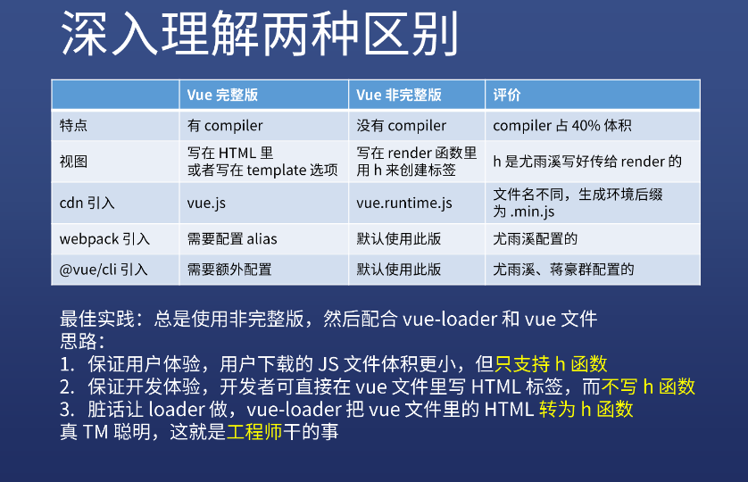

| ✍️ Tangxt | ⏳ 2020-07-04 | 🏷️ 入门 |

# 01-Vue 起手式

## ★前言

* 学 Vue 前，你得了解过 MVC 才行

## ★Vue 在中国很火吗

### ◇概述

- Vue 的读音：遇到专业的前端读「view」，反之，遇到不专业的，那就「V-U-E」这样一个一个字母的读！
- 为什么叫「Vue」？ -> 因为这是「[view](https://www.dancihu.com/fazhong/v/vue136819.htm)」的法语翻译，有「视觉」的意思……
- Vue 也作「View」 -> 意为 MVC 中的 V -> 从侧面看出，**MVC 中的「V」是 Vue 的重点**，而 M 和 C 则被简化了，即数据和控制层我们都不用去关心了，统统交给 Vue 来搞！

### ◇版本历史


- Vue 1.0：Vue 自称是 `MVVM` 框架
- Vue 2.0：Vue 是 `MV*` 框架，`*`意味着，你可以说成是 `MVC` 框架，也可以说成是 `MVVM` 框架，随你喜欢……总之，此时的 Vue 看起来像是 `MVVM` ，实际并不是……
- Vue 3.0：Vue 完全不是 `MVVM` 框架

> 很多高级知识都是模糊的，你无法明确它到底是还是不是，越高级的知识越是如此 -> 看一个人是否聪明，就看他的大脑里边能否容纳矛盾的知识，如果你的大脑只能容纳这种不矛盾的知识，说明你是个单纯的人，反之，你则是个聪明的人……

### ◇Vue 作者

- 简历
  - 尤雨溪 -> Evan You -> 有点像「破坏之王」里边的「断水流大师兄」
  - 艺术与艺术史专业 -> 艺术硕士 -> 毕业后在「Google Creative Labs」担任 UI 相关工作 -> 后来转为全职 JS 开发工程师
  - 现为独立开发者 -> 每个月有十几万以上的赞助
  - [GitHub 主页](https://github.com/yyx990803)、[个人域名](https://evanyou.me/)
- 主要作品
  - Vue
  - Vue Router
  - Vuex  
  - @vue/cli

### ◇如何加入 Vue

- [Vue Technology LLC 招人了](https://zhuanlan.zhihu.com/p/34846823)
- 工资 25k/月 起，上不封顶，看能力
- 启发
  - 你产生的价值越大，你得到的金钱越多 -> 你 35 岁产生不了价值，自然要淘汰！
  - 英文要好 -> 前端大部分知识都是讲英语的人搞出来的

谁加入了 Vue？ -> 蒋豪群 -> Vue CLI 维护者

### ◇Vue 热度

[百度指数](http://zhishu.baidu.com/v2/main/index.html#/trend/vue?words=vue,vue.js,react)：


[Google Trends](https://trends.google.com/trends/explore?date=2014-01-01%202020-07-06&q=vue,react,vue.js,react.js)：


尤雨溪推荐的统计方式：


<mark>Q：用 Vue 大部分是中国人吗？</mark>

80%的比例是中国人 -> 因为 Vue 的中文文档写得牛逼（中英都是尤雨溪写的，切换两种思维来写作），而 React 的中文文档则不太行（直接翻译外国人写的文档，外国人的写作思维和国内不同） -> 比 React 文档更烂的是 Webpack

<mark>Q：Vue 和 React 学哪个好？</mark>

- 结果：都要学 -> 你无法确定这个公司是要用 Vue 和 React 的
- 知识：Vue 越来像 React，尤其是 Vue 3
- 能力：如果你学会了其中一个，不可能不会另一个，除非你的基础没有打扎实，导致 Vue 学得半桶水，学 React 也半桶水……
- 顺序：先学 Vue 后学 React，或者 React -> Vue

### ◇文档

[中文文档](https://cn.vuejs.org/index.html)、[英文文档](https://vuejs.org/index.html)

## ★Vue 自学线路图

[Vue 自学路线图](http://fangyinghang.com/vue-roadmap/)：

> 我稍微截了下图 -> 因为这页面打开忒慢了……

### <mark>1）扎实的 HTML/CSS/JS 基础</mark>


### <mark>2）设计模式</mark>


> `mixin`混入、依赖注入 -> 不了解

### <mark>3）Vue API</mark>

#### <mark>1、组件</mark>


> 不知道为啥要叫组件？ -> 难道不应该叫属性吗？ -> 难道这些是从「组合关系」的角度来整理的吗？即一个组件的构成来自于这几个属性的组合…… -> 又或者说，这是组件 API，是为创建一个组件而服务的……

#### <mark>2、钩子</mark>


#### <mark>3、模板语法</mark>


> 也就是所谓的指令 -> 为操作视图而服务的

#### <mark>4、过渡动画</mark>


#### <mark>5、修饰符</mark>

> 分类关系

事件修饰符：


按键修饰符、系统修饰符、`.sync` 修饰符：


### <mark>4）Webpack 配置</mark>


### <mark>5）Vue 全家桶</mark>

#### <mark>1、Vuex & Vue Router</mark>


#### <mark>2、Axios & Jest/Mocha & PWA</mark>


### <mark>6）UI 框架</mark>


### <mark>7）Vue 3.0</mark>


### <mark>8）高级</mark>


---

高级知识：面试讲 -> 其它知识，在项目中迭代学习……

## ★使用 `@vue/cli` 搭建项目

### ◇目标一：搞出一个使用 Vue 的项目

怎么搭建？ -> CRM 学习法 -> [创建一个项目 - Vue CLI](https://cli.vuejs.org/zh/guide/creating-a-project.html#vue-create)

#### <mark>1、环境搭建</mark>

1. 安装：`yarn global add @vue/cli` -> 如果之前全局已安装了 vue cli，那么执行这行命令相当于是更新 vue cli
2. 版本检查：`vue --version` -> 之前的 `3.9.3`，现在更新后的 `@vue/cli 4.4.6`

#### <mark>2、创建一个 Vue 项目（这是学习时的配置，工作时请自行斟酌配置选项）</mark>

1. `vue create vue-demo-1` -> 报错了 -> `vue-template-compiler@2.6.10` & `vue@2.6.11`冲突了 -> 最后，我把 `D:\App\Scoop\persist\yarn\global\node_modules`下的目录全删了，还有把`yarn.lock`删了以及把`package.json`里边曾经安装的依赖都给删了……
2. 勾选一些东西：
   1. Manually select features
      1. Babel
      2. CSS Pre-processors -> dart-sass
      3. Linter / Formatter
      4. Unit Testing
         1. 默认
            1. 提交时 Lint -> 多提交，不然累积下来就有很多东西要你去改……
               1. Jest
                  1. In dedi…… -> 不分开放会有很多 bug……
                     1. n -> 不要把当前的配置当作是日后的项目配置的默认值，因为很多时候，我们是需要改的，不然，你就不知道该怎么改了


然而在安装依赖的时候又报错了……

```
error https://registry.npm.taobao.org/@types/glob/download/@types/glob-7.1.2.tgz?cache=0&sync_timestamp=1591314307851&other_urls=https%3A%2F%2Fregistry.npm.taobao.org%2F%40types%2Fglob%2Fdownload%2F%40types%2Fglob-7.1.2.tgz: Integrity check failed for "@types/glob" (computed integrity doesn't match our records, got "sha512-MJTU……RU=")

info Visit https://yarnpkg.com/en/docs/cli/install for documentation about this command.

ERROR  command failed: yarn
```

所以「`yarn check failure error`」？ （`yarn offline cache`）-> 我试了很多种方案，都无法解决 -> 我想了想我为啥一定要用 `yarn` 呢？它真得比 `npm6^` 香吗？

于是，我弃用 `yarn`了，转而使用 `npm` …… -> 卸载全局的 vue cli（用`yarn` 安装的）`yarn global remove @vue/cli` -> `npm install -g @vue/cli`

然而在执行 `vue create vue-demo-1` 的时候，用的还是 `yarn`……我也是醉了（**我以为用什么包管理工具安装的 vue cli，那就会用什么来创建 Vue 项目**）……

既然用了`yarn`，那么之前的报错信息又出来了……

于是，我卸载了 `yarn`，看看 `vue create xxx` 会不会用 `npm` 来安装依赖？

结果，报了没有找到`yarn`的错误！

难道就只能用 `yarn` 吗？

搜索「`npm vue created`」，结果找到了这样一条命令：

``` bash
vue create myproject --packageManager npm

# or 

vue config -s packageManager npm
```

最后再来一遍 `vue create vue-demo-2`，安装好后，`npm run serve`一下：


> 一些莫名其妙的想法 -> 在创建 vue 项目时，请保证磁盘空间是充足的……

---

至此，我们的目标一就已经完成了…… -> 那么我是如何完成的呢？ -> 「CRM」大法！

---

<mark>Q：`yarn install` 超时？</mark>

``` bash
# 全局设置
yarn config set network-timeout 180000 -g
```

➹：[yarn config - Yarn](https://classic.yarnpkg.com/en/docs/cli/config/)

<mark>Q：yarn -> `error： An unexpected error occurred`？</mark>

我忘记了这个问题的报错信息了 -> 反正我已改用 `npm` 了！

➹：[socket could not be established](https://blog.csdn.net/liu_jiachen/article/details/80182411)

➹：[Error: tunneling socket could not be established, cause=connect ECONNREFUSED 127.0.0.1:8888](https://github.com/npm/npm/issues/14459)

➹：[我终于找到 CI fail 的原因了！](https://www.eliseos.org/en/water/post/172)

<mark>Q：我目前的环境？</mark>

- `npm -v`：`6.14.5`
- `node -v`：`v10.15.3`
- `vue --version`：`@vue/cli 4.4.6`

---

### ◇如何系统学习 Vue？（我不想只搞出一个`hello world`就完事儿了）

- 用 CRM 大法把所有文档都过一遍！（方方自学时只用了两个下午就过完文档，然后开始干项目……我想这效率也忒高了吧……）
- 然后写篇博客（必须写）
- 最后忘掉它们（必然忘）

### ◇完成「目标一」的另一种姿势：自己从零搭建 Vue 项目

> 如果姿势 1 不行的话，我肯定会选择这种姿势……

方方目前干一个项目也是自己配的，因为有些需求 Vue Cli 是不能满足的，而自己配要灵活很多……

做法：

1. 使用 webpack or rollup 从零开始
2. 不适合新手，适合用 Vue 半年以上的老手（老手知道了需要用到哪些插件……新手可咩有系统性的认识）

> 15k 的老手提高 Vue 水平 -> 可以看看方方的 Vue 造轮子课！

### ◇`@vue/cli`用法回顾

1. 全局安装：`npm install -g @vue/cli`
2. 重置 vue cli 默认的包管理工具：`vue config -s packageManager npm`（默认是`yarn`）
3. 创建目录：`vue create 路径`（路径可以用`.`，表示把当前目录当作是 Vue 项目目录）
4. 选择使用哪写配置
5. 进入目录，运行 `npm run serve` 开启 `webpack-dev-server`
6. 用 Webstorm 或 VSCode 打开项目开始 CRM（基于这个项目学习 Vue 的各种 API 以及用法）
7. 进入 `@vue/cli` 官网看看文档目录，万一后面会用到……

---

<mark>Q：关于「vue cli」，我们只需要了解通过俩行命令，创建一个 Vue 项目不就行了吗？为啥还要去看「vue cli」的其它用法？</mark>

假如面试官问你「你是如何用 vue cli？」

> 你简单回答之：「两行命令，一个 Vue 项目就创建好了」

面试官再问你「vue cli 的插件你用过吗？」

> 你内心的独白：额……怎么 vue cli 还有插件的用法呀！

面试官最讨厌的是「**只要花 5s 就能了解的东西，如插件怎么用，而你如果不花，那么面试官就认为你是个不爱学习的人……**」

面试官再问「你用了 vue cli，如何跟 webpack 配合？」

> 你内心的独白：我要是会 webpack，还会来学这个 vue cli？

其实这些问题的答案，都写在文档里边了 -> 文档写得很好，直接看文档就好了！

总之，你使用一个工具，你大概就把目录给看一遍（有个系统性的认识），而内容不需要看，当然，如果你学有余力的话，你可以把官网的例子都用 CRM 大法跑一下……反之，时间不够，看目录就行了，然后在做项目的过程中，遇到问题了才去看内容……

### ◇使用 Vue 的其它姿势

使用 [CodeSandbox](https://codesandbox.io/) -> 方便（一个基于 Vue 的项目的基础架子几秒就出来了）

注意：

1. 登录后只能创建 50 个项目，不登录则可以创建无限个 -> 建议不要登录


在搞一些 demo 示例的时候，灰常好用，而且当你遇到 bug 难以解决的时候，你可以通过它分享你的 demo，来让他人帮助你解决这个 bug……

## ★ `vue.js` 和 `vue.runtime.js` 的使用

### ◇ +1 demo

> 目标二：做一个最简单的项目，并把涉及到的文档看一下


> 话说，图中黄色框框里边的内容都是些什么东西呢？ 如`export defalut`为啥可以直接导出呢？你这个可是`.vue`后缀的文件呀！-> 带着这些疑问请查阅文档，并搞懂它们！

以下内容 -> 深究这个 `+ 1` demo

### ◇Vue 实例

> 你必须要用到的知识

什么是 Vue 实例？

在上图里边，我们用的是单文件组件的形式来写的 demo，但从这个 demo 里边，我们是很难看出「什么是 Vue 实例？」的

用三种姿势来让你了解「什么是 Vue 实例？」

#### <mark>1、姿势一：从 HTML 得到视图</mark>

在 `main.js` 里边有这样一段代码：

``` js
import Vue from 'vue'
import App from './App.vue'

// 用来取消一些提示……
Vue.config.productionTip = false

new Vue({
  render: h => h(App),
}).$mount('#app')
```

你可以看到有个 `new Vue({})`，那么这代表啥东西呢？

想想看 jQuery：

``` js
(function(window, undefined) {
  function jQuery(selector) {
    return new jQuery.fn.init(selector);
  }
  jQuery.fn = jQuery.prototype = {
    init: function() {},
  };
  jQuery.fn.init.prototype = jQuery.fn;
  window.jQuery = window.$ = jQuery;
})(window);
```

我们平时用 jQuery 都是 `$('#xxx')` 这样用的，但它其实也等价于 `new jQuery('#xxx')`，你可以看到上边的代码中，`jQuery`是个函数呀！它返回了一个 `new jQuery.fn.init(selector)`，根据`new`的机制，只要返回了一个引用类型的值，那么就返回这个引用类型的值！所以：

``` js
// jQuery 实例封装了对 #xxx 的所有操作！
const $div = new jQuery('#xxx') // <=> const $div = $('#xxx') or const $div = jQuery('#xxx')
```

同理，Vue 实例也是如此：

``` js
// vm 封装了对组件内容的所有操作，如数据、事件绑定、视图更新等等
const vm = new Vue({})
```

接下来看看，Vue 实例是如何创建的…… -> **不用默认给出的姿势**

视图：

``` html
<!-- index.html -->
<div id="app"> {\{n}}</div>
```

行为：

``` js
import Vue from "vue";

// 把默认姿势：
new Vue({
  render: h => h(App),
}).$mount('#app')

// 改成这个：
new Vue({
   // 我要对 div#app 进行一个 MVC 封装
   el: '#app'
})
```

你一保存，可以看到控制台报错了：


为啥会报错呢？ -> 因为 Vue 不支持你这样写呀！（**即便你咩有写 `{\{n}}` 也会报错！**） -> 说白了，默认的 `runtime` 版（vue cli 这个脚手架默认给的），不支持你从 HTML 获取视图，也就是你无法获取 `<div id="#app"></div>`啦！

根据官方文档所说的：

> `vue.runtime.js` 是「只包含运行时版」，即它是非完整的，而完整版，同时包含编译器和运行时的版本
> 
> 如果你需要在客户端编译模板 （比如传入一个**字符串给 `template` 选项**，或**挂载到一个元素上并以其 DOM 内部的 HTML 作为模板**)，就将需要加上编译器，即完整版

所以，为了解决这个「**错误**」，我们需要安装 **完整版的 Vue**

那么，如何获取完整版的 Vue 呢？

> 从 CDN 引用 `vue.js` 或 `vue.min.js` 即可做到

举例来说：

> [vue (v2.6.11)](https://www.bootcdn.cn/vue/2.6.11/)

``` html
<!-- 在 index.html 里边引入这个 -->
<script src="https://cdn.bootcdn.net/ajax/libs/vue/2.6.11/vue.min.js"></script>
```

改一下 `main.js`：

``` js
// 去掉这个导入
import Vue from "vue";

// 直接使用 -> main.js 是入口文件，vue cli 打包后会注入到 index.html 里边去的 -> 此时使用的 Vue 是我们通过 cdn 引入进来的完整版的 vue
new Vue({
  el: "#app",
});
```

效果：


解决图中的错误：

``` js
new Vue({
  el: "#app",
  // -> data 可以是个函数，也可以是个对象
  data: {
    n: 0,
  },
});
```

话说，对于这个例子我们的关注点是啥？

1. `MVC`的 `V` ，即视图，没有写在 JS 里边 -> 长啥样的 DOM 结构，是写在 `body` 里边的

好了，以上就是 vue 完整版的作用了，即**可以让 Vue 实例直接对写在 HTML 里边的 DOM 结构进行 `MVC` 操作**

为了区别一下非完整版的，我们改成是非完整版的：

``` html
<script src="https://cdn.bootcdn.net/ajax/libs/vue/2.6.11/vue.runtime.min.js"></script>
```

效果：


可以看到，Vue 函数还在，但不支持从 HTML 里边获取视图……

#### <mark>2、姿势一：用 JS 构建视图</mark>

话说，我把视图写在`template`里边能支持吗？即写在 JS 里边……

``` js
new Vue({
  el: "#app",
  template: `<div> {\{n}}</div>`,
  data: {
    n: 0,
  },
});
```

从效果中看到 屏幕闪烁了一下 `{\{n}}`，之后就消失了，所以这种写法的「视图」也是不支持获取的……

换回完整版：


所以我们可以得出结论：

> 只要你是从 HTML 变成页面中的东西，不管是写从 HTML 中获取视图（写在`.html`里边+`el`属性挂载），还是从 JS 中获取视图（`template`属性），只有完整版是支持的，而不完整版是不支持的！ -> 这两种获取视图的姿势都很像是在写 HTML

#### <mark>3、姿势三：从 Render 得到视图</mark>

如果我非得要用「非完整版」呢？

那么你得这样来：

``` js
new Vue({
  el: "#app",
  // h 是 Vue 传的
  render(h) {
    return h("div", this.n);
  },
  data: {
    n: 0,
  },
});
```

> 如果没有出效果，可能是打包工具缓存了，你可以改成是 `2.6.10` 的！ -> 注意，一定要写上`el:'#app'`，因为只有这样你才会看到页面效果 -> 默认的`index.html`文件里边都会有行 `<div id="app"></div>`，你一旦挂载了，那么`render`函数的结果就会取而代之


---

`+1 demo` 的另一种写法（非完整版的`vue.js`）：

``` js
new Vue({
  el: "#app",
  render(createElement) {
    const h = createElement;
    return h("div", [
      this.n,
      h(
        "button",
        {
          on: {
            click: this.add,
          },
        },
        "+1"
      ),
    ]);
  },
  data: {
    n: 0,
  },
  methods: {
    add() {
      this.n++;
    },
  },
});
```

> `h` 的本质就是 `createElement`


可以看到，我们用非完整版的 `vue.js`，要构造出一个元素出来（**通过`createElement`来构造**），是很麻烦的！当然，这样的好处是我们不需要编译……

所以问题来了，到底是「完整版」好用？还是非完整版好用呢？

> 从小白的角度来看，肯定是「完整版」好用呀！

既然如此，那么「非完整版」存在的意义是啥？

> 它的意义在于它更加的独立，我们知道**从 HTML 得到视图**，需要完整版的，而**用 JS 构建视图**，用`template`则用完整版，用`h`的则可以用非完整版的，这种`h`构造方式很不方便，但为啥 vue cli 还会推荐使用呢？ -> 因为「非完整版」体积小呀！

### ◇为什么说「反人类」的 `h` 姿势是好的？（对于新手来说是很难理解的）

#### <mark>1、完整版的逻辑</mark>

你有一段字符串版的 HTML（要么是页面上的，要么是 template 属性上的）：

``` js
`<div>{\{n}}</div>` 
```

vue 需要把这 HTML 变成是 `<div>0</div>`

怎么做？直接替换吗？ -> 直接替换不好，因为这个 HTML 模板还有很复杂的如`v-if`、`v-for`、`@click='add'`等这些复杂的东西 -> 这些复杂的东西，你直接用正则替换是做不到的

于是 vue 需要写一个编译器叫 `compiler` -> `compiler`可以把含有占位符，如大胡子语法的 `{\{n}}`、`v-if`等这样的东西变成是**真实的 DOM 节点**

当你 `this.n += 1`的时候，vue 实例就会去改 DOM 节点，而不是从新再编译一次模板…… -> `<div>1<div>`

编译器它有个特点 -> 复杂 -> 占用代码体积

[官网](https://cn.vuejs.org/v2/guide/installation.html#%E8%BF%90%E8%A1%8C%E6%97%B6-%E7%BC%96%E8%AF%91%E5%99%A8-vs-%E5%8F%AA%E5%8C%85%E5%90%AB%E8%BF%90%E8%A1%8C%E6%97%B6) 说到：

> 运行时版本相比完整版体积要小大约 30%

也就是说，假如完整版是 100k，那么不完整版就是 70k 咯！

二者相差 `30k`，`30k`对于不完整版来说可是 `40%` 呀！ -> 不管怎样，不完整版的体积就是小…… 

不完整版咩有 `compiler`，意味着它无法把 HTML 变为 DOM 节点 -> 即它看到的 HTML `template` 就是一段普通的字符串，即它不具备识别`v-if`、`{\{n}}`、`@click="add"`等这样的功能……

既然咩有这些功能，我们为啥还要用「不完整版」呢？

因为这世界有个工具叫 `webpack`呀！我们一开始写的是这样的：

``` html
<div>{\{n}}</div>
```

代码 ，然后通过 `vue loader` 转化成：

``` js
h('div',this.n)
```

重点来了，`vue loader` 需要让用户浏览器下载吗？ -> 不需要，因为我们在打包的时候（`yarn build` or `npm run build`）就已经转化完了 -> 这样一来，我们就可以让用户浏览器下载只支持`h`函数这个版本的 `vue.js`，即不完整版的！

所以：

1. 我们开发者写代码的时候，还是写与 HTML 差不多的`template`
2. 而用户下载的则是`h('div',this.n)`这样的代码

完成这样一个过程，只需要在`1 2`之间通过`webpack`的`vue-loader`翻译过来就好了！

还有用户对 vue 的依赖，就可以使用体积小 30% 的 不完整版！

可以看到，vue 为了让用户节省了那 30% 的体积做了很大的努力，即把核心功能删掉，然后在打包的时候去翻译（产物是`AST`）

总之：

1. 完整版：体积大，功能强
2. 不完整版：体积小，功能弱，但是我们可以通过 webpack，让我们在写代码的时候，是完整版的体验，而用户下载的时候是非完整版的！


> 我们最终的效果是为了让用户下载体积更小的 `vue.js`，而为了提升开发体验，所以就写了个 `vue-loader` -> 如果非得复杂，只能是开发者这边，而用户那边越简单越好，简单来说，如果没有` vue-loader`，那么你是让用户下载完整版的，然后我们开发者可以写简单的 HTML `template`，还是为了让用户简单，下载不完整版的 `vue.js` ，然后我们使用复杂的`h()`去组装 DOM 结构呢？ -> 显然是后者呀！所以 `「用户体验」>「开发体验」`

接下来，测试一下 `vue-loader` 的作用…… -> 需要搞个 `.vue` 文件出来！

### ◇小结

#### <mark>1、如何使用 Vue 实例？</mark>


#### <mark>2、Vue 实例的作用？</mark>


---

<mark>Q：关于「生产环境版的」？</mark>

1. 注释全部删掉
2. 压缩
3. 变量名缩小
4. ……

一切行事都以减少代码体积为目的……

<mark>Q：关于完整版，从 HTML 获取视图 和 从 JS 获取视图的区别？</mark>

``` html
<!-- index.html -->
<div id="app">{\{n}}</div>
```

从 HTML 获取视图：


从 JS 获取视图：


可以看到：

- 前者，`div#app`就是视图模板 -> `el`属性值是为了找到视图模板的 -> 编译渲染
- 后者，`template`属性值就是视图模板 -> `el`属性值是为了找到车位，给`template`属性值停车的…… -> 编译渲染

我不太确定后者是不是这样执行的：

1. 编译`template`属性值的内容
2. 根据`el`属性值，确定元素要渲染的位置

又或者是：

1. 根据`el`属性值，把`div#app`换成是`<div>{\{n}}</div>`
2. 编译渲染

我觉得第一种猜测合理些……

---

## ★Vue 单文件组件

> 我使用的是非完整的 `vue.runtime.min.js`

### <mark>1）视图</mark>

``` html
<!-- Demo.vue -->
<template>
  <div class="demo">{-{ n }} <button @click="add">+1</button></div>
</template>
```

### <mark>2）除了视图以外其它的选项</mark>

``` html
<script>
export default {
  name: "Demo",
  // 用了 vue-loader，必须要函数姿势的 data
  data() {
    return {
      n: 0,
    };
  },
  methods: {
    add() {
      this.n++;
    },
  },
}; 
</script>
```

### <mark>3）为视图添加样式</mark>

``` html
<style lang="scss" scoped>
  .demo {
    color: lightcoral;
  }
</style>
```

---

我们可以看到 `.vue` 文件是灰常明确的，即划分成三块：视图、视图之外的选项、样式

而 `vue-loader` 可以把 `.vue` 这整坨东西变成一个对象

### <mark>4）使用</mark>

``` js
// main.js
import Demo from "./components/Demo.vue";

new Vue({
  // 指定 template 渲染的位置
  el: "#app",
  render(h) {
    return h(Demo);
  },
});
```

效果：


话说，我们 `import Demo from "./components/Demo.vue"` 过来的 `Demo` 是啥值？


> 可以看到它是个普通对象！其中有 `data` 、 `methods` 、 `render` 等这样的选项……

可以通过 `Demo.render.toString()` 把 `render` 这个函数的代码给 `log` 出来！ -> `_c -> createElement` ：

``` js
// <div class="demo">{-{ n }} <button @click="add">+1</button></div>

function() {
  var _vm = this
  var _h = _vm.$createElement
  var _c = _vm._self._c || _h
  return _c("div", {
    staticClass: "demo"
  }, [
    _vm._v(_vm._s(_vm.n) + " "),
    _c("button", {
      on: {
        click: _vm.add
      }
    }, [_vm._v("+1")])
  ])
}
```

如果我加了 `v-if` ，那么 `vue-loader` 处理过后的结果是这样的：

``` js
// <div class="demo" v-if="true">{-{ n }} <button @click="add">+1</button></div>

function() {
  var _vm = this
  var _h = _vm.$createElement
  var _c = _vm._self._c || _h
  return true ?
    _c("div", {
      staticClass: "demo"
    }, [
      _vm._v(_vm._s(_vm.n) + " "),
      _c("button", {
        on: {
          click: _vm.add
        }
      }, [_vm._v("+1")])
    ]) :
    undefined
}
```

---

这就是 `Webpack` 给前端带来的无限可能 -> 我们可以以任意的方式来组织成一个对象，只要我们可以写一个 loader 还原成一个对象就行了！

以上就是所谓的「单文件组件」啦！

## ★SEO 基本原理

### <mark>1）什么叫 SEO 友好？</mark>

SEO -> 搜索引擎优化 -> 是什么？ -> 可以简单理解为「搜索引擎」就是不停地 `curl`
举例子来说：

百度如何知道 `github.com` 的内容呢？

很简单，让百度的服务器去 `curl` 一下 `github.com` 就行了：

``` bash
# 打开你的终端
curl https://github.com/
```

`curl` 完之后百度得到了一个页面的源代码

于是，百度就会检索这个页面的源代码：


而这就是所谓的 `SEO` ，以及所谓的 `搜索引擎`
搜索引擎会检索一个页面的关键信息，如 `title` 、 `h1` 等这样的标签，而我们要做 SEO 的话，就得搞上这些信息

当别人通过相应的一些关键字搜索时，很有可能就会找到你的这个页面：


回到我们那个 `vue-demo-2` ，那么问题来了， `index.html` 的内容就只有这么点：


可以看到，搜索引擎只看到一个 `title` 就完事儿了，至于此页面的主要内容一无所知……毕竟 `<div id="app"></div>` 这个位置的内容 是我们后来通过 JS 渲染进来的啊！

**所以，这就是 SEO 不友好，或者说无法用 `curl` 命令得到这个页面的主要内容以及相关内容**

> 主要内容「 `React 造轮子` 」，相关内容「 `方应杭` 」

所以，我们该咋办呢？总不能不用 vue 吧！

解决这个问题的做法很简单，直接在 `div#app` 里边写点内容就好了：

``` html
<div id="app">
  <h1>GitHub</h1>
</div>
```

当然，这些内容会被我们的 JS 给替换掉…… -> vue 把这个 `div#app` 节点给替换掉了 -> 即便如此，我们的页面源代码还是会有这个 `h1` 标签的！不过，这会一闪而过，当然，你可以加上样式隐藏掉它！

如这样：

``` html
<div id="app">
  <h1 style="display: none;">GitHub</h1>
</div>
```

所以，怎么做 SEO？ -> 把主要内容写在页面里边就行了！

> `curl` 捕获到关键信息会保存到数据库，当用户搜索的时候，就会根据搜索关键字检索数据库（按照某种算法），返回一个结果（页面链接有顺序之分，如第一页，第一项） -> 搜索排名越靠前，给网站带来的流量越多……

### <mark>2）怎么做 SEO？</mark>


关于充钱能变强（如搜个 `java 培训` ）：

* 搜索排名第一的，点一次要给 百度 10 元
* 第二的给 5 块
* ……

搜索结果：达内 -> 传智播客 -> 黑马程序员……

所以，在中国 SEO 就是个笑话 -> 即便你 SEO 做得再好，也顶不住氪金玩家的任性呀！ -> SEO 目前是个明日黄花的产业，即过时的东西……

如果你现在看到一些机构在培训 SEO，那么很明显就是在割韭菜 -> 现在是微信时代了

即流量都在微信这边了

如饥人谷目前主要就是在微信里边做，如扫二维码、各大群分享文案等等来宣传

> 还有知乎、b 站、掘金……

总之，目前的 SEO，完全就是靠烧钱行事……

不过，对于 Google 来说，它是要比百度牛逼很多的！

它不仅可以获取 `curl` 的内容，还可以获取 JS 创建的内容，即获取「源代码」+「Elements 面板下的内容」，但是请不要依赖它！

因为中国大陆地区是无法直接访问 Google 的！

所以与其在网站上做好 SEO，还不如直接把文章内容做好，然后在微信、知乎等里边分享就好了！ -> 既然人家搜索不到你的网站，还不如主动出击，主动去分享呢！

你要做的 SEO（[淘宝的做法](https://www.taobao.com/)）：

``` html
<title>淘宝网 - 淘！我喜欢</title>
<meta name="description" content="淘宝网 - 亚洲较大的网上交易平台，提供各类服饰、美容、家居、数码、话费/点卡充值… 数亿优质商品，同时提供担保交易（先收货后付款）等安全交易保障服务，并由商家提供退货承诺、破损补寄等消费者保障服务，让你安心享受网上购物乐趣！" />
<meta name="keyword" content="淘宝，掏宝，网上购物，C2C, 在线交易，交易市场，网上交易，交易市场，网上买，网上卖，购物网站，团购，网上贸易，安全购物，电子商务，放心买，供应，买卖信息，网店，一口价，拍卖，网上开店，网络购物，打折，免费开店，网购，频道，店铺" />

<div class="logo">
  <h1>
    <a href="//www.taobao.com" role="img" class="logo-bd clearfix">淘宝网</a>
  </h1>
  <h2 aria-hidden="true"><a class="clearfix" href="//www.taobao.com">淘宝网</a></h2>
</div>
```

---

<mark>Q：关于 `a` 标签也是 SEO 优化的一部分？</mark>

你这样写：

``` html
<h1>GitHub</h1>
<a href="xxx.html">详情</a>
```

搜索引擎会继续 `curl`  `xxx.html` ……因为它认为这个链接与 `h1` 是有关联的！

## ★JS 达到什么水平可以写出类似 Vue 这样的框架？

没有什么水平之说，你先定一个目标，然后去实现它！能实现那就水平够了，不能实现，那就水平不够！ -> 总之，一个人的水平是无法确切知道的，你只有做了才知道自己到底有咩有水平！

> 学习方式不是达到什么水平才能去写什么，而是你写了什么才能达到什么水平！ -> 简单来说，你要先去做才能达到那个水平，而不是达到那个水平才去做！因为你没有做过，你是永远达不到那个水平的！ -> 先做再达到，做的时候搜各种知识，然后不停地迭代它完善它，最后它就出来了 -> 而不是我觉得我现在可以去做了，然后再去做，你要记住永远都是「未知的去做，做了之后再去补充自己的知识！」

---

<mark>Q：SSR 做 SEO 是什么意思？</mark>

就是用 Node.js 去写很多个类似 `index.html`这样的页面 -> 不是静态，是动态的！ -> 这样其实就是多页面了……

SSR -> 服务端渲染 -> 所谓渲染就是在 HTML 文件里边写字符串 `<div>xxx</div>`，然后出现在页面里！

所谓的 SSR 就是不要用客户端的 JS 去渲染内容，而是让服务端的 JS 去渲染这个内容！ -> 这个内容是 `<div id="app"></div>` 之后被替换的内容！

> 简单来说：渲染有两步 -> 源码+浏览器解析内容渲染到页面上，而 SSR，就是帮我们**构建源码**这一步！而不是交给客户端通过 JS CRUD DOM 来搞事情！

## ★总结、命名规范

> 理解这两种 vue （完整版和运行时版）的区别！



平时写博客：

- 浅析：你这篇博客内容全部照抄一个地方，那就是浅析
- 深入：把好几个地方的内容放到一个地方一起抄，那就是深入

简单来说，写博客很简单，就是综合很多个地方的内容，然后编辑一下就有了！

稍微解释一下图中的内容：

- 可以把`h`改成其它名字 -> 但最好还是用官方给的！
- 你的项目部署给用户使用 -> 需要加 `.min.js`
- webpack 引入？ -> 用个半年 vue 再说…… -> 默认非完整版的，你想配完整版的，那就去看官网！ -> 安装 vue 那章！
- `vue/cli` -> 配置完整版 -> 看官网
- 最佳实践（如果要 do，那么用哪种姿势才是最好的！）： 非完整版 -> 配合 `vue-loader` + `vue` 文件 -> 话说「完整版」难道一点意义都没？
- 为什么说这样做就是最佳体验？
  - 保证了用户体验 -> 有缺点「**只支持`h`函数**」
  - 保证了开发体验 -> 好处「**不写`h`函数**」 -> 与上一点是矛盾的！
  - `vue-loader` -> 解决矛盾，让大家都满意！ -> **不写`h`函数也能得到`h`函数**

写`vue-loader`的人的工资至少要比使用 `vue` 的人的工资高个 `50%`

为什么呢？

因为你一个人就帮助了好几十个人，甚至几百、成千上万个人啊！ -> 这价值你说有多高呀？

真正的 **工程师** 要做的事情就是「**封装**」 -> 你一定要学会封装，即把所有的细节封装到一个东西里边去，而这个东西不管是函数也好，`class`也好，`loader`也好，还是插件也好，都无所谓，反正你能帮助到别人就好了！

---

<mark>Q：引用错了会怎样？</mark>


如何重现这个「引用」错误？

1. 你用 `vue/cli` 创建了一个 vue 项目
2. `main.js`有个默认的 `render` 选项，你注释掉
3. 使用 `template` 选项 作为 HTML -> 结果报错了（功能缺失） -> 告诉你用的是 `runtime-only` 版的 `vue.js`，并告知你如何解决这个错误，如你要 `pre-compile` 一下这个 `template` 生成 `render`，而 `vue-loader` 就是 干 `pre-compile` 的活！或者你可以使用包含 `compiler` 的 `build`（build 也就是 build 出来的那个`vue.js`，说白了 `build` 代指 `vue.js` 这个产物）

<mark>Q：`import Demo from "./components/Demo"` -> 是否加后缀 `.vue` ?</mark>

1. 尝试不加会怎样？ -> 成功
2. 尝试加了又会怎样？ -> 也成功

得出你爱加就加，不加就不加！

如果你是个处女座，有强迫症 -> 建议你加上！ -> 为什么？ -> 比较明确说明这是个 `vue` 文件呀！万一，同级目录下还有个 `Demo.js`、`Demo.css`岂不是很不明确？

所以最好加上 `.vue` 后缀 -> 不要偷懒！

这个回答的思路：

- 实验证明：加不加都无所谓
- 防错原理：万一同级目录下出现了两个一模一样的文件名？就像是同一个班里边有两个叫「张三」，你叫张三一句，两声回应或者咩有回应，岂不是尴尬至极？ -> 不明确

当然，你也可以不加，等出现重名之后再加 -> 这是一个哲学问题 -> 先上车后补票，还是先买票再上车！ -> **先预防还是后补救？**

<mark>Q：如果你使用的完整版，但是你又把它当作是非完整版来使用？也就是写`render`</mark>

不会报错，结果仅仅只是体积变大了，没有其它副作用 -> 功能多了，但使用的仅仅只是使用部分小功能！

---

以上就是关于这两个版本介绍的所有知识了！

接下来了解一下 vue 实例的一些构造选项！

## ★测试

### <mark>1）Vue 安装</mark>

目标三：写一篇博客，介绍一下 Vue 两个版本的区别和使用方法：

1. 两个版本对应的文件名
2. `template` 和 `render` 怎么用
3. 教读者如何用 `codesandbox.io` 写 Vue 代码

要求 100 字以上，言之有理即可，不需要多么高深~

## ★了解更多

➹：[【Vue 全解】起手式 - 写代码啦！](https://xiedaimala.com/tasks/03de1086-17c1-4331-a1bc-39b11f635433)

➹：[Vue 简史 - 掘金](https://juejin.im/post/5c7c97f6f265da2de7136c59)

➹：[浅析 MVC - 知乎](https://zhuanlan.zhihu.com/p/98865921)

➹：[MVC：面包块而不是面条 - 知乎](https://zhuanlan.zhihu.com/p/96985491)

➹：[MVC - varown的文章 - 知乎](https://zhuanlan.zhihu.com/p/132324891)

➹：[揭秘 jQuery - 前端 - 掘金](https://juejin.im/entry/58bad91e128fe100643fb2ac)

## ★总结

- 方方讲得这块知识其实非常重要的，如果咩有这块知识，你会发现你用 `vue/cli` 搭建出来的 `vue` 项目，然后不断地去写 `.vue` 文件，是很奇怪的一件事，因为你有一点困惑，那就是「为啥我这样写，页面就有东西被渲染出来了呢？」
- 写 `template` 有四个地方：
  - 写在HTML文件里边，让 `el` 挂载 -> 只支持完整版 -> 非完整版+`vue-loader` 除外
  - 写在 JS 里边的 `template` -> 只支持完整版 -> 非完整版+`vue-loader` 除外
  - 写在 JS 里边的 `render` -> 完整或不完整你随意
  - 写在 `.vue` 里边的 `template` -> 经过`vue-loader`编译成`render`可处理的产物……
- 如何判断市面上的 `vue` 教程是辣鸡 `vue` 教程 -> 如果没有涉及到方方这一节所讲的知识内容，我都将视为辣鸡！
- 什么叫定一个小目标？ -> 什么叫完成一个小目标？ -> 学任何东西都应该一步一步来，步子迈大了真得很容易让人产生挫败感……而这样的结果就是「扛不住就放弃了事」……
- 我以前一直以为得要达到 `xxx` 水平才能去做某件事，现在想来，这是很可笑的一件事 -> 你从不会到会才能提高水平呀！可你不去做「不会的」怎么才能提高水平呢？ -> 动手吧！骚年！把这个东西干掉，当然，在干掉它的途中，你会学会使用各种武器，甚至会制造一些独门的武器！ -> 所谓的前置知识，我也把它归为「完成这个东西」的途中所需要用到的知识！而不是我要把这个前置知识学完了才去完成这个项目，如项目要用到 `TypeScript`，那么我是否要先把 `TypeScript` 的各种知识 都得好好认识一番之后再去做呢？ -> 不需要，有了基本的认识，就可以开干了，就像是方方他为啥用两个下午通读完 Vue 官方文档之后，就去做 Vue 项目了呢？（当然，方方的基础扎实，这没话说哈！）

## ★Q&A

### <mark>1）`UMD` 是什么？我们似乎使用 vue ，都是用 `UMD` 的……</mark>

`UMD`：通用模块定义 -> 一种能同时支持 `AMD` 和 `CommonJS ` 这两种风格的模块定义……

这意味着：

> UMD 版本可以通过 `<script>` 标签直接用在浏览器中。jsDelivr CDN 的 <https://cdn.jsdelivr.net/npm/vue> 默认文件就是运行时 + 编译器的 UMD 版本 (`vue.js`)。

➹：[什么是 AMD，CommonJS 和 UMD？ - 简书](https://www.jianshu.com/p/ec2844e0aea9)

➹：[安装 — Vue.js](https://cn.vuejs.org/v2/guide/installation.html#%E8%BF%90%E8%A1%8C%E6%97%B6-%E7%BC%96%E8%AF%91%E5%99%A8-vs-%E5%8F%AA%E5%8C%85%E5%90%AB%E8%BF%90%E8%A1%8C%E6%97%B6)

### <mark>2）关于 vue 的渲染流程？</mark>

我们写了一个`template`：


> template -> createElement -> VNode

虚拟 DOM -> 真实 DOM


具体点来说：


所以整个渲染流程是这样的：

template -> compile -> createElement（render `h` 参数，这一步很关键） -> Virtual DOM -> create -> Real DOM

如果视图更新：


> 图中的 Data -> 就 vm 的 `data` 属性

再详细全面点：


> vue 的那个生命周期图很重要呀！之前我得猜测得到了印证……就是关于那个`el`参数的问题…… -> `outerHTML` vs `innerHTML`：前者除了包含`innerHTML`的全部内容以外，还包括对象标签本身 -> 所以在`index.html`里边写的`<div id="app"></div>`这个整体就是一个`template`呀！

题外话：

指令更新视图？


➹：[Vue](https://www.slideshare.net/ssusercab70d/vue-72292920)

➹：[Day04 - Virtual DOM & V-Node](https://ithelp.ithome.com.tw/articles/10193220)

➹：[vue 渲染流程](https://www.itread01.com/content/1542625812.html)

➹：[Reactivity in Depth — Vue.js](https://vuejs.org/v2/guide/reactivity.html?)

➹：[vue-mvvm 设计模式](https://echizen.github.io/tech/2019/03-24-vue-mvvm)

➹：[Vue.js 运行机制全局概览 - XXY BLOG](https://xinxingyu.github.io/blog/blog/Vue/mechanism/a-overview.html#%E5%85%A8%E5%B1%80%E6%A6%82%E8%A7%88)

➹：[Change Detection And Batch Update](https://imweb.io/topic/57f0d8ccb02d5ce2648dc898)

### <mark>3）github 预览不支持 `{\{xxx}}`？</mark>

- `{\{hi}}`
- `{-{hi}}`

### <mark>4）`@vue/cli` 的基本配置信息？</mark>


- `@vue/cli` 和 `webpack` 是什么关系？ -> `@vue/cli`里面包含了`webpack`，并且配置好了基本`webpack`打包规则

### <mark>5）关于 `@vue/cli` 版本，`2.x` vs `3.x` ？</mark>


➹：[39.vue全解(起手式0) - 掘金](https://juejin.im/post/5e9c66206fb9a03c8c04231f)