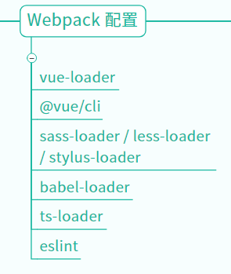

| ✍️ Tangxt | ⏳ 2020-07-04 | 🏷️ 入门 |

# Vue 起手式

## ★前言

* 学 Vue 前，你得了解过 MVC 才行

## ★Vue 在中国很火吗

### ◇概述

- Vue 的读音：遇到专业的前端读「view」，反之，遇到不专业的，那就「V-U-E」这样一个一个字母的读！
- 为什么叫「Vue」？ -> 因为这是「[view](https://www.dancihu.com/fazhong/v/vue136819.htm)」的法语翻译，有「视觉」的意思……
- Vue 也作「View」 -> 意为 MVC 中的 V -> 从侧面看出，**MVC 中的「V」是 Vue 的重点**，而 M 和 C 则被简化了，即数据和控制层我们都不用去关心了，统统交给 Vue 来搞！

### ◇版本历史


- Vue 1.0：Vue 自称是 `MVVM` 框架
- Vue 2.0：Vue 是 `MV*` 框架，`*`意味着，你可以说成是 `MVC` 框架，也可以说成是 `MVVM` 框架，随你喜欢……总之，此时的 Vue 看起来像是 `MVVM` ，实际并不是……
- Vue 3.0：Vue 完全不是 `MVVM` 框架

> 很多高级知识都是模糊的，你无法明确它到底是还是不是，越高级的知识越是如此 -> 看一个人是否聪明，就看他的大脑里边能否容纳矛盾的知识，如果你的大脑只能容纳这种不矛盾的知识，说明你是个单纯的人，反之，你则是个聪明的人……

### ◇Vue 作者

- 简历
  - 尤雨溪 -> Evan You -> 有点像「破坏之王」里边的「断水流大师兄」
  - 艺术与艺术史专业 -> 艺术硕士 -> 毕业后在「Google Creative Labs」担任 UI 相关工作 -> 后来转为全职 JS 开发工程师
  - 现为独立开发者 -> 每个月有十几万以上的赞助
  - [GitHub 主页](https://github.com/yyx990803)、[个人域名](https://evanyou.me/)
- 主要作品
  - Vue
  - Vue Router
  - Vuex  
  - @vue/cli

### ◇如何加入 Vue

- [Vue Technology LLC 招人了](https://zhuanlan.zhihu.com/p/34846823)
- 工资 25k/月 起，上不封顶，看能力
- 启发
  - 你产生的价值越大，你得到的金钱越多 -> 你 35 岁产生不了价值，自然要淘汰！
  - 英文要好 -> 前端大部分知识都是讲英语的人搞出来的

谁加入了 Vue？ -> 蒋豪群 -> Vue CLI 维护者

### ◇Vue 热度

[百度指数](http://zhishu.baidu.com/v2/main/index.html#/trend/vue?words=vue,vue.js,react)：


[Google Trends](https://trends.google.com/trends/explore?date=2014-01-01%202020-07-06&q=vue,react,vue.js,react.js)：


尤雨溪推荐的统计方式：


Q：用 Vue 大部分是中国人吗？

80%的比例是中国人 -> 因为 Vue 的中文文档写得牛逼（中英都是尤雨溪写的，切换两种思维来写作），而 React 的中文文档则不太行（直接翻译外国人写的文档，外国人的写作思维和国内不同） -> 比 React 文档更烂的是 Webpack

Q：Vue 和 React 学哪个好？

- 结果：都要学 -> 你无法确定这个公司是要用 Vue 和 React 的
- 知识：Vue 越来像 React，尤其是 Vue 3
- 能力：如果你学会了其中一个，不可能不会另一个，除非你的基础没有打扎实，导致 Vue 学得半桶水，学 React 也半桶水……
- 顺序：先学 Vue 后学 React，或者 React -> Vue

### ◇文档

[中文文档](https://cn.vuejs.org/index.html)、[英文文档](https://vuejs.org/index.html)

## ★Vue 自学线路图

[Vue自学路线图](http://fangyinghang.com/vue-roadmap/)：

> 我稍微截了下图 -> 因为这页面打开忒慢了……

1）扎实的HTML/CSS/JS基础


2）设计模式


> `mixin`混入、依赖注入 -> 不了解

3）Vue API

1、组件


> 不知道为啥要叫组件？ -> 难道不应该叫属性吗？ -> 难道这些是从「组合关系」的角度来整理的吗？即一个组件的构成来自于这几个属性的组合…… -> 又或者说，这是组件API，是为创建一个组件而服务的……

2、钩子


3、模板语法


> 也就是所谓的指令 -> 为操作视图而服务的

4、过渡动画


5、修饰符

> 分类关系

事件修饰符：


按键修饰符、系统修饰符、`.sync` 修饰符：


4）Webpack 配置



5）Vue 全家桶

1、Vuex & Vue Router


2、Axios & Jest/Mocha & PWA


6）UI 框架


7）Vue 3.0


8）高级


---

高级知识：面试讲 -> 其它知识，在项目中迭代学习……

## ★使用 `@vue/cli` 搭建项目

### ◇目标一：搞出一个使用 Vue 的项目

怎么搭建？ -> CRM学习法 -> [创建一个项目 - Vue CLI](https://cli.vuejs.org/zh/guide/creating-a-project.html#vue-create)

1、环境搭建

1. 安装：`yarn global add @vue/cli` -> 如果之前全局已安装了 vue cli，那么执行这行命令相当于是更新 vue cli
2. 版本检查：`vue --version` -> 之前的 `3.9.3`，现在更新后的 `@vue/cli 4.4.6`

2、创建一个 Vue 项目（这是学习时的配置，工作时请自行斟酌配置选项）

1. `vue create vue-demo-1` -> 报错了 -> `vue-template-compiler@2.6.10` & `vue@2.6.11`冲突了 -> 最后，我把 `D:\App\Scoop\persist\yarn\global\node_modules`下的目录全删了，还有把`yarn.lock`删了以及把`package.json`里边曾经安装的依赖都给删了……
2. 勾选一些东西：
   1. Manually select features
      1. Babel
      2. CSS Pre-processors -> dart-sass
      3. Linter / Formatter
      4. Unit Testing
         1. 默认
            1. 提交时 Lint -> 多提交，不然累积下来就有很多东西要你去改……
               1. Jest
                  1. In dedi…… -> 不分开放会有很多bug……
                     1. n -> 不要把当前的配置当作是日后的项目配置的默认值，因为很多时候，我们是需要改的，不然，你就不知道该怎么改了


然而在安装依赖的时候又报错了……

```
error https://registry.npm.taobao.org/@types/glob/download/@types/glob-7.1.2.tgz?cache=0&sync_timestamp=1591314307851&other_urls=https%3A%2F%2Fregistry.npm.taobao.org%2F%40types%2Fglob%2Fdownload%2F%40types%2Fglob-7.1.2.tgz: Integrity check failed for "@types/glob" (computed integrity doesn't match our records, got "sha512-MJTU……RU=")

info Visit https://yarnpkg.com/en/docs/cli/install for documentation about this command.

ERROR  command failed: yarn
```

所以「`yarn check failure error`」？ （`yarn offline cache`）-> 我试了很多种方案，都无法解决 -> 我想了想我为啥一定要用 `yarn` 呢？它真得比 `npm6^` 香吗？

于是，我弃用 `yarn`了，转而使用 `npm` ……

然而在执行 `vue create vue-demo-1` 的时候，用的还是 `yarn`……我也是醉了……

既然用了`yarn`，那么之前的报错信息又出来了……

于是，我卸载了 `yarn`，看看 `vue create xxx` 会不会用 `npm` 来安装依赖？

结果，报了没有找到`yarn`的错误！

难道就只能用 `yarn` 吗？

搜索「`npm vue created`」，结果找到了这样一条命令：

``` bash
vue create myproject --packageManager npm

# or 

vue config -s packageManager npm
```

最后再来一遍 `vue create vue-demo-2`，安装好后，`npm run serve`一下：


> 一些莫名其妙的想法 -> 在创建vue项目时，请保证磁盘空间是充足的……

---

至此，我们的目标一就已经完成了…… -> 那么我是如何完成的呢？ -> 「CRM」大法！

---

Q：`yarn install` 超时？

``` bash
# 全局设置
yarn config set network-timeout 180000 -g
```

➹：[yarn config - Yarn](https://classic.yarnpkg.com/en/docs/cli/config/)

Q：yarn -> `error： An unexpected error occurred`？

我忘记了这个问题的报错信息了 -> 反正我已改用 `npm` 了！

➹：[socket could not be established](https://blog.csdn.net/liu_jiachen/article/details/80182411)

➹：[Error: tunneling socket could not be established, cause=connect ECONNREFUSED 127.0.0.1:8888](https://github.com/npm/npm/issues/14459)

➹：[我终于找到 CI fail 的原因了！](https://www.eliseos.org/en/water/post/172)

Q：我目前的环境？

- `npm -v`：`6.14.5`
- `node -v`：`v10.15.3`
- `vue --version`：`@vue/cli 4.4.6`

---

### ◇如何系统学习 Vue？（我不想只搞出一个`hello world`就完事儿了）

- 用 CRM 大法把所有文档都过一遍！（方方自学时只用了两个下午就过完文档，然后开始干项目……我想这效率也忒高了吧……）
- 然后写篇博客（必须写）
- 最后忘掉它们（必然忘）

### ◇完成「目标一」的另一种姿势：自己从零搭建 Vue 项目

> 如果姿势1不行的话，我肯定会选择这种姿势……

方方目前干一个项目也是自己配的，因为有些需求 Vue Cli 是不能满足的，而自己配要灵活很多……

做法：

1. 使用 webpack or rollup 从零开始
2. 不适合新手，适合用 Vue 半年以上的老手（老手知道了需要用到哪些插件……新手可咩有系统性的认识）

> 15k的老手提高 Vue 水平 -> 可以看看方方的 Vue 造轮子课！

### ◇`@vue.cli`用法回顾

1. 全局安装：`npm install -g @vue/cli`
2. 重置 vue cli 默认的包管理工具：`vue config -s packageManager npm`（默认是`yarn`）
3. 创建目录：`vue create 路径`（路径可以用`.`，表示把当前目录当作是 Vue 项目目录）
4. 选择使用哪写配置
5. 进入目录，运行 `npm run serve` 开启 `webpack-dev-server`
6. 用 Webstorm 或 VSCode 打开项目开始 CRM（基于这个项目学习 Vue 的各种API以及用法）
7. 进入 `@vue/cli` 官网看看文档目录，万一后面会用到……

---

Q：关于「vue cli」，我们只需要了解通过俩行命令，创建一个 Vue 项目不就行了吗？为啥还要去看「vue cli」的其它用法？

假如面试官问你「你是如何用 vue cli？」

> 你简单回答之：「两行命令，一个 Vue 项目就创建好了」

面试官再问你「vue cli 的插件你用过吗？」

> 你内心的独白：额……怎么 vue cli 还有插件的用法呀！

面试官最讨厌的是「**只要花 5s 就能了解的东西，如插件怎么用，而你如果不花，那么面试官就认为你是个不爱学习的人……**」

面试官再问「你用了 vue cli，如何跟 webpack 配合？」

> 你内心的独白：我要是会webpack，还会来学这个 vue cli？

其实这些问题的答案，都写在文档里边了 -> 文档写得很好，直接看文档就好了！

总之，你使用一个工具，你大概就把目录给看一遍（有个系统性的认识），而内容不需要看，当然，如果你学有余力的话，你可以把官网的例子都用 CRM 大法跑一下……反之，时间不够，看目录就行了，然后在做项目的过程中，遇到问题了才去看内容……

### ◇使用 Vue 的其它姿势

使用 [CodeSandbox](https://codesandbox.io/) -> 方便（一个项目的基础架子几秒就出来了）

注意：

1. 登录后只能创建50个项目，不登录则可以创建无限个 -> 建议不要登录


在搞一些 demo 示例的时候，灰常好用，而且当你遇到 bug 难以解决的时候，你可以通过它分享你的 demo，来让他人帮助你解决这个 bug……

## ★ `vue.js` 和 `vue.runtime.js` 的使用

### ◇ +1 demo

> 目标二：做一个最简单的项目，并把涉及到的文档看一下


### ◇Vue实例

> 你必须要用到的知识


## ★Vue 单文件组件

## ★SEO 基本原理

## ★达到什么水平可以写出 Vue

## ★总结、命名规范

## ★测试

### ◇Vue 安装
