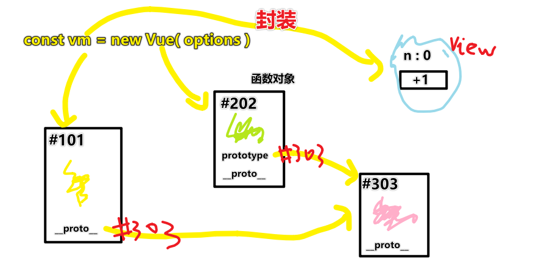
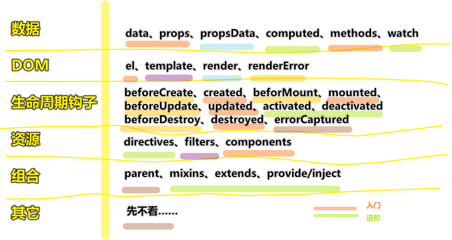
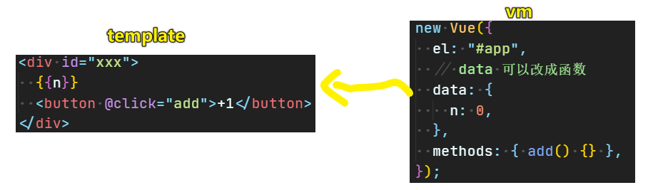
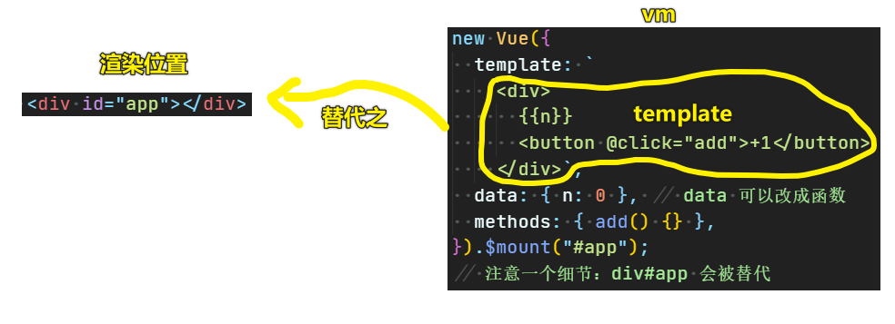
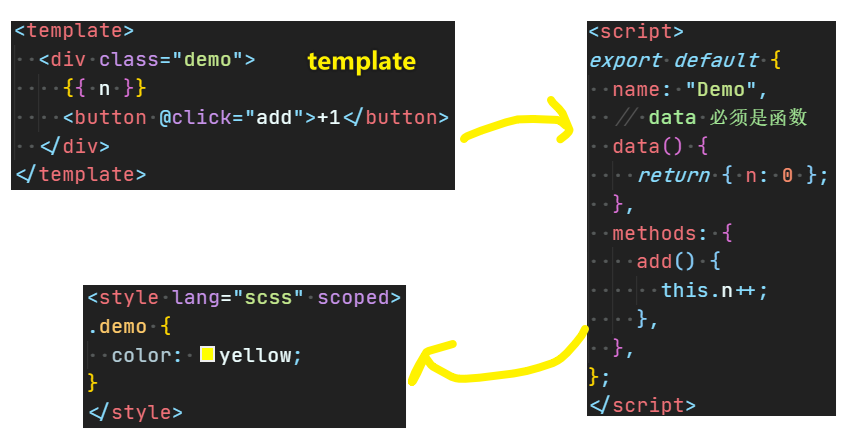
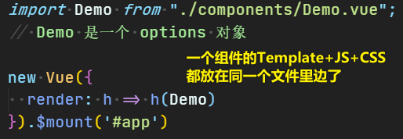
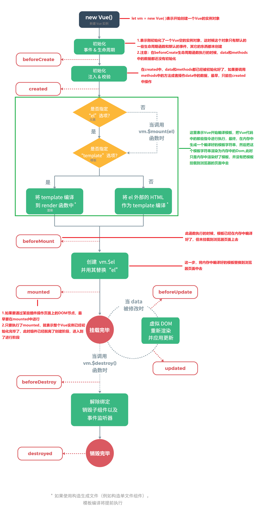
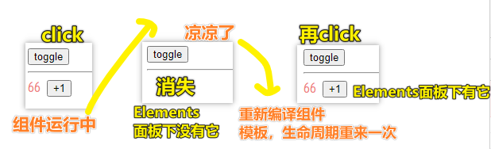
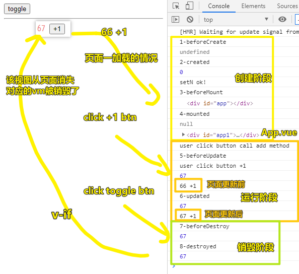
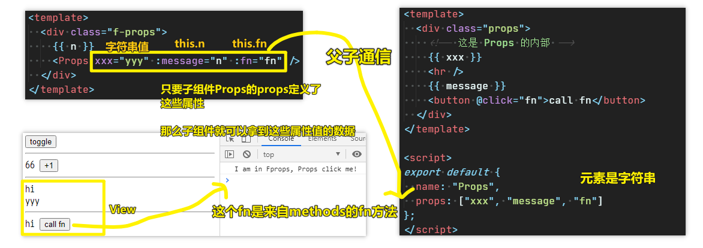

| ✍️ Tangxt | ⏳ 2020-07-10 | 🏷️ 组件 API |

# 02-构造选项

## ★前言

- 在`.vue`文件里边，`<template>内容</template>`里边的`内容`是 XML 语法哈！可不是 HTML 语法 -> 这意味着单标签必须闭合，如`<input />`（HTML推荐单标签不用闭合），当然，还有一种奇葩的语法就是标签里边咩有内容时，可以直接用`/`闭合，如`<div />`（HTML可不支持这样搞！） -> 为什么尤大会选择 XML 语法呢？ -> 因为「**严格的 XML 语法比松散的 HTML 语法相比起来更容易编译**」
- 补充一个使用「完整版」的缺点：耦合性太大，在 `html` 文件中夹杂 `vue` 语法，导致**各类型文件融合到一块**，耦合性大 -> 这也解释了为啥要有单文件组件`.vue`

## ★创建 Vue 实例



1. 把 `Vue` 的实例命名为  `vm` ， `vm`  对象封装了对视图的所有操作包括**数据读写**、**事件绑定**、**DOM 更新**
2.  `vm` 的构造函数是`Vue`，按照ES6的说法， `vm` 所属的类是`Vue`
3. `options`是`new Vue`的参数，一般称为**选项**或**构造选项**

> 图中信息的关注顺序： `options` -> `vm` -> `Vue` -> `Vue.prototype` -> `Vue.prototype.__proto__`

## ★`new Vue`有哪些构造选项？

### <mark>1）如何知道`options`旗下有哪些属性？</mark>

- 英文文档：搜「options」
- 中文文档：搜「选项」

都可以在 [API — Vue.js](https://cn.vuejs.org/v2/api/) 找到……

### <mark>2）`options` 主要有五类属性</mark>



> 学习顺序 -> 类似红**橙**黄绿**青蓝紫** -> 不分层次地去了解每个属性的话，等于白学……

### <mark>3）入门属性（必学）</mark>

#### <mark>1、数据</mark>

- el -> 挂载点 -> 可以用`$mount`代替
- data -> **内部**数据 -> 支持对象和函数，优先用函数
- methods -> 方法 -> 事件处理函数或者是普通函数

---

- `props` -> **外部**数据
  - 也叫属性
  - `message="n"` 传入字符串
  - `:message="n"` 传入 `this.n` 数据
  - `:fn="add"` 传入 `this.add` 函数

#### <mark>2、资源</mark>

- components -> Vue 组件，注意大小写 -> 三种引入方式，推荐最后一种

#### <mark>3、生命周期钩子</mark>

> 四个钩子

- created -> 实例出现在内存中
- mounted -> 实例出现在页面中
- updated -> 实例更新了
- destroyed -> 实例从页面和内存中消亡了

### <mark>4）进阶属性（必学）</mark>

#### <mark>1、数据读写</mark>

- computed -> 计算属性
  - 不需要加括号
  - 它会根据依赖是否变化来缓存
- watch -> 侦听
  - 一旦 `data` 变化，就执行的函数
  - `options.watch` 用法
  - `this.$watch` 用法
  - `deep`、`immediate` 含义

#### <mark>2、资源</mark>

- directives -> 指令
  - 内置指令 -> `v-if/v-for/v-bind/v-on`
  - 自定义指令，如`v-focus`
  - 指令是为了**减少重复**的DOM操作

#### <mark>3、组合</mark>

- mixin -> 混入
  - 重复三次之后的出路
  - 混入 vs 全局混入
  - 选项自动合并
  - 混入就是为了**减少重复**的构造选项

- extends -> 继承
  - 先了解一下 `Vue.extend`
  - 你觉得用了 `mixin` 还是重复
  - 于是你自己写了一个 `View`，它继承 `Vue`
  - 你还可以预先定义其它构造选项
  - 继承就是为了**减少重复**的构造选项
  - 那为什么不用ES6的`extends`呢？

- provide/inject
  - 爷爷想和孙子讲话怎么办？
  - 祖宗想跟它的所有后代讲话怎么办？
  - 答案是全局变量，但是全局变量太 low
  - 所以我们需要**局部的**全局变量

### <mark>5）通用属性</mark>

``` js
propsData
render
renderError
beforeCreate
beforeMount
beforeUpdate
beforeDestroy
```

### <mark>6）特殊属性</mark>

- template: 含有自定义方法
- filters : 不推荐使用


### <mark>7）不常用属性</mark>

- errorCaptured
- parent
- 其它属性

## ★`el` 和 `data` 选项

### <mark>1）模板 `template` 三种写法</mark>

#### <mark>1、Vue 完整版 -> 写在 HTML 里</mark>



#### <mark>2、Vue 完整版 -> 写在选项里</mark>



#### <mark>3、Vue 非完整版 -> 配合 `Xxx.vue` 文件</mark>

创建一个 `Demo.vue`：



在另一个地方使用这个 `Demo` 组件：



### <mark>2）`el` 挂载点</mark>

- `el`的取值：CSS选择器 or 一个 HTMLElement 实例
  - `#app` or `document.querySelector('#app')`

``` js
// 自动挡：
new Vue({
  el: '#app',
  render: h => h(Demo)
})

// 手动挡：
new Vue({
  render: h => h(Demo)
}).$mount('#app')
```

> 手动挂载 vs 自动挂载

---

<mark>Q：Vue 实例的作用范围是？</mark>

> Vue会管理`el`选项命中的元素以及内部的后代元素

<mark>Q：只能使用 `id` 选择器吗？</mark>

> 也可以使用其它的选择器 -> 但建议使用 `id` 选择器！

<mark>Q：是否可以设置成其它的 DOM 元素？</mark>

> 可以使用其它的双标签 -> 但不能使用 `html` 和 `body`

---

### <mark>3）`data` 内部数据（优先使用函数）</mark>

- Vue实例绑定的视图中，用到的数据定义在`data`中
- `data`中可以写复杂类型的数据，如普通对象、数组、函数……
- 渲染复杂类型数据时，遵守JS的语法即可
- 组件的定义只接受`function`
- 在 View（template） 中使用数据，直接写`data`旗下的属性值就行了，注意别忘了添加大胡子语法，即`🟡🟡message🟡🟡`、`🟡🟡id+1🟡🟡`、`🟡🟡user.name🟡🟡`、`🟡🟡user.hobby[2]🟡🟡`、`🟡🟡fn('hi')🟡🟡`

---

<mark>Q：如果`data`旗下某个属性的值是 `null` or `undefined`？</mark>

如是`message`属性，那么你在 `template` 这样写：`🟡🟡message🟡🟡`，那就不显示了！

<mark>Q：大胡子语法？</mark>

Github Pages 解析这个语法`{-{}}`是有问题的（请忽视那个`-`），我就用`🟡🟡🟡🟡`代替了！

我们读`🟡🟡🟡🟡` -> “Mustache”语法 (双大括号)

数据绑定的最常见的形式：

- 文本插值：`🟡🟡message🟡🟡` -> 这一整坨东西就是`message`的值，即你不会在视图中看到`🟡🟡🟡🟡`

注意：**双大括号会将数据解释为普通文本**，而非 HTML 代码。为了输出真正的 HTML，你需要使用 `v-html` -> 如果`message`是HTML字符串值，那么你就 `v-html = 'message'`

如：

``` html
<p>Using v-html directive: <span v-html="rawHtml"></span></p>
<!-- rawHtml的值是：<span>'hi'</span> -->
<!-- 作为内容插入，也就是作为儿子插入 -->
<p>Using v-html directive: <span><span>'hi'</span></span></p>
```

<mark>Q：为什么要优先使用函数？</mark>

- 避免数据污染 -> 为了确保组件每次调用的`data`都是一个新的`data`，而不是共用一个`data`

---

## ★methods、components、四个钩子

### <mark>1）methods</mark>

- 是个普通对象值 -> 旗下有事件处理函数或者普通函数！
- 如果`methods`旗下有个方法（更新视图数据的操作），那么每次更新都会触发重新渲染，影响性能，所以多用watch和computed来代替类似这样的操作！

使用：

``` js
// 定义
{
  methods: {
    add() {this.n++},
    filter(){
      return 'hi'
    }
  }
}
```

``` html
<!-- template -->
<div id="app">
  🟡🟡n🟡🟡
  <button @click="add">+1</button>
  🟡🟡filter()🟡🟡
</div>
```

> `🟡🟡filter()🟡🟡` -> `filter()` -> 函数调用表达式！

### <mark>2）components（Vue 组件）</mark>

> 每个 Vue 组件都是一个 Vue 实例

- 全局姿势：`Vue.component` -> 完整版才支持
  - `component`第一个参数为你定义组件的名字，第二个参数跟Vue实例`options`一样
- 组件可以无限复用，`data`必须是一个函数，避免引用同样的内存地址，导致数据错乱
- 建议大写组件名，以防和`html`标签发生冲突 -> 即命名首字母大写，如`App-xxx`
- 有三种姿势引入组件 -> 最好使用单文件引入方式
- 建议`componentes`命名是保持一致（与引用时），如`import Demo from ''./Demo.vue`，那么就可以这样写 `components:{Demo}` 啦！ -> 简写成一个 `Demo` 美滋滋

局部注册（只能局部使用，不能分享给其它全局组件使用）：

``` js
// 推荐这种姿势引入其它组件到Xxx组件里边的template
import Demo from "./Demo.vue";
const vm = new Vue({
  // 局部注册组件 -> 这样当前这个vm实例的template就能直接使用了
  components: {
    Add: Demo
  },
  // or ES6解析赋值
  // components: {Demo} -> 写在template得这样：<Demo/>
  // JS的对象属性名对大小写是敏感的，即 var o = {Name:'ya',name:'5'}
  // o.Name 为 'ya'，o.name 为 '5'
  data(){
    return {
      n: 0
    }
  },
  template:  `
    <Add/>
  `
})
```

全局注册：

``` js
// args1：id，args2：definition -> 本质就是 options
Vue.component('Demo',{
  template: `
    <div>hi</div>
  `
})

// 使用

const vm = new Vue({
  data() {
    return {
      n: 0
    }
  },
  template: `
    <div>
      <Demo/>
    </div>
  ` 
})
```

### <mark>3）什么是生命周期</mark>

> 从 Vue 实例创建、运行、到销毁期间，总是伴随着各种各样的事件，这些事件，统称为生命周期！

周期就像是：立个flag（未开始） -> 实现flag（进行中） -> 划掉flag（已完成）



> 先天 `new Vue()` 一下，会有多个钩子函数自动执行，不同的钩子函数在执行的时候，可能会拿到不同的数据，如 `beforeCreate` 钩子执行时，就拿不到 `data`、`methods`里边的数据！而`created`钩子在执行时，就可以拿到`data`、`methods`里边的数据，这样我们就可以调用`methods`中的方法去操作`data`中的数据了！

### <mark>4）8个钩子</mark>

> 主要关注 `created`、`mounted`、`updated`、`destroyed` 这四个钩子！

#### <mark>1、创建期间的生命周期函数</mark>

- beforeCreate : 实例刚在内存中被创建出来，此时，还没有初始化`data`和`methods`属性
- created : 实例已经在内存中创建OK，此时`data`和`methods`已经初始化完成，此时还没有开始编译模板 -> 此时的组件在内存中，没有出现在页面中
- beforeMount : 此时模板已经在内存中编译完成，但是还没有挂载到页面中 -> 虽然编译完成，但还没有去覆盖页面中的 `div#app`
- mounted : 此时，已经将编译好的模板，挂载到了页面指定的容器中显示 -> 此时该组件出现在页面了，即你可以通过JS拿到 `div#app1`了

#### <mark>2、运行期间的生命中期函数</mark>

- beforeUpdate : 用户点击视图上的button，执行`click`事件绑定的`add`方法，对`data`中的`n`值`+1`，然后再执行这个钩子！ -> **此时可以获取到在内存中的`n`的最新值，但视图中的`n`值还是旧值** -> **页面渲染前或者说视图更新前执行**
- updated : `data`中的状态值和页面中上显示数据改动了或者更新了会执行该函数 -> **在页面渲染了最新数据之后就会执行它**

#### <mark>3、销毁期间的生命周期函数</mark>

- beforeDestroy：实例销毁之前调用 -> **此时组件绑定的页面视图已经从DOM树中移除，内存中还有该组件实例**
- destroyed：实例或者组件销毁后调用 -> **内存中没有该组件实例了**



> 运行期间的钩子可以多次执行 -> 创建期间的钩子只执行一次，当然，通过点击按钮`v-if=false`后，组件视图消失，组件实例的生命周期结束，然后你再点击按钮，`v-if=true`后，组件重新开始新的一轮生命周期！即又会来一次创建期间的钩子执行……

#### <mark>4、小结</mark>



> demo：[测试8个生命周期钩子](https://github.com/ppambler/vue-demo-101/commit/5879403bbcc7532aa793f0dec8145a176a77164f)

## ★props（外部数据，或者称为属性）

- 组件不仅仅是要把模板的内容进行**复用**，更重要的是**组件之间的通信**，通常父组件的模板中包含子组件，父组件要向子组件传递数据或者参数，子组件接收到后根据参数的不同来进行对应的渲染。数据传递在vue组件可以通过`props`来实现
- 父组件传个子组件的数据：
  - 静态的：字符串
  - 动态的（变量）：基本数据类型+复杂数据类型 -> 注意：**加`:`多用于传入变量**
- 谁引用组价，那么谁就负责传入外部变量，而被引用的组件则负责接收外部数据！



> 在父组件里边，写在`Props`这个自定义标签上的`message`和 `fn`（命名）属性是由被引用的组件所决定的，在这里也就是`Props`组件决定的！ -> 总之，这不是我们父组件固定的命名 -> 即**子组件决定了自己要接收哪些外部数据**！

## ★了解更多

➹：[Vue的两个版本 - 上帝之兵的文章 - 知乎](https://zhuanlan.zhihu.com/p/148504421)

➹：[Vue全解 - 知乎](https://zhuanlan.zhihu.com/p/149649488)

➹：[Vue构造选项入门属性讲解 - 知乎](https://zhuanlan.zhihu.com/p/133398519)

➹：[40.vue全解(起手式1) - 掘金](https://juejin.im/post/5e9bc313f265da47b35c7cb4)

➹：[Vue $mount的挂载入口的奥秘 - 掘金](https://juejin.im/post/5b7fffa851882543036700ad)

➹：[Vue.js 生命週期](https://medium.com/@ms0313735/vue-js-%E7%94%9F%E5%91%BD%E9%80%B1%E6%9C%9F-e601c6213698)

➹：[Vue.js component 使用說明](https://medium.com/@ms0313735/vue-js-component-%E4%BD%BF%E7%94%A8%E8%AA%AA%E6%98%8E-8ea866fca0ed)

## ★总结

- 不要一口气把所有「构造选项」都给学了！你要分清楚，哪些是入门阶段学习，哪些是进阶阶段学习，哪些是不需要学习的！
- 了解了8个钩子是何时执行的，以及这些钩子在执行的过程中，能够获取哪些数据，而又有哪些数据是不能获取的！
- 父子通信姿势一：子组件定义了`props`，那么其中的元素值，就是父组件使用子组件标签时，所写上的标签属性！ -> 就像是这样 `<div class="father"><a href="xxx.html">click me</a></div>`，`href`属性可不是乱写的哦！这是固定写法呀！由`a`标签天生决定的！


