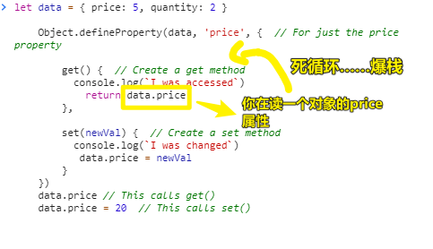
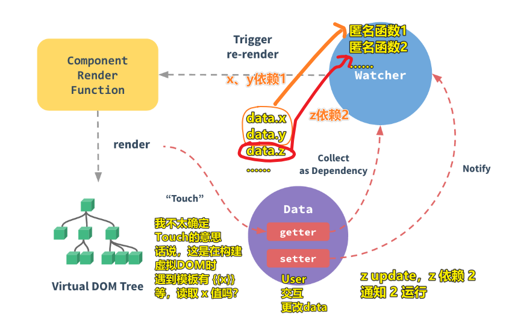
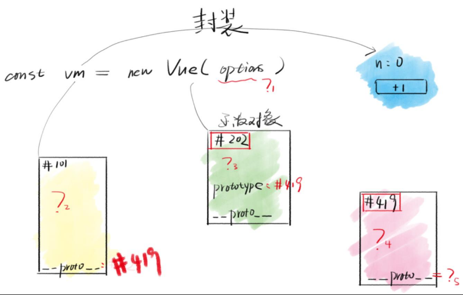
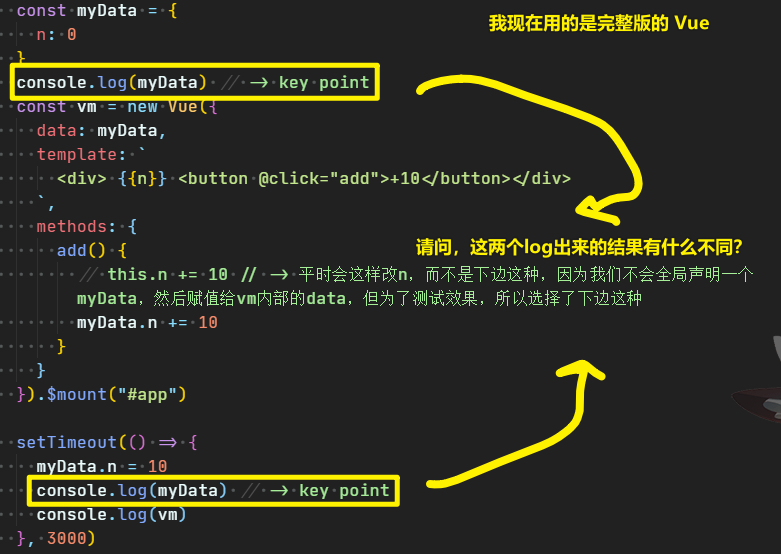
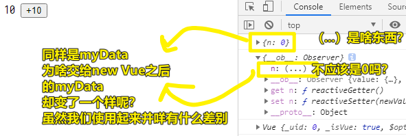
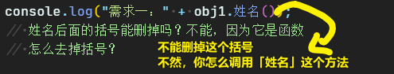
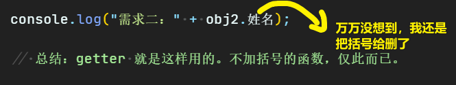
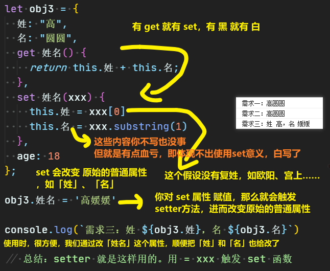
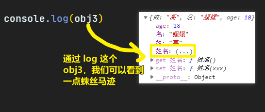

| ✍️ Tangxt | ⏳ 2020-07-11 | 🏷️ 数据响应式 |

# 03-数据响应式

## ★前言

了解「数据响应式」前，我看了 vue 官网的这篇介绍：

[深入响应式原理 — Vue.js](https://cn.vuejs.org/v2/guide/reactivity.html)

但我看得云里雾里的……

根据官网推荐的视频（纯英文的视频实在是听不懂），我大概看了一下视频下方的这篇文章：

[Build a Reactivity System - Advanced Components - Vue Mastery](https://www.vuemastery.com/courses/advanced-components/build-a-reactivity-system/)

其中提到：

- JavaScript is procedural, not reactive -> 你想「reactive」，那么就需要事件绑定，但有`data`事件吗？ -> 所以这就是为啥会有「数据绑定」的称呼？ -> 数据更新相当于是触发事件，事件的reactive是视图发生相应的更新……
- 把一段代码存储起来，当 `data` 发生变化时，再次运行这段存储起来的的代码！
- 观察者模式（**在xxx存储里边匿名函数 -> 通知xxx里边所有的匿名函数 -> 你们这些匿名函数都跑一遍吧！**）
  - `record` -> `depend` -> 记录 -> 记录更新`data`的计算规则
  - `storage` -> `subscribers` -> `[]` -> 存储匿名函数，也就是存储记录的规则，注意，规则是去重的……
  - `reply` -> `notify` -> 回放 ->执行计算规则
- 根据匿名函数的计算规则，匿名函数可能观察1个`data`属性或2个`data`属性或3个……如匿名函数`A`的计算规则是 `data.price * 0.8`，那么`A`只`watcher`一个`data.price`，再比如匿名函数`B`的计算规则是 `data.price * data.quantity`，那么 `B` 得 `watcher` 两个状态，即`data.price`和`data.quantity`
- 访问`data`属性（如`price` or `quantity`）时，存储匿名函数到`subscriber`数组 -> 更新`data`属性，运行存储在`subscriber`里边的匿名函数！ -> 方案`Object.defineProperty()`
- 为啥在使用`Object.defineProperty()` 时要定义一个全局的 `internalValue`呢？
  
  
  
- **Price accessed (get)** => call `dep.depend()` to save the current `target`
- **Price set** => call `dep.notify()` on price, re-running all the `targets`

> 这篇文章真得写得很好呀！从最原始到最终的结果，是一步步走过来的，我看过一些讲 Vue 响应式原理的文章，直接一上来就是`Object.defineProperty()`，没有丝毫的铺垫过程……

再看这张图，我不确定自己的理解是否正确：



---

## ★`getter` 和 `setter`

> Vue 对 `data` 做了什么？

1）一张「内存图」贯穿你整个对 Vue 的学习



2）为什么方方要用一节课的时间来讲这个看似很简单的`options.data`（深入理解一下）？

我们认为 `data` 是很简单的，即它就是一个**内部数据**而已，没啥特别的

但实际上，为了方便我们之后学习 `options` 的进阶属性，我们必须揉碎它，剥开它

`data`的主要原理，可以看这个：[深入响应式原理 — Vue.js](https://cn.vuejs.org/v2/guide/reactivity.html) -> 内容篇幅太少了，可能你看完之后并不能深刻的理解！ -> 当然，你也可以看源代码，但这是非常不切实际的……

相较于官方文档，方方的讲解 -> 对 `data` 扩充了非常多的内容！

2）小实验

1、从一个小点开始



结果：



2、解释 `log` 的异同？

前置知识：[ES 6 新特性列表](https://fangyinghang.com/es-6-tutorials/)、[getter 和 setter](https://developer.mozilla.org/en-US/docs/Web/JavaScript/Reference/Operators/Object_initializer)

> 关于 ES6 新出来的 API，你**只需要知道它们是干啥的就行了**，不需要自己动手去一个个了解，也不需要去记住它们是怎么用的 -> 当你在做项目的时候，需要用到了某个 API，再去了解它的语法、用法……

CRUD 这个对象：

``` js
let obj0 = {
  姓: "高",
  名: "圆圆",
  age: 18
};
```

**①需求一：得到姓名**

``` js
let obj1 = {
  姓: "高",
  名: "圆圆",
  姓名() {
    return this.姓 + this.名;
  },
  age: 18
};

console.log("需求一：" + obj1.姓名());
// 姓名后面的括号能删掉吗？不能，因为它是函数
// 怎么去掉括号？
```



**②需求二：姓名不要括号也能得出值**

``` js
let obj2 = {
  姓: "高",
  名: "圆圆",
  get 姓名() {
    return this.姓 + this.名;
  },
  age: 18
};

console.log("需求二：" + obj2.姓名);

// 总结：getter 就是这样用的。不加括号的函数，仅此而已。
```



> 用了ES6的新语法，仅仅在`姓名`属性名前边加个`get`关键字就可以实现我们的需求…… -> 为什么可以这样？ -> 嗯，没有为什么，ES6的新语法特性就是如此……总之，你可以这样理解：`姓名`本质是属性不是函数，但是`姓名`的定义是用函数姿势定义的！ -> 这样的`姓名`属性叫「**计算属性**」，虽然跟**普通属性**长得一模一样…… -> 读法「get 一个属性 的值」，如「get 姓名 的值」

**③需求三：姓名可以被写**

``` js
let obj3 = {
  姓: "高",
  名: "圆圆",
  get 姓名() {
    return this.姓 + this.名;
  },
  set 姓名(xxx) {
    this.姓 = xxx[0]
    this.名 = xxx.substring(1)
  },
  age: 18
};

obj3.姓名 = '高媛媛'

console.log(`需求三：姓 ${obj3.姓}，名 ${obj3.名}`)

// 总结：setter 就是这样用的。用 = xxx 触发 set 函数
```



---

虽然了解了 `get` 和 `set` 到底是什么，有啥用，但我还是不理解 `{n: (...)}` 是个啥子东西……



可以看到我们并没有写一个叫「`姓名`」的属性（**像个真实属性一样**，对比 `get 姓名` ，颜色更为明显，同我们定义的普通属性`姓`、`名`、`age`简直一模一样，只是值是`(...)`），但是 `obj3` 旗下就是有个叫 `姓名` 的普通属性！

浏览器的看法：

> 开发者你确实可以对`姓名`读和写，但是并不存在一个叫`姓名`的属性 -> 读和写的操作是通过`get`和`set`完成的！

所以我们可以推出：

- `n:(...)`的意思是，并不存在一个叫`n`的属性，而是有个 `get n` 和 `set n`，这俩东西用来模拟对 `n` 的读写操作！

**虽然我们理解了`n:(...)`这种形式，但是我们并不理解为啥要把`n`变成是`get n`和`set n`**

---

Q：对象的方法定义有几种姿势？

最常见的姿势（引入函数）：

``` js
let o = {
  property: function (parameters) {},
}  
```

简写姿势（不需要用关键字`function`提示这是一个引入了函数的属性）：

``` js
// Shorthand method names (ES2015)
let o = {
  property(parameters) {},
}
```

不常见但很有用的姿势（引入`getter` or `setter`方法）：

``` js
let o = {
  get property() {},
  set property(value) {}
}
```

我的认知改变：

- 有`function`的属性
- 有`getter`的属性
- 有`setter`的属性

「`function`方法」 & 「`getter`方法 or `setter`方法」 是有区别的！

Q：触发一个方法执行有三种姿势？

- `xxx.name()`
- `xxx.name`
- `xxx.fullName = '毛不易'`

## ★`Object.defineProperty`


