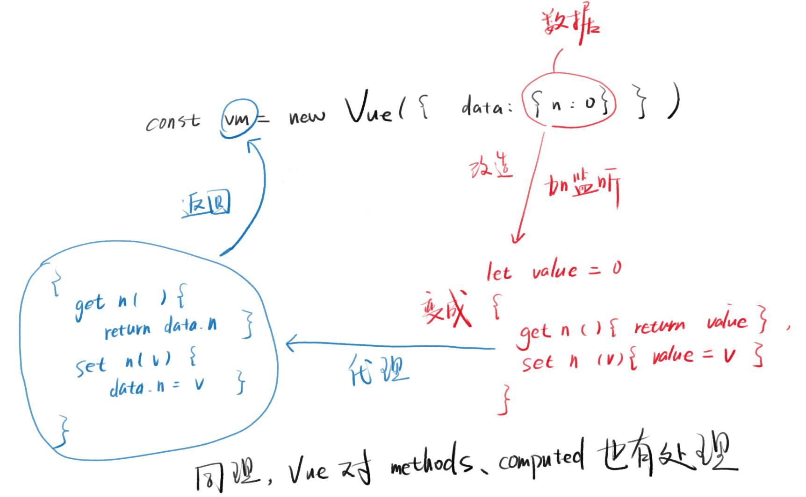
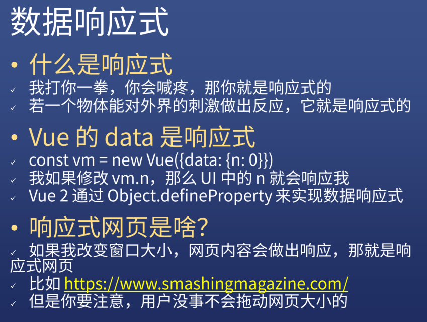
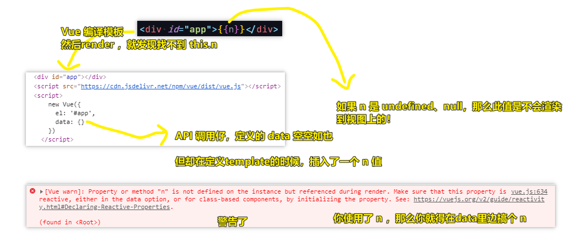
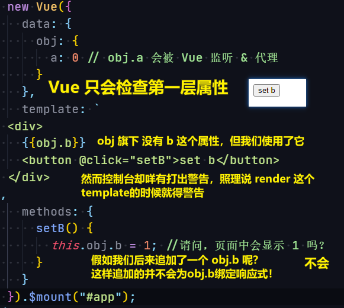
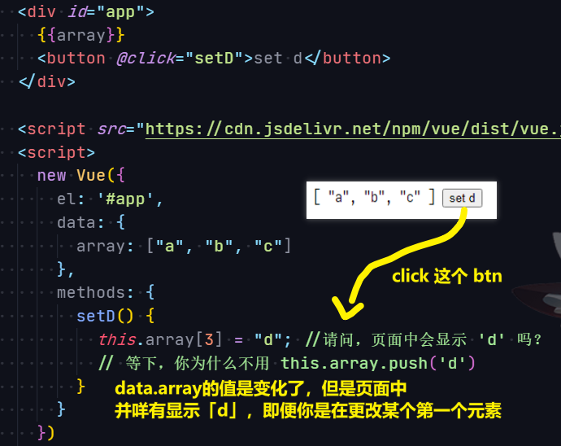
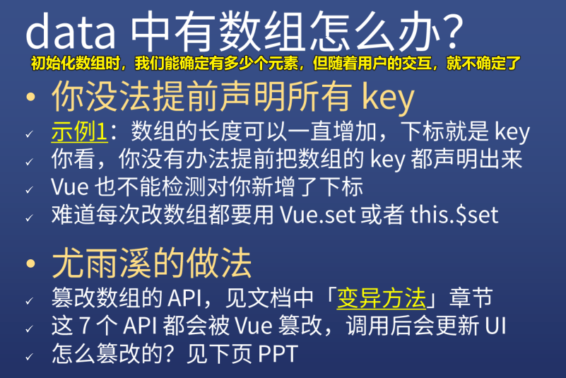
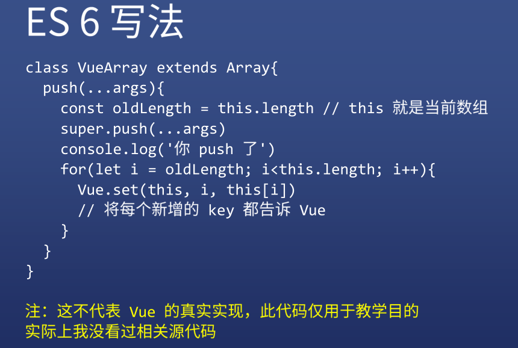
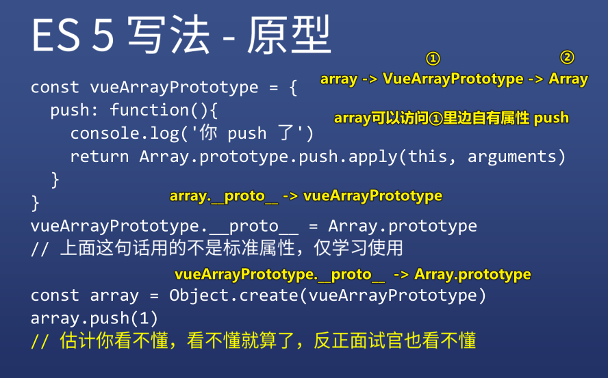
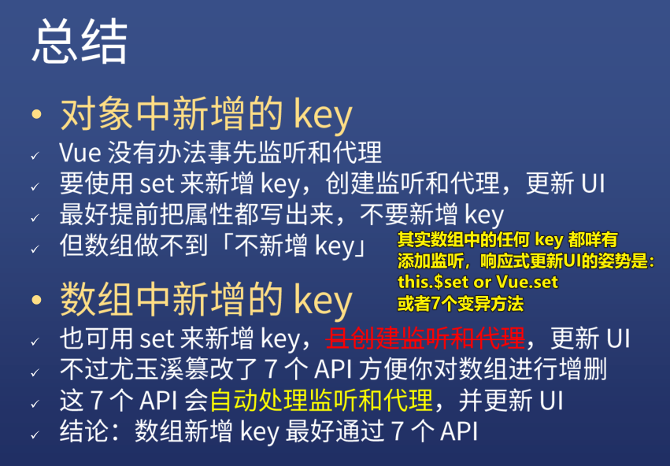

| ✍️ Tangxt | ⏳ 2020-07-11 | 🏷️ 数据响应式 |

# 03-数据响应式

## ★前言

了解「数据响应式」前，我看了 vue 官网的这篇介绍：

[深入响应式原理 — Vue.js](https://cn.vuejs.org/v2/guide/reactivity.html)

但我看得云里雾里的……

根据官网推荐的视频（纯英文的视频实在是听不懂），我大概看了一下视频下方的这篇文章：

[Build a Reactivity System - Advanced Components - Vue Mastery](https://www.vuemastery.com/courses/advanced-components/build-a-reactivity-system/)

其中提到：

- JavaScript is procedural, not reactive -> 你想「reactive」，那么就需要事件绑定，但有`data`事件吗？ -> 所以这就是为啥会有「数据绑定」的称呼？ -> 数据更新相当于是触发事件，事件的reactive是视图发生相应的更新……
- 把一段代码存储起来，当 `data` 发生变化时，再次运行这段存储起来的的代码！
- 观察者模式（**在xxx存储里边匿名函数 -> 通知xxx里边所有的匿名函数 -> 你们这些匿名函数都跑一遍吧！**）
  - `record` -> `depend` -> 记录 -> 记录更新`data`的计算规则
  - `storage` -> `subscribers` -> `[]` -> 存储匿名函数，也就是存储记录的规则，注意，规则是去重的……
  - `reply` -> `notify` -> 回放 ->执行计算规则
- 根据匿名函数的计算规则，匿名函数可能观察1个`data`属性或2个`data`属性或3个……如匿名函数`A`的计算规则是 `data.price * 0.8`，那么`A`只`watcher`一个`data.price`，再比如匿名函数`B`的计算规则是 `data.price * data.quantity`，那么 `B` 得 `watcher` 两个状态，即`data.price`和`data.quantity`
- 访问`data`属性（如`price` or `quantity`）时，存储匿名函数到`subscriber`数组 -> 更新`data`属性，运行存储在`subscriber`里边的匿名函数！ -> 方案`Object.defineProperty()`
- 为啥在使用`Object.defineProperty()` 时要定义一个全局的 `internalValue`呢？
  
  
  
- **Price accessed (get)** => call `dep.depend()` to save the current `target`
- **Price set** => call `dep.notify()` on price, re-running all the `targets`

> 这篇文章真得写得很好呀！从最原始到最终的结果，是一步步走过来的，我看过一些讲 Vue 响应式原理的文章，直接一上来就是`Object.defineProperty()`，没有丝毫的铺垫过程……

再看这张图，我不确定自己的理解是否正确：


---

## ★`getter` 和 `setter`

> Vue 对 `data` 做了什么？

### <mark>1）一张「内存图」贯穿你整个对 Vue 的学习</mark>


### <mark>2）为什么方方要用一节课的时间来讲这个看似很简单的`options.data`（深入理解一下）？</mark>

我们认为 `data` 是很简单的，即它就是一个**内部数据**而已，没啥特别的

但实际上，为了方便我们之后学习 `options` 的进阶属性，我们必须揉碎它，剥开它

`data`的主要原理，可以看这个：[深入响应式原理 — Vue.js](https://cn.vuejs.org/v2/guide/reactivity.html) -> 内容篇幅太少了，可能你看完之后并不能深刻的理解！ -> 当然，你也可以看源代码，但这是非常不切实际的……

相较于官方文档，方方的讲解 -> 对 `data` 扩充了非常多的内容！

### <mark>2）小实验</mark>

#### <mark>1、从一个小点开始</mark>


结果：


#### <mark>2、解释 `log` 的异同？</mark>

前置知识：[ES 6 新特性列表](https://fangyinghang.com/es-6-tutorials/)、[getter 和 setter](https://developer.mozilla.org/en-US/docs/Web/JavaScript/Reference/Operators/Object_initializer)

> 关于 ES6 新出来的 API，你**只需要知道它们是干啥的就行了**，不需要自己动手去一个个了解，也不需要去记住它们是怎么用的 -> 当你在做项目的时候，需要用到了某个 API，再去了解它的语法、用法……

CRUD 这个对象：

``` js
let obj0 = {
  姓: "高",
  名: "圆圆",
  age: 18
};
```

**①需求一：得到姓名**

``` js
let obj1 = {
  姓: "高",
  名: "圆圆",
  姓名() {
    return this.姓 + this.名;
  },
  age: 18
};

console.log("需求一：" + obj1.姓名());
// 姓名后面的括号能删掉吗？不能，因为它是函数
// 怎么去掉括号？
```


**②需求二：姓名不要括号也能得出值**

``` js
let obj2 = {
  姓: "高",
  名: "圆圆",
  get 姓名() {
    return this.姓 + this.名;
  },
  age: 18
};

console.log("需求二：" + obj2.姓名);

// 总结：getter 就是这样用的。不加括号的函数，仅此而已。
```


> 用了ES6的新语法，仅仅在`姓名`属性名前边加个`get`关键字就可以实现我们的需求…… -> 为什么可以这样？ -> 嗯，没有为什么，ES6的新语法特性就是如此……总之，你可以这样理解：`姓名`本质是属性不是函数，但是`姓名`的定义是用函数姿势定义的！ -> 这样的`姓名`属性叫「**计算属性**」，虽然跟**普通属性**长得一模一样…… -> 读法「get 一个属性 的值」，如「get 姓名 的值」

**③需求三：姓名可以被写**

``` js
let obj3 = {
  姓: "高",
  名: "圆圆",
  get 姓名() {
    return this.姓 + this.名;
  },
  set 姓名(xxx) {
    this.姓 = xxx[0]
    this.名 = xxx.substring(1)
  },
  age: 18
};

obj3.姓名 = '高媛媛'

console.log(`需求三：姓 ${obj3.姓}，名 ${obj3.名}`)

// 总结：setter 就是这样用的。用 = xxx 触发 set 函数
```


---

虽然了解了 `get` 和 `set` 到底是什么，有啥用，但我还是不理解 `{n: (...)}` 是个啥子东西……


可以看到我们并没有写一个叫「`姓名`」的属性（**像个真实属性一样**，对比 `get 姓名` ，颜色更为明显，同我们定义的普通属性`姓`、`名`、`age`简直一模一样，只是值是`(...)`），但是 `obj3` 旗下就是有个叫 `姓名` 的普通属性！

浏览器的看法：

> 开发者你确实可以对`姓名`读和写，但是并不存在一个叫`姓名`的属性 -> 读和写的操作是通过`get`和`set`完成的！

所以我们可以推出：

- `n:(...)`的意思是，并不存在一个叫`n`的属性，而是有个 `get n` 和 `set n`，这俩东西用来模拟对 `n` 的读写操作！

**虽然我们理解了`n:(...)`这种形式，但是我们并不理解为啥要把`n`变成是`get n`和`set n`**

---

<mark>Q：对象的方法定义有几种姿势？</mark>

最常见的姿势（引入函数）：

``` js
let o = {
  property: function (parameters) {},
}  
```

简写姿势（不需要用关键字`function`提示这是一个引入了函数的属性）：

``` js
// Shorthand method names (ES2015)
let o = {
  property(parameters) {},
}
```

不常见但很有用的姿势（引入`getter` or `setter`方法）：

``` js
let o = {
  get property() {},
  set property(value) {}
}
```

我的认知改变：

- 有`function`的属性
- 有`getter`的属性
- 有`setter`的属性

「`function`方法」 & 「`getter`方法 or `setter`方法」 是有区别的！

<mark>Q：触发一个方法执行有三种姿势？</mark>

- `xxx.name()`
- `xxx.name`
- `xxx.fullName = '毛不易'`

## ★`Object.defineProperty`

在上个标题里边，我们知道：

> ES6提供了一种新的语法特性，可以让我们在一个对象上设置一个`getter`和一个`setter`，然后对一个虚拟的属性进行读写……

文档：[Object.defineProperty()](https://developer.mozilla.org/en-US/docs/Web/JavaScript/Reference/Global_Objects/Object/defineProperty) -> 主要看 Examples

### <mark>1）如何使用`Object.defineProperty()`？</mark>

我们之前在声明并初始化`obj3`的时候就直接写了它的`get`和`set`：

``` js
let obj3 = {
  姓: "高",
  名: "圆圆",
  get 姓名() {
    return this.姓 + this.名;
  },
  set 姓名(xxx) {
    this.姓 = xxx[0]
    this.名 = xxx.substring(1)
  },
  age: 18
};
```

但是如果我们之后还有为`obj3`添加新的`get`和`set`属性呢？如这样：`obj3.get xxx() {}`，显然这是加不了的……

所以这个时候 `Object.defineProperty()` 就派上用场了……

它的参数：

1. 第一个参数：告诉我你要在哪个对象上进行`define`，即你要`define`哪个对象
2. 第二个参数：告诉我你要定义一个什么东西，如一个叫 `xxx` 的东西（**虚拟属性**）
3. 第三个参数：对象值，写上`get`和`set`就好了，注意你不需要这样写 `get xxx(){}`……因为第二个参数已经明确了这是一个叫`xxx`的东西，所以你直接 `get(){}` 就行了 -> 不要多此一举哈！（）


> 通过`Object.defineProperty()`这种方式，我们给`obj3`添加了一个虚拟属性`xxx`，也叫属性……在定义`xxx`的`set`方法时，`xxx`这个属性是不存在的，即 `obj3` 此时是咩有这个属性的，即便我们在外界可以`obj3.xxx`这样访问，但这样访问的本质是调用了`getter`和`setter`方法，之前我们初始化`obj3`之所以可以用`this.姓`啥的，那是因为`obj3`就是有个`姓`属性呀，所以我们必须得找一个东西来放置`set`过来的值，所以我们定义了一个叫`_xxx`的东西，用来存储`xxx`的值，而每次`get`的值，实际拿到的是`_xxx`的值，也就是说`get`和`set`与`_xxx`构成了闭包……

注意，`set`和`get`里边的`this`指向是`obj3`哈！

总之，定义完一个`obj3`之后，你还想追加所谓的「虚拟属性」的话，那么你得通过`Object.defineProperty()`来哈！而且关于这**新的**虚拟属性（假如叫`xxx`），你在`Object.defineProperty()`的第三个参数里边的`set`和`get`是不能出现`this.xxx`这样的代码，如果出现了，那么就会出现死循环，然后爆栈！ -> 避免死循环，所以需要用到一个临时变量（全局也好，局部也罢，如叫`_xxx`），用来存储`xxx`这个属性的值，`get xxx`，即`obj3.xxx`时拿到的是`_xxx`的值，`set xxx`，即`obj3.xxx = 'hi'`时，`update`的东西是`_xxx`…… -> `xxx`给我的感觉就像是个傀儡一样！表面上看`xxx`真得是`obj3`的属性，实际上是个被`setter`和`getter`操控的傀儡！

---

目前，我们已经知道了`getter`、`setter`以及`Object.defineProperty()`，但我们依旧还是不理解为啥会有`{n:0} -> vm -> {n:(...)}`这样的变化！

> `getter`和`setter`：在定义一个对象的时候，可以直接定义一个`getter`和`setter`
> 
> `Object.defineProperty()`：定义完对象过之后，你又突然想加一个`getter`和`setter`，那就使用`Object.defineProperty()`这个东西来搞吧！

## ★代理和监听

测试对象：

``` js
let data0 = {
  n: 0
}
```

### <mark>1）需求一：用 `Object.defineProperty` 定义 `n`</mark>

``` js
let data1 = {}

Object.defineProperty(data1, 'n', {
  value: 0
})

console.log(`需求一：${data1.n}`)

// 总结：这煞笔语法把事情搞复杂了？非也，继续看。
```

分析：


一个无厘头的看法（天生的属性 vs 后来的属性）：


> 通过 `Object.defineProperty` 定义的属性似乎在告诉我，此属性最好不要访问，就跟 IE 禁止使用 `__proto__` 一样

### <mark>2）需求二：`n` 不能小于 `0`</mark>

> 即 `data2.n = -1` 应该无效，但 `data2.n = 1` 有效

``` js
let data2 = {}

data2._n = 0 // _n 用来偷偷存储 n 的值

Object.defineProperty(data2, 'n', {
  get() {
    return this._n
  },
  set(value) {
    if (value < 0) return
    this._n = value
  }
})

console.log(`需求二：${data2.n}`)
data2.n = -1
console.log(`需求二：${data2.n} 设置为 -1 失败`)
data2.n = 1
console.log(`需求二：${data2.n} 设置为 1 成功`)

// 抬杠：那如果对方直接使用 data2._n 呢？
// 算你狠
```

解析：

为啥不能 `data2.n = -1` 这样？这种赋值操作不是烂大街了吗？还有什么值是不能赋给变量的？JS 可不是强类型语言呀！

> 通过ES6的`getter`和`setter`是可以做到这一点的！

做法要点：

- 需要一个真实的`_n`（命名随意，但一般有下划线`_`开头的属性，都是告诉API调用仔不要访问这个`_n` -> 它是形式上私有的，API调用仔访问它会很危险），用来存储虚拟的`n`
- 为啥 `get` 和 `set`里边用的是`this`，而不是`data2`？ -> 因为万一不叫`data2`了呢？而`this`就是`data2`，就是当前的这个`data2`对象，你换成是`data666`，那么`this`就是`data666`
- 一个存储属性值的地方，一个读属性的地方，一个写属性的地方


如果我们使用了`get`和`set`，那么我们可以在`set`里边做个判断，即不满足条件，就不`set`，甚至可以报一个错！

问题来了：

1. API调用仔，居然这样做：`obj2._n = -1` -> 这样一来，`n`就是`-1`的初始值了，所以我们的需求GG了！

怎么办？

1. `data2`对象的这个`_n`属性，能不能不要暴露给 API 调用仔？甚至能否连`data2`这个名字也不要暴露给 API 调用仔？

方案：

> 使用代理！

### <mark>3）需求三：使用代理</mark>

``` js
let data3 = proxy({ data: { n: 0 } }) // 括号里是匿名对象，无法访问

function proxy({ data }/* 解构赋值，别TM老问 */) {
  const obj = {}
  // 这里的 'n' 写死了，理论上应该遍历 data 的所有 key，这里做了简化
  // 因为我怕你们看不懂
  Object.defineProperty(obj, 'n', {
    get() {
      return data.n
    },
    set(value) {
      if (value < 0) return
      data.n = value
    }
  })
  return obj // obj 就是代理
}

// data3 就是 obj
console.log(`需求三：${data3.n}`)
data3.n = -1
console.log(`需求三：${data3.n}，设置为 -1 失败`)
data3.n = 1
console.log(`需求三：${data3.n}，设置为 1 成功`)

// 杠精你还有话说吗？
// 杠精说有！你看下面代码
```

解析要点：


可以看到，API 调用仔是无法去修改我写的代码的！

`{ data: { n: 0 } }` -> 就是`options` -> 通过解析赋值拿到「真实的值」`{ n: 0 }`

一个比喻（代理有房子吗？ vs 房子是房东的）：


你是租房的，中介是`obj`，房东是`data`


当我们`data3.n`的时候，访问的是`obj`的虚拟属性`n`，但拿到的是`data.n`的值 -> 门面上你租的房子像是中介所属的，实际上是房东的！

所以，总体上看：

- 我们的代码只暴露了代理对象，咩有暴露真实的`data`对象！ -> API 调用仔对 `data` 旗下的属性的任何操作，都要经过「中介」的把关，如你不能养宠物，你不能与房东对话交流，你不能从事违法职业等等……

总之，API 调用仔 无法直接修改 `data`，必须得经过代理的审查，确认无误后，才能修改`data`

不过，这样依旧存在问题：


API调用仔绕过了代理，直接操作真实数据！

### <mark>4）需求四</mark>

``` js
let myData = { n: 0 }
let data4 = proxy({ data: myData }) // 括号里是匿名对象，无法访问

// data3 就是 obj
console.log(`杠精：${data4.n}`)
myData.n = -1
console.log(`杠精：${data4.n}，设置为 -1 失败了吗！？`)

// 我现在改 myData，是不是还能改？！你奈我何
// 艹，算你狠
```

### <mark>5）需求五：就算用户擅自修改 `myData`，也要拦截他</mark>

``` js
let myData5 = { n: 0 }
let data5 = proxy2({ data: myData5 }) // 括号里是匿名对象，无法访问

function proxy2({ data }/* 解构赋值，别TM老问 */) {
  // 这里的 'n' 写死了，理论上应该遍历 data 的所有 key，这里做了简化
  // 因为我怕你们看不懂
  let value = data.n
  // delete data.n // -> 可以不写，因为后面定义虚拟属性的时候，可以覆盖掉
  Object.defineProperty(data, 'n', {
    get() {
      return value
    },
    set(newValue) {
      if (newValue < 0) return
      value = newValue
    }
  })
  // 就加了上面几句，这几句话会监听 data

  const obj = {}
  Object.defineProperty(obj, 'n', {
    get() {
      return data.n
    },
    set(value) {
      if (value < 0) return//这句话多余了
      data.n = value
    }
  })

  return obj // obj 就是代理
}

// data3 就是 obj
console.log(`需求五：${data5.n}`)
myData5.n = -1
console.log(`需求五：${data5.n}，设置为 -1 失败了`)
myData5.n = 1
console.log(`需求五：${data5.n}，设置为 1 成功了`)
```

简单解析：


可以看到，不管你是通过`myData5.n`来读写，还是通过`data5.n`来读写，都会被`getter`、`setter`监听到！

### <mark>6）这代码看着眼熟吗？</mark>

``` js
let data5 = proxy2({ data:myData5 }) 
let vm = new Vue({data: myData})
```

可以看到，我们之前不懂的这个：`{n:0} -> vm -> {n:(...)}`，现在轻而易举地就能知道是为什么了！

以上讲的原理，就是 Vue 内部的源代码！

### <mark>7）现在我们可以说说 `new Vue` 做了什么了</mark>

``` js
vm = new Vue({data: myData})
```

这行代码，Vue 做两件事情：

1. 让`vm` 成为 `myData` 的代理 -> 你 `vm.m` 就是在取 `myData.m`，你 `vm.v` 就是在取 `myData.v`，同样，`vm.v = 'hi'`这样赋值，也是在对`myData.v`赋值…… -> 通过`this`来访问`v`、`m`属性也是如此，因为`this`就是代理，就是`vm`
2. 对`myData`的所有属性进行监控 -> 虽然我们在使用 Vue 的时候，基本上都是 `new Vue({data: {n:0}})` 这样做的，但是奈何总有人会`new Vue({data: myData})`这样写 -> 必须要让代理`vm`知道所有的事情，这样一来就可以调用`render(data)`，然后更新 UI 了！不然，`myData`变化了，UI 还是没有作出相应的变化！

总之，Vue 做了那么多功夫，总而言之就一句话：

> 你对 `data` 的任何修改，我 Vue 必须要知道！不然，我就无法去`render`了！ -> 无法`render`，UI 就不会变化了！那么 我这个 Vue 的立身之本也就没有了！

### <mark>8）小结</mark>

研究方法：

方方对`data`的**研究方法**要比知识本身更为重要，那这是什么研究方法呢？


通过这两个`log`，我们发现了`myData`被 `Vue` 处理之前，和被`Vue`处理之后，的结果是不一样的！

显然，通过方方的讲解之后，我们知道了一旦传入了`myData`给 Vue，那么 Vue 就会对这个 `myData` 进行串改，而这样的结果是，之前的`n`不见了，取而代之的是`get n() {}` 和 `set n() {}`

总之，你得学会这种打`log`姿势，就是处理前这东西是咋样的？处理后这东西是咋样的？ -> 思考「为啥会有这样的变化？Vue 到底对 `myData` 做了什么？」

> 我们在使用其它类库的时候，根本就不会这样传参数：`{data:myData}`，即不会用个变量来传！而是直接给个匿名的数据，如`{data:{n:0}}` -> 不然，你永远都想不到 `{n:0}` 是否已经有了变化

这些研究方法的意义：

- 通过这些研究方法你能得到一个本领：那就是你**不读源码**，也能了解真相！ -> 为什么？ -> 因为你能够因此发现「蛛丝马迹」，任何一些小的区别你都能通过 `log` 打出来，然后你就去探讨「为什么」，这样一来，还需要看源代码吗？

话说，方方是如何查看源代码，然后来验证自己是对的呢？ -> 方方说看源码是很难的，其难度比上述探究「为什么」的过程，还要**难 100 倍以上**！

## ★现场飙车看 Vue.js 源代码

> 如何查看 Vue 源码？ -> [vuejs/vue at 2.6](https://github.com/vuejs/vue/tree/2.6) -> [vue/state.js](https://github.com/vuejs/vue/blob/edf7df0c837557dd3ea8d7b42ad8d4b21858ade0/src/core/instance/state.js)

- `data`就是`state`
- **知道原理后才去看源码**，而不是看了源码才知道原理 -> 不知道原理去看源码，是完全看不懂源码的！
- 通过源码学习是高手骗你的，像方方这样水平的人，看源码是很自然的，即能够快速知道这行源码有问题，那行源码有问题 -> 对于高手而言，看源码是好的学习方式，**因为他们分分钟就能看出其中的原理，不需要自己花时间去瞎猜！**但方方之所以能看懂，是因为他已经写了好几年的JS了，用了好几年的 Vue 了，所以对于高手来说，看源码学习是很好的！但**对于新手来说，看源码就是自杀**！就像是对于新手而言，源码就是迷宫，新手很快就会迷失掉，新手还没走到自己想要的位置，就已经在路途中死掉了，而老手，可以找到一条确切的路线，一关一关地走下去！
- 在你使用 Vue 不超过一年的情况下，不要看 Vue 的源码；在你使用 Vue 超过一年的情况下，也不要看 Vue 源码，为啥这样说呢？因为既然你已经这么熟悉 Vue 了，你自然可以猜到它是怎么实现的了！就像是方方这样能猜到它是如何实现一样 -> 总之，**不管你熟悉 Vue 也好，不熟悉 Vue 也罢，都咩有必要看源码**，而是你应该去**把 ES6 的 `getter` 和 `setter`、`Object.defineProperty()`等这些东西搞清楚**，而搞清楚这些东西，就 ok 了！

## ★小结


- 代理是一种设计模式，很多地方儿都会用到它！一听到人家说「代理」，那么你就应该想到「中介与房东」的关系，注意，这不是中介跟租客的关系哈！中介是全权代理房东哈！
- 操作`myData.n`，可以`vm.n`，也可以`this.n`
- 只要你把数据（如`myData`）交给了 Vue 的 `data` 选项，那么 Vue 就完全死死地掌控了这个 `myData` 数据！没有办法让 `myData` 逃脱 Vue 的控制！ -> 一个极权的库
- `this`的意义，你`new Vue()`的时候，没有把它赋值给`vm`，那么`this`在这种情况下就特别有意义了，因为它指向的是 `new Vue()` 呀！即代指它！ -> 总之，`this`在 `new Vue()` 没有名字的情况下，代指它！

示意图：



如果`data`有多个属性，如`n`、`m`、`k`，那么就会有`get n` / `get m` / `get k` 等 -> 做到这一点很简单 -> 循环加闭包

注意，传给`data`选项的`{n:0}`，Vue 并咩有创建一个新的实例，而是直接把 `{n:0}`里边的 `n` 改成是 `get n`、`set n`罢了！不然，我们之前`log`出来的`myData`就不应该有 `getter/setter`

> 理解了 `data` 才能继续学习 `computed` 和 `watch`

## ★Vue 的 `data` 的 bug

### <mark>1）什么是数据响应式？</mark>



响应式是一个模糊的概念，只要你能对我的操作进行一些反应，那就是「响应式」的！

响应式网页：[Smashing Magazine — For Web Designers And Developers](https://www.smashingmagazine.com/)

目前，我们已经理解了数据响应式，但是面试一般都不会问，面试的精髓在于「**它会问变态的情况，而不是常态的情况**」!

### <mark>2）你好像说 Vue 有 bug</mark>

#### <mark>1、 `Object.defineProperty` 的问题</mark>

要 **监听 & 代理** `obj.n` ，我们知道 `obj` 旗下必须得有一个 `'n'` 属性才行，即 `Object.defineProperty(obj,'n',{...})`
可如果前端开发者比较水，没有给 `n` 怎么办呢？

如这样：



绕过警告：



Vue 没法监听一开始就不存在的 `obj.b`
当然，如果你非得「先上车后补票」，即先在 `template` 插入 `data` 里边没有的属性，如 `xxx` ，之后，再通过事件交互啥的，为 `data` 追加属性 `xxx` ，而且该 `xxx` 属性是被 Vue 监听的！

那么你可以这样做：

1. 把 `key` 都声明好，后面不再加属性 -> 这种做法你不想要
2. 使用 `Vue.set` 或者 `this.$set` -> 你想要的做法

代码：

``` js
// 这种做法你不想要，因为自己一开始就不想写 b 属性
{
  obj: {
    a: 0,
    b: undefined
  }
}

// 第二种姿势：

{
  setB() {
    // this.obj.b = 1; //请问，页面中会显示 1 吗？

    // 这 set === $set -> true
    Vue.set(this.obj, 'b', 1)

    // or

    // 为啥加个「$」？ -> 因为万一 data 旗下有个 set 属性呢？所以为了避嫌就只好加个 $ 了
    this.$set(this.obj, 'b', 1)
  }
}
```

#### <mark>2、`Vue.set` 和 `this.$set`？</mark>

作用：

- 新增 `key` -> 给当前 Vue 实例的`data`（一层的或多层的）添加`key`
- 自动创建代理和监听（如果咩有创建过） -> 代理写在 vm 上，监听即改造当前这个data对象 -> 之后的使用效果，与一开始就添加属性无异
- 触发UI更新（但并不会立刻更新） -> 副作用

## ★数组的变异方法

### <mark>1）`data`中有数组 怎么办？</mark>



解决这个问题（更新了`data.array`就会让页面响应式数据渲染）有两种姿势：

1. 用 `this.$set()` or `Vue.set()`
2. 变异的数组方法 `this.array.push()`

注意，我们这是在对数组中的元素进行 CURD，可不是直接把整个数组`this.array`给重新赋值给一个新数组了，如果重新赋值为一个新数组，那肯定是响应式数据更新的！



---

<mark>Q：如果data旗下的某个属性是数组类型的值，那么其template里边的更新时机是？</mark>


---

### <mark>2）变异方法的实现</mark>

> 文档使用介绍：[列表渲染 — Vue.js](https://cn.vuejs.org/v2/guide/list.html#%E6%95%B0%E7%BB%84%E6%9B%B4%E6%96%B0%E6%A3%80%E6%B5%8B)

#### <mark>1、ES6 写法</mark>



#### <mark>2、ES5 写法</mark>



## ★总结



## ★练习题

> 测试数据响应式

### <mark>1）题一</mark>

``` js
let obj = {
    姓: '高', 名: '圆圆',
    ___A____ {
        return this.姓 + this.名
    }
}
```

请问 A 处的 `getter` 应该怎么写？

1. 姓名()
2. get 姓名
3. get 姓名()
4. getter 姓名()

### <mark>2）题二</mark>

``` js
let obj = {}
Object.defineProperty(obj, __A___, _____B____)
```

请问 A、B 两处应该怎么写，才能让 `obj.n` 的值为 `5`

1. A 写 n，B 写 5
2. A 写 'n'，B 写 5
3. A 写 n，B 写 {value: 5}
4. A 写 'n'，B 写 {value: 5}

### <mark>3）题三</mark>

Vue 中，用于设置 data 中的新增的 key 的 API 是：

1. Vue.set
2. Vue.$set
3. vm.set
4. vm.$set

### <mark>4）题四</mark>

Vue 中，数组的变异方法有哪 7 个？

1. push()
2. filter()
3. map()
4. reduce()
5. pop()
6. shift()
7. unshift()
8. splice()
9. sort()
10. reverse()

### <mark>5）题五</mark>

面试中，面试官经常会问「说说你对 Vue 数据响应式的理解」，请试着回答这个面试题。

要求：回答 20 字以上，能写篇博客更好。

> 这一题只是想让你知道，平时不总结，面试就结巴。

### <mark>6）题六</mark>

[题目链接](https://xiedaimala.com/tasks/bede62c0-ac04-4e13-8ee5-298d2b204f06/quizzes/6ba3ede1-4101-4686-b8f6-2a380a822bbd)

请回答2、3、4小题

答案解析：[《Vue 自测题》中答错率最高的题的解释 - 知乎](https://zhuanlan.zhihu.com/p/39421405)

## ★了解更多

➹：[Vue 数据响应式的理解 - 上帝之兵的文章 - 知乎](https://zhuanlan.zhihu.com/p/148774913)

➹：[Vue全解 - 上帝之兵的文章 - 知乎](https://zhuanlan.zhihu.com/p/149649488)

## ★总结

* 我知道你喜欢看视频学习，但我希望你在看视频之前，能先自行自学一番……如查看官方文档之类的……


