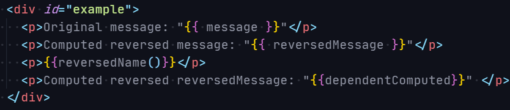
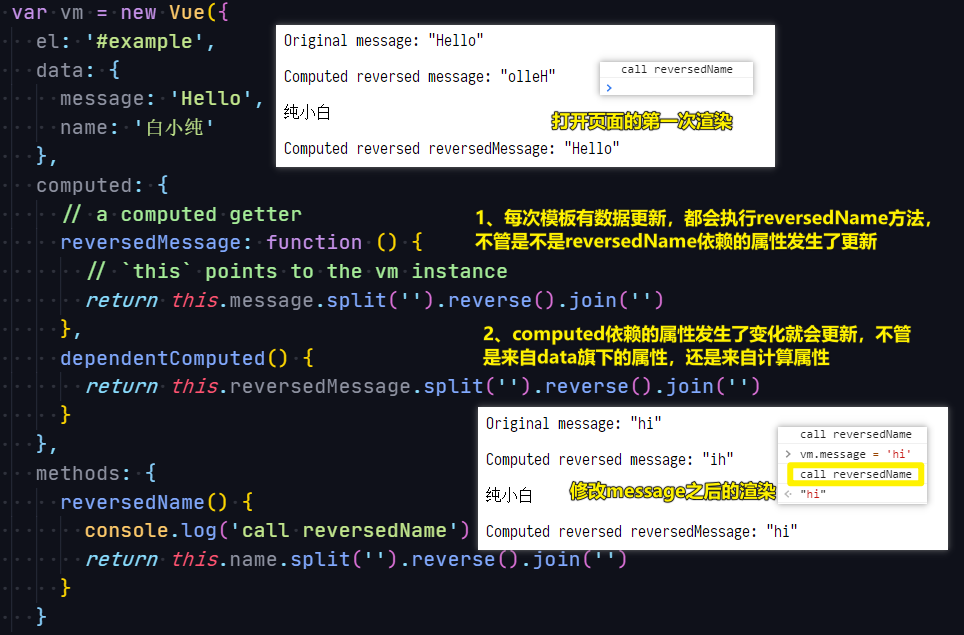
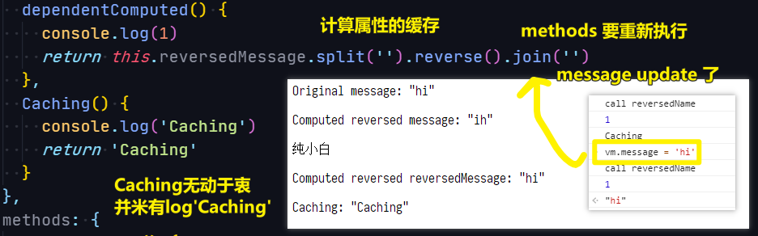
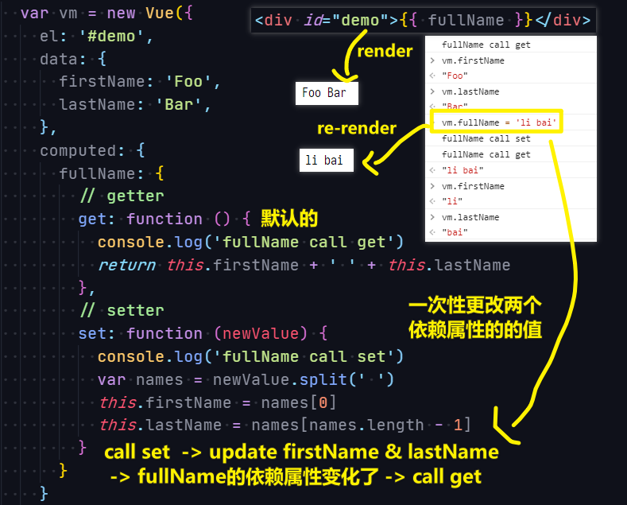
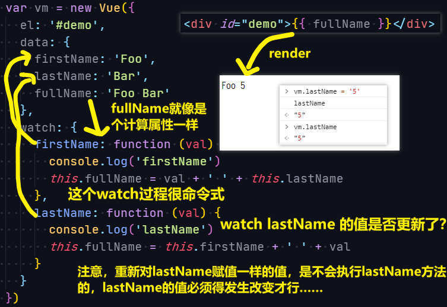

| ✍️ Tangxt | ⏳ 2020-07-15 | 🏷️ computed、watch |

# 04-computed 和 watch

## ★计算属性

1）为什么需要计算属性？

我们在模板内可以插入表达式，如`🟡🟡message🟡🟡`、`🟡🟡User.name🟡🟡`……

假如我们在模板中插入这样复杂的表达式：

``` html
<div id="example">
  {{ message.split('').reverse().join('') }}
</div>
```

可以看到，此时我们并不能一眼就能明白 `message.split('').reverse().join('')` 在表示什么

也就是说，这个表达式是很「命令式」的，并不像`message`、`User.name`这样这么「声明式」！

所以，针对这种有「**复杂逻辑**」的表达式，我们都应该使用计算属性！反之，如果是「**简单运算**」，那就不需要用计算属性，直接用 `data` 里边旗下的属性就好了！

2）使用计算属性

有以下模板：



测试：



计算属性的缓存 vs 方法：



小结：

- 计算属性是基于它们的**响应式依赖**进行缓存的。只在相关响应式依赖发生改变时它们才会重新求值 -> 依赖属性不改变，那么多次访问计算属性会**立即返回之前的计算结果**，而不必再次执行函数
- 每当**触发重新渲染（如模板中的数据发生了更新）**时，调用方法将总会再次执行函数
- 为什么需要缓存？ -> 计算属性 A（性能开销比较大，如遍历一个巨大的属性并做大量的计算），计算属性 B（依赖计算属性 A），如果咩有缓存，每次渲染 B 的值，那么就会多次执行 `A` 的 `getter` 了，而这显然有点多余……当然，如果你不希望有缓存，可以用方法代替之……

3）计算属性也有 `setter`

计算属性默认只有 `getter`，不过在需要时你也可以提供一个 `setter`：



## ★侦听属性（`watch`）

1）是什么？

一种**更通用的方式**来观察和响应 Vue 实例上的数据变动

简单来说，就是当你有一些数据需要随着其它数据变动而变动时，就可以用该侦听属性 `watch`

不过该属性过于「**命令式**」，相较于「计算属性」来说，这很不方便……

2）使用



可看到，`watch`里边的代码是很重复的，很命令的，相较于计算属性的版本来说，是比较 low 的：

``` js
var vm = new Vue({
  el: '#demo',
  data: {
    firstName: 'Foo',
    lastName: 'Bar'
  },
  computed: {
    fullName: function () {
      return this.firstName + ' ' + this.lastName
    }
  }
})
```

## ★侦听器（Watchers）


