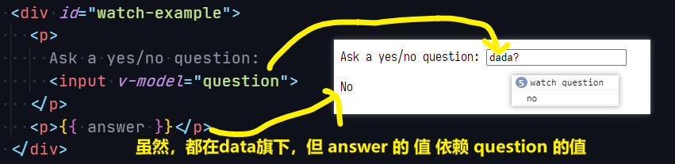
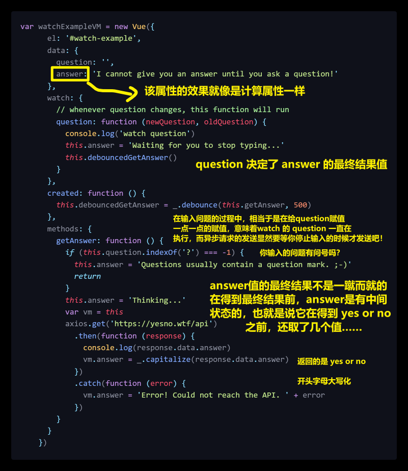
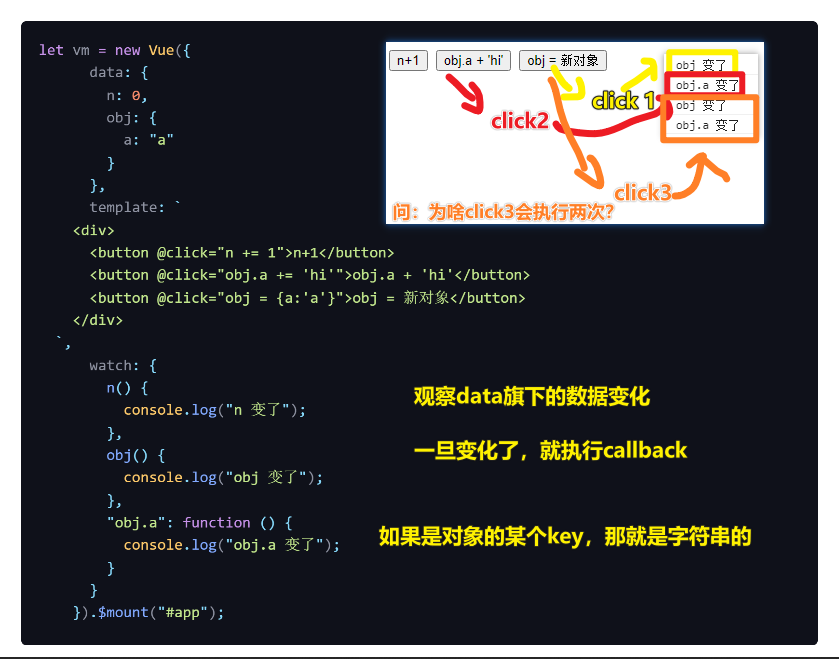
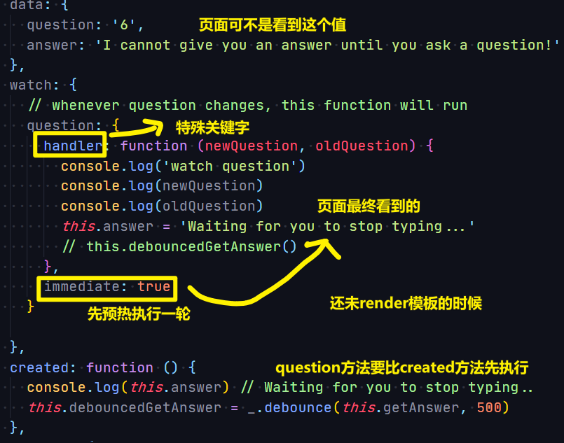
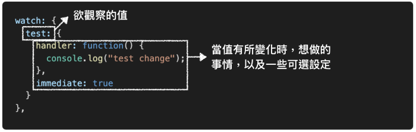
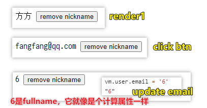

| ✍️ Tangxt | ⏳ 2020-07-15 | 🏷️ computed、watch |

# 04-computed 和 watch

## ★计算属性（`computed`）

### <mark>1）为什么需要计算属性？</mark>

我们在模板内可以插入表达式，如`🟡🟡message🟡🟡`、`🟡🟡User.name🟡🟡`……

假如我们在模板中插入这样复杂的表达式：

``` html
<div id="example">
  🟡🟡 message.split('').reverse().join('') 🟡🟡
</div>
```

可以看到，此时我们并不能一眼就能明白 `message.split('').reverse().join('')` 在表示什么

也就是说，这个表达式是很「命令式」的，并不像`message`、`User.name`这样这么「声明式」！

所以，针对这种有「**复杂逻辑**」的表达式，我们都应该使用计算属性！反之，如果是「**简单运算**」，那就不需要用计算属性，直接用 `data` 里边旗下的属性就好了！

### <mark>2）使用计算属性</mark>

有以下模板：


测试：


计算属性的缓存 vs 方法：


小结：

- 计算属性是基于它们的**响应式依赖**进行缓存的。只在相关响应式依赖发生改变时它们才会重新求值 -> 依赖属性不改变，那么多次访问计算属性会**立即返回之前的计算结果**，而不必再次执行函数
- 每当**触发重新渲染（如模板中的数据发生了更新）**时，调用方法将总会再次执行函数
- 为什么需要缓存？ -> 计算属性 A（性能开销比较大，如遍历一个巨大的属性并做大量的计算），计算属性 B（依赖计算属性 A），如果咩有缓存，每次渲染 B 的值，那么就会多次执行 `A` 的 `getter` 了，而这显然有点多余……当然，如果你不希望有缓存，可以用方法代替之……
- 计算属性使用时**不需要加括号**，可以直接作为属性使用，展示再页面中，而方法则需要加括号！

### <mark>3）计算属性也有 `setter`</mark>

计算属性默认只有 `getter`，不过在需要时你也可以提供一个 `setter`：


## ★侦听属性（`watch`）

### <mark>1）是什么？</mark>

一种**更通用的方式**来观察和响应 Vue 实例上的数据变动

简单来说，就是当你有一些数据需要随着其它数据变动而变动时，就可以用该侦听属性 `watch`

不过该属性过于「**命令式**」，相较于「计算属性」来说，这很不方便……

### <mark>2）使用</mark>


可看到，`watch`里边的代码是很重复的，很命令的，相较于计算属性的版本来说，是比较 low 的：

``` js
var vm = new Vue({
  el: '#demo',
  data: {
    firstName: 'Foo',
    lastName: 'Bar'
  },
  computed: {
    fullName: function () {
      return this.firstName + ' ' + this.lastName
    }
  }
})
```

## ★侦听器（Watchers）

> 还咩有确定一个值到底是多少的时候！

### <mark>1）为什么需要自定义侦听器？</mark>

既然尤大大提供了一个 `watch` 选项，那么肯定会有它使用的场景的：

- 当需要在数据变化时执行**异步**或**开销较大**的操作时，就会用到 `watch` 选项

### <mark>2）测试</mark>

测试 1：

模板：





测试 2：



- 当点击`​n+1`​的时候，`​n+1​`是一个简单类型 n 会发生改变。（简单类型的值一定会发生改变，因为简单类型存的是值，复杂类型存的才是地址）
​- 当点击`​obj.a+"hi"`的时候里面的值依然会发生改变，因为这是一个对象简单类型。
- 当点击`​obj=新对象` 的时候这个对象的地址会发生改变，vue 才会认为这个对象发生了改变。

所以，**`watch`的监听方式是：简单数据类型看值，复杂数据类型（对象）看地址**

### <mark>3）命令式的 `vm.$watch`</mark>

> 你可以不用 `watch`选项 -> 可以使用 `vm.$watch` 来自定义侦听器

文档：[vm-watch](https://cn.vuejs.org/v2/api/#vm-watch)

Tip：`watch`也可以监听模拟的「计算属性」

## ★疑问

### <mark>1）`watch` 选项 先执行 ，还是 `created` 钩子先执行？</mark>



### <mark>2）只要计算属性有依赖其它属性就会响应式更新？</mark>

我之前一直以为只有写在`return`旁边的其它属性，如「`return xxx`」，`xxx`变化了，计算属性才会跟着变化

没想到，并不需要这样，总之，只要函数体中存在依赖的其它属性就行了！

### <mark>3）对于计算属性的缓存你怎么看？</mark>

关于缓存，如果依赖的属性没有变化，就不会重新计算，`getter/setter`默认不会做缓存，Vue 做了特殊处理。

### <mark>4）什么是计算属性，什么是侦听属性？</mark>

- 计算属性就是**被计算出来的**属性就叫计算属性
- vue 中使用了`watch`侦听属性用来监听和响应 Vue 实例上的数据变动。`watch`就是在**数据发生变化**的时候，进行**执行一个函数**

区别：

`computed`看上去是方法，但是实际上是计算属性，它会根据你所依赖的数据**动态**显示新的计算结果。

计算结果会被缓存，computed 的值在`getter`执行后是会缓存的，只有在它依赖的属性值改变之后，下一次获取 computed 的值时才会**重新调用对应的 getter **来计算。

`watcher` 更像是一个 `data` 的**数据监听回调**，当依赖的 `data` 的数据变化，执行回调，在方法中会传入 `newVal` 和 `oldVal`。可以提供**输入值无效**，提供**中间值** 特场景。Vue 实例将会在实例化时调用 `$watch()`，遍历 `watch` 对象的每一个属性。如果你需要**在某个数据变化时做一些事情**，使用`watch`。

### <mark>5）`watch`的`deep`属性？</mark>

默认值是 `false`，代表是否深度监听

使用场景：

`data`是这样的：

``` js
{
  obj: {
    a: 123
  }
}
```

我们`watch`这个对象：

``` js
{
  watch: {
    obj: {
      handler(newName, oldName) {
         console.log('obj.a changed');
      },
      immediate: true,
      deep: true
    }
  } 
}
```

效果：

`deep:true`的存在，让`obj.a`变化了，也会触发`handler`的执行，不然，默认的`deep:false`，只有`obj`的引用地址发生了变化，`handler`才会去执行！

所以：

`deep`的意思就是**深入观察**，监听器会一层层的往下遍历，给对象的所有属性都加上这个监听器，但是这样**性能开销就会非常大**了，任何修改`obj`里面任何一个属性都会触发这个监听器里的 `handler`。

因此，我们可以这样优化，使用字符串形式监听：

``` js
watch: {
  'obj.a': {
    handler(newName, oldName) {
      console.log('obj.a changed');
    },
    immediate: true,
    // deep: true
  }
} 
```

这样 vue 才会一层一层解析下去，直到遇到属性`a`，然后才会给`a`设置监听函数，而不是`obj`旗下所有的属性！

### <mark>6）为什么要注销 `watch`？</mark>

因为我们的**组件是经常要被销毁的**，比如我们跳一个路由，从一个页面跳到另外一个页面，那么原来的页面的 `watch` 其实就没用了，这时候我们应该注销掉原来页面的 watch 的，不然的话可能会导致**内存溢出**

当然，我们平时 `watch` 都是写在组件的选项中的，它会随着组件的销毁而销毁。

然而，如果我们使用下面这样的方式写 `watch`，那么就要手动注销了，当然，这种注销其实也是很简单：

``` js
const unWatch = app.$watch('text', (newVal, oldVal) => {
  console.log(`${newVal} : ${oldVal}`);
})

unWatch(); // 手动注销 watch
```

`app.$watch`调用后会返回一个值，就是`unWatch`方法，你要注销 `watch` 只要调用`unWatch`方法就可以了。

### <mark>7）对配置的认识？</mark>



我们知道观察的数据发生了变化，就会执行`callback`，可如`immediate`、`deep`这样的选项，它们都具备某种特殊的功能，而这些功能在某种场景下会有奇效！

### <mark>8）我们观察`xxx`的状态，那么`watch`会有几种写法？</mark>

> `watch`属性可以是字符串、函数、对象、数组

``` js
{
  watch:{
    n(){} // 可以是函数
    n: 'logN' // 可以是 methods 里面的函数
    n: { handler(){} , deep:true }
    n: { handler(){} , immediate:true }
    n: [f1(){},f2(){}] //都会执行里面的函数
    'obj.a'(){} // 监听 obj 里面 a 的值是否变化
  }
}
```

### <mark>9）不建议使用`watch`模拟`computed`？</mark>

``` js
let vm = new Vue({
      data: {
        user: {
          email: "fangfang@qq.com",
          nickname: "方方",
          phone: "13812312312"
        },
        displayName: ""
      },
      watch: {
        "user.email": {
          handler() {
            const { user: { email, nickname, phone } } = this;//从this中解析出user，从user中解析出三个变量
            this.displayName = nickname || email || phone;
          },
          immediate: true // 第一次渲染也触发 watch
        },
        "user.nickname": {
          handler() {
            const { user: { email, nickname, phone } } = this;
            this.displayName = nickname || email || phone;
          },
          immediate: true
        },
        "user.phone": {
          handler() {
            const { user: { email, nickname, phone } } = this;
            this.displayName = nickname || email || phone;
          },
          immediate: true
        }
      },
      template: `
    <div>
       🟡🟡displayName🟡🟡
       <button @click="user.nickname=undefined">remove nickname</button>
    </div>
  `,
      methods: {
        changed() {
          console.log(arguments);
          const user = this.user;
          this.displayName = user.nickname || user.email || user.phone;
        }
      }
    }).$mount("#app");
```

效果：



## ★了解更多

➹：[计算属性和侦听器 — Vue.js](https://cn.vuejs.org/v2/guide/computed.html)

➹：[vue computed正确使用方式 - 知乎](https://zhuanlan.zhihu.com/p/72541791)

➹：[41.computed和watch - 掘金](https://juejin.im/post/5e97d9c5e51d4546e64c7422)

➹：[Vue.js中 watch 的高级用法 - 掘金](https://juejin.im/post/5ae91fa76fb9a07aa7677543)

➹：[浅析Vue进阶属性“computed、watch” - 知乎](https://zhuanlan.zhihu.com/p/151032257)

➹：[認識 Vue.js watch 監聽器. 認識 watch 如何使用、有哪些可選設定](https://medium.com/unalai/%E8%AA%8D%E8%AD%98-vue-js-watch-%E7%9B%A3%E8%81%BD%E5%99%A8-ffee991368be)

➹：[Vue.js: Watch](https://cythilya.github.io/2017/04/15/vue-watch/)

➹：[Vue 的 computed 和 watch 的区别 - 知乎](https://zhuanlan.zhihu.com/p/105292806)

➹：[Vue 里的 computed 和 watch 的区别 - 知乎](https://zhuanlan.zhihu.com/p/99894379)

➹：[computed和watch的区别 - 知乎](https://zhuanlan.zhihu.com/p/105790175)

## ★总结

- `watch`可译为「监听」、「侦听」
- `computed`是用来计算一个值的，使用时**不需要加括号**，可以直接当属性使用。`computed`拥有**依赖缓存特性**，如果依赖值不变，`computed`不会重新计算
- `watch`是用来监听的，被监听的属性旗下（**取的是`{}`值**），有两个选项，`immediate` 和 `deep`，当`immediate:true`时，表示会在**第一次运行**（第一次渲染）时执行这个函数，当`deep:true`时，如果监听一个对象，会**同时监听其内部属性**。`watch` **没有依赖缓存特性**。 -> 对于`vm.$watch`来说，语法是这样的：`vm.$watch('xxx',handler,{deep: true, immediate: true})`
- 不要使用箭头函数来定义 `watch` 了某个`data`的`handler`函数，因为箭头函数没有 `this`，不然，`this`的指向就是其上一级作用域的`this`值！ -> 大概率是`window`
- 何时用`computed`？
  - 如果一个数据需要经过**复杂计算**就用 `computed` -> **多个`data`旗下的数据来搞一个计算属性**
- 何时用`watch`？
  - 如果一个数据需要**被监听**并且**对数据做一些操作**就用 `watch` -> `data`都被 Vue 内部`getter`和`setter`了，我们想要自主的「对数据做一些操作」，只能通过`watch`来搞了…… -> **乱搞一个`data`旗下的数据**
- 在写值的时候，请注意，值是什么类型的
- 对`computed`和`watch`有了一些用法认识还不够，你还得写大量的例子去深入理解它们！