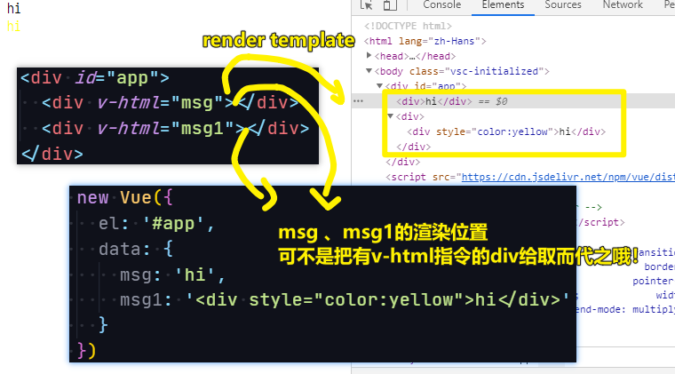

| ✍️ Tangxt | ⏳ 2020-07-17 | 🏷️ 模板、指令、修饰符 |

# 05-模板、指令与修饰符

> 文档：[模板语法 — Vue.js](https://cn.vuejs.org/v2/guide/syntax.html)

## ★模板

1. Vue 完整版，写在HTML里
2. Vue 完整版，写在`template`选项里
3. Vue 非完整版，配合 `xxx.vue` 文件，即写在`xxx.vue`里边的`template` -> `data`必须为函数 -> 使用需要`render:h => h(Xxx)`

## ★内容展示

### <mark>1）插值</mark>

- `🟡🟡obj.a🟡🟡` -> 表达式
- `🟡🟡n+1🟡🟡` -> 写任何运算符
- `🟡🟡fn(n)🟡🟡` -> 调用函数
- 如果像`obj.a`、`n`等这样的表达式，所返回的值是`undefined` or `null`的话，那么`🟡🟡xxx🟡🟡`这坨占位就不显示任何东西了，当作是从未来过一样……

### <mark>2）`v-text` & `v-html`</mark>

`<div v-text="表达式"></div>` -> 这也是展示内容的 -> 等价于 `<div>🟡🟡表达式🟡🟡</div>`


`<div v-html="msg"></div>` -> 可以把msg的内容渲染成html



### <mark>3）如果想展示`🟡🟡n🟡🟡`？</mark>

`v-pre`不会对模板进行编译


## ★指令

什么是指令？

> 以 `v-` 开头的属性就是指令 -> 指令的职责是，当**表达式的值改变**时，将其产生的**连带影响**，**响应式地作用于 DOM**

其语法是怎样的？

> `v-指令名[:参数]=值`，如`v-if="xxx"`、`v-bind:href="url"`、`v-on:click="doSomething"`

注意，`2.6.0`版本：

参数可以动态的，如`v-on:[eventName]="doSomething"`，`eventName`可以是`click`、`focus`等值，说白了`eventName`是个变量哈（值类型是字符串）！ -> 如果不是字符串值，那就是`null`值，而且是`null`值的话，那么意味着这个指令的绑定是无效的！即等于没写一样！

> 参数的取值，如果是表达式的话，请不要有空格或引号，如`v-bind:['foo' + bar]`，当然你也可以用**计算属性**替代复杂的表达式！

> 浏览器会把 `attribute` 名全部强制转为小写，请不要用大写字符来命名属性名，如`someAttr` -> `someattr`

动态参数的缩写（2.6.0+）：`<a :[key]="url"> ... </a>`、`<a @[event]="doSomething"> ... </a>`

指令的取值？

> 单个 JavaScript 表达式 (`v-for` 是例外情况）

### <mark>1）绑定属性</mark>

1. `v-bind:src="xxx"` -> 简写 `:src="xxx"`
2. `<div :style="{border:'1px solid red',height:'100px'}">hi</div>` -> 注意，样式值得是字符串值哈，不然，「编译模板就会出错」 -> 对了，如果你把`:style`的值替换成变量，是不起效的！总之，我们这么写，是在为元素添加行内样式

Tips：

在绑定`class`或`style`属性时，支持其它类型的值，如数组或对象

如：

``` html
<!-- class绑定 -->
<div :class="{red:ture}"></div>
<div :class="[classA, classB]"></div>

<!-- style 绑定 -->
<div :style="{color:ture}">111</div>
<div :style="[styleObjectA, styleObjectB]"></div>
```

### <mark>2）绑定事件</mark>

- `v-on:事件名` -> 简写 `@click="add"`（**正常人都用缩写**）
  - `v-on:click="add"` -> 点击，执行`add()`
  - `v-on:click="xxx(1)"` -> 点击才会执行`xxx(1)`，可不会渲染模板就会马上执行`xxx`
  - `v-on:click="n+=1"` -> 点击，执行`n+=1`，同样也是点击了才会执行！

### <mark>3）条件判断</mark>

- `if……else`


- 根据**表达式真假**切换元素的显示状态，本质是通过dom来切换显示状态。`true`为显示状态，`false`为隐藏状态
- `v-else`必须要和`v-if`匹配使用，**`v-else`不能单独使用**，只有`v-if`的值为`false`时，`v-else`模块才会显示出来

### <mark>4）循环</mark>

- `v-for = "(v,k) in 对象或数组" :key="k"` -> 指令写在需要重复的元素身上，如`li`元素

> 使用`v-for`就必须要在后面加上`:key`，否则会一直出现警告

### <mark>5）显示 & 隐藏</mark>


相较于`v-if`，`v-show`的元素并咩有从DOM树中移出，而`v-if`则是从DOM树中移出了，意味着元素被销毁了！

> 根据表达式真假值，切换元素的`display` CSS属性

### <mark>6）其它指令</mark>

➹：[API — Vue.js](https://cn.vuejs.org/v2/api/#v-cloak)

## ★修饰符

### <mark>1）是什么？</mark>

修饰符 (modifier) 是以半角英文句号 `.` 指明的**特殊后缀**，用于指出一个指令应该以**特殊方式**绑定

如：`.prevent` 修饰符告诉 `v-on` 指令对于触发的事件调用 `event.preventDefault()`

``` html
<form v-on:submit.prevent="onSubmit">...</form>
```

> 相当于是给`onSubmit`方法里边插入了一段特殊的万金油代码！

语法：

> `v-指令名:参数.modifier=值` -> 如`v-on:click.prevent`

### <mark>2）事件修饰符</mark>

```
@click.stop="add" //表示阻止事件传播/冒泡
@click.prevent="add" //表示阻止默认动作
@click.stop.prevent="add" //修饰符可以串联，同时表示两种意思
@click.once="doThis"  // 点击事件将只会触发一次
```

### <mark>3）按键修饰符</mark>

- 在监听键盘事件时候，我们经常需要检查详细的按键
- 按键码：为了在必要的情况下支持旧浏览器，Vue提供了绝大常用的按键码的别名

```
<input @keyup.13 = "submit"> // 按下enter键执行该函数
  
为了在必要的情况下支持旧浏览器，Vue提供了绝大多数常用的按键码的别名

.enter (回车)
.tab (Tab)
.delete (delete(删除)/BackSpace(退格))
.space  (空格键)
.up (上箭头)
.down (下箭头)
.left (左箭头)
.right (右箭头)
```

### <mark>4）一共有多少修饰符？</mark>

- v-on支持的有.`{keycode|keyAlias}`**.stop.prevent**.capture.self.once.passive.native
- 快捷键相关：.ctrl.alt.shift.meta.exect
- 鼠标相关：.left.right.middle
- v-bind支持的有：.prop.`camel`**.sync**
- v-model支持的有：.lazy.number.trim

### <mark>5）理解vue中的`.sync`修饰符</mark>

#### <mark>1、概述</mark>

在使用vue的过程中，我们有时会遇到如下场景：**子组件需要引用父组件的一个属性，并且修改**。由于vue是不允许对**外部的**数据直接修改的，所以便需要在两个组件之间建立一个通信，让父组件去监听子组件发出的请求，然后再对相应的值做出改变。

#### <mark>2、用法</mark>

1. 我们首先需要在子组件上面，建立一个事件，然后写上事件名和变化的值
2. vue内置了EventBus为$emit，可以用来触发事件

``` js
this.$emit("update:money",money-100) 
```

1. 然后在父组件上面监听这个事件的触发，将变化的值传回来
2. 同时vue将子组件改变的那个值，存进了`$event`这个内置变量中，这样父组件中就能获取到这个值

``` js
v-on:update:money="total=$event"
```

1. vue又将监听的部分写集成.sync修饰符，这样看起来更加的简洁，于是上面这一行代码也可以简写为如下形式：

``` js
:money.sync="total"
```

#### <mark>3、示例</mark>

``` html
<!DOCTYPE html>
<html lang="zh-Hans">

<head>
  <meta charset="utf-8">
  <title>index2</title>
  <style>
    .green {
      border: 3px solid lightgreen;
    }

    .red {
      border: 3px solid lightcoral;
      padding: 30px;
    }
  </style>
</head>

<body>
  <div class="red">
    Father 还有{{total}}
    <child :money="total" v-on:update:money="fn"></child>
    <!-- v-on:update:money="fn" <=> v-on:update:money="total=$event" -->
    <!-- 上面 v-on:update:money="fn" 等价于 :money.sync="total" -->

    <child :money.sync="total"></child>
  </div>
  <script src="https://cdn.jsdelivr.net/npm/vue/dist/vue.js"></script>
  <script>
    Vue.component('child', {
      template: `
        <div class="green">
        <button @click="$emit('update:money',money-100)">花钱</button>
        <span>{{money}}</span>
      </div>
      `,
      props: ["money"]
    })

    let vm = new Vue({
      el: '.red',
      data() {
        return {
          total: 10000
        };
      },
      methods: {
        fn(event) {
          // event 是子组件传递过来的值，天生就存在
          console.log(event)
          this.total = event;
        }
      }
    })
  </script>
</body>

</html>
```

效果：


运行过程是：

click 「btn」(花钱) -> 触发「`update:money`」事件 -> 通知父组件 -> 父组件监听了「`update:money`」事件，执行`fn`方法，fn的第一个参数值就是`money-100`，改变父组件的`total`的状态为`money-100` -> 完成花钱动作

> 这是一个完整的发布订阅模式

> 注意：这是先更新了在父组件这个区域内，写在子组件上的`:money`，然后再去更新子组件里边的`money`，也就是说`total`计算完后，子组件的`money`才确定有多少钱！

所以：

vue 修饰符`sync`的功能是：当一个子组件需要改变了一个 `prop` 的值时，会通知其父组件进行同步的修改。

> Vue 发明了一种修饰符 `.sync` （可以封装监听事件的操作） -> 本质来说 `.sync` 其实是一个 语法糖
> 
> 关于 `$event` ，为啥有`$`，以防`data`旗下有个`event`属性！


## ★了解更多

➹：[Vue全解 - 上帝之兵的文章 - 知乎](https://zhuanlan.zhihu.com/p/149649488)

➹：[42.vue全解(模板、指令与修饰符) - 掘金](https://juejin.im/post/5e9d0e4cf265da47fd1ec692)

➹：[自定义事件 — Vue.js](https://cn.vuejs.org/v2/guide/components-custom-events.html#sync-%E4%BF%AE%E9%A5%B0%E7%AC%A6)

➹：[Vue 的语法糖 .sync修饰符 - 知乎](https://zhuanlan.zhihu.com/p/105419044)

➹：[深入理解 Vue 的 .sync 修饰符 - 知乎](https://zhuanlan.zhihu.com/p/100017093)

➹：[Vue的.sync修饰符 - 知乎](https://zhuanlan.zhihu.com/p/105960801)

## ★总结

- Vue模板的主要特点：
  - 使用 `XML` 语法，可不是`HTML`
  - 使用`🟡🟡🟡🟡`插入表达式
  - 使用`v-bind`、`v-on`、`v-html`等指令操作DOM
  - 使用`v-if`，`v-for`等指令实现条件判断与循环
- 指令
- 修饰符


