| ✍️ Tangxt | ⏳ 2020-07-17 | 🏷️ directives、mixin、extends、provide/inject |

# 06-进阶构造属性

## ★Directive（指令）

### <mark>1）Demo1</mark>

``` html
<div id="app">
  <input v-focus>
  <button v-t-click>btn</button>
</div>
```

``` js
// Register a global custom directive called `v-focus`
Vue.directive('focus', {
  // When the bound element is inserted into the DOM...
  inserted: function(el) {
    // Focus the element
    console.dir(el)
    el.focus()
  }
})
Vue.directive('t-click', {
  inserted: function(el) {
    console.dir(el)
    el.onclick = () => {
      alert('t-click')
    }
  }
})
let vm = new Vue({
  el: '#app'
})
```

效果：

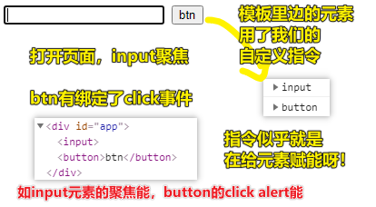

> 我不关注它的写法，只关注它的效果，以及它给我的感受！

### <mark>2）Demo2</mark>

``` html
<div id="hook-arguments-example" v-demo:foo.a.b="message"></div>
```

``` js
Vue.directive('demo', {
  bind: function(el, binding, vnode) {
    var s = JSON.stringify
    el.innerHTML =
      'name: ' + s(binding.name) + '<br>' +
      'value: ' + s(binding.value) + '<br>' +
      'expression: ' + s(binding.expression) + '<br>' +
      'argument: ' + s(binding.arg) + '<br>' +
      'modifiers: ' + s(binding.modifiers) + '<br>' +
      'vnode keys: ' + Object.keys(vnode).join(', ')
  }
})

let vm = new Vue({
  el: '#hook-arguments-example',
  data: {
    message: 'hello!'
  }
})
```

效果：

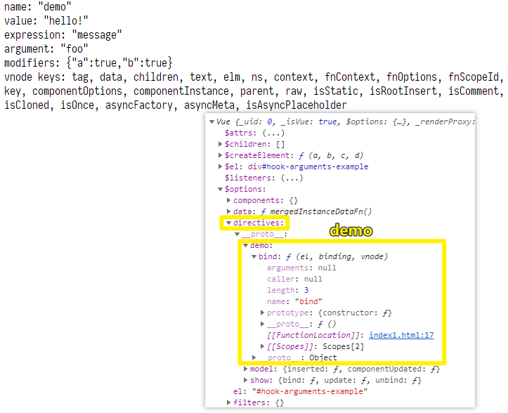

我们能拿到的数据：

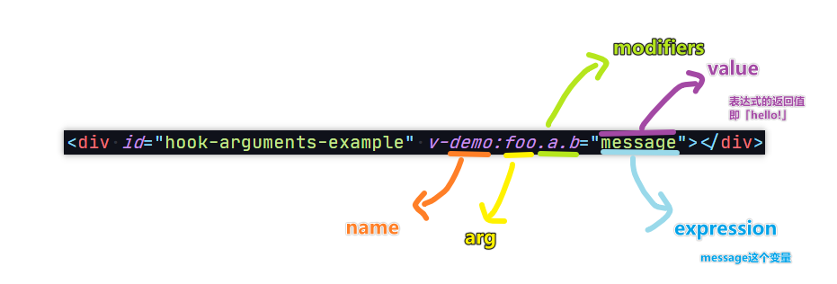

---

<mark>Q：关于 `JSON.stringify` ？</mark>

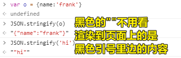

<mark>Q： `bind` 是什么？Demo1 里边的 `inserted` 又是什么？还有我看到 `model` 有 `componentUpdated` ， `show` 有 `updata` 和 `ubind` ？</mark>

它们都是 Hook Functions（钩子函数）

这些函数会在特定的时机被调用！

如：

1. `bind` ：只调用一次，指令第一次绑定到元素时调用。在这里可以进行一次性的初始化设置
2. `inserted` ：被绑定元素插入父节点时调用 （仅保证父节点存在，但不一定已被插入文档中）
3. ……

<mark>Q：传给那些钩子函数有哪些参数呢？</mark>

1. `el`
2. `binding` -> 一个指令如 `v-my-directive.foo.bar="1 + 1"` ，这里边的数据都能通过 `binding.xxx` 拿到！
3. `vnode`
4. `oldVnode`

### <mark>3）Demo3</mark>

> 为什么需要动态参数

``` html
<p v-pin="200">Stick me 200px from the top of the page</p>
```

``` js
Vue.directive('pin', {
  bind: function(el, binding, vnode) {
    el.style.position = 'fixed'
    el.style.top = binding.value + 'px'
  }
})
```

把这个绑定了 `v-pin` 指令的 `p` 元素固定在距离页面**顶部** `200` 像素的位置

话说，如果我们想要距离页面页面**右边**的呢？

难道我又得搞个 `v-right` 的指令出来？ -> 显然，不需要，可以使用动态参数呀！

做法：

``` html
<p v-pin:[direction]="200">I am pinned onto the page at 200px to the left.</p>
```

``` js
Vue.directive('pin', {
  bind: function(el, binding, vnode) {
    el.style.position = 'fixed'
    var s = (binding.arg == 'left' ? 'left' : 'top')
    el.style[s] = binding.value + 'px'
  }
})
new Vue({
  el: '#dynamicexample',
  data: function() {
    return {
      direction: 'left'
    }
  }
})
```

效果：

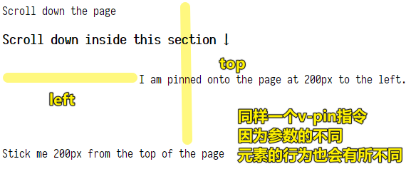

### <mark>4）Demo4</mark>

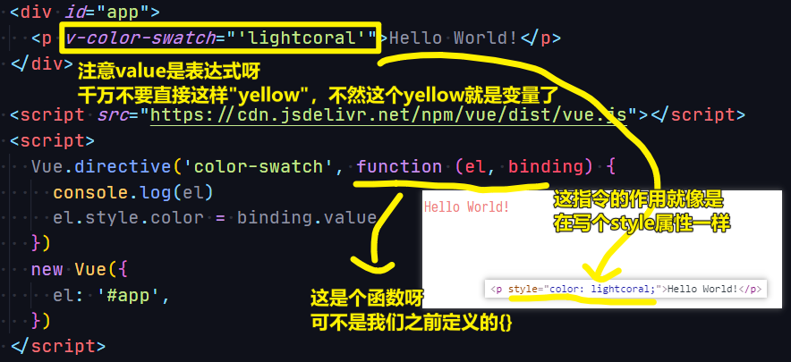

这是函数简写，为啥叫「函数简写」，不叫「函数参数」呢？

因为如果你在 `bind` 和 `update` 时都触发相同行为，而不关心其它的钩子，那么你就可以用所谓的「函数简写」啦！而不是定义一个 `{}` ，然后整上两个钩子！

### <mark>5）Demo5</mark>

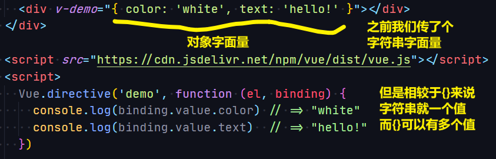

Tips：

1. 指令需要多个值 -> 传入一个 JavaScript 对象字面量
2. 指令函数能够接受所有**合法的** JavaScript 表达式。

### <mark>6）疑问</mark>

#### <mark>1、何时用哪些钩子函数，我并咩有看明白……</mark>

1. bind: 只调用一次，指令第一次绑定到元素时调用。
2. inserted: 被绑定元素插入父节点时调用。 -> 如为元素绑定事件监听器
3. update: 被绑定元素所在的模板更新时调用。
4. componentUpdated: 被绑定元素所在模板完成一次更新周期时调用。
5. unbind: 只调用一次，指令与元素解绑时调用。 -> 如移除元素的事件监听器

示例：

``` js
// 自定义v-on2指令
new Vue({
  el: "#app",
  directives: {
    on2: {
      // binding 是一个对象，包含指令的很多信息
      inserted(el, binding) {
        console.log('hi')
        el.addEventListener(binding.arg, binding.value)
      },
      unbind(el, binding) {
        el.removeEventListener(binding.arg, binding.value)
      }
    }
  },
  template: `
            <button v-on2:click="hi">点我</button>
        `,
  methods: {
    hi() {
      console.log("m");
    }
  }
})
```

> 注意：如果你这样写`<button v-on2:click="hi()">点我</button>`，不用点击就会，先 `log m`，再`log 'hi'` -> 原生的`@click`指令，显然做了`hi()`这种值的处理！即不会执行`hi`方法，只有点击了才会执行！

#### <mark>2、钩子函数的三个参数？</mark>

1. `el` 指令所绑定的元素，可以用来直接操作DOM
2. `binding` ：一个对象，包含指令的**很多信息**
3. `vnode` ：Vue编译生成的虚拟节点

### <mark>7）小结</mark>

1. 自定义指令的两种写法
   1. 声明一个全局指令：`Vue.directive('x',directiveOptions)` -> 可以在任何组件里用 `v-x`
   2. 声明一个局部指令 -> `new Vue({...,directives: {"x": directiveOptions}})` -> `v-x` 只能用在该实例中
2. `directiveOptions` -> 有5个函数属性
   1. `bind(el,info,vnode,oldVnode)`-类似 `created`
   2. `inserted(参数同上)`-类似`mounted`
   3. `update(参数同上)`-类似`updated`
   4. `componentUpdated(参数同上)`-用得不多
   5. `unbind(参数同上)`-类似`destroyed`
3. 指令的作用
   1. 主要用于 DOM 操作
      1. Vue的实例/组件用于数据绑定、事件监听、DOM更新
      2. Vue指令主要目的就是**原生DOM操作**
   2. **减少重复**
      1. 如果某个DOM操作你经常使用，就可以封装为指令
      2. 如果某个DOM操作比较复杂，也可以封装为指令

## ★Mixin（混入属性，混入就是复制）

### <mark>1）为什么需要 Mixin？</mark>

在开发一个**充满组件的**应用程序时，通常会遇到两个都有着非常**相似功能**的组件。

那么，问题来了：

1. 我们是否可以把这两个组件合二为一？
2. 或者，依旧分开它们，毕竟它们之间都有足够多的差异，不然，把它们结合起来的话，会导致更多的问题（相较于俩组件没合并前的问题）

幸运的是，Vue 给了我们第三个选择：**Mixins**

Mixins 是封装**一小部分功能**的一个有效方法，而这些功能可以在多个组件之间**重用**。

我们要学的：

1. 如何搞个 Mixins 出来？
2. 如何**有效利用**这个方便的 Mixins 工具？

### <mark>2）创建一个 Mixin（Option Merging）</mark>

* 一个 mixin 对象有：任意的组件选项
* 当 `xx` 组件使用 mixin 对象时，所有 mixin 的选项都将被「混合」进入该 `xx` 组件的本身的选项中去！ -> 水（组件）混入了白糖（mixin 对象）
* 组件 和 mixin 对象含有同名选项时，**不同则一起生活，冲突（即相同）则组件优先**
  + `data` 旗下的也会通过**递归姿势**进行合并
  + 同名钩子函数将合并为一个数组，因此都将被调用，注意，第一个元素是来自 mixin 对象的钩子，**mixin 对象的钩子的调用优先于组件的钩子**
  + 值为**对象**的选项，如 `methods` 、 `components` 、 `directives` ，将被合并为同一个对象。两个对象键名冲突时，**优先选组件对象的键值对**。
  + `Vue.extend()` 也使用同样的策略进行合并

示例：

``` js
var mixin = {
  data: function() {
    return {
      message: 'hello',
      mix: 'abc'
    }
  },
  created: function() {
    console.log('混入对象的钩子被调用')
  },
  methods: {
    foo: function() {
      console.log('foo')
    },
    conflicting: function() {
      console.log('from mixin')
    }
  }
}

var vm = new Vue({
  el: '#app',
  mixins: [mixin],
  data: function() {
    return {
      message: 'goodbye',
      com: 'def'
    }
  },
  created: function() {
    console.log('组件钩子被调用')
  },
  methods: {
    bar: function() {
      console.log('bar')
    },
    conflicting: function() {
      console.log('from self')
    }
  }
})
```

效果：

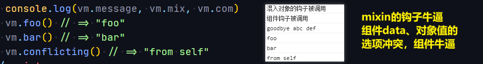

再举一个示例：

``` html
<!DOCTYPE html>
<html lang="zh-Hans">

<head>
  <meta charset="utf-8">
  <title>index7</title>
  <style>
    .red {
      width: 100px;
      height: 100px;
      border: 3px solid lightcoral;
    }

    .green {
      width: 100px;
      height: 100px;
      border: 3px solid lightgreen;
    }
  </style>
</head>

<body>
  <div id="app">
    <div>
      <button @click="Child1isShow=false">child1消失</button>
      <child1 v-if="Child1isShow"></child1>
    </div>
    <br />
    <div>
      <button @click="Child2isShow=false">child2消失</button>
      <child2 v-if="Child2isShow"></child2>
    </div>
  </div>

  <script src="https://cdn.jsdelivr.net/npm/vue/dist/vue.js"></script>
  <script>
    const log = {
      data() {
        return {
          name: undefined,
          time: undefined
        };
      },
      created() {
        if (!this.name) {
          throw new Error("need Name")
        }
        this.time = new Date();
        console.log(`${this.name}出生了`)
      },
      beforeDestroy() {
        const now = new Date() - this.time;
        console.log(`${this.name}死亡了，共存活了 ${now} ms`);
      }
    }

    Vue.component('child1', {
      data() {
        return {
          name: 'child1'
        }
      },
      template: `
      <div class="red">Child1消失</div>
      `,
      mixins: [log]
    })
    Vue.component('child2', {
      data() {
        return {
          name: 'child2'
        }
      },
      template: `
     <div class="green">Child2消失</div>
      `,
      mixins: [log]
    })

    new Vue({
      el: '#app',
      data() {
        return {
          Child1isShow: true,
          Child2isShow: true,
        };
      },
    })
  </script>
</body>

</html>
```

> 我把`mixin`写在同一个文件了，一般来说是，创建一个`mixins`目录，然后在该目录下创建一个`log.js` -> `mixins/log.js`

效果：

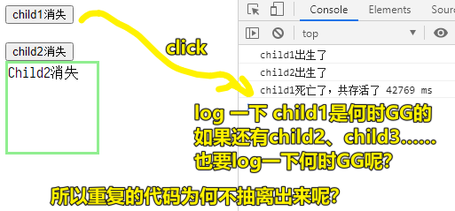

### <mark>3）全局混入（Global Mixin）</mark>

* 使用场景很少，**建议不要使用**，不然，你真这么做了的话，那么每个单独创建的 Vue 实例 都被混入了（**包括第三方组件**） -> 有些实例喝咖啡真得不需要加糖呀！
* 当然，既然它出现了，那么肯定就有它的用武之地！ -> **自定义选（注入处理逻辑）**

示例：


虽然，全局 mixins 可用于自定义选项，然后最一些万金油的事儿，但最好还是使用插件来搞：[插件 — Vue.js](https://cn.vuejs.org/v2/guide/plugins.html)

> 插件通常用来为 Vue 添加全局功能

### <mark>4）小结</mark>

1. Mixins -> 在组件之间**重用代码以共享行为**的一种便捷方法！ -> 让我们的代码库减少重复、更加模块化
2. Mixins 的合并策略是怎样的？
   1. 同名钩子，Mixins先行 -> 原理是，数组的第一个元素是Mixins的钩子
   2. 同名 `data` 旗下的属性 -> 递归之，组件取而代之
   3. 同名选项是对象值 -> 组件取而代之
   4. 不同名，一起过！
3. 分发：（动）一个个地发给。分发慰问品，如分发奖品，如分发选项给组件实例，全局mixins即主动分发（**主动给组件实例，不管你要不要**），局部mixins即被动分发（**组件实例想要就要，不要就不要**）
4. 类比：
   1. `directives`的作用是减少DOM操作的重复
   2. `mixins`的作用是减少`data`、`methods`、钩子的重复

## ★Extends 继承、扩展（不推荐使用）

### <mark>1）概述</mark>

这个东西的存在，有着与`mixins`同样的需求

话说：

- 不想要每次都写一个 `mixins`，咋办呢？

你可以使用 `Vue.extend` 或 `options.extends`

做法，同`mixins`类似，通过暴露一个`extends`对象到组件中使用

示例：

``` js
// MyVue是一个组件实例哈！
const MyVue = Vue.extend({
  // or mixins: [log]
  data() {
    return {
      name: '',
      time: undefined
    }
  },
  created() {
    if (!this.name) { console.error('no name!') }
    this.time = new Date();
    console.log(`${this.name}出生了`)
  },
  beforeDestroy() {
    const duration = (new Date()) - this.time
    console.log(`${this.name}存活时间${duration}ms`)
  }
})
Vue.component('child1', {
  data() {
    return {
      name: 'child1'
    }
  },
  template: `
  <div class="red">Child1消失</div>
  `,
  extends: MyVue
})
Vue.component('child2', {
  data() {
    return {
      name: 'child2'
    }
  },
  template: `
  <div class="green">Child2消失</div>
  `,
  extends: MyVue
})

new Vue({
  el: '#app',
  data() {
    return {
      Child1isShow: true,
      Child2isShow: true,
    };
  },
})
```

效果是一样的……

讲真，我完全get不到`extends`的点！

### <mark>2）小结</mark>

1. 用法：`const Component = Vue.extend({……})` -> `new Component(options)` or `Vue.component('child1', {……,extends:Component}`
2. `extends`是比`mixins`更抽象一点的封装
3. 如果你嫌写五次 `mixins` 麻烦，可以考虑`extends`一次！ -> **不过实际工作中用得很少**

## ★Provide、Inject（提供和注入）

> 文档：[provide / inject](https://cn.vuejs.org/v2/api/#provide-inject)

### <mark>1）概述</mark>

众所周知，在组件式开发中，最大的痛点就在于**组件之间的通信**。在 Vue 中，Vue 提供了各种各样的组件通信方式，从基础的 `props/$emit` 到用于兄弟组件通信的 `EventBus`，再到用于全局数据管理的 `Vuex`。

在这么多的组件通信方式中，`provide/inject` 显得十分阿卡林（毫无存在感）。但是，其实 `provide/inject` 也有它们的用武之地

> `provide` 和 `inject` 主要在开发**高阶插件/组件库**时使用。并不推荐用于普通应用程序代码中。

### <mark>2）是什么？</mark>

`provide` 可以在祖先组件中**指定**我们想要提供给后代组件的**数据或方法**，而在**任何**后代组件中，我们都可以使用 `inject` 来接收 `provide` 提供的数据或方法。

### <mark>3）示例1</mark>

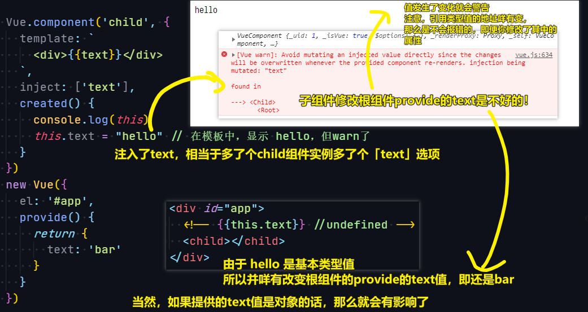

话说，如何去掉那个警告呢？ -> 用引用类型值，该对象的属性就好了！

### <mark>4）示例2</mark>

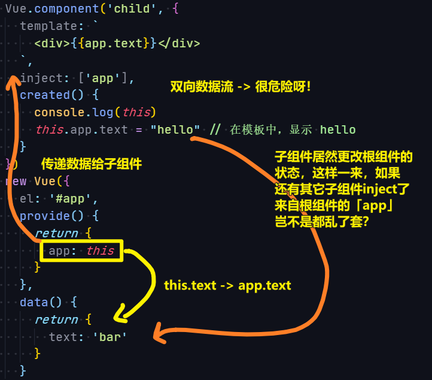

根组件成为了全局状态的容器 -> 很像 React 中的 context

### <mark>5）示例3</mark>

> 换肤

``` html
<!DOCTYPE html>
<html lang="zh-Hans">

<head>
  <meta charset="utf-8">
  <title>index9</title>
  <style>
    .app.theme-lightgreen button {
      background: lightgreen;
      color: white;
    }

    .app.theme-lightgreen {
      color: darkcyan;
    }

    .app.theme-lightcoral button {
      background: lightcoral;
      color: white;
    }

    .app.theme-lightcoral {
      color: darksalmon;
    }

    .app.fontSize-normal {
      font-size: 16px;
    }

    .app button {
      font-size: inherit;
    }

    .app.fontSize-small {
      font-size: 12px;
    }

    .app.fontSize-big {
      font-size: 20px;
    }
  </style>
</head>

<body>
  <div id="xxx" :class="`app theme-${themeName} fontSize-${fontSizeName}`">
    <change-button>换肤</change-button>
    <br>
    <button>🟡</button>
    <button>🟡</button>
    <button>🟡</button>
    <button>🟡</button>
    <button>🟡</button>
  </div>

  <script src="https://cdn.jsdelivr.net/npm/vue/dist/vue.js"></script>
  <script>
    Vue.component('change-button', {
      data() {
        return {}
      },
      template: `
        <div>
          <button @click="changeTheme">换肤</button>
          <button @click="changeFontSize('big')">大字</button>
          <button @click="changeFontSize('small')">小字</button>
          <button @click="changeFontSize('normal')">正常字</button>
        </div>
      `,
      inject: ["themeName", "changeTheme", "changeFontSize"]

    })
    new Vue({
      el: '#xxx',
      provide() {
        return {
          themeName: this.themeName,
          fontSizeName: this.fontSizeName,
          changeTheme: this.changeTheme,
          changeFontSize: this.changeFontSize
        }
      },
      data() {
        return {
          themeName: 'lightcoral', // 'lightgreen'
          fontSizeName: 'normal' // 'big' or 'small'
        }
      },
      methods: {
        changeTheme() {
          if (this.themeName === 'lightcoral') {
            this.themeName = 'lightgreen'
          } else {
            this.themeName = 'lightcoral'
          }
        },
        changeFontSize(size) {
          if (["normal", "big", "small"].indexOf(size) === -1) {
            throw new Error(`no size: ${size}`)
          }
          this.fontSizeName = size
        }
      }
    })


  </script>
</body>

</html>
```

效果：

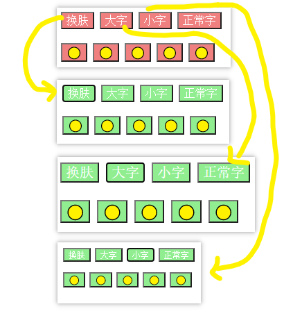


### <mark>6）小结</mark>

1. 慎用 `provide/inject` -> Vue 官方推荐使用 Vuex，而不是原生的 API
2. Vuex 和 provide/inject 最大的区别在于:
   1. Vuex 中的全局状态的每次修改是**可以追踪回溯**的
   2. provide/inject 中变量的修改是无法控制的，换句话说，你**不知道是哪个组件修改了这个全局状态**
3. Vue 的设计理念借鉴了 React 中的**单向数据流原则**（虽然有 `sync` 这种破坏单向数据流的家伙），而 provide/inject **明显破坏**了单向数据流原则。试想，如果有多个后代组件同时依赖于一个祖先组件提供的状态，那么**只要有一个组件修改了该状态，那么所有组件都会受到影响**。这一方面**增加了耦合度**，另一方面，使得**数据变化不可控**。如果在多人协作开发中，这将成为一个噩梦。
4. 两条条使用 `provide/inject` 做全局状态管理的原则：
   1. 多人协作时，做好作用域隔离
   2. 尽量使用一次性数据作为全局状态，即不会二次更改的数据！

## ★了解更多

➹：[Custom Directives — Vue.js](https://vuejs.org/v2/guide/custom-directive.html#Hook-Functions)

➹：[Vue: 自定义指令 - 简书](https://www.jianshu.com/p/06c4f2005ddd)

➹：[混入 — Vue.js](https://cn.vuejs.org/v2/guide/mixins.html)

➹：[Mixins - Next-Level Vue - Vue Mastery](https://www.vuemastery.com/courses/next-level-vue/mixins/)

➹：[聊聊 Vue 中 provide/inject 的应用 - 掘金](https://juejin.im/post/5dc4cbeff265da4d1f51c7f1)

➹：[43.Vue全解进阶属性(Directive、Mixin、Extends、Provide、Inject) - 掘金](https://juejin.im/post/5ea2978a51882573ae040298)

➹：[Vue全解 - 知乎](https://zhuanlan.zhihu.com/p/149649488)

➹：[vue2组件之间双向数据绑定问题 - 前端笔记 - SegmentFault 思否](https://segmentfault.com/a/1190000011783590)

## ★总结

- 对 Vue 的学习 -> 二八原则 -> 常用的 20% API 就能解决大部分日常问题，剩余的用处不大 -> 但是，抽点时间去了解那些冷门的 API，也许你能发现一些不一般的风景，令你在解决一些问题时，事半功倍。


