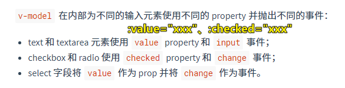

| ✍️ Tangxt | ⏳ 2020-07-19 | 🏷️ 表单、v-model |

# 07-表单与v-model

> 文档：[表单输入绑定 — Vue.js](https://cn.vuejs.org/v2/guide/forms.html)

## ★基本用法

### <mark>1）概述</mark>

我觉得没啥好去细看的……

你想想自定义指令的内容，就明白 `v-model` 到底是个什么玩意儿了！

``` html
<!---编译前-->
<my-input v-model="data" />

<!---编译后-->
<my-input :value="data" @input="v => data = v" />
```

都是监听用户对表单元素的操作 -> 数据化用户的操作 -> 把拿到的数据交给 `data` 旗下的某个数据



记住有哪些表单元素：

1. 文本
2. 多行文本
3. 复选框
4. 单选按钮
5. 选择框

### <mark>2）修饰符</mark>

- `.lazy`：不要一点一点的数据同步，我要一次性
- `.number`：输入值数值化
- `.trim`：过滤首尾空格

### <mark>3）ant-design-vue</mark>

[快速上手 - Ant Design Vue](https://antdv.com/docs/vue/getting-started-cn/)

可以看极客时间的课程……

## ★了解更多

➹：[为啥ant-design-vue的示例文档中很少使用v-model？ - Johnson的回答 - 知乎](https://www.zhihu.com/question/366711686/answer/978029973)

➹：[深入理解 v-model - 知乎](https://zhuanlan.zhihu.com/p/30846688)

➹：[超级详细的v-model实践总结 - 知乎](https://zhuanlan.zhihu.com/p/113947656)

➹：[[转] vue自定义组件中的v-model简单解释 - {前端开发} - 博客园](https://www.cnblogs.com/chris-oil/p/12260257.html)


