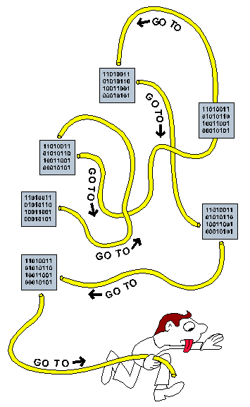

| ✍️ Tangxt | ⏳ 2020-07-19 | 🏷️ MVC、双向绑定 |

# 08-MVC与双向绑定

## ★双向绑定

### <mark>1）起源</mark>

说到前端框架，就总会谈论到什么「双向绑定」和「单向绑定」这些概念了。

但是要理解这些概览，最好还是从其最原始的形态入手，也就是自己搞出双向绑定和单向绑定。

这就要说到 MVC 了。

2010 年，Backbone.js 第一版发布，三年后在腾讯工作的方方才开始用这么个东西。由此可以看出**英文世界的前端知识一直都是领先于其他语言的**。

有人说 Backbone.js 是基于 MVC 思想的，也有人说 Backbone.js 是基于 MVP 思想的，但方方在这里并不打算给大家明确的答案，因为不管是 MVC 还是 MVP，都是类似的。今天方方会从**需求的角度**来引导大家理解 MVX（X 可以是任何东西）思路。

### <mark>2）意大利面条式的代码</mark>

形容你写的代码是「**意大利面条式的**」，这个形容称呼最早来自2010 年，Backbone.js 第一版发布 -> 你们不使用 Backbone.js 这个框架写出来的代码就是TM的「意大利面条式的」

意大利面条式代码是长啥样的？

> 代码长长短短，还互相交织，你中有我，我中有你，错综复杂 -> Spaghetti code

简单来说，如果人家看你的代码感到很累的话，如看一下第15行的函数，其中这个函数的逻辑需要看很多处的代码，如第8行，第26行等等，那么你的代码就有「意大利面条式的」嫌疑…… -> 说白了，**代码整体上看结构很松散**

还有就是，你第一天写完了这个代码，看起来是很容易理解的，然而过了一个星期之后，你打算修改第一天的代码，你发现你自己完全看不懂或者很难看懂当初在第一天写的那个代码了！ -> 从时间角度上看，这也有「意大利面条式的」嫌疑 -> **时间久了之后，代码极难维护**

例子1：<https://jsbin.com/jojorul/edit?js,output>

### <mark>3）一些程序员想出了解决办法</mark>

一些程序员通过自己的总结，发现这些代码总是可以分成三类：

1. 专门操作远程数据的代码（fetchDb 和 saveDb 等等）
2. 专门呈现页面元素的代码（innerHTML 等等）
3. 其他控制逻辑的代码（点击某按钮之后做啥的代码）

为什么分成这三类呢？因为我们前端抄袭了后端的分类思想，后端代码也经常分为三类：

1. 专门操作 MySQL 数据库的代码
2. 专门渲染 HTML 的代码
3. 其他控制逻辑的代码（用户请求首页之后去读数据库，然后渲染 HTML 作为响应等等）

> 后端的MVC思想来自于「三层架构」（**视图层View、服务层Service、持久层Dao，分别完成不同的功能**） -> 不确定对不对，反正需要一个理由说服自己！

这些思路经过慢慢的演化，最终被广大程序员完善为 MVC 思想。

1. M 专门负责数据
2. V 专门负责表现
3. C 负责其他逻辑

如果我们来反思一下，会发现这个分类是无懈可击的：

1. 每个网页都有数据
2. 每个网页都有表现（具体为 HTML）
3. 每个网页都有其他逻辑

于是乎，MVC 成了经久不衰的设计模式（**设计模式就是「套路」的意思**）

现在我们来改写一下例子1。

例子2：<https://jsbin.com/separoy/edit?js,output>

> 效果上与例子1是一样的，但其源码组织，相较于例子1，更有结构，扩展性更强……

改进了以下几点：

1. 把意大利面条变成三块有结构有组织的对象：model、view 和 controller
2. model 只负责存储数据、请求数据、更新数据
3. view 只负责渲染 HTML（可接受一个 data 来定制数据）
4. controller 负责调度 model 和 view

### <mark>3）模板代码（也就是类）</mark>

> 一个页面还好，但页面多了，就有重复代码了！

一个页面或模块只需要 model view controller 三个对象
第二个页面就需要再来 model2 view2 controller2 三个对象
第三个页面就需要再来 model3 view3 controller3 三个对象
……
第N个页面就需要再来 modelN viewN controllerN 三个对象

你每次写一个 model 都要写很类似的代码
你每次写一个 view 都要写很类似的代码
你每次写一个 controller 都要写很类似的代码

为什么不利用模板代码（俗称面向对象）把重复的代码写到一个类呢（JS里面就是把「共有属性」放到原型里） -> 如`bindEvents`、`fetch`、`update`、`fetchModel`……

> 个性化的，就自有属性了……

代码如下

例子3：<https://jsbin.com/riyinum/edit?js,output>

> 除了书的展示以外，假如还有笔之类的，直接就 `new` 三个代表 MVC 的实例出来就好了 -> 把这三个类分别拆成一个个js文件，如`mvc/view.js`、`mvc/model.js`、`mvc/controller.js`

### <mark>4）烦人的地方</mark>

> 数据有两种，一种是存在数据库里边的数据，即**持久化的用户数据**，另一种则是临时在页面上展示的数据，即**UI数据**，一般就是那个`data`属性，而且UI数据没有理由存在Model上！ -> UI数据 跟 存在数据库里边数据咩有关系呀！ -> UI数据，如在页面上你对一个input表单元素输入的数据…… -> Vue旗下的`data`属性就是用过来缓存UI数据的！
> 
> 我们把 `options` 这种参数写法看作是 `options API`
> 
> 发布订阅模式 -> Model update -> emit View render
> 
> Vue -> 细粒度更新+自动绑定视图上数据的变化，如把input框里边的UI数据绑定到了`data`这个临时数据仓库！而视图渲染时又会用到这个`data`旗下最新的数据！
> 
> 方便大于逻辑 -> 如 `this.view.data.name -> this.view.name` -> `this.view`就是 Vue 的实例 -> `this.name`

一般来说，**如果代码有重复或类似，就能优化（也可以不优化）**。

例3的代码有这样的重复代码，我们一个一个来解决。

第一个烦人的地方：每次用 model 获取数据之后，还要「手动」调用 `this.view.render(this.model.data)`，你看代码中有四处手动调用了 `updateModel`。

怎么解决呢？一个方案是给 Model 加上事件机制。

优化后的代码如下

例子4：<https://jsbin.com/cozotap/edit?js,output>

第二个烦人的地方有个 BUG：

每次 render 都会更新 `#app` 的 innerHTML，这可能会丢失用户的写在页面某个 input 里面的数据。（渲染的颗粒度忒大了！）

这有两个解决办法：

- 2.1 用户只要输入了什么，就记录在 JS 的 data 里。（数据绑定的初步思想出现了） -> 所谓绑定是指把UI数据临时绑定到了`data`旗下某个属性（如`n`）里边，下次渲染时通过某种手段（如对`input`元素的`value`属性也占个位）把`n`这个最新的数据也一起渲染到视图里边去，虽然渲染的颗粒度还是一样的，但至少解决了问题不是？

- 2.2 不要粗暴的操作 innerHTML，而是只更新需要更新的部位（虚拟 DOM 的初步思想出现了） -> 第二次渲染时颗粒度不要那么大好不好？

Angular 就是基于第一个思想而发明的，而 React 则是基于第二个思想。

有些人还觉得有第三个烦人的地方：

`events` 能不能直接写到 HTML 上面，而不是写到 JS 里。（类似 Vue 在模板HTML上`@click`这样写上一些指令哈！ -> 没有Vue之前，我们的事件或者说是业务逻辑就是在操作DOM呀！……有了Vue之后，就是在操作「临时数据」或者说是「UI数据」或者说是「data」） 

确实这样写代码更直观，所以 Angular 和 React 都采纳了这一想法。但是又一波人不喜欢这种写法，他们认为 HTML 和 JS 应该是分离的：

> 我们花了好几年才普及内容与行为分离的观点，没想到 Angular 和 React 一下子就回到解放前了。

这种争论到 2017 年才渐渐休止，大家逐渐都接受了直接在 HTML 上绑定 JS 事件的写法。

接下来我们介绍 Angular 对于 2.1 问题的解法。

### <mark>5）Angular 与 Vue 的双向绑定</mark>

由于 Angular 太复杂（概念），很多人表示学不会，这时出现了一个简化版的 Angular —— Vue 0.8。

当时的 Vue 主要借鉴了 Angular 的双向绑定思想，所以我们用 Vue 来举例更好理解，这样我就不用花一个小时来向你介绍 Angular 了。

例子5：<https://jsbin.com/sutocat/edit?js,output>

> 模板中，我少写了`
<input v-model="n">
`

Vue 代替了 View，这就是 Vue 的名字和其读音的来历。（Vue是法语，与View是一个意思！即「视图、View、Vue」都是一个意思）

Vue 的双向绑定（也是 Angular 的双向绑定）有这些功能：

1. 只要 JS 改变了 `view.number` 或 `view.name` 或 `view.n` （注意 Vue 把 `data` 里面的 number、name 和 n 放到了 view 上面，没有 `view.data` 这个东西）， HTML 就会**局部更新**
2. 只要用户在 `input` 里输入了值，JS 里的 `view.n` 就会更新。

这就像双向绑定：**JS 数据与页面元素互相绑定**。

同时 **Vue 也实现了局部更新**（2.2）。

Vue 还有很多其他功能，使得 Controller 显得多余：

例子6：<https://jsbin.com/tajomeh/edit?js,output>

> 把本来在Controller绑定事件的这个操作移到 Vue 去了……

然后 model.data 也显得多余：

例子7：<https://jsbin.com/taporoh/edit?js,output>

> Model是与数据库打交道的…… -> `model`发起请求拿到数据之后，直接 update Vue 的 `data`

可以看到，事情变得「容易」了很多。

## ★总结

- 代码越写越少……结构越来越好……可读性越来越好…… -> 我觉得 Vue 很牛逼呀！
- 所谓的双向绑定指的是：用户操作页面反馈出来的数据（如往`input`表单输入数据），能更新到JS里边所绑定的`data`，而`data`可以同步更新到页面上
- 所谓的虚拟DOM -> 简单来说就是局部更新
- 如果你平时不打算用框架来写代码的话，那么你就用`MVC`这种写代码套路来写吧！毕竟，每个网页都有数据（Model），每个网页都有表现（具体为 HTML，View），每个网页都有其他逻辑（Controller） -> `Controller`是`M`和`V`的调度中心，即能初始化页面、用户操作页面后通知`C`去安排`M`搞一些事情，然后通过「发布-订阅」，`M`通知`C`，带着从`M`里边拿到的`data`去渲染视图`V` -> `click -> C -> M -> C -> V`

## ★Q&A

### <mark>1）MVC 与 三层架构有联系吗？</mark>

系统架构是指整个应用系统程序大体的结构，常见的系统架构有**三层架构**与**MVC**

三层架构与MVC不是简单的相等，它们存在差别，但又有联系 -> 这两种系统架构的出现，都是为了**降低系统模块间的耦合度**

也就是说虽然它们一个叫「**馒头**」，一个叫「**面条**」，但它们的本质都是面粉，即它们都是用来「**分层和解耦**」的！

> 不要以为都是「三」，就认为三层架构和MVC是一样的！

对比Java后端的三层架构：

总之，直白点来说：

MVC是**设计模式**，属于微观的解决方案（如『博客』这一特定应用）

3 Tier（层）是**系统架构**，属于**宏观**的解决方案（如『网络』这一巨大的领域）。

3 Tier的三层是指（在client-server的语境下）：

- Presentation Tier，指客户端。
- Business Tier，指服务器。
- Data Tier，指数据库。

> Manipulate -> 操作，处理

<mark>Q：为什么需要mvc架构，或者为什么有三层架构？</mark>

这是一个很好很重要的问题。

简单地说，是为了**更好地**分开逻辑，从而让代码模块化。

模块化的好处是：

1. 一个模块的修改对其他模块影响大大减小。
2. 拓展应用更加容易。可以增加一个新的v模块，如在pc web的基础上增加一个mobile web。
3. 不同模块的开发可以同时进行。

总而言之，利大于弊……

➹：[MVC 与三层架构 - 掘金](https://juejin.im/post/5929259b44d90400642194f3)

➹：[mvc与三层结构终极区别](https://blog.csdn.net/csh624366188/article/details/7183872)

➹：[对三层和MVC的认识过程](https://blog.csdn.net/beijiguangyong/article/details/7029257)

➹：[中度理解MVC和三层架构 - 知乎](https://zhuanlan.zhihu.com/p/62146420)

➹：[MVC和三层架构有何区别和联系？ - 知乎](https://www.zhihu.com/question/21851341)

### <mark>2）意大利面条代码？</mark>

- 是什么？
  - 非结构化和难以维护的源代码，如在一个文件里边，对某一行代码的理解，需要在好几行里边跳来跳去才能理解！
- 这是如何出现的？
  - 项目需求经常变化
  - 缺乏编程风格规则
  - 能力或经验不足
  - ……
- 我们要做什么？
  - 写出可理解的代码，而不是意大利面条式的代码
- 其它称呼的代码？
  - Ravioli code 意大利饺子代码、馄饨代码：针对OOP，描述了由结构良好的class组成的代码，这些class隔离起来很容易理解，但是**作为一个整体很难理解**
  - Lasagna code 烤宽面条代码、千层面代码：是指各层代码复杂且缠绕在一起，改变其中一层就需要改变其它**所有的**层
  - Pizza code 披萨代码：指结构非常平坦（flat，扁平）的代码

➹：[Spaghetti code - Wikipedia](https://en.wikipedia.org/wiki/Spaghetti_code)

➹：[What is Spaghetti Code? - Definition from Techopedia](https://www.techopedia.com/definition/9476/spaghetti-code)

➹：[Definition of spaghetti code - PCMag](https://www.pcmag.com/encyclopedia/term/spaghetti-code)

