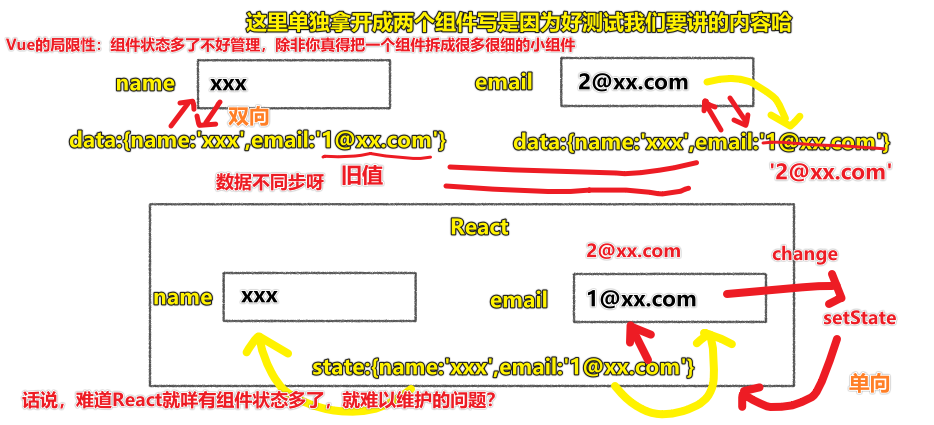
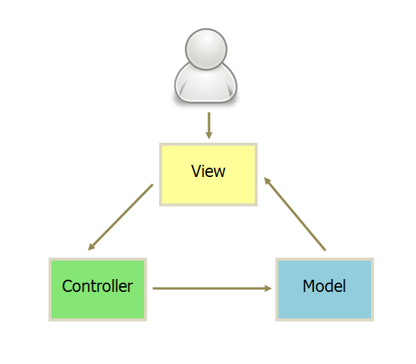

| ✍️ Tangxt | ⏳ 2020-07-20 | 🏷️ MVC、单向绑定 |

# 09-MVC 与单向绑定

## ★Vue 代替 Controller

### <mark>1）双向绑定</mark>

* 用户 -> 内存：用户通过 `input` 框输入数据，更改内存里边 `data` 旗下的 `n` 值
* 内存 -> 用户：JS 通过修改 `n` ，改变页面视图里 `input` 框里边的值！ -> 手段 `Object.defineProperty`
Vue 做的双向绑定是借鉴 Angular 的，而 Angular 则是借鉴 C#的 WPF（最早把双向绑定投入到大规模的使用中）

> DOM 与 内存的关系

用代码说明一下：

``` html
<div id="app">
  <input type="text" v-model="n">
</div>

<script src="https://cdn.jsdelivr.net/npm/vue/dist/vue.js"></script>
<script>
  let vm = new Vue({
    el: '#app',
    data: {
      n: 1
    }
  })
  console.log(vm.n)
  setTimeout(() => {
    console.log(vm.n)
  }, 5000)
</script>
```


> 改 DOM 自动映射到内存，改内存自动映射到 DOM

### <mark>2）局部更新</mark>

哪个数据变了，就改哪里，而不是整个视图不管数据变没变，都改一遍……

总之，这不是无差别更新……而是有差别攻击……

### <mark>3）Vue 没有提供 `model` API，但提供了处理 `events` 的 API</mark>

为啥没有做呢？ -> 因为没有必要哈！

MVC 搞到最后，只有一个 View 了 -> 为啥会这样呢？ -> 因为 Vue 的功能太多了

很多前端其实看不出 Vue 的 MVC 是在哪儿的……

### <mark>4）`model`有个`data`，`vue`也有一个`data`，为何不二合一呢？</mark>

`data` 的设计是：

``` js
{
  data: {
    // 数据库 数据
    book: {
      id: null,
      name: '未命名',
      number: 0
    },
    n: 1 // -> UI 数据 （也叫用户数据） -> 服务于 input 元素等
  }
}
```

> 本来`model.data`是数据库数据，而`vue.data`是 UI 数据 -> 方方说`book`之外的数据都是 UI 数据

额……我在想，不管是`book`还是`n`都是 UI 数据吧！只是前者的数据源来自于数据库，而后者是来自于用户的！而它们都被渲染到 UI 中……所以说它们都是 UI 数据也不过分吧？

### <mark>5）小结</mark>

- 通过 Vue 的引用，实现了：
  - 把 `controller` 弄到 `methods` 里边去了，还混到模板 HTML 里边去了
  - 把 `model.data` 给干掉，交给 Vue 的 `data` 来存！
- Vue 的名字虽然叫 View，但它实际上做了很多 Controller 和 Model 的事情，当然 Controller 的事情巨多……
- 知道了双向绑定是什么，以及知道了是如何逐渐演化成了`Vue`（**代码组织形式一次比一次好，从例1到例7可以看出，注意，知道每次变化是为什么，是很重要的，对了，这是一年的前端变化哦！方方用一节课的时间就介绍完了，所以很难理解也是很正常的！**） -> MVC 中的 `V` 做了那么多的事情，其实这是有点反 MVC 的，但现在的前端好像也不太在意哈！ -> 反正用了 Vue 之后，这代码组织结构也是极其的好，阅读性也是极其的好……
- 一定要区分数据是来自于服务器的？还是存粹的UI数据？ -> **额，好像来自数据库的数据就是用户数据，如`book`，而像`n`这样的则是 UI 数据，也叫临时数据！这与之前的理解是矛盾的……**

> 想起当初第一次接触MVC的时候，看了半个多月都不怎么懂，而当时，方方就说不能理解那就跳过，过几个月之后，你再看就很容易明白为啥要这样干了……事实证明，确实如方方所说的那样……

## ★单向绑定

> 讲 React 单向绑定的基本思路，不讲 React API

### <mark>1）信息点</mark>

- 一个组件就是一个MVC
- Vue的双向绑定是组件内的，父组件与子组件之间是不能做双向绑定的！
- React 返回一个模板必须要有 `()`，不然就会直接返回一个`undefined` -> 模板语法是`{}`
- 渐进式
  - 白话点来说，第一天你最多吃10个馒头，吃11个就揍你；第二天你最多吃9个馒头，吃10个就揍你……直到某一天一个馒头都不准你吃……
  - Vue，从 `MVC -> M Vue C -> M Vue -> Vue`（对新手来说，是可以接收的，因为这是一点一点过来的哈！）
- 断崖式
  - MVC -> React（直接到React，很突兀，对老手来说是可以接受的）
- 为什么需要单向数据流？
  - 有组件A（`data:{user:{name:'xxx',email:'1@xx.com'}}` -> 渲染用户名）、组件B（`data:{user:{name:'xxx',email:'1@xx.com'}}` -> 渲染用户邮箱） -> 双向绑定，`B`输入新邮箱地址，而`A`的`email`还是旧的，同样，`name`也是如此 -> 为啥不把它们合并成一个组件呢？ -> 假如还要引入很多个组件，那么这综合起来的组件，其`data`就很大了！而这就很不模块化了……
  
  
  
  - 所以，我们可以搞个父组件`F`，把`A`和`B`的`data`给删咯！在`F`里创建一个`data:{user:{name:'xxx',email:'1@xx.com'}}` -> 每次用户往`A`的`input`里边输入`name`，那么就会通知`F`组件更新其`data.user.name`，然后再把最新的`name`数据交给`A`去渲染视图……
- React的渲染：
  - 第一次渲染：初始化的`this.state = {book:{},n:1}` -> `render()`
  - 第二次渲染：`this.setState({book:response.data})`（智能的，只会处理那个变化了的状态） -> `render()`
- React的单向是这样的：
  - `state` -> `render()` -> `view`（`input`框里的默认值`1`） -> 用户往`input`框了输入内容（如`12`） -> 触发`change()`事件 -> `update state` -> `render()` -> `view`（`input`框里的值`12`）
  - 注意，如果咩有`change`事件等，是无法输入内容的，因为`input`里的值是来自于`state`的，你不改变`state`的值，那么就不会重新渲染，总之，`state`是多少，那么`render`出来的`view`上的数据就是多少……有种`state`是与`view`绑定的感觉，但这种绑定是单向的…… -> 说白了，React的视图是**只读的**，要更新视图，需要通过一个**事件**来搞 -> **智能的局部更新，即只改某个`state`变了的的那部分**
  
  
  
- 我感觉只是`v-model`给人的感觉才是实现了双向绑定……因为`v-model`是语法糖呀！它的本质也是监听了视图里的数据变化，然后修改`data`旗下的`n`值，然后再去`render`的！而 React 则是直接的、存粹的、无糖的…… -> 对了，Vue的跨父子组件的双向绑定可以用`.sync`来搞（数据是`prop`，本质也是事件监听……）……
- 单向绑定：半自动的双向绑定；双向绑定：全自动的双向绑定！
  
  
  
  - 全自动并不是说一定是很好的，这就像是人工智能一样，它大于等于人工智障，因为如果你做得不能特别的善解人意的话，那么这跟智障有区别吗？就像是双向绑定这样，如果不能做到100%完美的双向绑定，还不如搞个半自动呢，因为这样自己的心理倒还是可以接收的哈！总之，不是双向绑定不行，而是**我们很难猜透这样做了的心思**，总之，全自动洗衣机不一定要比半自动洗衣机好！
- 关于`this.add.bind(this)`，为啥总是要加`bind`呢？ -> 一开始React其实不用让你加`bind(this)`的，而是自动加的，然而一些前端用了一段时间之后，就反对这种方式了，这理由跟我们不使用双向绑定差不多，即这样自动的话，有时会显得很智障，还不如让我们全部自己写呢？请不要画蛇添足好吧！总之，反对思路是「**全自动不如我半自动，而且全自动还有bug呢！**」所以，React在下一个版本就放弃加`bind`了，都让开发者自己加`bind`，那么何时加`bind`？函数不需要`this`，那就不加`bind`呗！但正常情况下，**一般都会加上的！** -> 还有`this.add`也没有省略这个`this`，虽然代码理解起来简单了，但似乎又有点啰嗦……
- 先更新UI再更新数据库，如果数据库没有更新到，再撤销UI，还是先更新数据库再更新UI？
  - 前者可以欺骗用户我们的网站性能很快，用户体验很好，但有风险，那就是假如网不好呢？
  - 后者就是稳妥的……
  - 举例子来说，女生喜欢花言巧语，不管能不能成都说成的男生，还是稳妥的不确定的男生？ -> 女生一般喜欢前者的，而程序员也喜欢前者的……
  - React有个专有名词「**乐观主义UI**」，即先告诉用户成功了，之后如果因网络不好的话，就告诉用户不成功，刚才是我瞎说的…… -> 这种方式是主流的方式
  - **你学前端越学到后面，越像是在选择相信哪一种思维，而不是代码怎么写的问题**，如你是相信vue、angular的双向绑定，还是更愿意相信React 的单向绑定更可靠呢？ -> 这个得凭自己的经验去做，没有人会告诉你哪个是正确的……
- 组件化的双向绑定因为不好，因为这会让我们总是**倾向于把整个页面变成一个组件**，这样双向绑定起来就会很爽了，但这样就反「组件化」了！ -> 所以推荐最佳实践：
  - **用户数据 -> 单向绑定**
  - **UI数据 -> 双向绑定**
  - 保存在MySQL里面的数据就是用户数据，反之，不存在的，就是UI数据 -> 如用户的邮箱和账号肯定是存在MySQL，所以这是用户数据，所以对于这些数据我们不能用双向绑定，因为如果出现两个地方改它的话，那就很麻烦了…… -> UI数据，这个按钮是显示还是隐藏？这些数据不存储在数据库，而且只有当前这一个组件需要用到，所以为何不用双向绑定呢？（点击，`n`为`1`显示，再点击，`n`为`2`隐藏）反正这些数据不会影响到其它组件！
  - 总之，它们俩适用于不同的场景……

### <mark>2）React —— 单向绑定</mark>

双向绑定看起来很 magic（魔法），但是有些人觉得单向更好：

例子8： <https://jsbin.com/fodasut/3/edit?html,js,output>

> [简化版demo](https://codesandbox.io/s/vigorous-bash-48s2j?file=/src/BookCard.js) ->只更新UI，没有保存到数据库 -> 关于 React 代码的写法，我不知道是不是约定大于配置，如这样`onChange={e => this.handleChange(e)}`，需要用个箭头函数包裹一下，原来是`onChange={this.changeN}`这样的，还有这个方法名得这样叫`handleChange`，即得加个`handle`前缀，还有该`book`旗下某个数据时需要用到`Object.assign()`（整体改……），它会比较数据哪个变化了，然后局部更新虚拟DOM……我之前还以为是这样做的 `this.setState({book:{number: this.state.n + this.state.book.number}})`，因为这样才会让人感到有局部更新的效果 -> 总体上看，React 写法的代码，不如 Vue 来得简洁……但写的时候思路是很顺畅的，阅读性也是极其的好……

我们来想想为什么双向绑定不好呢？

因为「双向绑定」有一点点反「组件化」：跨组件的双向绑定很奇怪。

但是局部使用双向绑定是非常爽的。

### <mark>3）单向绑定的要点</mark>

1. 单向
2. VirtualDOM

<mark>Q：请说一下你对单向绑定的理解？</mark>

举栗子说明，如：

1. 上边那个例子代码，纯单向数据流的例子，这种姿势回答很朴素，如果是面对面的面试，可以当着面试官的面来解释这个代码，而这样做是最好的，但很多情况下，这个条件达不到哈！
2. 直接使用一个单向数据流的库来回答这个问题

选择2：

当面试官问你「你是如何理解单向数据流的？」

第一句话就说：`redux`的单向数据流是怎么做的？

找一张图 -> 需要理解很多`redux`的理念


> 搞清楚MVC之后，正确的代入到图中的饺子（框框的内容）


<mark>Q：面试官问你，请说一下你是如何理解虚拟DOM的？</mark>

虚拟DOM就是对DOM的底层封装，我们不用直接去操作DOM，只要告诉虚拟DOM最新的状态是什么，那么虚拟DOM自己就会去更新DOM的一部分……

虚拟DOM最大的优点就是：它可以根据两次数据变化去局部更新

了解：[如何理解虚拟DOM? - 知乎](https://www.zhihu.com/question/29504639)

### <mark>4）双向绑定的要点</mark>

1. 实现方式
   1. Dirty Checking（AngularJS 1.x）的方式
   2. Reactive
      1. 使用 getter setter，缺点是无法监听不存在的属性
      2. 使用 [Proxy](https://developer.mozilla.org/en-US/docs/Web/JavaScript/Reference/Global_Objects/Proxy)

<mark>Q：「双向绑定的实现方式？」</mark>


> 原因应该是我们怎么知道`data.name = 'Jack'`这段代码是去改 `input` 呢？

有三种姿势：

#### <mark>1、Dirty Checking（AngularJS 1.x） -> 就是 回调 哈！</mark>

AngularJS 1.x 的姿势是「在每次代码变动的时候，给你封装一个东西」

如你第一次初始化：

``` js
{ 
  data: {
    name: 'xxx'
  }
}
```

angular就会去调用`render()`

那如果我第二次修改`data`呢？如使用一个`setTimeout`，`xx`s后 `data.name = 'Jack'`？

但angular并不能发现你是在更改`input`呀！

于是angular想了这么一个办法，不要用`setTimeout`，而是用我封装好的`$setTimeout`（angular提供的一个函数）

`$setTimeout`的功能跟`setTimeout`的功能完全一样，可既然完全一样，为啥还要写呢？ -> 因为它会让`data.name = 'Jack'`执行完之后，调用`render`

那么`render`它会做什么呢？ -> 它会看你的数据与上一次数据有什么不同？

简单来说，angular1.x 能在所有能 操作`data`的话， 都封装一个函数哈！

同样，我们发送Ajax请求也得用angular提供的API，该API会在数据响应回来之后调用`render`

总之，angular的思路是：

> 在你可能改代码的地方儿都给你提供一个特殊的函数，而这个特殊的函数，会在你代码执行完之后去调用`render`方法，而`render`方法则会看一下旧的数据是怎样的，然后新的数据又是怎样的 -> 对比一下 -> 对比之后，局部更新UI

可以看到angular是很奇怪的，居然把一些API给重写了，而 Vue 显然就没有这么干！

文档：[AngularJS: Tutorial: 7 - XHR & Dependency Injection](https://docs.angularjs.org/tutorial/step_07)


如果你悄悄地用原生的`ajax`方法，把`self.phone`给改了，那么angular是完全不知道`self.phone`这个数据是变化了的

所以 Dirty Checking 的意思（思路）是，把你所有改数据的入口，都加一个守卫，只要经过了这个入口，它就知道等会你出来的时候，我就要去看一下数据变没变……

网上很多文章都会告诉你什么是脏数据检查，但却没有告诉你什么时候做脏数据检查！ -> 把你要操作数据的API，前边加个`$`，重新写了一遍……

#### <mark>2、Reactive</mark>

Vue 咩有把 ajax 进行封装，用的是第三方库 `axios` 做的 `get、post` ，那么为啥 Vue 不去做脏数据检查呢？

因为 Vue 用的是 `getter、setter` 来监听属性 呀！

如何知道在 JS 里边改了 `data.name`？


注意，Vue会对`data`旗下所有的数据改造成`getter&setter`，之后为`data`旗下追加属性的话，你得通过`Vue.set(object, propertyName, value)`来才会有数据响应式的效果，不然你直接`data.h = '6'`这样是没有响应式效果的，即不会与页面上用到的数据同步哈！

总之，Vue会给`data`旗下所有的属性加个拦截器（监听器）之类的……

相较于angular1.x的，Vue 用到的`getter、setter`姿势显然要聪明很多，毕竟angular1.x必须要给所有的入口安插一个守卫才行，如把`http`变成`$http`，把`setTimeout`变成`$setTimeout`……才有可能实现检查到数据的变化

当然，Vue也有缺点，那就是无法监听后来追加的属性……即无法监听一开始不存在的属性 或者 被我们删除的属性

#### <mark>3、最终方案 `proxy`</mark>

`proxy`是做双向绑定的最终方案！`proxy`可以做到不管数据一开始存不存在，只要你设置了就会有响应式去更新UI！

> Vue 3.0 计划用 `proxy` 来重写 数据响应式


可以看到`dataProxy`全权代理对`data`的操作！不管存在的，还是之后添加了才存在的，都可以感知到！

## ★测试

### <mark>1）填空题</mark>

请填空：

``` js
class X{
    __N行代码__
}

var view = new X({
    data: {
        name: 'frank'
    }
})

console.log(view.name === 'frank') // 输出 true
view.name = 'jack' // 输出「有人修改了 name」
```

请填写 N 行代码，使得代码按照注释那样输出结果（有额外的输出不扣分）

> 提示：`Object.defineProperty` 或者 `Proxy` 都行

### <mark>2）请将课堂中的代码都敲一遍，运行看看，想想每次修改代码之后，代码哪里变好了？</mark>

> 全靠自觉！

## ★了解更多

➹：[Redux 基础概念 · 从零开始学 ReactJS（ReactJS 101）](https://wizardforcel.gitbooks.io/reactjs101/Ch07/react-redux-introduction.html)

➹：[译 & Web 应用程序中的数据和 UI 分离 - 掘金](https://juejin.im/post/5e90831ee51d4560ea31fdf9)

➹：[在 2016 年学 JavaScript 是一种什么样的体验？ - 知乎](https://zhuanlan.zhihu.com/p/22782487)

## ★总结

- 有了思维框架之后，就不会让自己思考问题的时候失焦

## ★Q&A

### <mark>1）MVP是什么？</mark>

编程里边的 理解：

来买宝贝的（View） -> 主持人(Presenter) -> 宝贝（Model），宝贝谁买了，就在谁身上，就像是哪个视图要了数据，就在谁身上渲染一样……（Model和View是不能接触的，说白了View 与 Model 不发生联系）


> MVP, MVVM甚至MXXX都只是MVC的变体而已，至于将重点放在C点还是V点（没人会希望放到M点吧？！）就自然引出了若干种所谓的模式，其实模式只有一种，你称为P也好VM也好，它都只是C的实例而已。总是设法弄出一些所谓的Business Word的家伙们，是前端开发最大的敌人！

我个人理解的MVC是： `V -> C -> M -> V` （V接收用户指令，数据通信都是单向的）



``` js
{
  add() {
    // 业务逻辑
    let newData = {
      number: this.model.data.number + 1
    }
    // 要求Model改变状态
    this.updateModel(newData)
  },
  updateModel(newData) {
    // 发送Ajax请求，把响应回来的数据，保存到 Model 里边
    this.model.update(newData).then(() => {
      // 把 新数据 发送给 View 去 Render
      this.view.render(this.model.data)
    })
  }
}
```

> View 传送指令到 Controller -> Controller 完成业务逻辑后，要求 Model 改变状态 -> Model 将新的数据发送到 View，用户得到反馈

还有一种是直接通过controller接受指令（改变 URL 触发 `hashChange` 事件）：


总之：

- 视图（View）：用户界面
- 控制器（Controller）：业务逻辑
- 模型（Model）：数据保存

对了，Backbone.js 是变体的MVC，其 **Controller 非常薄**，只起到路由的作用，而 View 非常厚，**业务逻辑都部署在 View**，即由 View 直接要求 Model 改变状态，所以，**Backbone 索性取消了 Controller，只保留一个 Router（路由器）**（ Backbone.js 有 Router 的概念，毫无疑问，它是借鉴了后端的 Web MVC 概念……而像 Vue 这样的，借鉴了经典 MVC，以及 Angular 的双向绑定，还有 React 的 虚拟DOM……）


> Backbone这种MVC，目前不怎么用了，目前大多用 MVVM、MVP 这样的，即 M 与 V 是不直接通信的


在产品设计里边：

> a minimum viable product (MVP) is the version of a new product that allows a team to collect the minimum amount of validated learning about customers with the least effort.

即 MVP 是最小可行性产品，如果该产品对用户ok，那么就会继续迭代下去，说白了，先用最低的成本试水，如果市场反应好，那继续迭代下去：


我觉得很多培训机构就是这样的，课程不断迭代……而老学员两眼泪汪汪……

其它示例：


➹：[Running hypothesis driven experiments using the MVP - UX Collective](https://uxdesign.cc/the-product-manager-and-the-mvp-a0c618b0d8fa)

➹：[Using The MVP Approach To Create A Successful Project](https://www.infomir.eu/eng/blog/articles/17-using-the-mvp/)

➹：[MVC、MVP、MVVM，我到底该怎么选？ - 掘金](https://juejin.im/post/5b3a3a44f265da630e27a7e6#heading-7)

➹：[goldze/MVVMHabit: 👕基于谷歌最新AAC架构，MVVM设计模式的一套快速开发库，整合Okhttp+RxJava+Retrofit+Glide等主流模块，满足日常开发需求。使用该框架可以快速开发一个高质量、易维护的Android应用。](https://github.com/goldze/MVVMHabit)

➹：[Everything You Need to Know for Building MVP for Startups](https://www.cloudways.com/blog/building-an-mvp/)

➹：[MVC，MVP 和 MVVM 的图示 - 阮一峰的网络日志](https://www.ruanyifeng.com/blog/2015/02/mvcmvp_mvvm.html)

### <mark>2）单向绑定与双向绑定</mark>

- 全局性数据流使用单向，**好跟踪**。局部性数据流使用双向，**简单，写得爽**……
- 双向绑定只会在做TODOMVC的时候才会感觉代码少吧，维护起来大点的项目，不能看 -> 我现在都烦死了vue的双向绑定了，维护别人的项目都有想死的感觉

为啥 React 不实现双向绑定呢？

> 不实现双向绑定是React设计决定，因为React的目标从来不是“让开发者写更少的代码”，而是让“代码结构更加清晰易于维护”。
> 
> 有的库采用了双向绑定，利于快速上手，但是不得不承受对应的缺点，软件上十全十美的方案几乎没有，就看如何均衡，就看对于特定问题如何取舍。

> 最好是在业务数据上单向数据流，但是在功能组件开发上允许双向绑定，这样综合效用最高

> react对这个问题的处理方法，很朴素，却暗合了**中间件模式**，让上层程序更容易理解

我突然明白 ant-design-vue 为啥没有用 `v-model` 了，而是用了脱糖的写法……

➹：[单向数据绑定和双向数据绑定的优缺点，适合什么场景？ - 知乎](https://www.zhihu.com/question/49964363)

➹：[react不实现双向绑定的原因是什么呢，提高用户动手能力？ - 知乎](https://www.zhihu.com/question/300849926)

➹：[Vue的双向绑定和单向数据流 - 掘金](https://juejin.im/post/5ccbd11df265da035b61a771)

### <mark>3）脏数据？</mark>

➹：[今天想跟大家分享下 double check in 和 dirty check in - 知乎](https://zhuanlan.zhihu.com/p/32139993?from_voters_page=true)

➹：[VueJs到底从Angular1.x抄了什么？ - 知乎](https://zhuanlan.zhihu.com/p/28298565)

➹：[Angular的脏检测跟Vue的数据劫持相比有什么优势和劣势？ - 知乎](https://www.zhihu.com/question/276579926)


