| ✍️ Tangxt | ⏳ 2020-07-22 | 🏷️ 技巧 |

# 10-Vue 的常用技巧

> 文档不会说的内容

## ★ `v-model` 不是双向绑定

1）React 和 Vue 的区别是什么？

经典答法：

> React 是单向数据流，而 Vue 则是双向绑定的

不过，这个答案是错的，但是你就是可以这样回答！ -> 因为使用 React 的人，对 Vue 的了解，肯定是停留在以前的 Vue ，以前的 Vue 确实是双向绑定，但是现在的 Vue 是咩有双向绑定的，全部都是单向的

总之，去一个 React 的公司就告诉他，Vue 是双向绑定的，React 是单向绑定的，反之，去一个 Vue 的公司，就告诉他「Vue 1 是以双向绑定为主的，而 Vue 2 逐渐地就使用单向数据流了，而`v-model`是语法糖 」 -> 对不同的公司给出的答案是不一样的！

2）信息点

1、`v-model`不是双向绑定，它是在骗你的，其本质是个语法糖 

`input` & `#app` 的关系就像是子组件与父组件一样

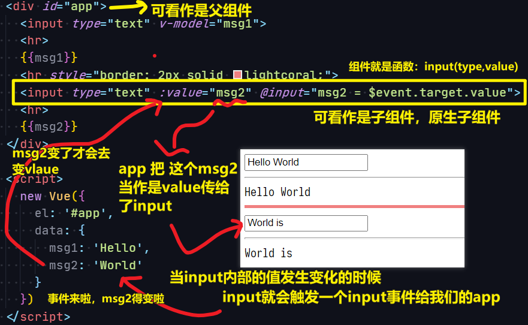

> 在`#app`这个区域看到的变量、表达式啥的，都是`#app`这个父组件的数据哈！ -> `input`这个子组件内部会触发`input`事件，并把用户输入的`value`带上来给父组件，父组件会监听到这个事件，所以`$event.target.value`的值就是用户输入的`value`，`msg2 = value`就是在改父组件的`msg2`的值，这个`msg2`一变化，就会响应到`:value="msg2"`

2、能让你出现`bug`的测试

Vue 记不住光标的位置：

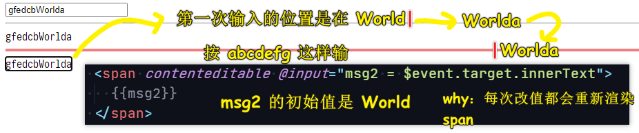

DOM 变化情况：

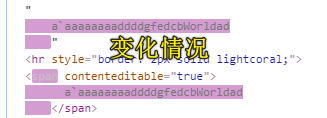

可以看到，所谓的「双向绑定」其实是单向的……即 用户在页面上改 DOM -> 事件 -> `msg2 = 用户输入的值` -> DOM 更新……注意这是跨父子组件的更新！而不是子组件的更新，直接就反映在子组件的 DOM 上了……如果真这样，那才是真正意义上的「双向绑定」！

> 话说，`$event.target`指的是不是那个触发事件的元素，如上边的`span`元素！ -> `e.currentTarget`始终是监听事件者（`xxx.addEventListener()`），而`e.target`是事件的真正发出者（**触发事件的那个元素**）

3）Vue 的「双向绑定」 `v-model`

从 Vue 0.x 开始，Vue 就用 `v-model`来实现「双向绑定」。

如：

```
data: {
  user: { name: 'xxx'}
}
<input v-model="user.name">
```

能实现以下两个绑定：

1. `user.name` 的变化自动同步到 `input.value`
2. `input.value` 的变化自动同步到 `user.name`

但是当 FLUX 单向数据流兴起之后：

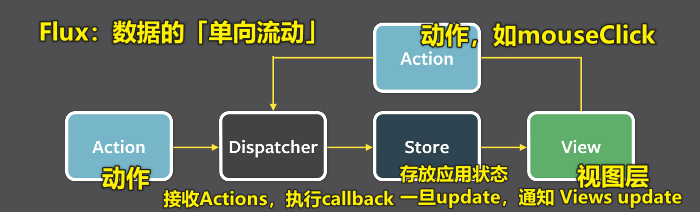

> Flux 是一种架构思想，专门解决软件的结构问题。它跟 MVC 架构是同一类东西，但是**更加简单和清晰**。Flux存在多种实现（至少15种），常用 Facebook 的官方实现 -> Flux会将一个应用分成四个部分。

Vue 的作者重新审视了「双向绑定」，发现「双向绑定」的一些问题之后，就更倾向于「单向绑定」了。v-model 被拆成两部分

```
data: {
    user: { name: 'frank'}
},
<input :value="user.name" @input="user.name = $event">
```

这样一来，数据的变更权就回到数据拥有者手上了。

用一个 `contenteditable` 的 bug 来理解单向数据流。

同时为了巩固这一模式，**Vue 规定子组件不能修改父组件传给它的 `props`**，一旦发现就会打印出一个警告。

我们以保存用户名来举例说明什么是单向数据流。

可以看出起优点有：

- **数据拥有者清楚地知道数据变化的原因和时机（因为是它自己操作数据的）**
- **数据拥有者可以阻止数据变化**

这些都是在双向绑定中很难做到的。

## ★豪车与嫩模

1）双向绑定的不好之处

用户改了数据，就会立刻生效 -> 数据是不受控制的！

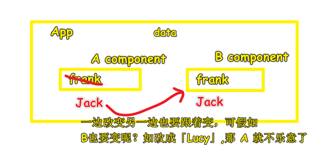

而单向数据流则可以：

- 数据拥有者（哪个组件拥有`data`）清楚地知道数据变化的原因和时机（因为是它自己操作数据的）
- 数据拥有者可以阻止数据变化

就像是 React 那样可以阻止用户对表单直接输入那样……

形象点来说：

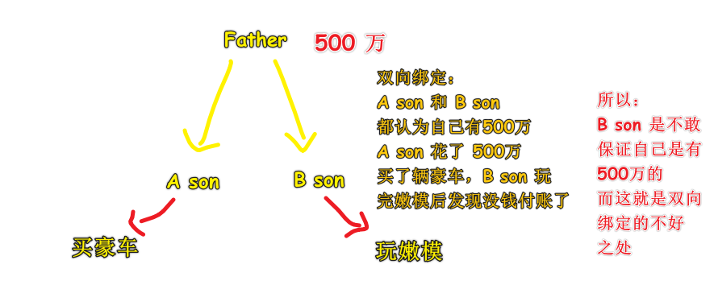

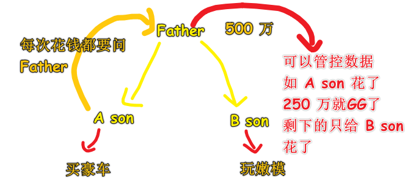

> 注意，以前的双向绑定是真得双向绑定啊！没有什么事件在改`data`之前杵着，你往`input`里输入数据，就会立即改内存里的`data`，中间不带喘气的，而现在的`v-model`你看起来以为是双向绑定，但其实并不是啊！也是单向数据流呀！ -> Vue 现在是通过两个单向绑定（`:value="xxx"`「**父到子传数据**」和`@input="xxx = $event.target.value"`「**子到父传数据**」）来模拟双向绑定呀！即 Vue 的双向绑定是假的双向绑定，所以这就是为啥我们可以拦截数据的原因！
> 
> `A input`维护自己的一个`data`，`B input`维护自己的一个`data`，`data`就是组件的状态！ -> 我们为`input`文本框输入的内容也是`input`这个组件的状态！ -> 双向绑定的感觉就像是把`input`和`#app`这俩个组件融合到一起了……如`<input type="text" v-model="msg1">`，你输入内容，就是在改变`input`的状态，而这个状态情况能实时交给`msg1`，就像是这样`<div>🟡🟡msg1🟡🟡</div>`，你改`msg1`的值，就是在往`input#text`里输入内容，也就是在为`msg1`赋值……

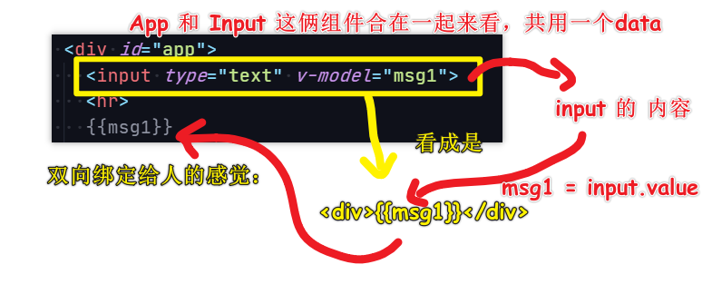

> 看看 0.x 的 Vue 的双向绑定：[Handling Forms - vue.js](https://011.vuejs.org/guide/forms.html)

2）三种写法

不好的姿势：

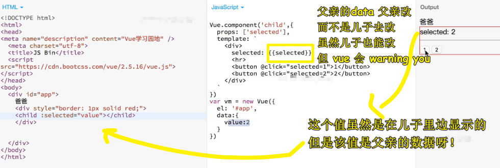

> `selected`是父元素拥有的，如果你直接在儿子里边改父元素的这个`selected` data 的话，那就是在搞双向绑定了！ -> `props`过来的`data`可不是子组件的！只是父组件给子组件用的`data`

通知爸爸去 `update` data：

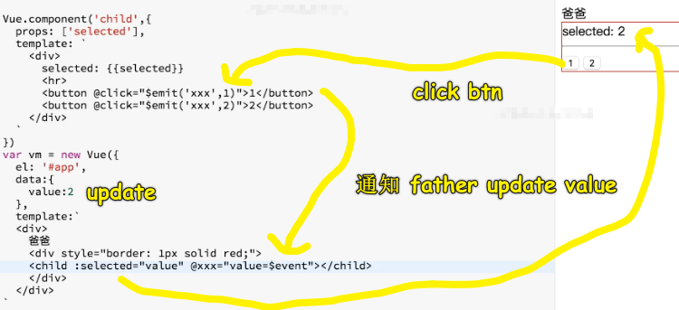

> 通过`$event`可以拿到`emit`过来的`1`，注意这只能传一个值哈！

这种姿势，控制台没有警告，可以看到 vue 更倾向于单向数据流，而不是子元素直接改父元素传入的这个`selected`值！也就是父元素的那个`value`值（实参）！

vue1 用户要吃糖：

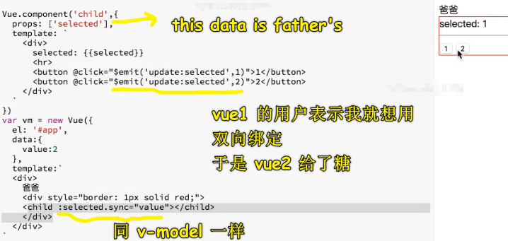

> 写法上看，用对子组件的操作，数字化，也就是传了一个参数`1 or 2`给父组件`value = 1 or 2`

脱糖：

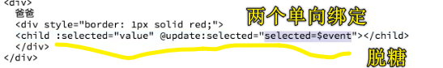

> 我们点击`btton`，冒泡 -> 发布-订阅 -> `update:selected`事件的`callback`触发执行！

---

## ★制造一个`tabs`轮子


