| ✍️ Tangxt | ⏳ 2020-07-22 | 🏷️ 技巧 |

# 10-Vue 的常用技巧

> 文档不会说的内容

## ★ `v-model` 不是双向绑定

1）React 和 Vue 的区别是什么？

经典答法：

> React 是单向数据流，而 Vue 则是双向绑定的

不过，这个答案是错的，但是你就是可以这样回答！ -> 因为使用 React 的人，对 Vue 的了解，肯定是停留在以前的 Vue ，以前的 Vue 确实是双向绑定，但是现在的 Vue 是咩有双向绑定的，全部都是单向的

总之，去一个 React 的公司就告诉他，Vue 是双向绑定的，React 是单向绑定的，反之，去一个 Vue 的公司，就告诉他「Vue 1 是以双向绑定为主的，而 Vue 2 逐渐地就使用单向数据流了，而`v-model`是语法糖 」 -> 对不同的公司给出的答案是不一样的！

2）信息点

1、`v-model`不是双向绑定，它是在骗你的，其本质是个语法糖 

`input` & `#app` 的关系就像是子组件与父组件一样


> 在`#app`这个区域看到的变量、表达式啥的，都是`#app`这个父组件的数据哈！ -> `input`这个子组件内部会触发`input`事件，并把用户输入的`value`带上来给父组件，父组件会监听到这个事件，所以`$event.target.value`的值就是用户输入的`value`，`msg2 = value`就是在改父组件的`msg2`的值，这个`msg2`一变化，就会响应到`:value="msg2"`

2、能让你出现`bug`的测试

Vue 记不住光标的位置：


DOM 变化情况：


可以看到，所谓的「双向绑定」其实是单向的……即 用户在页面上改 DOM -> 事件 -> `msg2 = 用户输入的值` -> DOM 更新……注意这是跨父子组件的更新！而不是子组件的更新，直接就反映在子组件的 DOM 上了……如果真这样，那才是真正意义上的「双向绑定」！

> 话说，`$event.target`指的是不是那个触发事件的元素，如上边的`span`元素！ -> `e.currentTarget`始终是监听事件者（`xxx.addEventListener()`），而`e.target`是事件的真正发出者（**触发事件的那个元素**）

3）Vue 的「双向绑定」 `v-model`

从 Vue 0.x 开始，Vue 就用 `v-model`来实现「双向绑定」。

如：

```
data: {
  user: { name: 'xxx'}
}
<input v-model="user.name">
```

能实现以下两个绑定：

1. `user.name` 的变化自动同步到 `input.value`
2. `input.value` 的变化自动同步到 `user.name`

但是当 FLUX 单向数据流兴起之后：


> Flux 是一种架构思想，专门解决软件的结构问题。它跟 MVC 架构是同一类东西，但是**更加简单和清晰**。Flux 存在多种实现（至少 15 种），常用 Facebook 的官方实现 -> Flux 会将一个应用分成四个部分。

Vue 的作者重新审视了「双向绑定」，发现「双向绑定」的一些问题之后，就更倾向于「单向绑定」了。v-model 被拆成两部分

```
data: {
    user: { name: 'frank'}
},
<input :value="user.name" @input="user.name = $event">
```

这样一来，数据的变更权就回到数据拥有者手上了。

用一个 `contenteditable` 的 bug 来理解单向数据流。

同时为了巩固这一模式，**Vue 规定子组件不能修改父组件传给它的 `props`**，一旦发现就会打印出一个警告。

我们以保存用户名来举例说明什么是单向数据流。

可以看出起优点有：

- **数据拥有者清楚地知道数据变化的原因和时机（因为是它自己操作数据的）**
- **数据拥有者可以阻止数据变化**

这些都是在双向绑定中很难做到的。

## ★豪车与嫩模

1）双向绑定的不好之处

用户改了数据，就会立刻生效 -> 数据是不受控制的！


而单向数据流则可以：

- 数据拥有者（哪个组件拥有`data`）清楚地知道数据变化的原因和时机（因为是它自己操作数据的）
- 数据拥有者可以阻止数据变化

就像是 React 那样可以阻止用户对表单直接输入那样……

形象点来说：


> 注意，以前的双向绑定是真得双向绑定啊！没有什么事件在改`data`之前杵着，你往`input`里输入数据，就会立即改内存里的`data`，中间不带喘气的，而现在的`v-model`你看起来以为是双向绑定，但其实并不是啊！也是单向数据流呀！ -> Vue 现在是通过两个单向绑定（`:value="xxx"`「**父到子传数据**」和`@input="xxx = $event.target.value"`「**子到父传数据**」）来模拟双向绑定呀！即 Vue 的双向绑定是假的双向绑定，所以这就是为啥我们可以拦截数据的原因！
> 
> `A input`维护自己的一个`data`，`B input`维护自己的一个`data`，`data`就是组件的状态！ -> 我们为`input`文本框输入的内容也是`input`这个组件的状态！ -> 双向绑定的感觉就像是把`input`和`#app`这俩个组件融合到一起了……如`<input type="text" v-model="msg1">`，你输入内容，就是在改变`input`的状态，而这个状态情况能实时交给`msg1`，就像是这样`<div>🟡🟡msg1🟡🟡</div>`，你改`msg1`的值，就是在往`input#text`里输入内容，也就是在为`msg1`赋值……


> 看看 0.x 的 Vue 的双向绑定：[Handling Forms - vue.js](https://011.vuejs.org/guide/forms.html)

2）三种写法

不好的姿势：


> `selected`是父元素拥有的，如果你直接在儿子里边改父元素的这个`selected` data 的话，那就是在搞双向绑定了！ -> `props`过来的`data`可不是子组件的！只是父组件给子组件用的`data`
> 
> 对了，子组件直接改`selected`的值，并不会也改了父组件的`value`值，即便 `value` 是引用类型的值也没事儿（疑问？？？）…… -> 这相当于是：子组件是一个函数，`selected`是形参，父组件传了个`value`过来作为子组件的实参，子组件的函数体，`selected = 1` -> 问题来了，父组件传的`value`是个`{name:'father'}`呢？ -> 经过我测试，或者说，对 JS 函数的基本认识，引用类型的参数值，可以在函数体内修改同一个引用地址……

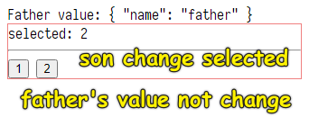

如果是引用类型的`value`：

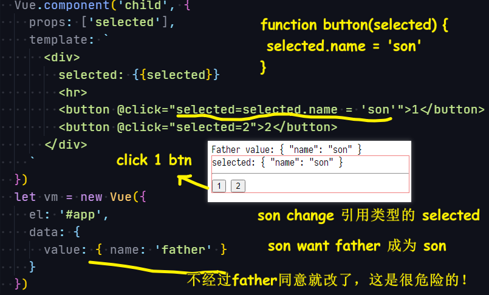

通知爸爸去 `update` data：


> 通过`$event`可以拿到`emit`过来的`1`，注意这只能传一个值哈！

这种姿势，控制台没有警告，可以看到 vue 更倾向于单向数据流，而不是子元素直接改父元素传入的这个`selected`值！也就是父元素的那个`value`值（实参）！

vue1 用户要吃糖：


> 写法上看，对子组件的操作，数字化，也就是传了一个参数`1 or 2`给父组件`value = 1 or 2`

脱糖：


> 我们点击`button`，冒泡 -> 发布-订阅 -> `update:selected`事件的`callback`触发执行！

3）`.sync` 修饰符

```
<div :selected.sync="x"> 等价于 <div :selected="x" @update:selected="x = $event">
```

例子：

``` js
Vue.component('child', {
    props: ['selected'],
    template: `
      <div>
        selected: {{selected}}
        <hr>
        <button @click="$emit('update:selected',1)">1</button>
        <button @click="$emit('update:selected',2)">2</button>
      </div>
    `
})
var vm = new Vue({
    el: '#app',
    data: {
        value: 2
    },
    template: `
      <div>
        爸爸
        <div style="border: 1px solid red;">
        <child :selected="value" @update:selected="selected=$event"></child>  
        </div>
      </div>
    `
})

```

`.sync` 的作用和 `v-model` 一模一样，就是用双向绑定的**语法糖**，实现两个单向绑定。好处同上。

4）小结

- Vue 没有双向绑定，只要你用了双向绑定的写法就会出现一个警告，说白了，Vue 保留了这个能力，但就是不推荐你用双向绑定！所有的事情都应该用单向绑定来完成！
- 体现双向绑定的姿势是：
  - 必然存在父子关系
  - 用户与子交互，子直接改变来自父的数据，中间不带喘气的……

---

## ★制造一个`tabs`轮子

> 写一个 tabs 功能是很好写的，但是造一个 tabs 轮子则是很难造的……

1）什么叫写一个`tabs`功能？

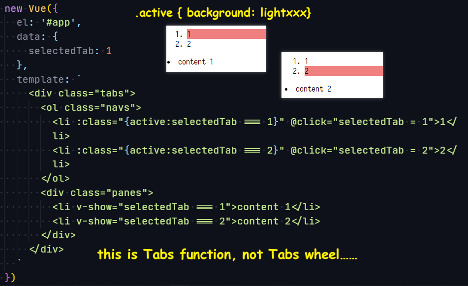

这叫写出一个 Tabs 功能，可不是一个 Tabs 轮子，因为如果人家要用你这个 Tabs 的话，需要拷贝代码，然后一点一点地修改代码，如 `selectedTab === 'a'`、`selectedTab === 'b'`……

所以说，**这不叫写一个 Tabs 轮子**

> 似乎平时抄人家的代码就是在抄功能呀！

那么什么叫写一个 Tabs 轮子呢？ -> 你造一个出来就知道了

2）如何造一个 Tabs 轮子

1. 看开源的 UI 轮子库，如 [element-ui](https://element.eleme.cn/#/zh-CN/component/tabs)……
2. 设计 Tabs 用法的 API，只要人家引入了我们这个 Tabs 轮子，就能使用这样的`template`结构，就能实现这样的 Tabs 效果……

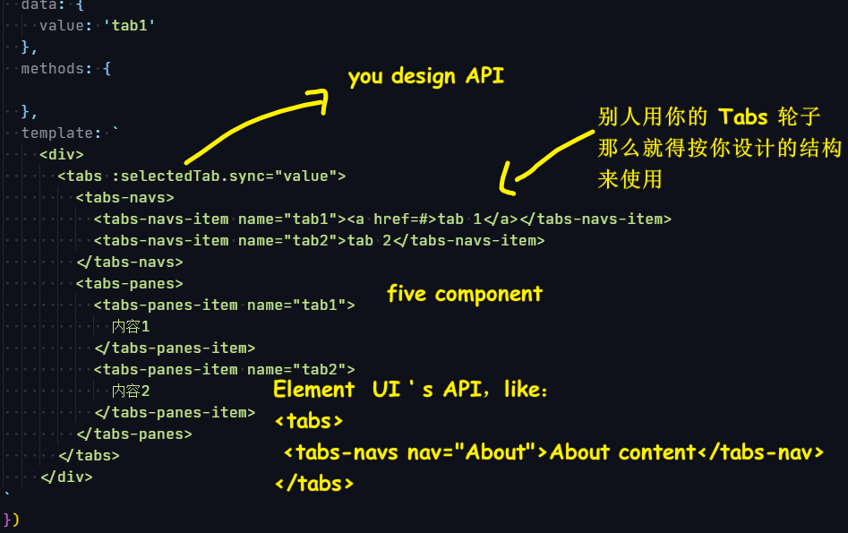

1、定义接口（`props`）

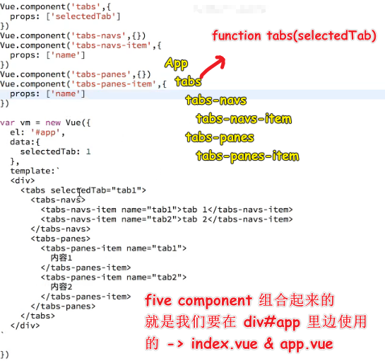

2、组件雏形

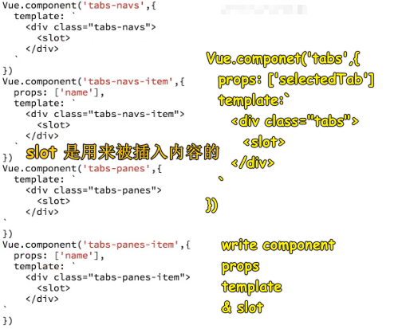

> 图中的`<slot>`要闭合一下 -> `<slot/>`，不然会报错，虽然不闭合也可以正常显示内容……

3、如何只显示`tab1`？

> 不要用`v-show`来控制组件的显示和隐藏 -> 用`class`吧！

Q：孙子如何得到`selectedTab`的值？

爷爷（`tabs`）告诉爸爸（`tabs-navs`），爸爸告诉儿子 (`tabs-navs-item`)

可是爷爷如何告诉爸爸呢？

爸爸是`slot`，我们要拿到插入进来的`tabs-navs`

使用 `mounted` 钩子（`created`钩子是拿不到的） -> `this.$children`

由于，爸爸有两个，即`tabs-navs` & `tabs-panes`

所以我们需要区分它们俩 -> 定义这俩组件的时候，请添加一个`name`选项（这是`name`选项的意义之一，还有一个意义是使用 `vue-devtools` 来方便`debugger`）

遍历`this.$children` -> `vm.$options.name`可获取`tabs-navs` or `tabs-panes`

如果是`tabs-navs`组件实例，那么就`vm.selectedTab = this.selectedTab`

我们`vm.selectedTab`，就是在给`tabs-navs`实例定义了一个叫`selectedTab`的`prop` -> 所以`tabs-navs`的选项需要有个`props:['selectedTab']`

同理，`爸爸 -> 儿子`，也是`爷爷 -> 爸爸`这样一个过程

整个过程来看，孙子如何得到`selectedTab`的值的呢？

> 口口相传：爷爷 -> 爸爸 -> 儿子

测试，结果咩有正常运行

因为`mounted`的顺序，是从里到外的，即儿子先 append 在爸爸，然后再是爸爸 append 爷爷……最后是爷爷 append 到 app，即 mounted 到页面上！

而这意味着，我们本来以为`mounted`是从高处往下走的，即`selectedTab`这个数据从高处流向低处，但其实`mounted`是从低处往上走的！即低处的`mounted`是无法通过`this.selectedTab`拿到值的，因为此时并无水从高处流下来呀！

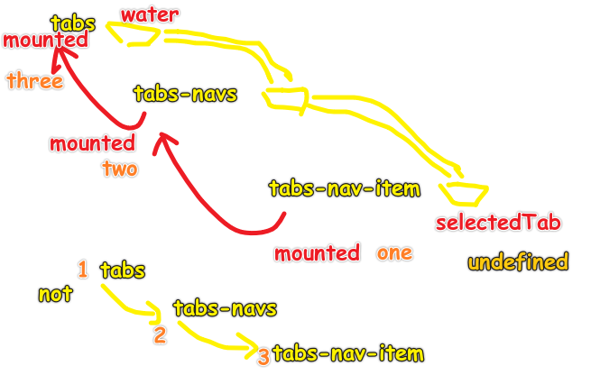

> 虽然儿子等咩有 mounted 到页面上，但它们 mounted 上一级也是可以的，而它们 mounted 完之后，就处于组件的运行状态了！
> 
> `created`的顺序是从上往下流的！

所以这个思路得变了……

思路：

1. 爷爷拿到了爸爸，让爸爸调用它自身的方法去设置`selectedTab`的值，所以爸爸的`selectedTab`就不能写在`props`里边了，而是写在`data`里边了！
2. 同理爸爸也是如此处理，这样儿子就能拿到从高处流下来的「**水**」了
3. 测试：直接手动更改在`tabs`上的`selectedTab`为`1 or 2`，会不会有相应的变化！

4、绑定事件，点击孙子会更新爷爷的`selectedTab`值吗？

不行呀！

儿子点击`tab-navs-item`（有`@click`） -> `$emit`的自定义事件，如`xxx`，是不会冒泡的…… -> 所以你得为儿子、爸爸、爷爷都得`$on`一个`xxx`事件 -> 到爷爷后，你得`updated`一下，因为`selectedTab`的值变化了，你得更新一下爷爷的`selected`值！不然，不会自动更新组件的状态！

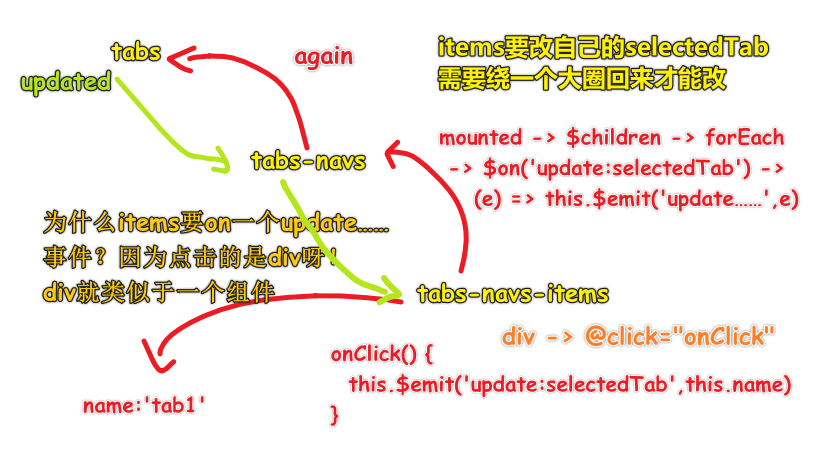

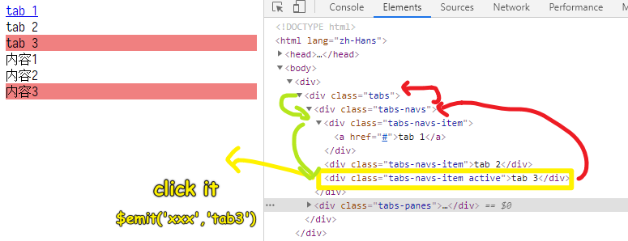

5、其它人如何使用这个 Tabs 轮子？

- 结构按照我们规定的来写
- 提供一个`value:'tab1'`的初始化`data`

代码：<https://jsbin.com/zewuvir/edit?js,output>

3）小结

- 在造这个轮子的过程中，你得对 Vue 的整个生命周期要有一个很详细的了解 -> 对 Vue 的事件如何传递也要有一个很深入的了解、以及事件也要有很深入的了解
- 大公司 -> 拧螺丝 -> 看文档抄代码。如果你要技术精进的话，那么你得模仿人家的轮子然后去造……
- 相较于 element-ui，`tabs-navs-item`的值可以是标签等，**没有任何约束，想写啥就写啥**，而 element-ui 的用了一个`label`，这样就只能规定是字符串值了！还有为啥要用`name`呢（这个解释得不清楚……）？不按书写`tabs-navs-item`的顺序来排列`tab1`、`tab2`这样嘞？ -> 因为希望点击`tab1`时是跳转到其它页面……
- Tabs 轮子非常典型：
  - 可让你了解事件传播机制、生命周期，比造日历的轮子更复杂，造日历轮子只有一层，而 Tabs 轮子有三层，它们之间是如何通信的是很复杂的……

## ★Vue 的渐进式

1）概述

Vue 的另一个大特点就是「渐进式」，意思就是你可以渐渐地用 Vue。而 React 几乎做不到这一点。

1. 你可以继续操作 DOM
2. 你可以很方便地做 SEO
3. 你可以局部做单页面
4. 你可以整体做单页面

2）信息点

- `new Vue({})`不能挂载在`body`上！ -> Vue 的潜规则！ -> 不然`body`元素很有可能被组件替代之，这样页面就没有`body`元素了！
- 对于小公司来说，使用 Vue 可以渐进式的改造网站 -> 假如页面有10个模块，都是用jQuery搞的，我们可以从中选择一个模块用 Vue 来搞 -> 逐渐地，最后可以让 10 个模块都变为用 Vue 来搞！
  
  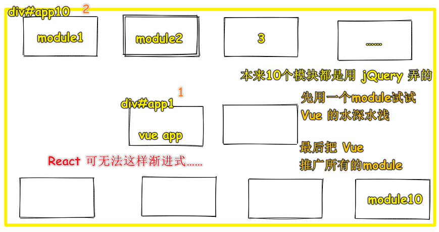
  
- SEO：把那些标题等，用于在服务器端渲染，而那些模块则用 Vue 就好了,而React 则希望body旗下的第一个元素就是 `React App` 
  
  
  
- Vue 与 jQuery一起使用不冲突，如我们选择某个元素，可以通过给某个元素`<div ref=div5></div>`，来让我们这样获取DOM元素： `vm.$refs.div5` -> 抛弃了 jQuery获取元素的API，虽然如此，我们还是可以用 jQuery对DOM进行CRUD的！ -> 而React 则是直接全家桶……
- 首页不用单页，因为要做SEO，而像`admin`这样的页面就用单页了 -> 整站可以50%用单页，也可以25%用单页……… -> 这就是渐进式，而React 则很少有人这样搞，因为React 做出来的页面都是JS渲染出来的，没有SEO……
- Vue占领市场的思想，可以让你一点点的用，而React就是一把梭……要么用React 要么用其它的……

补充：

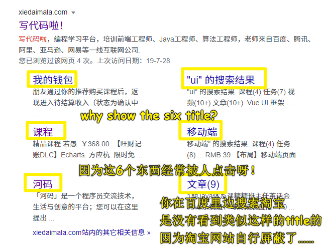

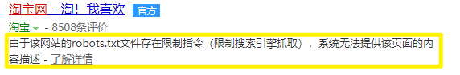

## ★`computed`、`watch`、`methods`的区别

