| ✍️ Tangxt | ⏳ 2020-07-25 | 🏷️ vue-router |

# 11-Vue Router-前端路由实现思路

## ★概述

路由器

1. 路由是什么

   搞清楚这几个概念：

   1. 路由
   2. 分发
   3. 路由表
   4. 默认路由
   5. 404 路由 / 保底路由
   6. 嵌套路由

2. hash 模式？history 模式？memory 模式？

   1. hash <https://codesandbox.io/s/x3nxq950ko>
   2. history <https://codesandbox.io/s/oqjvqm6w05>
   3. memory <https://codesandbox.io/s/936269l69o>

3. [Vue-Router 源码](https://github.com/vuejs/vue-router/blob/dev/dist/vue-router.js)

4. 正则表达式的使用

5. VueRouter 的一些 API（下节课讲）


## ★目录

1. 不会写路由的实现代码，只讲实现路由的思路
2. 路由是什么？ -> 给个回答，听完方方的讲解后，给出自己的最终答案
3. 了解 3 种模式的路由
4. vue-router 的源码？ -> 大概有 2600 多行？主要贡献者是尤雨溪，话说，这代码数量多吗？（**千行级别的可以去看，但万行级别的就算了！**） -> 方方会推荐一篇文章让你去看这个源码实现
5. 正则表达式 -> 很有用，需要刻意去学习它！
6. vue-router API -> 大概率自己去看文档！

## ★路由是什么？

> 理解「路由」，从生活概念入手

### <mark>1）简单理解「路由」是什么？（上网路由）</mark>

我们日常生活中接触到的路由有很多，如「路由器」，不过，现在似乎都用光猫了！

> 猫和路由器的区别：[Easy-Key——科普：猫、路由器和交换机的区别和联系 - 知乎](https://zhuanlan.zhihu.com/p/31257745)

家里有一个或一个以上的人要上网就得用到路由器了！


> 分发：只要满足一对多的情况，就叫做分发，即分别发送到各个地方

路由器的主要作用是分发请求的，只要一个东西分发了请求，那么它就是路由，而这个东西就是「路由器」

示例：发送一个请求抖音的信号，路由器就会分发出去……

话说，如果面试官问你「什么是路由？」，你会怎么回答？

> 分发「请求」的东西或者分发「请求」的对象是「路由器」（器就是器物之意），而**分发「请求」就是「路由」**

然而，面试官问的是「前端路由」，而我们回答的是「上网路由」，所以我们要对我们了解到的「上网路由」细化成「前端路由」

### <mark>2）「停止学习框架」</mark>

方方翻译了一篇文章——停止学习框架

评论中有一些很典型的思维：

> 不学框架？谁会要你？现在的前端不就是学框架的吗？为啥要停止学习框架？我得用 100% 的时间来学习框架才行……

方方是如何学习 router 的？

1. 不看 vue router 是如何实现的，先去看有关路由的基础知识，毕竟除了 vue 有 router 以外，还有 react、angular 都有，所以如果你不学基础知识的话，那么这就意味着你要学习三种路由 API -> 这就像是**先去了解「水果」，再去了解「桃子、李子、梨子」** 或者说就像是产品里的「**MVP**」概念一样，先尝试搞个原型，再去迭代优化……
2. 到维基百科查「路由」最最基础、最最原始的含义 -> 得到一些相关概念：「分发」+「路由器」（硬件，不用看）+「路由表」（存储路径的表，每个框架的 router 实现都会有路由表）+「路由形式」（如何传播信息）

> route 是「路线」， router 是路由器，即路由器对象……

### <mark>3）前端路由</mark>

> codesanbox 创建一个项目时，可以通过点击「有颜色的 box 」来创建 -> 原生 JS（logo 黄色）、React（logo 蓝色）、Vue（logo 绿色）

需求：


代码实现：[效果](https://ppambler.github.io/vue-demo-2/router/index1.html)、[源码](https://github.com/ppambler/vue-demo-2/blob/master/router/index1.html)


> 代码写得不好看……

## ★优化代码

### <mark>1）从上个例子里边学到的概念</mark>

* 路由
* `hash(#1)`

### <mark>2）追加额外功能</mark>

#### <mark>1、默认路由</mark>

> 即页面一打开 `number` 默认就是 `1` -> `number = number || 1` -> `url` 后缀没有 `#xx` ， `div#app` 里边显示的就是默认路由过来的界面！


#### <mark>2、404 路由/保底路由</mark>

> 保证用户总是能够看到一个东西，不能出现意外的情况


#### <mark>3、嵌套路由</mark>

需求：


代码有点麻烦，下个 `★` 会讲到！

### <mark>3）代码优化</mark>

1. 重复代码函数提取 -> 函数名 `x` （想不出名字，就用这个 `x` ，而 `x` 的意思是表示函数代码写完之后一定会修改的） -> 看到函数体的逻辑——根据你想去的地方，展示你的界面，即从一个源地址，到达目的地，而这就是**路由** -> 所以函数的名字是「 `route` 」

``` html
<a href="#1">go to 1</a>
<a href="#2">go to 2</a>
<a href="#3">go to 3</a>
<a href="#4">go to 4</a>
<div id="app"></div>
<div id="div1" style="display: none;">1</div>
<div id="div2" style="display: none;">2</div>
<div id="div3" style="display: none;">3</div>
<div id="div4" style="display: none;">4</div>
<div id="div404" style="display: none;">你要找的内容被狗吃了</div>
```

``` js
function route() {
  // 获取 hash
  let number = window.location.hash.substr(1)

  // 找到坑位
  let app = document.querySelector('#app')

  // 默认路由
  number = number || 1

  // 重置界面
  if (app.children.length > 0) {
    // 旧界面隐藏
    app.children[0].style.display = "none"
    // 旧界面回到原处
    document.body.appendChild(app.children[0])
  }

  // 获取界面
  let div = document.querySelector( `#div${number}` )
  if (!div) {
    div = document.querySelector( `#div404` )
  }
  div.style.display = "block"

  // 展示界面 or 新界面入坑
  app.appendChild(div)
}

route()

window.addEventListener('hashchange', () => {
  console.log('hash 变了')
  route()
})
```

---

接下来看看「路由表」

## ★路由表

### <mark>1）为啥需要路由表？</mark>

`route` 函数里边，凭啥就只有 `1/2/3/4` 这 4 个 hash？难道就不能自定义吗？凭啥 `1` 就是 `div1` 呢？我 `one` 是 `div1` 不行么？

> 目前 `route` 函数里的规则是很奇怪的，即只能根据 `#div${number}` 这样的规则来获取相应的界面，如 `#1 -> div1` ，为啥就不能是 `#1 -> div666` 呢？凭啥只能是 `div1` 这个界面？我使用你这个 `route` 函数，凭啥必须要我在页面中写个叫 `#div1` 的 `div` ？

### <mark>2）表驱动编程</mark>

> `div` -> 界面在内存中创建

``` js
const div1 = document.createElement('div')
div1.innerHTML = '1'
const div2 = document.createElement('div')
div2.innerHTML = '2'
const div3 = document.createElement('div')
div3.innerHTML = '3'
const div4 = document.createElement('div')
div4.innerHTML = '4'

const routeTable = {
  '1': div1,
  '2': div2,
  '3': div3,
  '4': div4
}

// route 里边：
// 获取界面 -> number -> string，即便 number 不是 string 也会自动转成 string
let div = routeTable[number]
```

其实，路由是很简单的，只要你把基础的东西理解透了，就不用管是 Vue 、React 、Angular，因为它们的实现思路肯定是一样的，只是提供的 API 不一样罢了！

### <mark>3）嵌套路由</mark>

需求：


简单来说：

* `1/1` -> 去 `1.1` 这个子界面

在路由里边再分一个路由，而这个路由就是「子路由」或「嵌套路由」

> 路由即是路线

怎么做？

> `route` 参数是 `container` -> 本来叫 root，由于函数名 route 与 root 发音过于相似就 GG 掉了……

思路：


我看了一下 Vue Router 的嵌套路由概念：

> 文档：[嵌套路由 - Vue Router](https://router.vuejs.org/zh/guide/essentials/nested-routes.html)

发现根路由的视图，与子路由的视图一起的，就像是这样：

``` 
/user/foo/profile                     /user/foo/posts
+------------------+                  +-----------------+
| User             |                  | User            |
| +--------------+ |                  | +-------------+ |
| | Profile      | |  +------------>  | | Posts       | |
| |              | |                  | |             | |
| +--------------+ |                  | +-------------+ |
+------------------+                  +-----------------+
```

有点像是一个 `div` 嵌套着一个 `div` -> 我之前以为是这样的：


> 那个 `true` 标识的才是大家认为的嵌套路由的结果……而不是那个 `false`（我原先以为需求是类似`false`这样的）

方方是这样实现的：

``` js
const div11 = document.createElement('div')
div1.innerHTML = '1.1'
const div12 = document.createElement('div')
div2.innerHTML = '1.2'
const div13 = document.createElement('div')
div3.innerHTML = '1.3'

// 再定义一个子路由表
const route1Table = {
  "1/1": div11,
  "1/2": div12,
  "1/3": div13
}

// container -> root -> 如果是 #1/2，那么 1 就是 root or container
function route(container) {
  // ……
}
```

---

至此，关于路由几个重要的概念，基本上已经讲清楚了，接下来，就来看看 `hash` 、 `history` 、 `memory` 的区别

## ★History 模式

> 之前讲了路由是什么，以及路由相关的概念
> 
> 文档：[HTML5 History 模式 - Vue Router](https://router.vuejs.org/zh/guide/essentials/history-mode.html#%E5%90%8E%E7%AB%AF%E9%85%8D%E7%BD%AE%E4%BE%8B%E5%AD%90)

### <mark>1）为啥不用 `hash` 模式？</mark>

我们知道`hash`在任何情况下都能做前端路由……

但这种姿势，对 SEO 不友好，也就是说「服务器收不到 hash，内容是不会被搜索引擎收录的」


不过，这也不是绝对的，google 做了处理，可以对 hash 做个 SEO 处理，当然，这得要你对服务器做一些配置

做法：

hashbang -> `#!xxx` -> 带`!`就行了…… -> 不推荐这样做……

> 我觉得不用`hash`模式是因为`#`太丑了！ -> 用`history`模式的话，可以直接`/1`这样获取界面……而不是`#1`这样

### <mark>2）`history`模式是什么？</mark>

用户随意输入一个 url，响应回来的是一个有用的页面（如首页），而不是 404 页面（404 页面是无用的）！

所以`history`模式是：

> 后端将所有前端路由都渲染到同一页面！

缺点：IE8 及以下支持 -> 可忽略不计！

### <mark>3）做法</mark>

1. 路由表的`key`变成`/1`这样了
2. 阻止`a`链接的默认行为 -> 使用`for……of`迭代所有`a`DOM 对象
3. 使用`history`API（`history.pushState(obj,'page 2','xx.html')`） -> 在不刷新页面的情况下，更改 URL 
4. 监听`path`的改变，更改界面 -> 然而没有相应的事件监听方法 -> 定义一个函数，点击`a`就执行`callback`

`history`模式为啥要让所有的页面指向同一个页面呢？

> 因为用户喜欢刷新，不然`/66`这样存在的路径就是 404 页面了！

> 感觉之所以用`history`模式是因为要 `fuck` 掉 404 页面！而且也有 SEO！因为请求服务器就是带`/1`的！还有就是用户不需要刷新了……

注意，后端是需要配置的：


---

<mark>Q：`for……of`？</mark>

在可迭代对象（包括 `Array`，`Map`，`Set`，`String`，`TypedArray`，`arguments` 对象等等）上创建一个迭代循环，调用自定义迭代钩子，并为每个不同属性的值执行语句

简单来说，索引有`0、1、2……`的即可迭代，而像`xxx`这样的对象属性是无法迭代的，而且也不会迭代继承的……即不会迭代原型链上的……

➹：[for...of - JavaScript - MDN](https://developer.mozilla.org/zh-CN/docs/Web/JavaScript/Reference/Statements/for...of)

<mark>Q：证明 JS 生效？</mark>

对 JS 文件 `console.log('fuck')`

<mark>Q：`http://www.baidu.com`？</mark>

表面上看是这样，其实发的请求是`http://www.baidu.com/`这样的！

<mark>Q：如何让对象的 key 值是变量？</mark>

姿势一：

``` js
const username = "name";
const obj = {
  [username]:"king123"
}
console.log(obj.name); //output-> king123
```

姿势二：

``` js
const username = "name";

const obj = {};
obj[username] = "king123";

console.log(obj.name); //output-> king123
console.log(obj[username]) // output -> king123
```

所以可有：

``` js
const baseUrl = '/router/'

let hashTable = {
  '1': div1,
  '2': div2,
  '3': div3,
  '4': div4
}

function createRouteTable(baseUrl, hashTable) {
  let obj = {}
  for (let key in hashTable) {
    obj[baseUrl + key] = hashTable[key]
  }
  return obj
}

const routeTable = createRouteTable(baseUrl, hashTable)
console.log(routeTable)
```

结果很奇怪：


> 似乎是那个 value 值的效果！ -> 即那个 `div` DOM 对象

➹：[How to use variable as an Object key in JavaScript - Reactgo](https://reactgo.com/javascript-variable-object-key/)

➹：[JSON.stringify()](https://developer.mozilla.org/zh-CN/docs/Web/JavaScript/Reference/Global_Objects/JSON/stringify)

---

## ★`hash`模式和`history`模式对比

- `history`模式：点击`a`链接 -> 阻止默认行为，不刷新页面 -> 改路径 -> 路由一下（默认访问`index.html`，或者说是`root`路由，那么默认返回的是`/1`对应的界面）
- `hash`模式：在任何情况下都能做前端路由，但就是对 SEO 不友好！ -> 不友好原因是服务器收不到这个`#xxx`

使用`history`必须满足两个条件：

1. 后端将所有的前端路由都渲染到同一个页面，如`/1`、`/2`、`/3`等指向的都是同一个`index.html`页面 -> 注意这不是 404 页面哈！
2. 你不需要支持 IE8

话说，`memory`模式是什么呢？

> 既不用`hash`存储路由，也不用`history`存储路由，而是用一个对象来存储，如`localStorage`

`hash`和`history`的前端路由是作用于`url`那个输入地址栏的，而`memory`则是把前端路由弄在`localStorage`里边的，这样一来，页面总是那个`url`地址！

## ★memory 模式

### <mark>1）做法</mark>

1. `number`的值是从`localStorage`里获取的
2. 拿到路径就去渲染界面

代码大概是这样的：

``` js
// ……
let number = window.localStorage.getItem('xxx');
// ……
window.localStorage.setItem('xxx', `${baseUrl}${href}`)
```

> 注意，以后写`baseUrl`的时候，请不要这样`'/router/'`这样写，而是`/router`，不然，很容易出现`/router//1`这样的情况……

这种模式适合非浏览器，如你的 APP 想做路由，而 APP 的第一页是没有路径的！

使用场景：

1. react native
2. weex
3. ……

一般，我们前端都用不上这种模式……

### <mark>2）三种区别</mark>

- 前两种都是把路径存在`url`上边 -> **可分享的，url 记录了此刻的页面信息**
- 只要不是把`路径`放到`url`里边，那么就是`memory`模式，一般用在浏览器是`localStorage`，而 APP 则是放在本地数据库里边！ -> **缺点：它是单机的，即你分享页面给人家是默认的页面**

## ★如何阅读 VueRouter 源码

> 把之前学到的核心概念 -> 对应到 Vue Router

### <mark>1）一个`a`标签（目标），一个界面（结果）</mark>

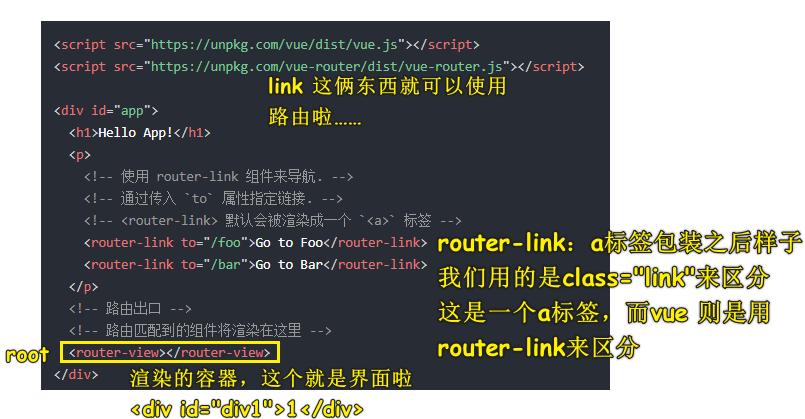

### <mark>2）JavaScript</mark>

#### <mark>1、如何创建一个界面（`div`）？vue-router 定义的路由表是怎样的？</mark>

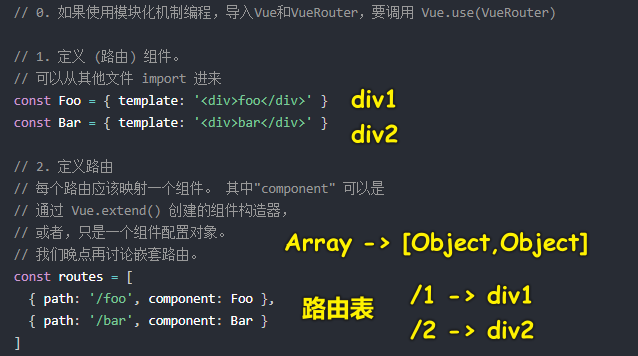

#### <mark>2、一个`router`对象</mark>

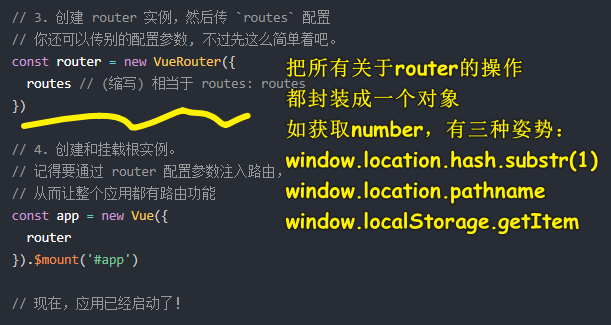

我们使用 vue-router，那么就不需要手动去写上边这三种路由模式了，直接通过`mode`选项设置就好了！

而这就是所谓的封装了，即我们不用去管`router`对象是如何拿到路径等这些细节，反正就是能拿到！

之后，就是把`router`这个封装对象传给根组件`#app`去处理了！

#### <mark>3、获取路径信息</mark>

通过`this.$route`来获取用户传的各种路径信息，如`his.$route.params.username`，具体细节，看文档就好了！

### <mark>3）动态路由</mark>

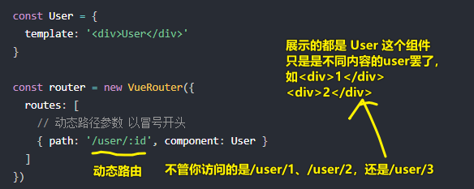

`path: '/user/:id'`的实现原理：

> 用正则表达式做的！把`:id`的值封装成一个对象，然后传给`User`组件

### <mark>4）嵌套路由</mark>

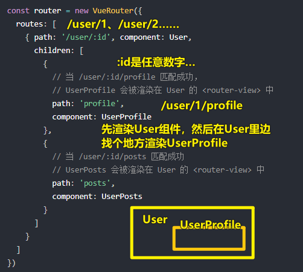

> 一个路由（`/user/1`）：一个容器，嵌套路由（`/user/1/profile`）：一个容器里边再放一个容器

### <mark>5）方方是如何看 vue-router 源码的？</mark>

#### <mark>1、先 CRM 大法，使用一下 vue-router</mark>

> 不用操作 DOM 的 JS，可以放到前边，即`head`标签里边

把 [起步代码](https://router.vuejs.org/zh/guide/#javascript) CRM 一下 -> 得到一些形象：

默认是`hash`模式

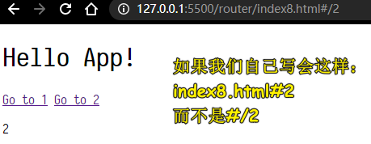

似乎就是把`to="/1"`的`/1`与`#`这个 hash 符给拼接了 -> `#/1`

也就是说，vue-router 并咩有 `window.location.hash.substr(1)`里边的`substr`这一步咯！

改成是`history`模式：

``` JS
const router = new VueRouter({
  mode: 'history',
  routes: [...]
})
```

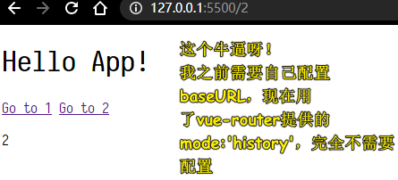

> `memory`模式就不测试了，一般我们前端是用不上的！

得到的知识点：

- `router-link`：切换路由，如`/1`、`/2`
- `router-view`：展示界面，就是个`container`，不过会被对应的组件`template`给替换掉！
- 两个界面组件
- `routes` -> 路由表（数组，元素是对象）
- `router` -> 对路由操作的封装（一个`VueRouter`实例对象） -> 开发者写上一些配置选项，如`mode:'history'`，那么`router`就会知道如何来处理路由了！ -> 依旧是`Options API`
- `app（new Vue()）` -> 把`router`作为一个`Option`传入，即`new Vue({router})`

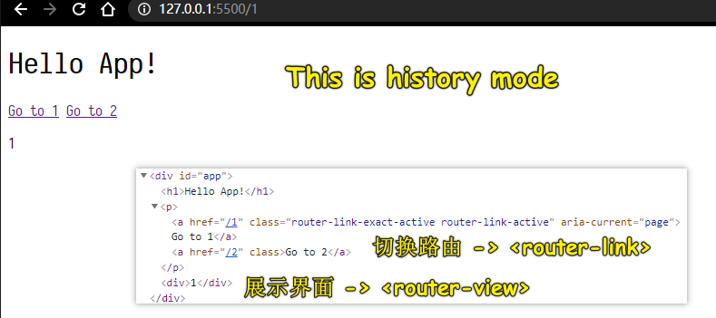

#### <mark>2、开始看源码？</mark>

> 文档：[vue-router/vue-router](https://github.com/vuejs/vue-router/blob/dev/dist/vue-router.js)

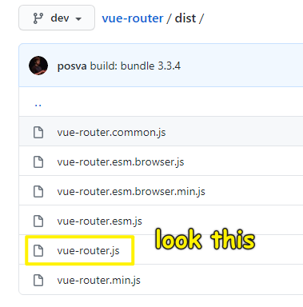

照理说，哪个行数最少就看哪个（`min.js`除外），但`vue-router.js`的是最通用的，所以就看这个了 -> 其实`esm.js`代码行数最少（ES6 模块规范）……

准备好文档材料之后，就开始看了（把代码下载下来，打开 VS Code，折叠起来看！）

从你**使用最常用的代码**开始看，如`router-link` & `router-view`：

**看`router-link`：**

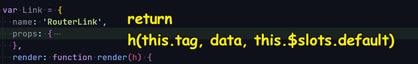

Link 就是个 Vue 组件，名字叫`RouterLink`，它需要接收这么几个属性：

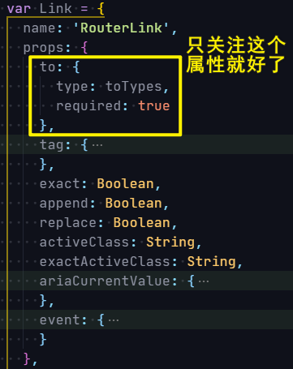

我们写了这个`router-link`标签，那么渲染出来的东西是什么呢？

``` js
h(this.tag, data, this.$slots.default)
```

我们要重点关注的是`data`（给元素标签添加属性）：

1. 绑定`onclick`事件，就跟我们之前原生写`history`模式路由一样，即遍历所有的`a`有`.link`标签，为它们绑定`click`事件，阻止它们的默认跳转发请求行为

绑定的`click`事件会调用`handler`方法：

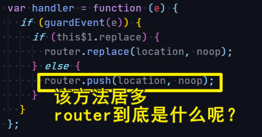

简单来说，我们点击`a`标签就会调用`push`方法！ -> 类似`pushState()`这样的…… -> 不同的`mode`有不同的`push`方法

> 看源码要有目的的去看……如我们要看`router`到底是个什么东东 -> `this.$router` -> `this.$options.router` -> 就是我们`new Vue({ router })`时所传的`router`这个封装对象

小结：

1. `router-link`被`click`了 -> 执行`router.push` or `router.replace` -> 拿`push`来说 -> `VueRouter.prototype.push` -> 执行`this.history.push` -> `history`有三种：`HTML5History.prototype.push`、`HashHistory.prototype.push`、`AbstractHistory.prototype.push`（也就是`memory`） -> 它们的共同点，都会调用`transitionTo`，其中首先会更新路由（`updateRoute(route)`），然后调用 callback（`onComplete(route)`）

---

<mark>Q：`h`的含义？</mark>

`h`是一个 Vue 提供的**你想怎么创建就怎么创建**的 API -> 让你用 JS 的形式来创建任意的标签，而不是用`template`的`v-if`来搞！

如：

``` html
<ah :level="1">Hello!</ah>
```

template 形式：

``` html
<h1 v-if="level === 1">
   <slot></slot>
</h1>
<h2 v-else-if="level === 2">
   <slot></slot>
</h2>
```

`h`形式：

``` js
function render (createElement) {
    return createElement(
      'h' + this.level,   // 标签名称
      this.$slots.default // 子节点数组
    )
  }
```

> `createElement`的重命名就是`h` -> `h`就是用于创建元素的函数！
> 
> `h` 代表的是 **hyperscript**：表示的是 "生成 HTML 结构的脚本"，缩写为 `h` 是因为它更容易去输入，可认为是 `createElement` 的缩写

➹：[渲染函数 & JSX — Vue.js](https://cn.vuejs.org/v2/guide/render-function.html)

➹：[在 Vue 的 render 方法中 h 是什么意思？](https://learnku.com/vuejs/t/23288/what-does-h-mean-in-the-vue-render-method)

---

**看`router-view`：**

> 怎么看思路同`router-link`一样，想看它是什么，然后有什么用

它是个`View`：

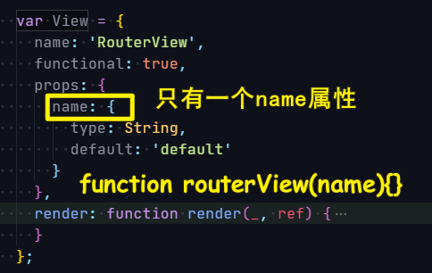

`render`的结果是：

``` js
h(component, data, children)
```

它没有事件监听，直接渲染一个组件，而这个组件怎么来的呢？ -> 显然是，当前路由对应哪个组件，那就渲染哪个组件 -> 从缓存里拿！

## ★总结

- URL 的 hash 保存了一个小片段数据，而这个数据的改变可以响应我们的视图…… -> 数据不同，内容不同
- 路由就是一个`path`，一个`path`对应着一个界面
- 先自己手撸一个简陋的路由 -> 实现`hash`模式、`history`模式、`memory`模式 -> 这些实现可以看人家的，一般都会有人这么做的 -> 了解有关路由的重要概念 -> CRM 大法使用`vue-router` -> 看源码（找常用的组件标签来看，如`route-link`、`router-view`）
- 看源码时不要一行行去看，先看常用的组件和标签 -> 从源码中，你可以看到是如何写一个原型方法的`VueRouter.prototype.match = function match() {}`，注册组件时是`Vue.component('RouterView', View);`、定义组件时的`name`属性是 `name: 'RouterView'`、在`template`使用组件时用的是`router-view` -> 看源码就像是在看这东西做了什么，是如何做的，也可以说是在看一篇优秀的作文是怎么写的 -> 对于我们而言，就是模仿它的写法，弄懂我们这样使用这个东西，为啥会有这样效果的原因，如为啥点击一个`a`标签，页面就切换了一个界面……

## ★Q&A

### <mark>1）`router`、`routes`、`route`的区别？</mark>

- router：路由器对象，包含一些操作路由的功能函数，来实现**编程式导航**。一般指的是在任何组件内访问路由。如：路由编程式导航的`router.push()` -> 声明式导航（`<router-link :to="...">`）
- routes：指创建 vue-router 路由实例的配置项。用来配置多个 route 路由对象
- route：指路由对象表示**当前激活**的路由的状态信息。如：`this.$route`指的是当前路由对象，`path/meta/query/params`

➹：[vue---router、routes、route 的区别](https://blog.csdn.net/muzidigbig/article/details/84563117)

➹：[编程式的导航 - Vue Router](https://router.vuejs.org/zh/guide/essentials/navigation.html)

### <mark>2）`hash`模式 和 `history`模式的区别？</mark>

> 小白回答：hash 模式 url 带`#`号，history 模式不带`#`号

这个回答其实和没有回答是一样，百度一下都知道了，官网文档也有，如果这样回答就能通过，那么那个面试官问这个问题又有什么意义呢？其实这个问题的意义是**考验你的开发经验，与实际场景的应用和与后端人员的配合**。

> 大牛解答：hash 模式 url 里面永远带着`#`号，我们在开发当中默认使用这个模式。那么什么时候要用 history 模式呢？如果用户考虑 **url 的规范**那么就需要使用 history 模式，因为 history 模式没有`#`号，是个正常的 url **适合推广宣传**。当然其功能也有区别，比如我们在开发 app 的时候有分享页面，那么这个分享出去的页面就是用 vue 或是 react 做的，咱们把这个页面分享到第三方的 app 里，**有的 app 里面 url 是不允许带有`#`号的**，所以要将`#`号去除那么就要使用 history 模式，但是使用 history 模式还有一个问题就是，在**访问二级页面的时候，做刷新操作，会出现 404 错误**，那么就需要和后端人配合让他配置一下 apache 或是 nginx 的 url 重定向，**重定向到你的首页路由**上就 ok 啦。

以上摘自：[VUE 路由的 hash 模式与 history 模式的区别？](http://www.lucklnk.com/godaddy/details/aid/154901038)

官方介绍：[HTML5 History 模式](https://router.vuejs.org/zh/guide/essentials/history-mode.html)

关于 Vue 的路由一直以来个人都觉得是一件很神奇的事情，一个单页面应用居然可以做到多路由跳转并按需加载页面代码。以往的做法都是通过锚点来定位对应的页面代码，而这种古老的操作方式最大的问题就是**首屏加载缓慢，一次性加载了所有页面代码**。

那么 Vue-router 又是怎么实现的呢？

首先，这个 router 有两种模式：hash 模式（默认）、history 模式（需配置`mode: 'history'`）

hash 与 history 的区别：

|          | hash                       | history          |
| -------- | -------------------------- | ---------------- |
| url 显示  | 有#，很 Low                 | 无#，好看        |
| 回车刷新 | 可以加载到 hash 值对应页面   | 一般就是 404 掉了  |
| 支持版本 | 支持低版本浏览器和 IE 浏览器 | HTML5 新推出的 API |

然后，我们来研究下两者的原理：

#### <mark>1、hash 模式</mark>

我们先来认识下这位朋友`#`，这个`#`就是** hash 符号**，中文名哈希符或锚点，当然这在我们前端领域姑且这么称呼。

然后**哈希符后面的值，我们称之为哈希值**。OK，接下来我们继续分析它的原理。路由的哈希模式其实是利用了`window`可以监听`onhashchange`事件，也就是说你的 url 中的哈希值（`#`后面的值）如果有变化，前端是可以做到监听并**做一些响应**（搞点事情），这么一来，即使前端并**没有发起 http 请求它也能够找到对应页面的代码块进行按需加载**。

后来人们给他起了一个霸气的名字叫前端路由，成为了单页应用标配。

大伙可以围观下网易云音乐的 url 模式：<https://music.163.com/#/friend>

#### <mark>2、history 模式</mark>

我们先介绍一下 H5 新推出的两个神器：`pushState`与`replaceState`

具体自行百度，简而言之，这两个神器的作用就是可以**将 url 替换并且不刷新页面**，好比挂羊头卖狗肉，http 并没有去请求服务器该路径下的资源，一旦刷新就会暴露这个实际不存在的“羊头”，显示 404。

那么如何去解决 history 模式下刷新报 404 的弊端呢，这就需要服务器端做点手脚，将不存在的路径请求重定向到入口文件（index.html），前后端联手，齐心协力做好“挂羊头卖狗肉”的完美特效。

至此，我们的前端路由在实现与展示效果上又更进了一步！

> 总之，`pushState`方法不会触发页面刷新，只是导致 history 对象发生变化，地址栏会有反应。

#### <mark>3、总结</mark>

**传统的路由**指的是：当用户访问一个 url 时，**对应的服务器会接收这个请求**，然后解析 url 中的路径，从而执行对应的处理逻辑。这样就完成了一次路由分发。

而**前端路由是不涉及服务器的**，是前端利用`hash`或者 HTML5 的`history` API 来实现的，一般用于不同内容的展示和切换

`history`模式下，`build`之后本地 `index.html` 打开是无效的。

`hash`模式下，`build`之后本地 `index.html` 打开正常！

➹：[【前端路由】Vue-router 中 hash 模式和 history 模式的区别](https://blog.csdn.net/fifteen718/article/details/82529433)

➹：[VUE 路由的 hash 模式与 history 模式的区别？-程序思维](http://www.lucklnk.com/godaddy/details/aid/154901038)

### <mark>3）`history`的`pushState`？</mark>

#### <mark>1、`pushState`和`replaceState`</mark>

HTML5 新接口，可以改变网址（存在跨域限制）而不刷新页面，这个强大的特性后来用到了单页面应用如：`vue-router`，`react-router-dom`中。

**注意：仅改变网址，网页不会真的跳转，也不会获取到新的内容，本质上网页还停留在原页面！**

```
window.history.pushState(data, title, targetURL);
@状态对象：传给目标路由的信息，可为空
@页面标题：目前所有浏览器都不支持，填空字符串即可
@可选 url：目标 url，不会检查 url 是否存在，且不能跨域。如不传该项，即给当前 url 添加 data
```

```
window.history.replaceState(data, title, targetURL);
@类似于 pushState, 但是会直接替换掉当前 url, 而不会在 history 中留下记录
```

#### <mark>2、`popstate`事件</mark>

`popstate`事件会在点击后退、前进按钮（或调用`history.back()`、`history.forward()`、`history.go()`方法）时触发。**前提是不能真的发生了页面跳转，而是在由`history.pushState()`或者`history.replaceState()`形成的历史节点中前进后退**

 **注意：用`history.pushState()`或者`history.replaceState()`不会触发`popstate`事件。**

```js
window.onpopstate = function(event) {
  console.log(event.state);
  console.log(window.history.state;);
};
```

**以上两种方式皆可获取之前在`pushState`和`replaceState`中传入的`data`**

➹：[history 的 pushState 和 replaceState - 简书](https://www.jianshu.com/p/808292c42cda)

➹：[HTML5 history 新特性 pushState、replaceState - 心存善念 - 博客园](https://www.cnblogs.com/xcsn/p/4517581.html)
