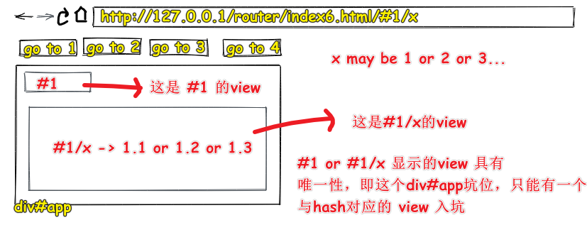
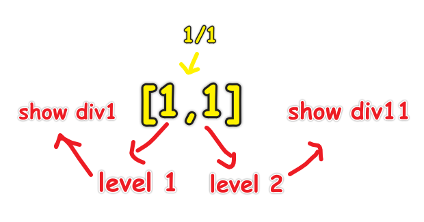
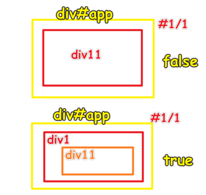
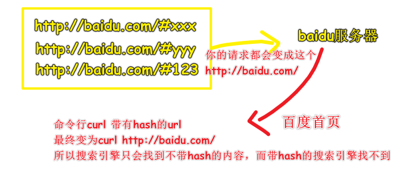
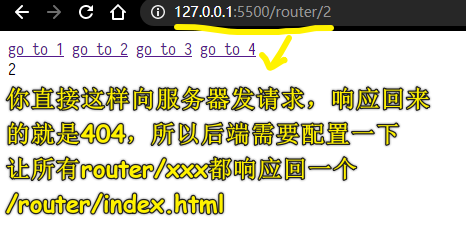
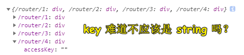

| ✍️ Tangxt | ⏳ 2020-07-25 | 🏷️ vue-router |

# 11-Vue Router-前端路由实现思路

## ★概述

路由器

1. 路由是什么

   搞清楚这几个概念：

   1. 路由
   2. 分发
   3. 路由表
   4. 默认路由
   5. 404 路由 / 保底路由
   6. 嵌套路由

2. hash 模式？history 模式？memory 模式？

   1. hash <https://codesandbox.io/s/x3nxq950ko>
   2. history <https://codesandbox.io/s/oqjvqm6w05>
   3. memory <https://codesandbox.io/s/936269l69o>

3. [Vue-Router 源码](https://github.com/vuejs/vue-router/blob/dev/dist/vue-router.js)

4. 正则表达式的使用

5. VueRouter 的一些 API（下节课讲）


## ★目录

1. 不会写路由的实现代码，只讲实现路由的思路
2. 路由是什么？ -> 给个回答，听完方方的讲解后，给出自己的最终答案
3. 了解 3 种模式的路由
4. vue-router 的源码？ -> 大概有 2600 多行？主要贡献者是尤雨溪，话说，这代码数量多吗？（**千行级别的可以去看，但万行级别的就算了！**） -> 方方会推荐一篇文章让你去看这个源码实现
5. 正则表达式 -> 很有用，需要刻意去学习它！
6. vue-router API -> 大概率自己去看文档！

## ★路由是什么？

> 理解「路由」，从生活概念入手

1）简单理解「路由」是什么？（上网路由）

我们日常生活中接触到的路由有很多，如「路由器」，不过，现在似乎都用光猫了！

> 猫和路由器的区别：[Easy-Key——科普：猫、路由器和交换机的区别和联系 - 知乎](https://zhuanlan.zhihu.com/p/31257745)

家里有一个或一个以上的人要上网就得用到路由器了！


> 分发：只要满足一对多的情况，就叫做分发，即分别发送到各个地方

路由器的主要作用是分发请求的，只要一个东西分发了请求，那么它就是路由，而这个东西就是「路由器」

示例：发送一个请求抖音的信号，路由器就会分发出去……

话说，如果面试官问你「什么是路由？」，你会怎么回答？

> 分发「请求」的东西或者分发「请求」的对象是「路由器」（器就是器物之意），而**分发「请求」就是「路由」**

然而，面试官问的是「前端路由」，而我们回答的是「上网路由」，所以我们要对我们了解到的「上网路由」细化成「前端路由」

2）「停止学习框架」

方方翻译了一篇文章——停止学习框架

评论中有一些很典型的思维：

> 不学框架？谁会要你？现在的前端不就是学框架的吗？为啥要停止学习框架？我得用 100% 的时间来学习框架才行……

方方是如何学习 router 的？

1. 不看 vue router 是如何实现的，先去看有关路由的基础知识，毕竟除了 vue 有 router 以外，还有 react、angular 都有，所以如果你不学基础知识的话，那么这就意味着你要学习三种路由 API -> 这就像是**先去了解「水果」，再去了解「桃子、李子、梨子」** 或者说就像是产品里的「**MVP**」概念一样，先尝试搞个原型，再去迭代优化……
2. 到维基百科查「路由」最最基础、最最原始的含义 -> 得到一些相关概念：「分发」+「路由器」（硬件，不用看）+「路由表」（存储路径的表，每个框架的 router 实现都会有路由表）+「路由形式」（如何传播信息）

> route 是「路线」， router 是路由器，即路由器对象……

3）前端路由

> codesanbox 创建一个项目时，可以通过点击「有颜色的 box 」来创建 -> 原生 JS（logo 黄色）、React（logo 蓝色）、Vue（logo 绿色）

需求：


代码实现：[效果](https://ppambler.github.io/vue-demo-2/router/index1.html)、[源码](https://github.com/ppambler/vue-demo-2/blob/master/router/index1.html)


> 代码写得不好看……

## ★优化代码

1）从上个例子里边学到的概念

* 路由
* `hash(#1)`

2）追加额外功能

1、默认路由

> 即页面一打开 `number` 默认就是 `1` -> `number = number || 1` -> `url` 后缀没有 `#xx` ， `div#app` 里边显示的就是默认路由过来的界面！


2、404 路由/保底路由

> 保证用户总是能够看到一个东西，不能出现意外的情况


3、嵌套路由

需求：


代码有点麻烦，下个 `★` 会讲到！

3）代码优化

1. 重复代码函数提取 -> 函数名 `x` （想不出名字，就用这个 `x` ，而 `x` 的意思是表示函数代码写完之后一定会修改的） -> 看到函数体的逻辑——根据你想去的地方，展示你的界面，即从一个源地址，到达目的地，而这就是**路由** -> 所以函数的名字是「 `route` 」

``` html
<a href="#1">go to 1</a>
<a href="#2">go to 2</a>
<a href="#3">go to 3</a>
<a href="#4">go to 4</a>
<div id="app"></div>
<div id="div1" style="display: none;">1</div>
<div id="div2" style="display: none;">2</div>
<div id="div3" style="display: none;">3</div>
<div id="div4" style="display: none;">4</div>
<div id="div404" style="display: none;">你要找的内容被狗吃了</div>
```

``` js
function route() {
  // 获取 hash
  let number = window.location.hash.substr(1)

  // 找到坑位
  let app = document.querySelector('#app')

  // 默认路由
  number = number || 1

  // 重置界面
  if (app.children.length > 0) {
    // 旧界面隐藏
    app.children[0].style.display = "none"
    // 旧界面回到原处
    document.body.appendChild(app.children[0])
  }

  // 获取界面
  let div = document.querySelector( `#div${number}` )
  if (!div) {
    div = document.querySelector( `#div404` )
  }
  div.style.display = "block"

  // 展示界面 or 新界面入坑
  app.appendChild(div)
}

route()

window.addEventListener('hashchange', () => {
  console.log('hash 变了')
  route()
})
```

---

接下来看看「路由表」

## ★路由表

1）为啥需要路由表？

`route` 函数里边，凭啥就只有 `1/2/3/4` 这 4 个 hash？难道就不能自定义吗？凭啥 `1` 就是 `div1` 呢？我 `one` 是 `div1` 不行么？

> 目前 `route` 函数里的规则是很奇怪的，即只能根据 `#div${number}` 这样的规则来获取相应的界面，如 `#1 -> div1` ，为啥就不能是 `#1 -> div666` 呢？凭啥只能是 `div1` 这个界面？我使用你这个 `route` 函数，凭啥必须要我在页面中写个叫 `#div1` 的 `div` ？

2）表驱动编程

> `div` -> 界面在内存中创建

``` js
const div1 = document.createElement('div')
div1.innerHTML = '1'
const div2 = document.createElement('div')
div2.innerHTML = '2'
const div3 = document.createElement('div')
div3.innerHTML = '3'
const div4 = document.createElement('div')
div4.innerHTML = '4'

const routeTable = {
  '1': div1,
  '2': div2,
  '3': div3,
  '4': div4
}

// route 里边：
// 获取界面 -> number -> string，即便 number 不是 string 也会自动转成 string
let div = routeTable[number]
```

其实，路由是很简单的，只要你把基础的东西理解透了，就不用管是 Vue 、React 、Angular，因为它们的实现思路肯定是一样的，只是提供的 API 不一样罢了！

3）嵌套路由

需求：



简单来说：

* `1/1` -> 去 `1.1` 这个子界面

在路由里边再分一个路由，而这个路由就是「子路由」或「嵌套路由」

> 路由即是路线

怎么做？

> `route` 参数是 `container` -> 本来叫 root，由于函数名 route 与 root 发音过于相似就 GG 掉了……

思路：



我看了一下 Vue Router 的嵌套路由概念：

> 文档：[嵌套路由 - Vue Router](https://router.vuejs.org/zh/guide/essentials/nested-routes.html)

发现根路由的视图，与子路由的视图一起的，就像是这样：

``` 
/user/foo/profile                     /user/foo/posts
+------------------+                  +-----------------+
| User             |                  | User            |
| +--------------+ |                  | +-------------+ |
| | Profile      | |  +------------>  | | Posts       | |
| |              | |                  | |             | |
| +--------------+ |                  | +-------------+ |
+------------------+                  +-----------------+
```

有点像是一个 `div` 嵌套着一个 `div` -> 我之前以为是这样的：



> 那个 `true` 标识的才是大家认为的嵌套路由的结果……而不是那个 `false`（我原先以为需求是类似`false`这样的）

方方是这样实现的：

``` js
const div11 = document.createElement('div')
div1.innerHTML = '1.1'
const div12 = document.createElement('div')
div2.innerHTML = '1.2'
const div13 = document.createElement('div')
div3.innerHTML = '1.3'

// 再定义一个子路由表
const route1Table = {
  "1/1": div11,
  "1/2": div12,
  "1/3": div13
}

// container -> root -> 如果是 #1/2，那么 1 就是 root or container
function route(container) {
  // ……
}
```

---

至此，关于路由几个重要的概念，基本上已经讲清楚了，接下来，就来看看 `hash` 、 `history` 、 `memory` 的区别

## ★History 模式

> 之前讲了路由是什么，以及路由相关的概念
> 
> 文档：[HTML5 History 模式 - Vue Router](https://router.vuejs.org/zh/guide/essentials/history-mode.html#%E5%90%8E%E7%AB%AF%E9%85%8D%E7%BD%AE%E4%BE%8B%E5%AD%90)

1）为啥不用 `hash` 模式？

我们知道`hash`在任何情况下都能做前端路由……

但这种姿势，对 SEO 不友好，也就是说「服务器收不到hash，内容是不会被搜索引擎收录的」



不过，这也不是绝对的，google做了处理，可以对hash做个SEO处理，当然，这得要你对服务器做一些配置

做法：

hashbang -> `#!xxx` -> 带`!`就行了…… -> 不推荐这样做……

> 我觉得不用`hash`模式是因为`#`太丑了！ -> 用`history`模式的话，可以直接`/1`这样获取界面……而不是`#1`这样

2）`history`模式是什么？

用户随意输入一个url，响应回来的是一个有用的页面（如首页），而不是404页面（404页面是无用的）！

所以`history`模式是：

> 后端将所有前端路由都渲染到同一页面！

缺点：IE8及以下支持 -> 可忽略不计！

3）做法

1. 路由表的`key`变成`/1`这样了
2. 阻止`a`链接的默认行为 -> 使用`for……of`迭代所有`a`DOM对象
3. 使用`history`API（`history.pushState(obj,'page 2','xx.html')`） -> 在不刷新页面的情况下，更改URL 
4. 监听`path`的改变，更改界面 -> 然而没有相应的事件监听方法 -> 定义一个函数，点击`a`就执行`callback`

`history`模式为啥要让所有的页面指向同一个页面呢？

> 因为用户喜欢刷新，不然`/66`这样存在的路径就是404页面了！

> 感觉之所以用`history`模式是因为要 `fuck` 掉 404 页面！而且也有SEO！因为请求服务器就是带`/1`的！还有就是用户不需要刷新了……

注意，后端是需要配置的：



---

Q：`for……of`？

在可迭代对象（包括 `Array`，`Map`，`Set`，`String`，`TypedArray`，`arguments` 对象等等）上创建一个迭代循环，调用自定义迭代钩子，并为每个不同属性的值执行语句

简单来说，索引有`0、1、2……`的即可迭代，而像`xxx`这样的对象属性是无法迭代的，而且也不会迭代继承的……即不会迭代原型链上的……

➹：[for...of - JavaScript - MDN](https://developer.mozilla.org/zh-CN/docs/Web/JavaScript/Reference/Statements/for...of)

Q：证明 JS 生效？

对 JS 文件 `console.log('fuck')`

Q：`http://www.baidu.com`？

表面上看是这样，其实发的请求是`http://www.baidu.com/`这样的！

Q：如何让对象的key值是变量？

姿势一：

``` js
const username = "name";
const obj = {
  [username]:"king123"
}
console.log(obj.name); //output-> king123
```

姿势二：

``` js
const username = "name";

const obj = {};
obj[username] = "king123";

console.log(obj.name); //output-> king123
console.log(obj[username]) // output -> king123
```

所以可有：

``` js
const baseUrl = '/router/'

let hashTable = {
  '1': div1,
  '2': div2,
  '3': div3,
  '4': div4
}

function createRouteTable(baseUrl, hashTable) {
  let obj = {}
  for (let key in hashTable) {
    obj[baseUrl + key] = hashTable[key]
  }
  return obj
}

const routeTable = createRouteTable(baseUrl, hashTable)
console.log(routeTable)
```

结果很奇怪：



> 似乎是那个 value 值的效果！ -> 即那个 `div` DOM 对象

➹：[How to use variable as an Object key in JavaScript - Reactgo](https://reactgo.com/javascript-variable-object-key/)

➹：[JSON.stringify()](https://developer.mozilla.org/zh-CN/docs/Web/JavaScript/Reference/Global_Objects/JSON/stringify)

---

## ★`hash`模式和`history`模式对比


