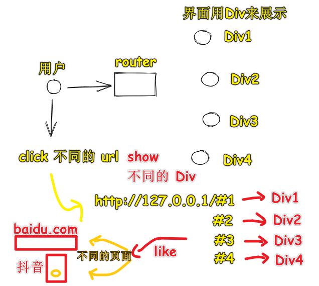
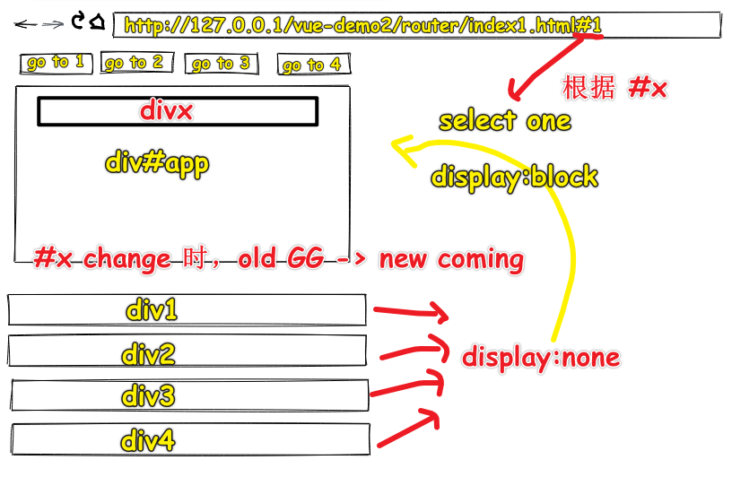
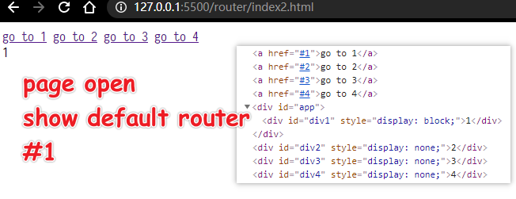
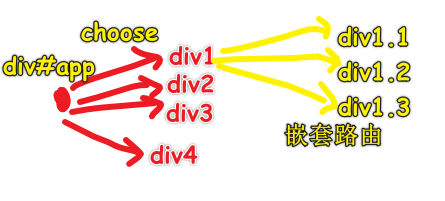

| ✍️ Tangxt | ⏳ 2020-07-25 | 🏷️ vue-router |

# 11-Vue Router-前端路由实现思路

## ★概述

路由器

1. 路由是什么

   搞清楚这几个概念：

   1. 路由
   2. 分发
   3. 路由表
   4. 默认路由
   5. 404 路由 / 保底路由
   6. 嵌套路由

2. hash 模式？history 模式？memory 模式？

   1. hash <https://codesandbox.io/s/x3nxq950ko>
   2. history <https://codesandbox.io/s/oqjvqm6w05>
   3. memory <https://codesandbox.io/s/936269l69o>

3. [Vue-Router 源码](https://github.com/vuejs/vue-router/blob/dev/dist/vue-router.js)

4. 正则表达式的使用

5. VueRouter 的一些 API（下节课讲）


## ★目录

1. 不会写路由的实现代码，只讲实现路由的思路
2. 路由是什么？ -> 给个回答，听完方方的讲解后，给出自己的最终答案
3. 了解 3 种模式的路由
4. vue-router 的源码？ -> 大概有 2600 多行？主要贡献者是尤雨溪，话说，这代码数量多吗？（**千行级别的可以去看，但万行级别的就算了！**） -> 方方会推荐一篇文章让你去看这个源码实现
5. 正则表达式 -> 很有用，需要刻意去学习它！
6. vur-router API -> 大概率自己去看文档！

## ★路由是什么？

> 理解「路由」，从生活概念入手

1）简单理解「路由」是什么？（上网路由）

我们日常生活中接触到的路由有很多，如「路由器」，不过，现在似乎都用光猫了！

> 猫和路由器的区别：[Easy-Key——科普：猫、路由器和交换机的区别和联系 - 知乎](https://zhuanlan.zhihu.com/p/31257745)

家里有一个或一个以上的人要上网就得用到路由器了！


> 分发：只要满足一对多的情况，就叫做分发，即分别发送到各个地方

路由器的主要作用是分发请求的，只要一个东西分发了请求，那么它就是路由，而这个东西就是「路由器」

示例：发送一个请求抖音的信号，路由器就会分发出去……

话说，如果面试官问你「什么是路由？」，你会怎么回答？

> 分发「请求」的东西或者分发「请求」的对象是「路由器」（器就是器物之意），而**分发「请求」就是「路由」**

然而，面试官问的是「前端路由」，而我们回答的是「上网路由」，所以我们要对我们了解到的「上网路由」细化成「前端路由」

2）「停止学习框架」

方方翻译了一篇文章——停止学习框架

评论中有一些很典型的思维：

> 不学框架？谁会要你？现在的前端不就是学框架的吗？为啥要停止学习框架？我得用 100% 的时间来学习框架才行……

方方是如何学习 router 的？

1. 不看 vue router 是如何实现的，先去看有关路由的基础知识，毕竟除了 vue 有 router 以外，还有 react、angular 都有，所以如果你不学基础知识的话，那么这就意味着你要学习三种路由 API
2. 到维基百科查「路由」最最基础、最最原始的含义 -> 得到一些相关概念：「分发」+「路由器」（硬件，不用看）+「路由表」（存储路径的表，每个框架的 router 实现都会有路由表）+「路由形式」（如何传播信息）

3）前端路由

> codesanbox -> 原生 JS（logo 黄色）、React（logo 蓝色）、Vue（logo 绿色）

需求：



代码实现：[效果](https://ppambler.github.io/vue-demo-2/router/index1.html)、[源码](https://github.com/ppambler/vue-demo-2/blob/master/router/index1.html)



> 代码写得不好看……

## ★优化代码

1）从上个例子里边学到的概念

* 路由
* `hash(#1)`
2）追加额外功能

1、默认路由

> 即页面一打开 `number` 默认就是 `1` -> `number = number || 1` -> `url` 后缀没有 `#xx` ， `div#app` 里边显示的就是默认路由过来的界面！



2、404 路由/保底路由

> 保证用户总是能够看到一个东西，不能出现意外的情况


3、嵌套路由

需求：



3）代码优化

1. 重复代码函数提取 -> 函数名 `x` （想不出名字，想用这个，而 `x` 表示之后一定会修改的） -> 看到函数体的逻辑——根据你想去的地方，展示你的界面，即从一个源地址，到达目的地，而这就是路由 -> 所以函数的名字是「 `route` 」

``` js
function route() {
  // 获取hash
  let number = window.location.hash.substr(1)

  // 找到坑位
  let app = document.querySelector('#app')

  // 默认路由
  number = number || 1

  // 重置界面
  if (app.children.length > 0) {
    // 旧界面隐藏
    app.children[0].style.display = "none"
    // 旧界面回到原处
    document.body.appendChild(app.children[0])
  }

  // 获取界面
  let div = document.querySelector( `#div${number}` )
  if (!div) {
    div = document.querySelector( `#div404` )
  }
  div.style.display = "block"

  // 展示界面 or 新界面入坑
  app.appendChild(div)
}

route()

window.addEventListener('hashchange', () => {
  console.log('hash 变了')
  route()
})
```

---

接下来看看「路由表」

## ★路由表


