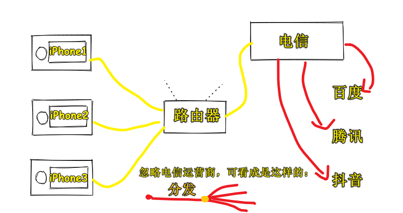

| ✍️ Tangxt | ⏳ 2020-07-25 | 🏷️ vue-router |

# 11-Vue Router-前端路由实现思路

## ★概述

路由器

1. 路由是什么

   搞清楚这几个概念：

   1. 路由
   2. 分发
   3. 路由表
   4. 默认路由
   5. 404 路由 / 保底路由
   6. 嵌套路由

2. hash 模式？history 模式？memory 模式？

   1. hash https://codesandbox.io/s/x3nxq950ko
   2. history https://codesandbox.io/s/oqjvqm6w05
   3. memory https://codesandbox.io/s/936269l69o

3. [Vue-Router 源码](https://github.com/vuejs/vue-router/blob/dev/dist/vue-router.js)

4. 正则表达式的使用

5. VueRouter 的一些 API（下节课讲）

## ★目录

1. 不会写路由的实现代码，只讲实现路由的思路
2. 路由是什么？ -> 给个回答，听完方方的讲解后，给出自己的最终答案
3. 了解3种模式的路由
4. vue-router的源码？ -> 大概有2600多行？主要贡献者是尤雨溪，话说，这代码数量多吗？（**千行级别的可以去看，但万行级别的就算了！**） -> 方方会推荐一篇文章让你去看这个源码实现
5. 正则表达式 -> 很有用，需要刻意去学习它！
6. vur-router API -> 大概率自己去看文档！

## ★路由是什么？

> 理解「路由」，从生活概念入手

我们日常生活中接触到的路由有很多，如「路由器」，不过，现在似乎都用光猫了！

> 猫和路由器的区别：[Easy-Key——科普：猫、路由器和交换机的区别和联系 - 知乎](https://zhuanlan.zhihu.com/p/31257745)

家里有一个或一个以上的人要上网就得用到路由器了！

> 分发：只要满足一对多的情况，就叫做分发，即分别发送到各个地方

路由器的主要作用是分发请求的，只要一个东西分发了请求，那么它就是路由，而这个东西就是「路由器」

示例：发送一个请求抖音的信号，路由器就会分发出去……

话说，如果面试官问你「什么是路由？」，你会怎么回答？

> 分发「请求」的东西或者分发「请求」的对象是「路由器」，而**分发「请求」就是「路由」**

然而，面试官问的是「前端路由」，而我们回答的是「上网路由」，所以我们要对我们了解到的「上网路由」细化成「前端路由」

