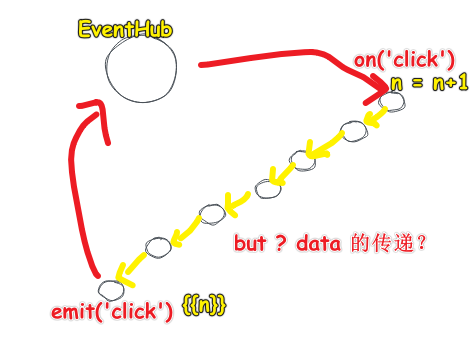
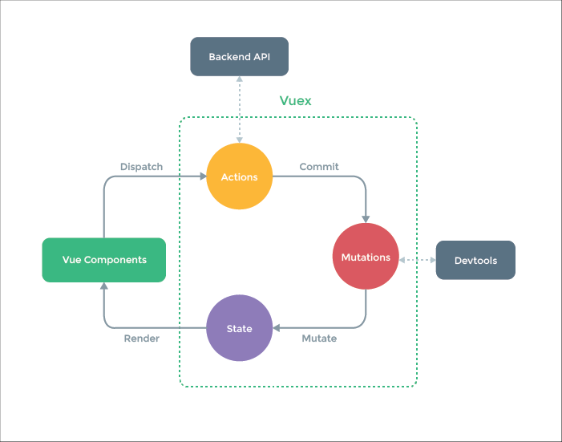

| ✍️ Tangxt | ⏳ 2020-07-30 | 🏷️ vuex |

# 12-状态管理与 Vuex

## ★概述

1. 状态是什么
2. 状态管理是什么
3. Vuex 用法

> 讲状态管理的原理以及最常用的状态管理 vuex 的使用！

## ★状态管理是啥？

> 了解「状态管理」需要拆开来看 -> 「什么是状态」+「什么是状态管理」

1）什么是状态？


举例来说：


2）如何对状态进行管理？

我们写一个组件是这样的：


我们写一个父子组件是这样的：


**父子之间是如何通信的？**


然而这种通信方式「**耦合**」了（设计的东西有依赖）！  -> 为什么这么说呢？ -> 如果我们不用 `g-button` ，用的是 `el-button` ，那么你能保证 `el-button` 里边是否有元素被绑定了 `click` 事件呢？如果没有，那么我们写的 `@hi` 就是个笑话！ -> 对于 React 来说，会经常性地传个 `onClick` 参数！

那么我们该如何解耦呢？（**解决耦合的问题就叫做解耦**）

**爷父孙通信？**


> 我们 `@click` 实际上就是在 `this.$on('click',callback)`
为啥需要 `eventBus` ？

因为它是个 `new Vue()` ， `$on` 和 `$emit` 这两个方法，有了它之后，组件之间消息的传递就不用那么手递手重复这样麻烦了……


话又说回来，我们的状态 `n` 只在 `grandfather` 上，可假如其兄弟上也要一个 `n` 呢？

> 那就把 `n` 状态的存放位置抬高一级呗！ -> 让 `n` 永远站在食物链的顶端


单向数据流就是自上而下流动数据，对于 Vue、React 来说，顶级 `n` 变了，次级依赖的 `n` 也会随着发生响应式的变更，而其它框架可能需要手动做一些处理！

然而，单向数据流也是有缺点的

> 我们知道事件沟通 `emit('click')` 只需要一次，事件监听 `on('click')` 也只需要一次，但是数据的单向数据流传递处处都需要写代码，即有几个组件用到 `n` ，那么你就得传几次 `n`


还有假如，如只有一处地方用到 `n` 呢？


清空自己之前的认识

我们知道事件传递可以通过 `eventHub` 来搞，这样一条线上即便存在几百个节点，沟通起来也挺方便的！



那么是否有 `dataHub` 呢？

目前我们的事件传递变迁是这样的：


同理，我们对 `n` 也来一次 `Hub` 的操作：


话说， `X` 代表什么呢？ -> 就是 `Store` 啦！

所有的数据管理都会有个 `Store` ，而 Store 就是存储东西的地方！一般存储的地方叫做柜台，用来收钱，而这是商店，所以 Store 又有商店的意思！

所以这就是为啥 vuex 有个最重要的概念——你必须有一个全局的 Store

就跟 EventBus 一样，为啥一定要有一个全局的 EventBus 呢？ -> 因为用它来**专门负责事件管理**呀！

而 Store 则是**专门负责数据管理**！

一旦有了 Store，你就不用操心数据的读和写的问题了！ -> 你直接把数据放到 Store 里边去，要读时，就调用 Store 的读 API，要写时，就调用 Store 的写 API

目前，关于 Store 的这两个读写 API，我们并不知道叫啥名字……

话又说回来，为啥方方要翻译那篇「停止学习框架」呢？

因为很有可能这些复杂的问题，你只需要在大脑里边把它们的结构画清楚，然后再画几个箭头就搞清楚了！

这节课要告诉你的是：

* 所有框架的核心都是一些很基本的名字，比如说「事件传递」、「数据传递」 -> 如果你的组件是树形结构的，不管是 Vue 、React 还是 Angular，都是一样的方法套路，即总会有个中介代理（叫啥无所谓），在那个特定的位置杵着……

## ★自己先看 vuex 文档使用一遍



文档：[Vuex 是什么？ - Vuex](https://vuex.vuejs.org/zh/)

1）简单使用

1、安装 vuex

2、创建一个 store

``` js
Vue.use(Vuex)

const store = new Vuex.Store({
  state: {
    count: 0
  },
  mutations: {
    increment(state) {
      state.count++
    }
  }
})
```

读状态对象：

``` js
store.state.count
```

更改状态对象：

``` js
store.commit('increment')
```

3、在子组件中使用

在 root 组件（ `div#app` ）中注入 `store` ，这样 root 组件旗下所有的子组件、孙子组件……都能通过 `this.$store` 来访问了

``` js
new Vue({
  el: '#app',
  // store: store
  store
})
```

子组件中使用：

``` js
Vue.component('count', {
  name: 'Count',
  // state
  data() {
    return {

    }
  },
  computed: {
    count() {
      return this.$store.state.count
    }
  },
  // view
  template: `
    <div>{{ count }}<button @click="increment">+1</button></div>
  `,
  // actions
  methods: {
    increment() {
      console.log(this)
      this.$store.commit('increment')
      console.log(this.$store.state.count)
    }
  }
})
```

效果：


2）如果子组件需要获取多个状态，那么我们岂不是都需要把这些状态都声明为计算属性？

> 假如我要获取 10 个状态，那么就得搞 10 个计算属性 -> 重复、冗余

使用 `mapState` 辅助函数帮助我们生成计算属性

``` js
const mapState = Vuex.mapState

// ……
{
  computed: mapState(['count'])
}
// ………
```

对了，如果该子组件还有局部的计算属性呢？（ `mapState` 函数返回的是一个对象）

也就说，我们要混合一下 -> 通常，我们需要使用一个工具函数将多个对象合并为一个，以使我们可以将最终对象传给 `computed` 属性。但是自从有了对象展开运算符，我们可以极大地简化写法：

``` js
{
  computed: {
    test() {
      return 'test'
    },
    // 使用对象展开运算符将此对象混入到外部对象中
    ...mapState(['count'])
  }
}
```

可见，组件仍然保有局部状态 -> 如果有些状态严格属于单个组件，最好还是作为组件的局部状态。你应该根据你的应用开发需要进行**权衡和确定**

3）Getter（ `store` 的计算属性）

为什么需要？

> 需要从 store 中的 state 中派生出一些状态 -> 也就是说对所拿到的状态进行二次加工 ，加工出来的状态就是派生或者说是衍生出来的状态 -> 如果只有一个组件需要这些衍生状态倒还好说，但是假如有多个组件需要这样搞呢？ -> 那岂不是都需要 很复杂的 `computed` 很多次？

如对列表过滤并计数：

``` js
{
  computed: {
    doneTodosCount() {
      return this.$store.state.todos.filter(todo => todo.done).length
    }
  }
}
```

做法：

1. `getters` 与 `state` 同级， `getters` 就像 `computed` 一样， `getter` 的返回值会根据它的**依赖被缓存**起来，且只有当它的**依赖值发生了改变**才会被**重新计算**，不同之处在于 `getters` 属性需要一个 `state` 形参（可选一个 `getters` 形参）

组件访问：

1. Getter 会暴露为 `store.getters` 对象 -> `this.$store.getters.doneTodos`
同 `state` 一样，也会有对称的 `mapGetters` 辅助函数

> `mapGetters` 辅助函数仅仅是将 `store` 中的 `getter` 映射到局部计算属性

4）Mutation（变化）

更改 Vuex 的 store 中的状态的**唯一方法**是提交 mutation -> 提交 mutation 的意思是，store 旗下有个 `mutations` 属性，其作用就跟 `methods` 一样……


除了默认传一个 `state` 参数以外，还可以指定额外的参数，而这额外的参数就是 mutation 的 载荷（payload）


对了，提交 mutation 的另一种方式是直接使用包含 type 属性的对象，如：

``` js
store.commit({
  type: 'increment',
  amount: 10
})
```

注意，如果你用这种姿势，那么**整个对象都作为载荷**传给 mutation 函数：

``` js
{
  mutations: {
    increment(state, payload) {
      state.count += payload.amount
    }
  }
}
```

Mutation 需遵守 Vue 的响应规则：

> Vuex 的 store 中的状态是响应式的，那么当我们变更状态时，监视状态的 Vue 组件也会自动更新

1. 最好提前在你的 store 中初始化好所有所需属性
2. 当需要在对象上添加新属性时，你应该：

   1. 使用 `Vue.set(obj, 'newProp', 123)` or
   2. 以新对象替换老对象。例如，利用对象展开运算符我们可以这样写： `state.obj = { ...state.obj, newProp: 123 }`
使用常量替代 Mutation 事件类型：

为什么这样做？

> 使用常量替代 mutation 事件类型在各**种 Flux 实现中是很常见的模式**。这样可以**使 linter 之类的工具发挥作用**，同时把这些常量放在单独的文件中可以让你的**代码合作者对整个 app 包含的 mutation 一目了然**

做法：


用不用常量取决于你——在**需要多人协作的大型项目中，这会很有帮助**。但如果你不喜欢，你完全可以不这样做

Mutation 必须是同步函数：

为啥要这样？


千万不要这样做：


> 当 mutation 触发的时候，回调函数还没有被调用，devtools 不知道什么时候回调函数实际上被调用——实质上**任何在回调函数中进行的状态的改变都是不可追踪的**

5）Action

Action 类似于 mutation，不同在于：

* Action 提交的是 mutation，而不是直接变更状态。
* Action 可以包含任意异步操作。

使用：


参数解构 -> 简化代码（特别是我们需要调用 commit 很多次的时候）：

``` js
{
  actions: {
    increment({
      commit
    }) {
      commit('increment')
    }
  }
}
```

执行一个 Action：

``` js
store.dispatch('increment')
```

Actions 支持同样的载荷方式和对象方式进行分发：

``` js
// 以载荷形式分发
store.dispatch('incrementAsync', {
  amount: 10
})

// 以对象形式分发
store.dispatch({
  type: 'incrementAsync',
  amount: 10
})
```

> API 是对称的！
> 
> `promise`、`async、await`都会使用到！

6）Module

由于**使用单一状态树**，应用的所有状态会集中到一个比较大的对象。当应用变得非常复杂时，**store 对象就有可能变得相当臃肿**。

为了解决以上问题，Vuex 允许我们**将 store 分割成模块（module）**。每个模块拥有自己的 state、mutation、action、getter、甚至是嵌套子模块

7）项目结构

Vuex 并不限制你的代码结构。但是，它规定了一些需要遵守的规则：

1. 应用层级的状态应该集中到单个 store 对象中。
2. 提交 mutation 是更改状态的唯一方法，并且这个过程是同步的。
3. 异步逻辑都应该封装到 action 里面。

只要你遵守以上规则，如何组织代码随你便。如果你的 store 文件太大，只需将 action、mutation 和 getter 分割到单独的文件。

对于大型应用，我们会希望把 Vuex 相关代码分割到模块中。下面是项目结构示例：

```
├── index.html
├── main.js
├── api
│   └── ... # 抽取出 API 请求
├── components
│   ├── App.vue
│   └── ...
└── store
    ├── index.js          # 我们组装模块并导出 store 的地方
    ├── actions.js        # 根级别的 action
    ├── mutations.js      # 根级别的 mutation
    └── modules
        ├── cart.js       # 购物车模块
        └── products.js   # 产品模块
```

## ★Vuex 的 store

1）其它 store 的方式？

搞 Store 的话，用 LocalStorage 也是可以的，只是相较于 Vuex 来说，Vuex 有更丰富的 API 供我们使用！

Vuex 和 SessionStorage 存储的数据是不长久的……

2）如何利用 Vue 的自动更新？

> 一个 A 组件更新了 Store 的`n`，那么另外一个 B 组件同样用到了`n`，那么该 B 组件如何自动更新这个 `n` 呢？


1. `Vue.use(Vuex)`+把`store`像`router`那样注入到根组件里边 -> 根组件旗下的每个组件实例都能访问到这个`store` -> 每个`store`都有五大核心属性：`state`、`getters`、`mutations`、`actions`、`modules`
2. 在组件中使用，通过`computed`自动更新

3）EventBus 还有用吗？

直接从系统中干掉！

4）信息点

1. 采用集中式存储管理应用的所有组件的状态 -> 采用 Store 来管理
2. mutations -> 这个概念方方之前没有提到，所有这是 vuex 自己搞出来的一个概念 -> 改动 -> 把所有的改动写在这个`mutations`里边，为啥要这样干呢？ -> 因为方便管理呀！
3. 读操作（**get**）：`store.state.n` -> 写操作（**set**）：`store.commit('plus')`（需要在`mutations`里边定义一个操作`plus`） -> 这是没有结合 Vue 的使用，这也是 Vuex 提供的两个 API -> **方方学习框架基本上就是把已有的概念对应上去学，如`getter 和 setter`对应`store.state.n 和 store.commit('plus')`**
4. 文档写得很细，很好学，如果写得很粗，如直接叫你看代码这样的程度，就很难写学了！
5. 方方很久没用过 Vuex 了！
6. 在创建 `store` 实例前，必须先 call `Vue.use(Vuex)`

5）Vue 组件 结合 Vuex 使用

为什么会用`computed`属性？

因为这数据实际上不在组件身上，而这是算出来的！ -> 来自 `store`

测试代码的构思：


代码逻辑：


问题来了，如果节点变多，即其它节点也用到了 `x`：


我们一开始要解决的问题就是重复的操作！

而现在使用 vuex 又重复了……

所以你 vuex 是否给我们开发者提供了便利呢？

> Vuex 提供了 `mapState` API -> 该 API 虽然表面上也是重复的，但减少了我们的代码量 -> 少敲几下键盘！

## ★mapState 和 mapMutations

