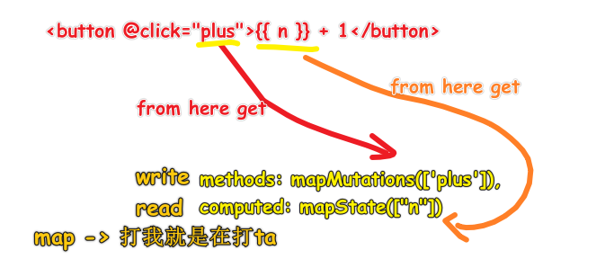

| ✍️ Tangxt | ⏳ 2020-07-30 | 🏷️ vuex |

# 12-状态管理与 Vuex

## ★概述

1. 状态是什么
2. 状态管理是什么
3. Vuex 用法

> 讲状态管理的原理以及最常用的状态管理 vuex 的使用！

## ★状态管理是啥？

> 了解「状态管理」需要拆开来看 -> 「什么是状态」+「什么是状态管理」

### <mark>1）什么是状态？</mark>


举例来说：


### <mark>2）如何对状态进行管理？</mark>

我们写一个组件是这样的：


我们写一个父子组件是这样的：


**父子之间是如何通信的？**


然而这种通信方式「**耦合**」了（设计的东西有依赖）！  -> 为什么这么说呢？ -> 如果我们不用 `g-button` ，用的是 `el-button` ，那么你能保证 `el-button` 里边是否有元素被绑定了 `click` 事件呢？如果没有，那么我们写的 `@hi` 就是个笑话！ -> 对于 React 来说，会经常性地传个 `onClick` 参数！

那么我们该如何解耦呢？（**解决耦合的问题就叫做解耦**）

**爷父孙通信？**


> 我们 `@click` 实际上就是在 `this.$on('click',callback)`
为啥需要 `eventBus` ？

因为它是个 `new Vue()` ， `$on` 和 `$emit` 这两个方法，有了它之后，组件之间消息的传递就不用那么手递手重复这样麻烦了……


话又说回来，我们的状态 `n` 只在 `grandfather` 上，可假如其兄弟上也要一个 `n` 呢？

> 那就把 `n` 状态的存放位置抬高一级呗！ -> 让 `n` 永远站在食物链的顶端


单向数据流就是自上而下流动数据，对于 Vue、React 来说，顶级 `n` 变了，次级依赖的 `n` 也会随着发生响应式的变更，而其它框架可能需要手动做一些处理！

然而，单向数据流也是有缺点的

> 我们知道事件沟通 `emit('click')` 只需要一次，事件监听 `on('click')` 也只需要一次，但是数据的单向数据流传递处处都需要写代码，即有几个组件用到 `n` ，那么你就得传几次 `n`


还有假如，如只有一处地方用到 `n` 呢？


清空自己之前的认识

我们知道事件传递可以通过 `eventHub` 来搞，这样一条线上即便存在几百个节点，沟通起来也挺方便的！


那么是否有 `dataHub` 呢？

目前我们的事件传递变迁是这样的：


同理，我们对 `n` 也来一次 `Hub` 的操作：


话说， `X` 代表什么呢？ -> 就是 `Store` 啦！

所有的数据管理都会有个 `Store` ，而 Store 就是存储东西的地方！一般存储的地方叫做柜台，用来收钱，而这是商店，所以 Store 又有商店的意思！

所以这就是为啥 vuex 有个最重要的概念——你必须有一个全局的 Store

就跟 EventBus 一样，为啥一定要有一个全局的 EventBus 呢？ -> 因为用它来**专门负责事件管理**呀！

而 Store 则是**专门负责数据管理**！

一旦有了 Store，你就不用操心数据的读和写的问题了！ -> 你直接把数据放到 Store 里边去，要读时，就调用 Store 的读 API，要写时，就调用 Store 的写 API

目前，关于 Store 的这两个读写 API，我们并不知道叫啥名字……

话又说回来，为啥方方要翻译那篇「停止学习框架」呢？

因为很有可能这些复杂的问题，你只需要在大脑里边把它们的结构画清楚，然后再画几个箭头就搞清楚了！

这节课要告诉你的是：

* 所有框架的核心都是一些很基本的名字，比如说「事件传递」、「数据传递」 -> 如果你的组件是树形结构的，不管是 Vue 、React 还是 Angular，都是一样的方法套路，即总会有个中介代理（叫啥无所谓），在那个特定的位置杵着……

## ★自己先看 vuex 文档使用一遍


文档：[Vuex 是什么？ - Vuex](https://vuex.vuejs.org/zh/)

### <mark>1）简单使用</mark>

#### <mark>1、安装 vuex</mark>

#### <mark>2、创建一个 store</mark>

``` js
Vue.use(Vuex)

const store = new Vuex.Store({
  state: {
    count: 0
  },
  mutations: {
    increment(state) {
      state.count++
    }
  }
})
```

读状态对象：

``` js
store.state.count
```

更改状态对象：

``` js
store.commit('increment')
```

#### <mark>3、在子组件中使用</mark>

在 root 组件（ `div#app` ）中注入 `store` ，这样 root 组件旗下所有的子组件、孙子组件……都能通过 `this.$store` 来访问了

``` js
new Vue({
  el: '#app',
  // store: store
  store
})
```

子组件中使用：

``` js
Vue.component('count', {
  name: 'Count',
  // state
  data() {
    return {

    }
  },
  computed: {
    count() {
      return this.$store.state.count
    }
  },
  // view
  template: `
    <div>{{ count }}<button @click="increment">+1</button></div>
  `,
  // actions
  methods: {
    increment() {
      console.log(this)
      this.$store.commit('increment')
      console.log(this.$store.state.count)
    }
  }
})
```

效果：


### <mark>2）如果子组件需要获取多个状态，那么我们岂不是都需要把这些状态都声明为计算属性？</mark>

> 假如我要获取 10 个状态，那么就得搞 10 个计算属性 -> 重复、冗余

使用 `mapState` 辅助函数帮助我们生成计算属性

``` js
const mapState = Vuex.mapState

// ……
{
  computed: mapState(['count'])
}
// ………
```

对了，如果该子组件还有局部的计算属性呢？（ `mapState` 函数返回的是一个对象）

也就说，我们要混合一下 -> 通常，我们需要使用一个工具函数将多个对象合并为一个，以使我们可以将最终对象传给 `computed` 属性。但是自从有了对象展开运算符，我们可以极大地简化写法：

``` js
{
  computed: {
    test() {
      return 'test'
    },
    // 使用对象展开运算符将此对象混入到外部对象中
    ...mapState(['count'])
  }
}
```

可见，组件仍然保有局部状态 -> 如果有些状态严格属于单个组件，最好还是作为组件的局部状态。你应该根据你的应用开发需要进行**权衡和确定**

### <mark>3）Getter（ `store` 的计算属性）</mark>

为什么需要？

> 需要从 store 中的 state 中派生出一些状态 -> 也就是说对所拿到的状态进行二次加工 ，加工出来的状态就是派生或者说是衍生出来的状态 -> 如果只有一个组件需要这些衍生状态倒还好说，但是假如有多个组件需要这样搞呢？ -> 那岂不是都需要 很复杂的 `computed` 很多次？

如对列表过滤并计数：

``` js
{
  computed: {
    doneTodosCount() {
      return this.$store.state.todos.filter(todo => todo.done).length
    }
  }
}
```

做法：

1. `getters` 与 `state` 同级， `getters` 就像 `computed` 一样， `getter` 的返回值会根据它的**依赖被缓存**起来，且只有当它的**依赖值发生了改变**才会被**重新计算**，不同之处在于 `getters` 属性需要一个 `state` 形参（可选一个 `getters` 形参）

组件访问：

1. Getter 会暴露为 `store.getters` 对象 -> `this.$store.getters.doneTodos`
同 `state` 一样，也会有对称的 `mapGetters` 辅助函数

> `mapGetters` 辅助函数仅仅是将 `store` 中的 `getter` 映射到局部计算属性

### <mark>4）Mutation（变化）</mark>

更改 Vuex 的 store 中的状态的**唯一方法**是提交 mutation -> 提交 mutation 的意思是，store 旗下有个 `mutations` 属性，其作用就跟 `methods` 一样……


除了默认传一个 `state` 参数以外，还可以指定额外的参数，而这额外的参数就是 mutation 的 载荷（payload）


对了，提交 mutation 的另一种方式是直接使用包含 type 属性的对象，如：

``` js
store.commit({
  type: 'increment',
  amount: 10
})
```

注意，如果你用这种姿势，那么**整个对象都作为载荷**传给 mutation 函数：

``` js
{
  mutations: {
    increment(state, payload) {
      state.count += payload.amount
    }
  }
}
```

Mutation 需遵守 Vue 的响应规则：

> Vuex 的 store 中的状态是响应式的，那么当我们变更状态时，监视状态的 Vue 组件也会自动更新

1. 最好提前在你的 store 中初始化好所有所需属性
2. 当需要在对象上添加新属性时，你应该：

   1. 使用 `Vue.set(obj, 'newProp', 123)` or
   2. 以新对象替换老对象。例如，利用对象展开运算符我们可以这样写： `state.obj = { ...state.obj, newProp: 123 }`
使用常量替代 Mutation 事件类型：

为什么这样做？

> 使用常量替代 mutation 事件类型在各**种 Flux 实现中是很常见的模式**。这样可以**使 linter 之类的工具发挥作用**，同时把这些常量放在单独的文件中可以让你的**代码合作者对整个 app 包含的 mutation 一目了然**

做法：


用不用常量取决于你——在**需要多人协作的大型项目中，这会很有帮助**。但如果你不喜欢，你完全可以不这样做

Mutation 必须是同步函数：

为啥要这样？


千万不要这样做：


> 当 mutation 触发的时候，回调函数还没有被调用，devtools 不知道什么时候回调函数实际上被调用——实质上**任何在回调函数中进行的状态的改变都是不可追踪的**

### <mark>5）Action</mark>

Action 类似于 mutation，不同在于：

* Action 提交的是 mutation，而不是直接变更状态。
* Action 可以包含任意异步操作。

使用：


参数解构 -> 简化代码（特别是我们需要调用 commit 很多次的时候）：

``` js
{
  actions: {
    increment({
      commit
    }) {
      commit('increment')
    }
  }
}
```

执行一个 Action：

``` js
store.dispatch('increment')
```

Actions 支持同样的载荷方式和对象方式进行分发：

``` js
// 以载荷形式分发
store.dispatch('incrementAsync', {
  amount: 10
})

// 以对象形式分发
store.dispatch({
  type: 'incrementAsync',
  amount: 10
})
```

> API 是对称的！
>  
> `promise` 、 `async、await` 都会使用到！

### <mark>6）Module</mark>

由于**使用单一状态树**，应用的所有状态会集中到一个比较大的对象。当应用变得非常复杂时，**store 对象就有可能变得相当臃肿**。

为了解决以上问题，Vuex 允许我们**将 store 分割成模块（module）**。每个模块拥有自己的 state、mutation、action、getter、甚至是嵌套子模块

### <mark>7）项目结构</mark>

Vuex 并不限制你的代码结构。但是，它规定了一些需要遵守的规则：

1. 应用层级的状态应该集中到单个 store 对象中。
2. 提交 mutation 是更改状态的唯一方法，并且这个过程是同步的。
3. 异步逻辑都应该封装到 action 里面。

只要你遵守以上规则，如何组织代码随你便。如果你的 store 文件太大，只需将 action、mutation 和 getter 分割到单独的文件。

对于大型应用，我们会希望把 Vuex 相关代码分割到模块中。下面是项目结构示例：

``` 
├── index.html
├── main.js
├── api
│   └── ... # 抽取出 API 请求
├── components
│   ├── App.vue
│   └── ...
└── store
    ├── index.js          # 我们组装模块并导出 store 的地方
    ├── actions.js        # 根级别的 action
    ├── mutations.js      # 根级别的 mutation
    └── modules
        ├── cart.js       # 购物车模块
        └── products.js   # 产品模块
```

## ★Vuex 的 store

### <mark>1）其它 store 的方式？</mark>

搞 Store 的话，用 LocalStorage 也是可以的，只是相较于 Vuex 来说，Vuex 有更丰富的 API 供我们使用！

Vuex 和 SessionStorage 存储的数据是不长久的……

### <mark>2）如何利用 Vue 的自动更新？</mark>

> 一个 A 组件更新了 Store 的 `n` ，那么另外一个 B 组件同样用到了 `n` ，那么该 B 组件如何自动更新这个 `n` 呢？


1. `Vue.use(Vuex)` +把 `store` 像 `router` 那样注入到根组件里边 -> 根组件旗下的每个组件实例都能访问到这个 `store` -> 每个 `store` 都有五大核心属性： `state` 、 `getters` 、 `mutations` 、 `actions` 、 `modules`
2. 在组件中使用，通过 `computed` 自动更新

### <mark>3）EventBus 还有用吗？</mark>

直接从系统中干掉！

### <mark>4）信息点</mark>

1. 采用集中式存储管理应用的所有组件的状态 -> 采用 Store 来管理
2. mutations -> 这个概念方方之前没有提到，所有这是 vuex 自己搞出来的一个概念 -> 改动 -> 把所有的改动写在这个 `mutations` 里边，为啥要这样干呢？ -> 因为方便管理呀！
3. 读操作（**get**）： `store.state.n` -> 写操作（**set**）： `store.commit('plus')` （需要在 `mutations` 里边定义一个操作 `plus` ） -> 这是没有结合 Vue 的使用，这也是 Vuex 提供的两个 API -> **方方学习框架基本上就是把已有的概念对应上去学，如 `getter 和 setter` 对应 `store.state.n 和 store.commit('plus')` **
4. 文档写得很细，很好学，如果写得很粗，如直接叫你看代码这样的程度，就很难写学了！
5. 方方很久没用过 Vuex 了！
6. 在创建 `store` 实例前，必须先 call `Vue.use(Vuex)`

### <mark>5）Vue 组件 结合 Vuex 使用</mark>

为什么会用 `computed` 属性？

因为这数据实际上不在组件身上，而这是算出来的！ -> 来自 `store`
测试代码的构思：


代码逻辑：


问题来了，如果节点变多，即其它节点也用到了 `x` ：


我们一开始要解决的问题就是重复的操作！

而现在使用 vuex 又重复了……

所以你 vuex 是否给我们开发者提供了便利呢？

> Vuex 提供了 `mapState` API -> 该 API 虽然表面上也是重复的，但减少了我们的代码量 -> 少敲几下键盘！

## ★mapState 和 mapMutations

### <mark>1）信息点</mark>

1. 不需要每个组件都引用 `store` ，只要在根组件里引入就好了！

### <mark>2）好看不好用</mark>

好理解姿势：

``` js
{
  computed: {
    n() {
      return this.$store.state.n
    }
  }
}
```

让代码简练点，但不好理解，不如上一种：

``` js
{
  computed: mapState({
    // 箭头函数可使代码更简练
    n: state => state.n
  })
}
```

真正的简化：

> 直接从 `state` 里边取出 `n` 值

``` js
{
  computed: mapState([
    // 映射 this.n 为 store.state.n
    'n'
  ])
}
```

一般我们使用 `mapState` ，只用数组形式的参数 -> 方便之处在于，我们不用再写计算属性了，直接写个名字就好了！

同理，多个就这样：

``` js
{
  computed: mapState(["n", "m"])
}
```

话说，为啥要叫 `mapState` 呢？

> map，是映射之意，而 State 是状态之意，加起来 `mapState` 就是映射一个状态 -> 把 `store` 里的 `n` 映射到当前组件里边的计算属性 `n` ，同理，把 `store` 里的 `m` 映射到当前组件里边的计算属性 `m`
`mapState(["n","m"])` 的返回值：


可见， `mapState` 这个 vuex 提供的 API 就是帮我们造出一个 `computed` 对象出来而已！ -> 让我们快速从 `store` 里获取数据，而不是繁琐地写计算属性……

> 复杂度守恒 -> 你简化代码，就得引入 `mapState` ，你不简化代码，那么就不需要引入 `mapState` ，直接一个个写计算属性就好了！

### <mark>3）能否简化 `commit` ？</mark>

> 对称的 API
>  
> `<button @click="plus">🟡🟡n🟡🟡+1</button>`

``` js
{
  // // 将 `this.plus()` 映射为 `this.$store.commit('plus')`
  methods: mapMutations(['plus']),
  computed: mapState(["n"])
}
```

可以看到代码变得很简洁了，你要**读**哪些数据，就放到 `computed` 里边去，你要**改**哪些数据就放到 `methods` 里边去



> `mapState` 是没有 `s` 的，就跟 `computed` 没有 `s` 一样……

关于基础：

基础永远都是基础，你只要把 `getter` 和 `setter` 搞清楚之后，你就在想是否能够用优雅的方式使用 `getter` ，是否能够用优雅的方式使用 `setter`
vuex 之所以流行，那就是因为它用优雅的方式告诉你，可以 `mapState(["n"])` 这样 `get` ，可以 `mapMutations(['plus'])` 这样 `set`
---

目前我们的 `+1` 、 `-1` 操作都是同步的，那么如果是异步的呢？如 1s 后加 1，1s 后减 1……

## ★mapActions

### <mark>1）在 `mutations` 里边写异步函数？</mark>


具体是啥 bug，不能直观告诉你 -> 简单来说，就是状态不可跟踪


如果你在 `mutations` 里边写异步函数，那么 Vue 的 devtools 就会出 bug，因为它并不知道你的异步操作什么时候完成

而写同步函数，则不会出 bug：


> 写的是同步函数，那么你 `click` 这个按钮，vue devtools 就会立刻把 更改的 `n` 值给记下来，而如果是异步的函数，那么 vue devtools 则不知道什么时候（可能是 1s、10s、100s……）把这个 `n` 值给记下来。 -> 总之，写了异步函数，那么状态就是不可跟踪的，也就是说 `state` 的历史快照（vue devtools）是不会被正确显示的……


> 看文档的难点 -> 你 get 不到它的那个点，那么你根本就不知道它在说的是啥？ -> 其实简单来说，就是把可视化的操作解释，翻译成文字然后让人家明白，是件不简单的事儿……

为了让 bug 更少，推荐你使用 `Actions`
> 关于 API，如果你能预测文档的 API（找到规律），那么对该文档就上道了！如 `mapActions`

### <mark>2）在 `Actions` 里写异步函数</mark>

在 `store` 中使用：


在组件中使用：


效果：


> 在 devtools 里， `commit` 的时间 和 `mutation` 添加的时间是一样的

关于 `action` 的名字是否可以不与 `mutation` 同名：

> 既然异步的 Actions，又用同步的 Mutations

在 `store` 里定义：


在组件里定义：


---

使用 `mapXxx` 时，别忘了要引入：

``` js
Vue.use(Vuex)
const mapState = Vuex.mapState
const mapMutations = Vuex.mapMutations
const mapActions = Vuex.mapActions
const store = new Vuex.Store({})
const vm = new Vue({
  el: '#app',
  store
})
```

---

对于 Vuex 的理解，你理解了这三个东西：

- `state`
- `mutations`
- `actions`

那么你基本上就完全理解了 Vuex 了！

---

关于 `Module`，如果数据很复杂，也就是`state`很复杂，建议你把数据分成多个文件！ -> 每个文件包含一个数据！

### <mark>3）小结</mark>

- state：读数据
- mutations：同步改数据
- actions：异步改数据

## ★Vuex 分模块

### <mark>1）概述</mark>

Module 是 Vuex 的核心概念之一，相较于 Getter，理解 Module，需要一些技巧才能理解！而 Getter 直接看文档就好了！

### <mark>2）为啥需要？</mark>


解决方案：分文件！ -> 分模块 -> 每个模块都有 Vuex 的核心概念

### <mark>3）做法</mark>

1. 定义好一个个模块
2. 把一个个模块集成到`store`里边去
3. 访问状态

<mark>Q：不借助任何打包工具，直接用 ES6 模块语法来导入 vue 和 vuex</mark>

- vue v2.6.11：<https://cdn.jsdelivr.net/npm/vue/dist/vue.esm.js>
- vuex v3.5.1：<https://cdn.jsdelivr.net/npm/vuex/dist/vuex.esm.js>

bootcdn 有问题：


在创建 `store` 的过程中报错了：


> 我完全不知道该如何解决这个问题

既然如此，那我就改回这样的好了：

- <https://cdn.jsdelivr.net/npm/vue/dist/vue.js>
- <https://cdn.jsdelivr.net/npm/vuex/dist/vuex.js>

> 这两个库就不用 ES6 模块化，直接一个全局模式好了！

整体目录结构：


使用：

``` js
// main.js
import store from './stores/index.js';
const mapState = Vuex.mapState
const mapMutations = Vuex.mapMutations
const mapActions = Vuex.mapActions

console.log(store.state.user)
new Vue({
  el: '#app',
  store,
  computed: mapState(['user', 'products'])
})
```

在组件的`template`里边可以通过 `user.name` 访问……

获取`user`旗下属性的值，还有另一种姿势：


如果 `products` 也有 `name` 和 `age`呢？

``` js
new Vue({
  el: '#app',
  store,
  computed: {
    ...mapState(['user', 'products']),
    ...mapState('user', ['name', 'age']),
    ...mapState('products', ['name', 'age']),
  }
})
```

后面的`name`和`age`会取代前面的……

> 感觉方方对这 Vuex 的使用，就简单讲了一下…… -> 我只好之后，通过做项目再去巩固对 Vuex 的使用吧！我之前稍微看了一下文档，但其中对`Store`的一些使用，我完全想不到使用场景呀……所以，也就看得不是很懂了……只好通过做 Vue 项目来理解文档中提到的一些东西了……

代码：[vue-demo-2/vuex](https://github.com/ppambler/vue-demo-2/tree/master/vuex)

## ★总结

- 大概过一遍视频之后，自己学一遍，敲一些代码，再看一遍视频，记录一些关键点信息……
- 为什么需要 `Store`？ -> 一堆组件都要 `n` -> Vuex 的核心 API

## ★Q&A

### <mark>1）驱动？</mark>

在 vuex 里边，state 是驱动应用的数据源

所谓的「驱动」，在我看来就是让应用活起来了，简单来说，一个应用如果没有数据源，那么你什么都看不到，就像是没有电力驱动风扇运作一样……

大众所认为的驱动：

> 驱动就是为了实现设备无关性而架在操作系统与硬件之间的**桥**。

再简单说驱动是桥。

应用程序开发者不用关心目标用户使用什么硬件，硬件厂家不用关心目标用户用什么应用。而两者只需要关心使用的是什么操作系统，以此为目的为操作系统开发的**可执行程序就是驱动**。


➹：[虽然经常听说驱动，但是驱动具体是啥？ - 知乎](https://www.zhihu.com/question/28758504)

### <mark>2）方法论？</mark>

在我看来，方法论就是「做好一件事的最佳实践」！

> 古语，磨斧不误砍柴功，其实就是 方法论
> 
> 方法论是一种以解决问题为目标的通用理论体系
> 
> 字面上，词源学上：方法论 (methodology) 是关于方法 (method) 的学问 (-ology=a field of study)

我看到了阮一峰的这篇 [博文](http://www.ruanyifeng.com/blog/2007/11/mvc.html)：

> 如何设计一个程序的结构，这是一门专门的学问，叫做"架构模式"（architectural pattern），属于编程的方法论。
> 
> MVC 模式就是架构模式的一种，它对我的启发特别大。我觉得它不仅适用于开发软件，也适用于其他广泛的设计和组织工作。

在评论里提到：

> 事实上很多人类社会中的组织都是模块化的，只有模块化才能更好的分工，实现`specialization`（专业化、专门化、特殊化），提高效率。
另，其实计算机中的很多概念，包括模块化，都是模拟人类社会学来的，比如`hyperlink`就是来自人的`associative memory`（联想记忆）。计算机本来就是人的发明，不可能脱离人而单独存在

这个`hyperlink`，我从为想过居然可以把超链接看作一个联想记忆的点！ -> 通过输入关键字，具体化关键字的细节，就像是我们在思考一个东西，然后突然就跳到另外一个东西里边去思考！

> 关于 Flux 架构 -> 这种架构似乎正在将 MVC 转变为看起来基于事件的架构

MVC 适合小型应用，当许多 models 和相应的 views 被添加到一个系统中时，复杂性就会爆炸，如下图所示：


这样的应用程序很难理解和调试，特别是由于 models 和 views 之间可能存在**双向数据流**

所以也就出现了 Flux：


- Store：应用程序所有的数据都在这儿了
- Dispatcher：「initial Controller（绑定事件之类的）」+「决定触发 Action 时如何更新 Store」
- View：Store 更细，View 也会随着同步更新

还可以选择生成一个要由 Dispatcher 处理的 Action。

这确保了系统组件之间的**单向数据流**（unidirectional flow of data）。具有多个 Stores 或 Views 的系统可以看作是只有一个 Store 和一个 View，因为数据只以一种方式流动，不同的 Stores 和 Views 不会直接相互影响。

> 一个村子是一个系统的话，那么每个家庭都是独立的 Model 和 View，Model 就像是金钱等一些可量化的数据一样，而 View，就是我们能看到这家人的房子是啥样一样……

以前我们每个家庭的生活是很独立的，不会接触到大量的其它家庭的信息，但是现在，手机出现了，信息发达了，每个家庭与家庭之间都在相互影响，有些小年轻更是焦虑起来了，导致整个家庭的面貌都按照不可预测的方向进行了……

这给我的感觉就像是社会从 FLux，转向了有双向绑定的 MVC 一样……

题外话：

Flux 是一种架构思想，专门解决软件的结构问题。它跟 MVC 架构是同一类东西，但是**更加简单和清晰**。

Flux 存在多种实现（至少 15 种） -> 如 Redux

而 MVC 也有诸多实现，如 Angular.js、Backbone.js……

➹：[Flux 架构入门教程 - 阮一峰的网络日志](http://www.ruanyifeng.com/blog/2016/01/flux.html)

➹：[Facebook: MVC Does Not Scale, Use Flux Instead [Updated]](https://www.infoq.com/news/2014/05/facebook-mvc-flux/)

➹：[javascript mvc 框架有哪些？ - html 中文网](https://www.html.cn/qa/javascript/11073.html)

➹：[方法论到底是什么？ - 知乎](https://www.zhihu.com/question/55340286)

➹：[Flux - Flux](https://facebook.github.io/flux/)

### <mark>3）playload？</mark>

胶囊里的药粉就是 payload

外面的皮是为了保证中间药粉的完好有效

➹：[http 中的 payload 怎么理解？ - 知乎](https://www.zhihu.com/question/26689845)

### <mark>3）rest & spread？</mark>

解析赋值：

``` js
let { x, y, ...z } = { x: 1, y: 2, a: 3, b: 4 };
x; // 1
y; // 2
z; // { a: 3, b: 4 }
```

初始化一个对象：

``` js
let n = { x, y, ...z };
n; // { x: 1, y: 2, a: 3, b: 4 }
```

➹：[tc39/proposal-object-rest-spread: Rest/Spread Properties for ECMAScript](https://github.com/tc39/proposal-object-rest-spread)
