| ✍️ Tangxt | ⏳ 2020-08-02 | 🏷️ 管理后台 |

# 13-管理后台的设计思路

## ★概述

1. 后台页面是什么意思？
2. RESTful API 是什么？
3. 权限怎么设计？
4. JSON 怎么设计？

## ★目录

* 这是 Vue 造轮子的最后一节课
* 关于轮子，方方有些轮子做得不够完善 -> 方方的打算，把自己用 Vue 造的轮子、用 React 造的轮子，完善到可以用在公司的项目里边，如写代码啦这个官网 -> **我想造个专为展示博客的 UI 轮子**……
* 小公司不造轮子，因为页面不多，而大公司就必须得造了，不然页面写得也忒慢了……
* 整个 Vue 造轮子课，大概有 96 小时！
* 展示轮子需要做一个 dashboard 页面

这节课主要讲 Admin/Dashboard（仪表盘、控制面板）的一般设计思路，如果你要维护公司的 Dashboard 页面，不管是从 0 到有创建一个 Dashboard 页面，还是完善已有的 Dashboard 页面，那么我们要怎么去想它的基本功能呢？（包括 SEO、怎么权限判断等等……）

1. 名词约定 -> 讲一节课前，会先把一些名词告知大家，一边后续的讲解能顺利进行下去
2. 单页 vs 多页 -> 用哪个？怎么配置？
3. RESTful 接口
4. 权限设计 -> 前端权限设计怎么做？后端稍微涉及一点……
5. JSON 设计 -> 怎么和后端约定接口？看看 如何设计 JSON 吧！

一个典型的 Dashboard 页面：

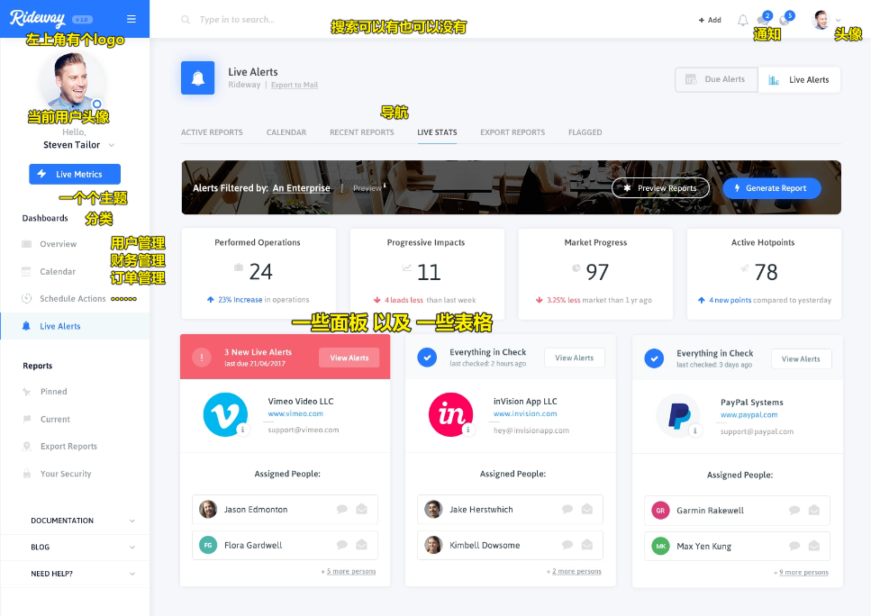

> 给的感觉就像是管理系统呀……

> 来自 [Stelian Subotin](https://dribbble.com/shots/3577091-Rideway-Corporate-Dashboard/attachments/797993) 

补充：

精美的图表可分为两类，一类是**信息图**；另一类是 **Dashboard**。

公司常做的是 -> 动态图表以及 Dashboard（商业报表）

➹：[如何制作非常精美的图表？ - 知乎](https://zhuanlan.zhihu.com/p/23944558)

➹：[Dashboard 设计进阶，看这一篇就够了 - 知乎](https://zhuanlan.zhihu.com/p/27400345)

## ★名词约定

* Dashboard：一般翻译来说，叫「控制台、**控制面板**」，注意这可不是那个 Console 哈！ -> 中国人喜欢把 dashboard 页面叫做 admin 页面，为啥这样叫呢？因为一般只有 admin 这个管理员才能登陆这个 dashboard -> 但其实，admin 只是一个角色而已……所以 admin 和 dashboard 其实不是一回事哈……
* 角色（role）：**用户的身份**（下边提到的用户角色足够了）
  + 普通用户
  + 收费用户，分级：
    - vip1
    - vip2
    - vip3
    - ……
  + 有身份的用户
    - 超级管理员（超管）：默认有所有的权限，能做任何事情
    - 财务人员：一般公司的财务信息应该只有财务部的负责人以及二把手能看 -> 所以也得给财务人员单独设定一个角色！
    - ……
* 权限（permission）：权限是什么？ -> **你能做什么？或者你不能做什么？**
  + 超级管理员可以创建任何人的账户 -> 先创建啥就创建啥（不要说成是创建用户，用户是一个人哈！用户创建的那个东西是账户） -> 给某个用户创建一个登录账户
  + 普通用户：只能创建自己的账户
* 后台：很多时候，在非开发人员的嘴里指的就是 **dashboard**，也就是说非开发人员说「我们有一个后台页面」，指的就是「我们有一个 dashboard 页面」 -> 对于我们前端开发人员来说，我们说后台其实就跟「后端」（back-end）一个意思，即服务器端上的代码，如用 PHP、Node.js 、Java 等写的程序代码，总之，就是**用后台语言写的后台程序**
* 前端：不叫前台哈！因为前台与另一个职业重合了，如公司的门面会有个前台小姐姐 -> 前端很讨厌别人说自己是前台，毕竟「我有那么漂亮吗？」，还有前端也很讨厌别人说自己是美工，怒骂一句「你才是美工，你全家都是美工」 -> 前端这个职业特别别扭，即先有的一些名字都有歧义，总之前端不是前台，也不是美工 -> front-end（必须有中划线，没有中划线就写错了！） -> 前端指所有**运行在浏览器中的代码**或者说是程序、软件，如用 JS 写的代码，用 TS 写的代码
* 接口：这个接口指的不是 Java 里代码的接口，而是指前后端之间的接口 -> 前后端开发人员交流的工具，如前端发一个请求给后端，后端返回给我一个 JSON，而这个过程就叫做**调用接口**！ -> 这个接口一般指的是一个 URL

> 前端发一个请求给后端，后端返回给我一个 JSON -> 就像是说 JS 代码程序发请求给后端如 Node.js 程序代码，Node.js 程序代码返回一个值 -> `function callBackEnd('url'){return JSON}` -> 调用接口，就是在调用 url，调用 url 就是在发送 ajax 请求…… 

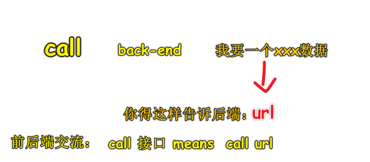

> 前后端通信需要遵守HTTP协议才行！ -> 或者说是按HTTP协议来……

## ★单页 vs 多页

1）概述

* SPA：Single Page Application -> 整个应用只有一个页面，那就是单页应用
* 多页：没有专有名词，毕竟以前的网站都是多页的！ -> Multiple Pages Application

如果我们用了 Vue Router 接管了页面所有的路径，那么不管你访问的路径是什么，全都定位到同一个页面（如 `index.html` ），然后渲染 -> 在同一个页面里边通过 Vue Router 可以展示不同的界面：

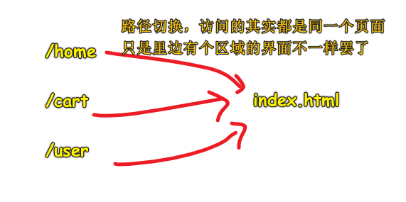

而对于多页来说，它是用后端路由做的：

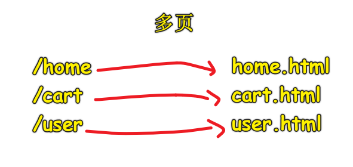

它们俩给我的感觉是：

* 单页：在一个页面里的某个旮旯里，根据路径切换画面（大鱼吃小鱼）
* 多页：一个路径，就是一个页面，就是一个画面（都是大鱼）

单页的图示：

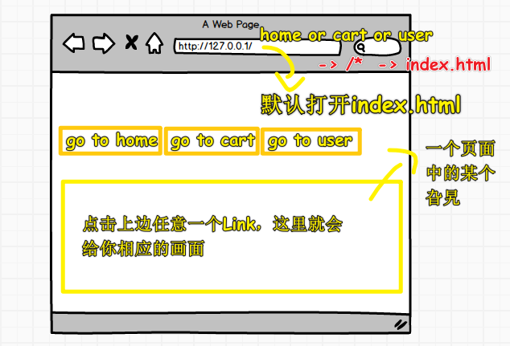

> 这像是路径不同导致的tab切换

多页的图示：

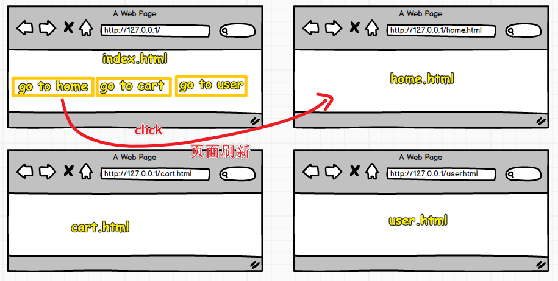

> 每个页面都有自己的html、css、js、图片等资源

2）xiedaimala的单页和多页是怎么做的？

多页面的好处：

1. 首页 -> 打开写代码啦首页，然后禁掉JS，刷新页面，你可以看到页面还是有内容的，而这些内容就是用于SEO的！ -> 让谷歌的爬虫可以检索到内容 -> 而这就是SSR
2. 首页 -> 重要的内容用SSR，不重要的内容用 Vue 动态渲染内容（如那个轮播图） -> 局部 Vue 应用
3. 课程页面 -> 用到了template标签 -> 页面看不到template标签渲染的内容，但源码是有内容的，所以爬虫能检索到！

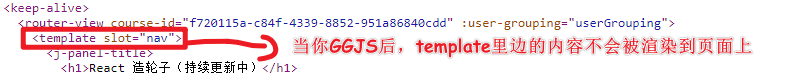

多页面的坏处：

1. 每次点击，就得刷新请求一个页面，然后重新启动 Vue -> 体验断断续续的
2. 每打开一个页面都得跑一次JS

单页面的好处：

> admin页面

我们在浏览器访问直接这样 <https://xiedaimala.com/admin> 访问，回到了首页

但如果在终端 `curl` 一下呢？

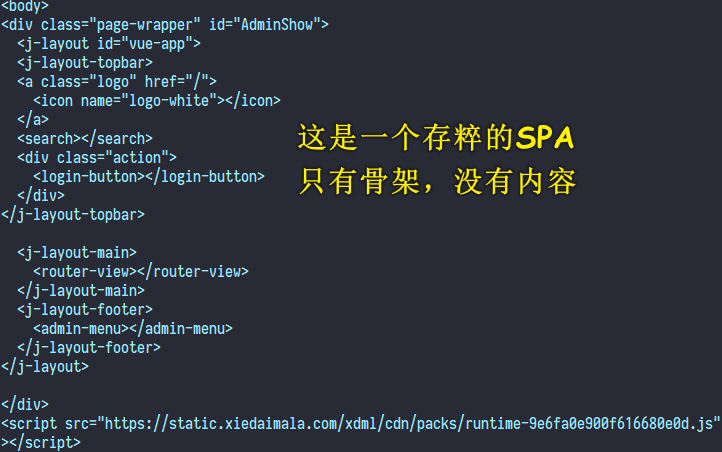

方方他是接近超级管理员的权限，他可以看到：

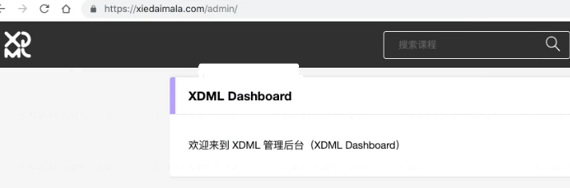

该页面很简洁，由6个Tab组成：

1. 成员
2. 内容
3. 财务
4. 教务
5. 运营
6. 配置

> 简陋 -> 因为不在乎好看与否

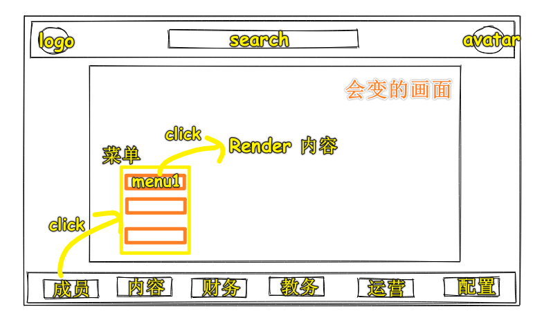

菜单的效果：

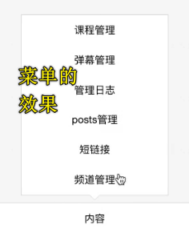

你 `click` 一下这个「课程管理」(路由从 `/admin/` 变为 `/admin/course` )：

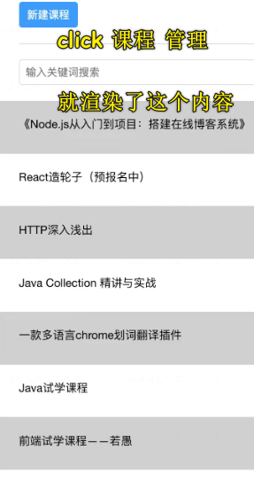

路径变成 `/admin/course` 这样了，并咩有重新刷新页面，然后渲染界面，而是直接把渲染界面的那个坑切换成一个有关 `course` 的画面

而这就是单页面啦！

饥人谷所有的后台界面，都是 `admin` 的，也就是都是之前 `curl` 出来的那个结构那样：

``` html
<!-- /admin/index.html -->
<div class="page-wrapper" id="AdminShow">
  <j-layout id="vue-app">
    <j-layout-topbar>
      <a class="logo" href="/">
        <icon name="logo-white"></icon>
      </a>
      <search></search>
      <div class="action">
        <login-button></login-button>
      </div>
    </j-layout-topbar>

    <j-layout-main>
    <!-- 核心内容 -->
      <router-view></router-view>
    </j-layout-main>
    <j-layout-footer>
      <admin-menu></admin-menu>
    </j-layout-footer>
  </j-layout>
</div>
```

不管你切换到什么界面，如你切换到`/admin/couser`、`/admin/user`等，该页面的源码都是上边这个`index.html`页面 -> 即便你直接在地址栏敲下 `/admin/couser` 所响应回来的也是这个`/admin/index.html` 页面，而不是`/admin/couser.html`页面

3）单页面 vs 多页面

> 基于写代码啦的页面架构分析

单页面：后端只负责渲染一个空的HTML，而前端则负责将空的HTML给展示出来！

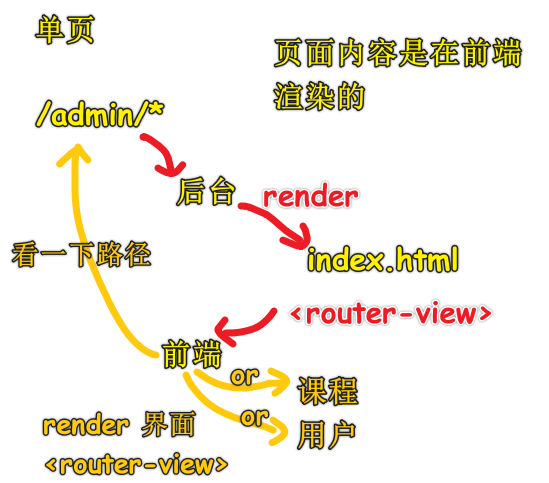

多页面

> 不可能只是后台渲染，于是前端就负责渲染一些需要增加的动态内容


---

目前「写代码啦」的页面架构：

- dashboard：全用单页 -> 无SEO，因为这内容，为啥要给搜索引擎知道呀？ -> 反正你`curl`，如`/admin/user`、`/admin/xxx`都是 404……或者只是个白屏空架子…… -> 如果有权限就不是404页面……
- 多页：把`home.html`里的关键内容展示给SEO，同理，`course.html`也是如此，这样一来，你谷歌搜索一下，敲下一些关键字，就能访问到 `home.html`、`course.html`等这样一些相应的页面了

如搜索「vue 造轮子」：

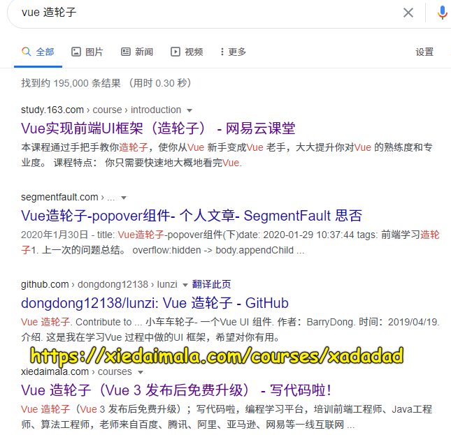

如果你前端要宣传自己，那么你就必须不能做成单页页面了（绝对不能做） -> 要做成单页面

以上就是「写代码啦」的页面架构了！

> 如果你有3年经验，公司要你架构一个网站 -> 选择单页还是多页？ -> 显然，要同时共存，而且你得知道后台应该怎么去——对应路由应该渲染什么……

---

内容较为抽象，之后会有示例！

## ★RESTful API 是什么


