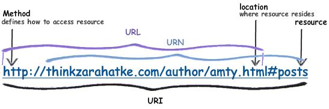
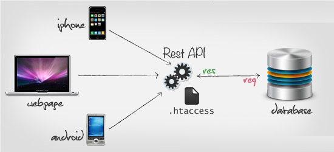

| ✍️ Tangxt | ⏳ 2020-08-02 | 🏷️ 管理后台 |

# 13-管理后台的设计思路

## ★概述

1. 后台页面是什么意思？
2. RESTful API 是什么？
3. 权限怎么设计？
4. JSON 怎么设计？

## ★目录

* 这是 Vue 造轮子的最后一节课
* 关于轮子，方方有些轮子做得不够完善 -> 方方的打算，把自己用 Vue 造的轮子、用 React 造的轮子，完善到可以用在公司的项目里边，如写代码啦这个官网 -> **我想造个专为展示博客的 UI 轮子**……
* 小公司不造轮子，因为页面不多，而大公司就必须得造了，不然页面写得也忒慢了……
* 整个 Vue 造轮子课，大概有 96 小时！
* 展示轮子需要做一个 dashboard 页面

这节课主要讲 Admin/Dashboard（仪表盘、控制面板）的一般设计思路，如果你要维护公司的 Dashboard 页面，不管是从 0 到有创建一个 Dashboard 页面，还是完善已有的 Dashboard 页面，那么我们要怎么去想它的基本功能呢？（包括 SEO、怎么权限判断等等……）

1. 名词约定 -> 讲一节课前，会先把一些名词告知大家，一边后续的讲解能顺利进行下去
2. 单页 vs 多页 -> 用哪个？怎么配置？
3. RESTful 接口
4. 权限设计 -> 前端权限设计怎么做？后端稍微涉及一点……
5. JSON 设计 -> 怎么和后端约定接口？看看 如何设计 JSON 吧！

一个典型的 Dashboard 页面：


> 给的感觉就像是管理系统呀……

> 来自 [Stelian Subotin](https://dribbble.com/shots/3577091-Rideway-Corporate-Dashboard/attachments/797993) 

补充：

精美的图表可分为两类，一类是**信息图**；另一类是 **Dashboard**。

公司常做的是 -> 动态图表以及 Dashboard（商业报表）

➹：[如何制作非常精美的图表？ - 知乎](https://zhuanlan.zhihu.com/p/23944558)

➹：[Dashboard 设计进阶，看这一篇就够了 - 知乎](https://zhuanlan.zhihu.com/p/27400345)

## ★名词约定

* Dashboard：一般翻译来说，叫「控制台、**控制面板**」，注意这可不是那个 Console 哈！ -> 中国人喜欢把 dashboard 页面叫做 admin 页面，为啥这样叫呢？因为一般只有 admin 这个管理员才能登陆这个 dashboard -> 但其实，admin 只是一个角色而已……所以 admin 和 dashboard 其实不是一回事哈……
* 角色（role）：**用户的身份**（下边提到的用户角色足够了）
  + 普通用户
  + 收费用户，分级：
    - vip1
    - vip2
    - vip3
    - ……
  + 有身份的用户
    - 超级管理员（超管）：默认有所有的权限，能做任何事情
    - 财务人员：一般公司的财务信息应该只有财务部的负责人以及二把手能看 -> 所以也得给财务人员单独设定一个角色！
    - ……
* 权限（permission）：权限是什么？ -> **你能做什么？或者你不能做什么？**
  + 超级管理员可以创建任何人的账户 -> 先创建啥就创建啥（不要说成是创建用户，用户是一个人哈！用户创建的那个东西是账户） -> 给某个用户创建一个登录账户
  + 普通用户：只能创建自己的账户
* 后台：很多时候，在非开发人员的嘴里指的就是 **dashboard**，也就是说非开发人员说「我们有一个后台页面」，指的就是「我们有一个 dashboard 页面」 -> 对于我们前端开发人员来说，我们说后台其实就跟「后端」（back-end）一个意思，即服务器端上的代码，如用 PHP、Node.js 、Java 等写的程序代码，总之，就是**用后台语言写的后台程序**
* 前端：不叫前台哈！因为前台与另一个职业重合了，如公司的门面会有个前台小姐姐 -> 前端很讨厌别人说自己是前台，毕竟「我有那么漂亮吗？」，还有前端也很讨厌别人说自己是美工，怒骂一句「你才是美工，你全家都是美工」 -> 前端这个职业特别别扭，即先有的一些名字都有歧义，总之前端不是前台，也不是美工 -> front-end（必须有中划线，没有中划线就写错了！） -> 前端指所有**运行在浏览器中的代码**或者说是程序、软件，如用 JS 写的代码，用 TS 写的代码
* 接口：这个接口指的不是 Java 里代码的接口，而是指前后端之间的接口 -> 前后端开发人员交流的工具，如前端发一个请求给后端，后端返回给我一个 JSON，而这个过程就叫做**调用接口**！ -> 这个接口一般指的是一个 URL

> 前端发一个请求给后端，后端返回给我一个 JSON -> 就像是说 JS 代码程序发请求给后端如 Node.js 程序代码，Node.js 程序代码返回一个值 -> `function callBackEnd('url'){return JSON}` -> 调用接口，就是在调用 url，调用 url 就是在发送 ajax 请求…… 


> 前后端通信需要遵守 HTTP 协议才行！ -> 或者说是按 HTTP 协议来…… -> 三次握手（能听到吗？、听到了、我开始发请求了，你准备一下） -> 请求响应完 -> 四次挥手（HTTP 是无状态协议，所以我们需要 Cookie 等）

## ★单页 vs 多页

### <mark>1）概述</mark>

* SPA：Single Page Application -> 整个应用只有一个页面，那就是单页应用
* 多页：没有专有名词，毕竟以前的网站都是多页的！ -> Multiple Pages Application

如果我们用了 Vue Router 接管了页面所有的路径，那么不管你访问的路径是什么，全都定位到同一个页面（如 `index.html` ），然后渲染 -> 在同一个页面里边通过 Vue Router 可以展示不同的界面：


而对于多页来说，它是用后端路由做的：


它们俩给我的感觉是：

* 单页：在一个页面里的某个旮旯里，根据路径切换画面（大鱼吃小鱼）
* 多页：一个路径，就是一个页面，就是一个画面（都是大鱼）

单页的图示：


> 这像是路径不同导致的 tab 切换

多页的图示：


> 每个页面都有自己的 html、css、js、图片等资源

### <mark>2）xiedaimala 的单页和多页是怎么做的？</mark>

多页面的好处：

1. 首页 -> 打开写代码啦首页，然后禁掉 JS，刷新页面，你可以看到页面还是有内容的，而这些内容就是用于 SEO 的！ -> 让谷歌的爬虫可以检索到内容 -> 而这就是 SSR
2. 首页 -> 重要的内容用 SSR，不重要的内容用 Vue 动态渲染内容（如那个轮播图） -> 局部 Vue 应用
3. 课程页面 -> 用到了 template 标签 -> 页面看不到 template 标签渲染的内容，但源码是有内容的，所以爬虫能检索到！


多页面的坏处：

1. 每次点击，就得刷新请求一个页面，然后重新启动 Vue -> 体验断断续续的
2. 每打开一个页面都得跑一次 JS

单页面的好处：

> admin 页面

我们在浏览器访问直接这样 <https://xiedaimala.com/admin> 访问，回到了首页

但如果在终端 `curl` 一下呢？


方方他是接近超级管理员的权限，他可以看到：


该页面很简洁，由 6 个 Tab 组成：

1. 成员
2. 内容
3. 财务
4. 教务
5. 运营
6. 配置

> 简陋 -> 因为不在乎好看与否


菜单的效果：


你 `click` 一下这个「课程管理」（路由从 `/admin/` 变为 `/admin/course` )：


路径变成 `/admin/course` 这样了，并咩有重新刷新页面，然后渲染界面，而是直接把渲染界面的那个坑切换成一个有关 `course` 的画面

而这就是单页面啦！

饥人谷所有的后台界面，都是 `admin` 的，也就是都是之前 `curl` 出来的那个结构那样：

``` html
<!-- /admin/index.html -->
<div class="page-wrapper" id="AdminShow">
  <j-layout id="vue-app">
    <j-layout-topbar>
      <a class="logo" href="/">
        <icon name="logo-white"></icon>
      </a>
      <search></search>
      <div class="action">
        <login-button></login-button>
      </div>
    </j-layout-topbar>

    <j-layout-main>
      <!-- 核心内容 -->
      <router-view></router-view>
    </j-layout-main>
    <j-layout-footer>
      <admin-menu></admin-menu>
    </j-layout-footer>
  </j-layout>
</div>
```

不管你切换到什么界面，如你切换到 `/admin/couser` 、 `/admin/user` 等，该页面的源码都是上边这个 `index.html` 页面 -> 即便你直接在地址栏敲下 `/admin/couser` 所响应回来的也是这个 `/admin/index.html` 页面，而不是 `/admin/couser.html` 页面

### <mark>3）单页面 vs 多页面</mark>

> 基于写代码啦的页面架构分析

单页面：后端只负责渲染一个空的 HTML，而前端则负责将空的 HTML 给展示出来！


多页面

> 不可能只是后台渲染，于是前端就负责渲染一些需要增加的动态内容


---

目前「写代码啦」的页面架构：

* dashboard：全用单页 -> 无 SEO，因为这内容，为啥要给搜索引擎知道呀？ -> 反正你 `curl` ，如 `/admin/user` 、 `/admin/xxx` 都是 404……或者只是个白屏空架子…… -> 如果有权限就不是 404 页面……
* 多页：把 `home.html` 里的关键内容展示给 SEO，同理， `course.html` 也是如此，这样一来，你谷歌搜索一下，敲下一些关键字，就能访问到 `home.html` 、 `course.html` 等这样一些相应的页面了

如搜索「vue 造轮子」：


如果你前端要宣传自己，那么你就一定不要把网站做成是单页页面的（绝对不能做） -> 要做成多页页面

以上就是「写代码啦」的页面架构了！ -> 其实大部分的网站架构都是这样做的，前端没啥好架构可以做的，总之，你不得不这样架构……可以说这是目前前端网页架构的最佳实践！

> 如果你有 3 年经验，公司要你架构一个网站 -> 选择单页还是多页？ -> 显然，要同时共存，而且你得知道后台应该怎么去——对应路由应该渲染什么……

---

内容较为抽象，之后会有示例！

## ★RESTful API 是什么

> 如果你做前端架构，那么 RESTful 也是一个你需要去关注的技术概念！

### <mark>1）它是为了解决什么问题而生的？</mark>

> 解决 URL 起名字的问题！

如我们经常会遇到一些很常见的需求：

1. 登录
2. 登出
3. 注册
4. 购买课程

请问，这四个功能对应的后台接口分别是什么？ -> 换句话说，如何起名字？

如果你瞎想给个名字的话，那么在下一个项目里边又得瞎想了，所以为啥不一次性解决名字的问题呢？

所以 **RESTful 的基本功能之一就是 「URL 起名字」的方法论**！

### <mark>2）登录 & 登出 & 注册 & 购买课程</mark>

登录是什么？

> 就是用户和网站之间有一个会话 -> 你拨打了 xxx 的电话，xxx 接了，这样一来，你就与 xxx 进行对话了！而这个在技术上就叫做「会话」

你和 xxx 进行一次对话 -> 你与网站进行一次会话！

而登出，就是把电话给挂了，不跟 xxx 对话了！

而登录，就是**在这段时间内，我一直在用「用户名和密码」来访问你的网站，所以网站你要记得我哦！**

所以登录的 URL 大概是这样：

``` 
sessions/create
```

> 会话的创建

而登出则是：

``` 
sessions/destroy
```

> 会话的删除

注册：

``` 
users/create
```

购买课程：

``` 
payments/create
orders/update
```

支付成功之后，订单更新！（一个动作，需要两个 API 来完成，而不是直接一个 API 就完事儿了）

以上就是 RESTful 的大概之意了……

### <mark>3）RESTful 的大概思路</mark>

> 涉及一些技巧性的东西！

RESTful 就是一个约定

所有的东西有一个重要的概念，那就是「资源」 -> **所有东西都是资源，用户是资源，课程是资源，支付也是资源**

每一个资源有 4 种不同的动作，分别是：

* 增：增加一个资源
* 删：删除一个资源
* 改：更新一个资源
* 查：搜索或浏览一个资源

#### <mark>1、查资源</mark>

以「写代码啦」的查资源为例：


查的两种形态：

* 查所有： `courses`
* 查一个： `courses/:id`


---

题外话：

302 重定向：

> 302 是一个普通的重定向代码。直观的看来是，请求者（浏览器或者模拟 http 请求）发起一个请求，然后服务端重定向到另一个地址。而事实上，**服务端仅仅是增加一条属性到 header，location=重定向地址**。而一般的，浏览器会**自动的**再去请求这个 location，重新获取资源。也就是说，这个会使得**浏览器发起两次请求**。


---

查有两种形态，一种是「查所有」，一种是「查一个」，但细分起来，还得对这两种形态细分一下：

* 查所有
  + 用 HTML 形式查看
  + 用 JSON 形式查看
* 查一个 
  + 用 HTML 形式查看
  + 用 JSON 形式查看

如果我们直接从浏览器中输入网址，那么渲染的就是 HTML 格式的内容；如果我们是通过 AJAX 发起请求，那么我们就应该渲染 JSON 的格式！

举例来说：


浏览器之所以知道要返回的是 json，而不是 HTML，因为我们在请求头里说了啊：


如果你要其它的，如 HTML，则这样：


所以，这就是为啥所有的路径都不需要加后缀：

* 是 `https://xiedaimala.com/courses` 而不是 `https://xiedaimala.com/courses.html` -> 因为 `https://xiedaimala.com/courses` 可以代表两种表现形式的资源，要么是传给你 `html` ，要么是传给你 `json` ，这一点可以在 `Accept` 里设置！

以上就是「查」的**两种方式两种形式**了……

> 有很多后台是这样的：你要 html，就 `xxx.html` ，你要 json，就 `xxx.json or xxx.do` 之类的…… -> 但其实，这不需要后缀，设置 `accept` 头就好了！ -> 如何设置？搜索「 `js set accept` 」

``` js
$.ajax({
  headers: {
    // 你改成是「application/json;」就好了
    Accept: "text/plain; charset=utf-8",
    "Content-Type": "text/plain; charset=utf-8"
  }
  data: "data",
  success: function(response) {
    // ...
  }
});
```

➹：[javascript - Pass accepts header parameter to jquery ajax - Stack Overflow](https://stackoverflow.com/questions/12347211/pass-accepts-header-parameter-to-jquery-ajax)

---

> 知道 7 个动作，就知道 RESTful 到底是啥意思了！

---

#### <mark>2、改资源 or 更新资源</mark>

把课程的标题给改了，请问该如何设计这个路由？

一般只有改一个，不会出现改多个的情况！

``` js
courses/:id
```

可是这如何区分这是查还是改呢？

用动词方法`get`，就是查看一个课程，如 `get courses/:id`

而用`patch`，就是更新一个课程，如`patch courses/:id` -> `patch`就是更新的意思

话说，为啥不是用`post`作更新呢？难道不是只有两个动词方法`get`和`post`吗？

> 为什么后端程序员，只用`post`和`get`？ -> 因为历史上曾经出现过某个很著名的后台服务、软件工具啥的，它除了 post 和 get 方法，其它方法都有 bug，于是那几年，大家在用这个软件的时候，就只使用咩有 bug 的 post 和 get，于是，那几年程序员就传其它 http 方法是有 bug，只有 post 和 get 咩有 bug -> 但这其实是软件的 bug，不然 http 设计出那么几个动词方法有啥意义呢？

把要改的资源用 json 传过去，然后改好的用 json 传回来：


这就是更新的方法，我们不需要去想任何接口的名字，直接用 http 提供的`patch`方法就好了！

很多后端程序员都喜欢这样干：

```
<!-- 查看所有课程 -->
courses/all
<!-- 查看一个课程 -->
cousers/:id
```

可是，你难道不认为`all`也有可能是一个`id`吗？

然后更新就用：

```
courses/:id/update
```

你看，这难道不麻烦吗？ -> 为啥不用一个动词`patch`呢？

#### <mark>3、删除一个资源</mark>

一般只删一个，删多个是一个很危险的操作！

```
delete courses/:id
```

> 饥人谷的课程是不能删除的，但任务是可以删除的


这三句话（`tasks/:id`、`delete`、响应回`200 ok`）足矣说明这么一个删除动作……

不需要`tasks/:id/delete`这样设计……

#### <mark>4、增加 or 创建一个资源</mark>

用 `post` 方法，有人说`put`也能用，但也有人说`put`是用来更新的（存在疑问？？？），所以我们干脆只用`post`好了！

```
/courses
```

不用传`id`，因为`id`是你创建数据库之后才创建的！说白了，你预先是不知道你课程 id 的！

我们只要 `post` 一个 `courses` 就能创建一个课程了！ -> 后台返回一个 json（该 json 包含一个`id`字段）

拿创建一个任务举例：


我们创建一个任务，服务器就会把这个所有的资源信息（`resource`）给我们响应回来！其中有个 `id` 字段，该字段让用户可以编辑这个唯一的 Task

#### <mark>5、小结</mark>

- 可以看到，对一个资源的增删改查，透过 RESTful 这个原则都给我们想好了 -> 路径就两种 `courses` & `courses/:id` ，就能完成 CRUD 操作，而动作就是 `post/delete/patch/get`

### <mark>4）RESTful 的第二部分</mark>

#### <mark>1、概述</mark>

为啥还有第二部分呢？ -> 因为还不够呀！虽然上边提到的 CRUD 可以完成对资源所有的操作，但还是缺少一些东西！

举例子说：

用户现在想编辑一个，也就是更新一个课程信息，那么请问「用户在地址栏里该输入什么样的 url 呢？」总不能，让用户自己创建一个 patch json 吧！

用户自己是不会发一个 patch 请求的 -> 只要不是 get 请求，用户都不会发，毕竟是在地址栏输入的！ -> **用户在地址栏输入网址就是在发 get 请求**，而用户也只会发 get 请求

因此，我们上边所提到的 4 个动词方法，除了 get，那都是有问题的！

所以改可有：

- `get courses/:id/edit`

而删除，不需要给个页面，只要一个按钮就行了！（点个按钮就发送个`delete`请求就行了）

而创建，也需要一个页面，如填表单之类的：

- `get courses/new`：表示我想要新增一个页面


> Task 信息填好后 -> 点击「提交」按钮 -> 调用「Post」接口！ -> `api/v1`是前缀
> 
> `course_id`：在某个课程上创建一个任务


查看：


查看某个课程下所有的 task：


改某个任务：

> 照理说会有个`edit`页面，但方方把「查」和「改」都设计到同一个页面了，即可以边看边改！这样就不用写多余的一个页面了，但实际上不应该这么做，就得「查看」一个页面，「编辑」又一个页面……毕竟有些 dashboard 角色是只能查看不能编辑的，而超级管理员则既能查看又能编辑……所以最好整俩页面，当然，整个 dashboard 就你一个超级管理员，那就算了！


提交：


> 提交的数据，放在 playload 里，提交完后，响应回 json 数据，再把数据渲染到界面里！ -> 为啥要把填入的数据从前端到后台再到前端这样兜一圈回来呢？ -> 因为后台要做敏感词校验呀！ -> 如用户填了「`44 大保健，某 av 地址 666`」，而这样的信息显然不能给广大网友看到，所以最后返回回来的数据就是「44666」这样了，总之，用户填的数据都得让后台过一遍，不然，你看那些抖音评论都发黄网，那岂不是乱套了？

删除：

一般用户点击一个删除按钮，后台响应回来，会给你一个 Tips「确认要删除吗？」 -> 写代码啦的后台咩有做这样一个「确认」按钮，因为方方做的是「假删除」啊！ -> 不会把记录从数据库中删除，只是在界面把任务数据给隐藏掉罢了！总之，写代码啦是咩有删除这个操作的，你看不见就是删除了？天真…… -> 为啥不真正删除呢？因为如果真删除了，数据库很多地方就是无效的，会有很多 bug，总之，删除是很难做的！

> 我在想知乎里的一些回答和文章真得就被作者给删掉了？ -> 我想作者他看不见，广大网友看不见，这很有可能是个假删除 -> 后台应该始终会有记录的！
> 
> 很多时候，我们打开微信，收藏一些文章，那么这些文章被作者删掉了，那么这还能访问吗？ -> 我测试了一下微博的收藏功能，收藏的东西，只要被原作者删掉了，那么用户就无法找到这个东西了，而且 B 站也是这样的……我太确定，知乎和微信是不是也是这样的！

#### <mark>2、小结</mark>

目前，有 5 个需要处理`json`的方法，以及 2 个需要让用户看到页面的方法：


- 查看一个资源，有两种姿势
- 改删增，各有一种姿势
- 两个页面 -> 创建需要一个表单页面、改也需要一个表单页面、（「按钮删」放在页面中就好了，一般也不需要真正删除）

**以上这 7 个东西就代表了任何一个资源的增删改查！**

为啥有 7 个？ 而不是 4 个？ -> 这一点一定要搞清楚！

> 因为查有两种形式，而用户改不能直接`patch`（只能给个表单页面填了之后，点击「提交」，才能`patch`），用户创建也不能直接`post`（只能给个表单页面你，你才有位置可填，才能创建一个新资源出来，点击「提交」，你才能`post`） -> 用户输入的 url 只有 get

只要你按照以上这 7 种姿势想路径，你就能非常快速的想出所有的 API 接口了……

一些技巧：

- 课程 id、task id，都是一串数字……数据库自己生成的……保证记录（一条数据）是唯一的……
- `_=`：防止缓存，在路径后边加个随机数，保证不会缓存，不然，资源就从本地缓存拿了！而不是从数据库拿

> API 接口写多了，就熟悉怎么写一个设计良好的 URL 了！

### <mark>5）几个问题</mark>


#### <mark>1、登录如何命名？</mark>

1. 想一下登录到底是什么资源？ -> 登录实际上是创建一个会话，所以它是 session
2. 登录就是创建一个 session


> 登录成功就 200，错误就 4xx

手机号码未注册登录？


> 前端与后台的交流 -> 前端 `post` 数据，后台响应 json 数据 回来，而且还有状态码`401`，表示不能验证 -> 为啥不能验证呢？因为手机号有问题呀！

如果手机号码正确，但验证码错了呢？


> 401 -> 验证码有问题！

以上就是关于一个登录该怎么设计的讲解，至于后台发过来的`error`信息是怎么创建的，之后会讲到！（与前端基本咩关系，但你也得知道如何设计 API 的架构）

#### <mark>2、购买课程</mark>

> 很难

购买课程是什么资源？ -> 有两个资源

1. 下订单 `order`
2. 支付 `payment`

#### <mark>3、用户</mark>


用户设置：


#### <mark>4、支付</mark>

> 复杂的也可以用 RESTful 来设计 API

1. 资源是什么？ -> 一定要把「支付」这个行为变成一个资源 -> payment
2. 下订单支付？ -> create order -> payment 是个未支付状态 -> 用户点击「支付」按钮跳转到支付宝 或者 是微信支付 -> 用户支付成功之后 -> 页面会跳转回来 -> update payment 的状态，表示用户已经创建支付了

> 写代码啦为啥知道你已经支付了？ -> 一开始写代码啦创建了一个未支付的记录，你点了支付宝确定购买之后，支付宝就发一个请求到写代码啦说「用户支付成功了」，于是写代码啦就更新你的 payment 了，表示「你确实支付了」。 而这就是 payment 的状态了！

总之，**重点是你要创建一个名词 `payment` 来表示这个资源**！

---

一句话概括这个「★」：

> 所有的需求都可以通过那 7 个 URL 来搞定！

## ★前端权限设计

> 用户输入 url，回车，默认就告诉后台要的是 `html` -> 说白了，请求头，默认就是`accept:'text/html'`

权限设计要做的：

1. 分菜单 -> 二进制，后台设计数据库：`001`是用户角色，`111`是超管……
2. 分 div -> `can('edit','role')` -> react 可以异步 can，而 vue 的`if……else`则不能
3. 查状态码 -> 以防懂前端的开发者搞事情 -> 403、401

> 千万要注意，有些操作不是前端做的，但是后台就因为你不懂，所以就叫你做了！

➹：[鉴权和授权，傻傻分不清 - 简书](https://www.jianshu.com/p/8fb63350f1eb)

➹：[前后端常见的几种鉴权方式 - 掘金](https://juejin.im/post/6844903927100473357#heading-18)

## ★如何设计 JSON 接口？

> 如何设计 JSON？ -> 是 RESTful API 的一部分，但方方认为这设计有点不好，于是加了点自己认为好的设计！

1. 不要考虑智障用户，如登录功能：输入手机号 -> 点击发送验证码 -> 填入验证码 -> 提交，但有些智障用户直接输入手机号，点击提交……你不用专门为这些智障用户做些什么，直接响应回一个 400（一般性错误）……然后给出一些错误信息……
2. 后台响应回来的是数据，一般是`data`对象（阿里、腾讯都这样做），方方用的是`resource`（资源） -> 注意，你返回一个用户信息的话，直接要用`resource`包裹住哈！不用这样写 `{resource:{user:{id:'xxx'}}}`，直接 `{resource:{id:'xxx'}}`就好了！
3. 后台在处理错误信息的时候，由于前后端分离，很有可能返回一个 `not found` 这样莫名其妙的信息，所以我们就用 Node.js 做中间层过滤一下信息，如后台 `not found`，Node.js 就`手机号不存在`…… -> 注意，`errors.phone`是数组值，因为错误信息可能有好几种，如敏感词之类的……


关于分页的设计，你访问写代码啦的 [前端课程](https://xiedaimala.com/courses/#/?tag1=frontend&page=1)：


> 有 66 个结果！

如果上传 10 个文件，其中有 5 个出错了，5 个成功了，而用`errors`那种姿势就不好表示了，所以需要设计另一种 JSON -> 出现的比较少


小结：


写代码啦所有的接口，响应回来的 JSON，基本上就只有这三种状态：

1. 请求一个资源
2. 请求一个资源错误
3. 请求多个资源

我们没有权利决定 URL 该怎么设计，也咩有权利决定 JSON 该怎么设计 -> 因为我们只是在干前端的活儿

> 学了 3 年前端之后，一定要开始学习一门后端的东西，否则你永远都要被后端牵着鼻子走，如他说不行就不行，他让你做你就做，最后加班的是你，开心的是他！ -> 千万不要偏食，就像是吃饭这样，你有喜欢吃的东西，但请不要只吃那一样东西……不然，一旦某一天你想吃的食材没了，难道你就不吃饭了吗？

## ★总结

DashBoard 的一般设计思路，重点关注三个地方：

- 路由的设计 -> 也就是 RESTful 接口的设计
- 权限设计
- JSON 设计

搞清楚这三个东西的前提是，你得知道这么一些概念：

1. 什么是 Dashboard
2. 什么是前端？什么是后台？
3. 什么是角色？什么是权限？

单页 vs 多页：

- 管理页面一般用单页是咩有问题的！ -> 因为不需要 SEO 呀！前端直接获取所有的页面资源，后端不需要参与，只需要把所有的页面都指向同一个页面就好了！ -> 注意，给用户看的页面绝对不能用单页！因为一旦用了单页浏览器的搜索引擎就搜索不到了！
- 多页 -> 思路是：先渲染出大概的内容，具体的内容再用 Vue 去初始化！

如何设计路由？（如何设计 RESTful 接口？）

> 就 7 个动作哈！ 增改查（两种情况）、删（一种情况）

权限设计？

> 三个思路：分菜单、分 div、把锅甩给后端

重点记住第三个，因为只要后端没做好，你的权限再怎么设计都没有用！因为前端是可以被绕过的！如直接通过终端（控制台）发请求……

JSON 设计？

三个：

1. 一般性的资源（一个资源） -> 直接返回 `{resource:{}}`
2. 错误的资源 -> `{errors:{f1:[……]}}`，告诉我每个字段错在哪？
3. 多个资源 -> `{resources:[],pager:{……}}`

还有，你得使用恰当的错误码 -> 很多公司都很喜欢自己造错误码 -> 如添加一个`errcode`字段来代替状态码，而且有些项目的接口明明是一回事儿，但就是不统一！

大部分一线公司的前端设计水平是非常低下的 -> 有多低下呢？连 RESTful 都咩有听过，全都自己想，每次搞一个项目，都得自己重想一遍……

> 接口应该是原子性的吗？ -> 也就是说一个接口只做一件事？ -> graphql
> 
> 后台经常说不想「重复查数据库」

## ★为什么前端要学后端知识？

目前，流行前后端分家 -> 所谓分家就是前端和后端不是同一个团队

而这导致 了一个问题，那就是「有些事情明明是后端做的，但就是要推给前端做」

比如说，后端给你返回一个 JSON，里边的数据，有些字段有，有些字段咩有 -> 实际上应该都有才对，如果该字段无数据，那你就传个`none`呀！

而后端就说「我不做哦！你自己做吧，我数据已经传了，没有这字段就没有呗！没有这个字段会 GG 么？」 -> 尤其是 PHP 的后端，而这导致前端总是判断这个字段是否存在！ -> 你后端难道就不能初始化一个空字符串吗？跟个智障一样！

而这就导致了我们前端不跟后端合作，前端自己用 Node.js 来做！ -> 你后端给我写个 Java 服务，这个服务用 double 接口还是其它远程 rpc 协议的接口，反正我前端就不用你的 http 接口了，我前端自己透过 Node.js 封装一个 HTTP 接口给自己用！

而这一两年的趋势都是这样的 -> 毕竟**前端实在是受不了辣鸡后端**了！

方方也是受不了，方方起初是纯前端的，了解了 http 协议，以及 RESTful API 后，就越看后端越不顺眼了！

于是，方方就自己学 Node.js ，一开始用 Node.js 做一些小网站，发现 Node.js 操作 SQL 是很蛋疼的，以及搞一些第三方库选择性好多，好难选 -> 你在这个出现问题，然后去解决问题的过程中，然后选各种库的区别过程中，你就会逐渐积累一些后端知识 -> 在这样的积累下，方方就尝试去教一些后端同事，方方蛮喜欢把自己学到东西告诉同事，然而后端说「反正现在代码能用，干嘛要改成这样的，改成你那样的，我要一个月才能改完……我现在一天就写完了……」

很多时候，就是因为这种心态，导致后端的路由乱七八糟，json 乱七八糟，返回码乱七八糟 -> 而这就没办法了，你只能去更好一点的公司！

像阿里巴巴就属于中等了，有得项目乱，有得则不乱 -> 新项目不乱，旧项目乱得要死！当然，这没有人敢改哈！

还有其它的团队，如彩程 -> 是一个全远程开发的团队 -> Tower

用的是 Rails -> 非常尊崇 Rails 提倡的所有理念，而 RESTful 就在其中之列……

方方去到这个公司就感觉很爽 -> 因为**这公司一切就按最应该做的方式来做**

所以归根到底，这不是技术问题，而是在于这个公司的技术的氛围问题！ -> 如果它的氛围是能用就行，那么只要过了三个月，代码就会变成一座 shi 山 -> **每个人经过的时候，都会拉一坨 shi 到上边，最后这个 shi 堆成了山，然后如果你要去改 bug，那么你就要钻到这个 shi 山里边去，闻着恶臭，把代码给改了，然后你改完之后，你还得拉一坨 shi 在上边，因为必须用 shi 才能解决它里边的 shi**

所以这个问题是咩有办法解决的！ -> 除非有一个特别强力的 team leader

就像方方这样，你必须改，我一个月就让你一个人改，你改完了，那么你这个月的 KPI 就完成了，没改完，就没有！

如果营销部门说赶紧上线，但你有一个强力的 leader 说「不行，我们不改完是不上线的！」，可一般技术 leader 是不会说这种话的，一般技术 leader 都是以「保证我能上线」为荣，但实际上这种技术 leader 是非常不好的！ -> **因为这会使得他手下的人很难做，基本上就是手下的人由于疲于应付上面的需求，所以他们根本就不会在乎代码质量**

所以这个问题说得深一点就是「**因为你们的技术在整个公司的地位比较弱，导致受到了其它部门需求的压榨，而需求一压榨，你就咩有办法顾代码质量了，只要你一不顾代码质量，那么你的代码就会迅速地变成一座 shi 山，而变成 shi 山，就咩有回头路了！也就是说 shi 会越来越多！**」

说了这么多，其实我们就是没有办法，只能强忍着坐在 shi 山中间，慢慢的，一点一点的，把周围的 shi 刨开，让 shi 变少，可能你需要一年才能把这些 shi **全部清空**，也有可能你最终**成为 shi 山上的一员**

所以写代码需要很多布道的人，告诉那些人，告诉那些不会写代码的人「**什么东西是好的**」，因为**这个世界实际是由不会写代码的人主导的**，像乔布斯，他就不会写代码，但是他手下就有很多人写代码，而写代码的人是听他的，他说要做咋样的，你们就得做成咋样的！ -> 所以**地位就决定了有的时候你不得不做一些你不想做的事情**

## ★了解更多

➹：[一种RESTful接口的约定 - Gordon](https://bungder.github.io/2017/07/24/REST/)

➹：[HTTP——需要知道的协议 - 掘金](https://juejin.im/post/6844903937246494727)

➹：[什么是 GraphQL？ - 知乎](https://www.zhihu.com/question/264629587)

➹：[公司前端历数后端研发接口5宗罪 - InfoQ](https://www.infoq.cn/article/4IzVzybBTdqtpqUl40oG)

➹：[如何设计好的接口 - 哈巴狗](http://www.habadog.com/2011/06/04/how-to-design-a-good-api/)

## ★Q&A

### <mark>1）什么是图表？</mark>

就是有图的表格 -> 「图形」（散点图、折线图、柱状图、条形图……）+「表格」（罗列数据的表格，但不直观）

> 图表是图形、示意图、地图或表格等形式的数据表示法 -> 数据的可视化

一个图表一般包含 6 种元素：

1. 第 1 个是图表标题，用于介绍图表的主题；
2. 第 2 个是横轴纵轴标题；
3. 第 3 个是类别名称；
4. 第 4 个图例：用各种符号和颜色代表图形里的不同类别；
5. 第 5 个是网格线，方便看到每个元素大概在图形中哪个部分；
6. 第 6 个是数据来源：赋予数据可信度；

当然，为了图表精简，这 6 个元素不必要所有都用上

图表示例：


> 数据周期：2017 年 12 月-2018 年 3 月

为什么需要图表？

1. 让数据可视化 -> 直观 -> 分析报告 -> 数据分析师
2. 对于非数据分析师的岗位，例如产品、市场、运营等，每天也会接触大量的图表
3. 学习和工作中，**很多想法**都需要**利用图表与领导沟通**
4. ……

所以我们前端就是把图表网页化咯？ -> 数据分析啥的不用我们干，我们只是个画图的，图中的信息表示啥，与我们无关……

> 数据 -> 影响他人的决策 -> 如果你的简历有数据量化你的能力，那么你就很容易得到面试官的青睐，如我把网页性能提供了 200%……

➹：[如何看懂图表？ - 知乎](https://zhuanlan.zhihu.com/p/41098335)

➹：[TalkingData-招聘类 APP 用户人群洞察报告](http://mi.talkingdata.com/report-detail.html?id=724)

➹：[图表入门 - 了解示意图、曲线图和图表 - Tableau](https://www.tableau.com/zh-cn/learn/articles/data-visualization/glossary/charts)

### <mark>2）versus 的缩写？</mark>

> VS 是 versus 的简写，versus 是拉丁文，表示“相对照、相对立”等意思。这个词及其简写，后来被英文采用。此缩写在中文有很多解释，所以可能没有必要在中国用英文单词，反而词不达意。在汉语中，基本是「对」的意思。


➹：[「versus」的缩写形式应该怎样写？ - 知乎](https://www.zhihu.com/question/24199500)

➹：[【NG 英文】英文縮寫『vs、v.s、vs.、v.s.』哪個才是正確的？點錯地方竟然變成別的字！](https://www.hopenglish.com/hope-tips-versus)

➹：[vs（拉丁文（英文）versus 的缩写）_百度百科](https://baike.baidu.com/item/vs/1563)

### <mark>3）URL vs URI</mark>

这图是正确的吗？



不太正确！

因为：

1. URLs 和 URNs 都是 URL 的特殊形式（格式）
2. 标识用于访问资源的机制的 URI 通常称为 URL，如 HTTP URIs 就是 URLs 的一个例子！
3. 如果 URI 使用 **URN 作为其方案**，并遵循 RFC 2141 和 RFC 2611 的要求，那么它就是 URN。URN 的目标是为资源提供全局唯一的名称

URN 示例（它没有提供任何机制来检索这个资源，但确实能识别这个资源）：


如果你有一些链接可以链接到这本书的在线版，如 PDF 格式的，那么这就是一个 URL（你也可以说成是 URI），如这样的：

```
https://www.somewebsite.org/books/RestInPractice.pdf
```

总之，每个 URL 是一个 URI，每个 URN 也是一个 URI！

你往浏览器的地址栏敲下的地址，就是一个 URL！但你也可以说它是一个 URI

---

其它的解释：

- URI：是一个资源的标识符，如书上的一页纸、一本书、一个 HTML 文档页面

  

- URL：是特别形式的标识符，它告诉你如何访问资源，如通过`HTTPs`、`FTP`等访问某个资源，如 <https://www.google.com>

所以说，**URL 是 URI 特别形式**，它的特别之处在于「**这是一种提供如何访问资源位置的`method`**」 -> 基本上，**URL 越具体越好**……因为这就越能定位「或者说找到」到你想要的资源！ -> URL（Uniform Resource Locator，统一资源定位符、网址、统一资源定位器、全球资源定位器）


> All URLs are URIs, but not all URIs are URLs.

更深层次的解释？ -> 不需要了，因为我只想吃根香肠，并不想去了解这根香肠是如何做出来的！

---

➹：[Examples of URI, URL and URN - Stack Overflow](https://stackoverflow.com/questions/42534419/examples-of-uri-url-and-urn)

➹：[What's the Difference Between a URI and a URL? - Daniel Miessler](https://danielmiessler.com/study/difference-between-uri-url/)

➹：[Linked Data and URI, URL, URN - YouTube](https://www.youtube.com/watch?v=6oFYgfVGsWw)

### <mark>4）API 是什么？EEST？SOAP？</mark>

API 有很多个意思：

编程开发里的 API：

> **别人提供给你用的东西就是 API**，如你操作页面元素，需要 DOM API、你要知道用户对 DOM 元素做了什么，需要 Event API、你需要调用用户的相机功能，需要系统提供给你的 API 才能调用、你需要指纹识别，也要系统给你一个 API，不然自己对着硬件手撸实现一个指纹功能也太那个了，假如用户的手机是其它类型的，那么岂不是要重新写一遍？

浏览器 与 服务器交互的 API：

> 这 **API 就是 URL 啦**！ -> 你来到一家奶茶店，看到菜单说：「服务员，我要红茶味的奶茶，不加冰，不加珍珠」，过一会儿，你要的奶茶就出现在你手上了 -> 完成这么一过程，就像是你在编程开发里的调用 API，然后返回一个结果给你 -> 在这里服务员就是 API，除了服务员这个 API 以外，还有奶茶制作人员这个 API，API 之间相互调用，最终就把结果送到你手上了！

API 的分类：

- Open API：也叫 Public API，使用上没有太大限制，当然，有时候需要开发者注册账户，拿到一些 key -> 基本上免费，公开给大众使用……可能会有流量限制……如： [API List: A public list of free APIs for programmers](https://apilist.fun/)
- Internal API：也叫 Private API，专门设计给公司内部使用，各个 team 之间的使用
- Partner API：只给有使用权的开发者去使用 -> 合作、付费使用服务

在 Web 开发里边，我们经常说 API 是 Web Service API，也就是那些 URL（通过 URL 提供服务），但其实，API 不是只有 Web Service API 这么一种形式的，还有其它形式……

回过头来看，Web Service API 可以分为 4 种：

1. REST
2. JSON-RPC
3. XML-RPC
4. SOAP

其中常用的是 REST、SOAP 这俩种！

SOAP：

> 肥皂，全名是「Simple Object Access Protocol」 -> 是一种 Protocol，就像 HTTP 一样，也是一种 Protocol ->它比较复杂，使用 XML 这种 Data Format -> 使用场景：常使用在与 Security 相关的东西，因为它可以包很多东西，包很多层呀！、还有一些 Enterprise 企业的场景，而在 Web Service 上面会比较少使用……

REST：

RESTful API：

> RESTful，一个名词形容词的概念 -> REST，即 Rest，叫你休息，很简单的意思 -> 使用起来很轻松，很方便 -> 很多程序员所认识到的 API，基本上都像 RESTful API 这种形式，甚至有程序员说到，所有的 API 都应该像 RESTful API 这个样子才叫做「API」，但其实这并不是哈！RESTful API，它只是一种 Style，它跟像 SOAP，像什么 JSON-RPC 那些东西是不一样的，因为它不是一种 「Protocol」，它只是一种「Architectural Style」，简单来说，就是一种原则（principle），一种使用这种样子 Address url 的原则：


也就是说，透过使用像 HTTP 这种 Protocol 去发送一些「Get」、「Post」、「Delete」这种的 Request，然后去做一些资料的传送以及 Service 之间的沟通

特征 -> 简单，会有 client 与 Server 之间这种 Request、Response，还有它是可以被 Cache 的，还有它的 Data Format 是可以比较多元的，如 JSON、TEXT、XML

注意，REST 并不是非得透过 HTTP 协议来搞的，也可以透过像 SOAP 这种 Protocol 去达成，只是不常见罢了！

SOAP vs REST：


SOAP 比较像是你用信封 -> 把信包好之后还要盖印章把它封好 -> 寄出去。但是它会有很多的包装以及 Overhead 什么的

而像 REST 的话，它比较像一张明信片 -> 非常的简单，上面写什么东东都很容易被看到 -> 寄出去。所以你可以看到它的安全性是有差别的！它所使用的资源上面也是有差别的，也就是说，SOAP 它就使用比较多的纸，因为有信封啥的，而明信片就只有一张纸

以上就是一个简单的比喻 -> 用来比较一下 SOAP、REST 的异同……

> 千万不要认为 API 是啤酒…… -> API，电器有个插头想要通电，使用了插座这个 API，就可以通电运转了……

---

我们不需要自己做登录功能，使用第三方登录就好了 -> 这就需要用到别人提供给你的 API

为啥这些公司要免费提供一些 API 给你使用呢？

我们**软件应用插入到人家提供的 API（接口）**，就可以用到它们提供的后台数据了，但这些数据是怎么来的，我们并不知道！就像是你拧开一个水龙头，这些水是怎么来的，你也不知道！

回过头来，为啥要免费提供呢？

1. 打广告
2. 知道用户的消费、行为习惯，跟广告公司谈价格

> 为啥叫接口？ -> 你的 web 应用插入了人家提供的 API（接口） -> 为啥要插入？因为这些服务，我们的 web 应用需要用到呀！

---

➹：[API? IPA? 應用程式介面是什麼？API 種類介紹 - What is API? REST? SOAP?【電腦說人話】 (CC 字幕 感謝幫我生字幕的各位） - YouTube](https://www.youtube.com/watch?v=xQULsD-r3mo&feature=emb_rel_end)

➹：[什么是 API，接口？ - YouTube](https://www.youtube.com/watch?v=Pbx4elFAXR0)

### <mark>5）一个 HTTP 方法是幂等的，「幂等」是啥意思？</mark>

一个 HTTP 方法是幂等的，指的是同样的请求被**执行一次与连续执行多次**的效果是一样的，服务器的状态也是一样的。

换句话说就是，幂等方法**不应该具有副作用**（统计用途除外）

在正确实现的条件下，`GET`，`HEAD`，`PUT`和`DELETE` 等方法都是幂等的，而 `POST` 方法不是。所有的 safe 方法也都是幂等的。

> safe 方法：只读操作，如 GET、HEAD、OPTIONS，与之相对的 unsafe 方法 则是 PUT、DELETE

注意：开发者不应该使用`DELETE`方法实现具有**删除最后条目功能**的 RESTful API

如，第一次调用`DELETE` 方法有可能返回 200，但是后续的请求可能会返回 404，而这 404 的返回破坏了`DELETE`幂等性约束，所以你应该谨慎使用 `DELETE` 方法对资源干的那些事儿！

➹：[幂等 - 术语表 - MDN](https://developer.mozilla.org/zh-CN/docs/Glossary/%E5%B9%82%E7%AD%89)

➹：[理解 HTTP 幂等性 - Todd Wei - 博客园](https://www.cnblogs.com/weidagang2046/archive/2011/06/04/idempotence.html)

### <mark>6）REST？</mark>

前言：

越来越多的人开始意识到，**网站即软件**，而且是**一种新型的软件**。

这种"互联网软件"采用客户端/服务器模式，建立在分布式体系上，通过互联网通信，具有高延时（high latency）、高并发等特点。

网站开发，完全可以采用软件开发的模式。但是**传统上，软件和网络是两个不同的领域，很少有交集**；软件开发主要针对**单机环境**，网络则主要**研究系统之间的通信**。互联网的兴起，使得这两个领域开始融合，现在我们必须考虑，**如何开发在互联网环境中使用的软件**。

RESTful 架构，就是目前**最流行的**一种**互联网软件架构**。它结构清晰、符合标准、易于理解、扩展方便，所以正得到**越来越多网站的采用**。

但是，到底什么是 RESTful 架构，并不是一个容易说清楚的问题。下面，我就谈谈我理解的 RESTful 架构。

---

REST -- REpresentational State Transfer

一句话概括它是什么：

> URL 定位资源，用 HTTP 动词（GET,POST,DELETE,DETC）描述操作。

如果一句话不行，那就三句话：

> 看 Url 就知道要什么
>
> 看 http method 就知道干什么
> 
> 看 http status code 就知道结果如何

---

简洁版：

1. REST 描述的是在网络中 client 和 server 的**一种交互形式**；REST 本身不实用，实用的是**如何设计 RESTful API**（REST 风格的网络接口）
2. **Server 提供的** RESTful API 中，URL 中只使用名词来指定资源，原则上不使用动词。“**资源**”是 REST 架构或者说整个网络处理的**核心**。比如：
   1. <http://api.qc.com/v1/newsfeed> : 获取某人的新鲜（类似于朋友圈、微博发的言论这样）
   2. <http://api.qc.com/v1/friends> : 获取某人的好友列表
   3. <http://api.qc.com/v1/profile> : 获取某人的详细信息
3. 用 HTTP 协议里的动词来实现资源的添加，修改，删除等操作。即通过 HTTP 动词来实现**资源的状态扭转**：
   1. GET 用来获取资源，POST 用来新建资源（也可以用于更新资源），PUT 用来更新资源，DELETE 用来删除资源。
   2. 比如：
      1. DELETE `http://api.qc.com/v1/friends`: 删除某人的好友 （在 http parameter 指定好友 id）
      2. POST `http://api.qc.com/v1/friends`: 添加好友
      3. UPDATE `http://api.qc.com/v1/profile`: 更新个人资料
      4. 禁止使用： GET `http://api.qc.com/v1/deleteFriend`
   3. 图例：
    
      
    
4. Server 和 Client 之间传递某资源的一个表现形式，比如用 JSON，XML 传输文本，或者用 JPG，WebP 传输图片等。当然还可以压缩 HTTP 传输时的数据（on-wire data compression）
5. 用 HTTP Status Code 传递 Server 的状态信息。比如最常用的 200 表示成功，500 表示 Server 内部错误等

主要信息就这么点。最后是要**解放思想**，Web 端不再用之前典型的 PHP 或 JSP 架构，而是改为前端渲染和附带处理简单的商务逻辑（比如 AngularJS 或者 BackBone 的一些样例）。

**Web 端和 Server 只使用上述定义的 API 来传递数据和改变数据状态**。**格式一般是 JSON**。iOS 和 Android 同理可得。由此可见，Web，iOS，Android 和第三方开发者变为平等的角色通过**一套 API** 来共同消费 Server 提供的服务。

---

详细版：

**先说 REST 名称**

REST -- REpresentational State Transfer

首先，之所以晦涩是因为前面主语被去掉了，全称是 **Resource Representational State Transfer**

通俗来讲就是：**资源在网络中以某种表现形式进行状态转移**。

分解开来：

- Resource：资源，即数据（前面说过网络的核心）。比如 newsfeed，friends 等；
- Representational：某种表现形式，比如用 JSON，XML，JPEG 等；
- State Transfer：状态变化。通过 HTTP 动词实现。


> 我觉得确实应该是翻译成状态变化，而不是状态转移。动作 -> CRUD 资源，资源状态变化 -> 返回结果，而不是把「返回结果」当作是转移！
> 
> 当然，你也可以理解成这样：把数据转移到前端UI -> 凭啥要转移？你看我发送的RESTful API……

**REST 的出处**

Roy Fielding 的毕业论文。这哥们参与设计 HTTP 协议，也是 Apache Web Server 项目（可惜现在已经是 nginx 的天下）的 co-founder。PhD 的毕业学校是 UC Irvine，Irvine 在加州，有着充裕的阳光和美丽的海滩，是著名的富人区。Oculus VR 的总部就坐落于此（虚拟现实眼镜，被 FB 收购，CTO 为 Quake 和 Doom 的作者 John Carmack）。

众说周知，论文都是晦涩难懂的。当年在 CMU 读书的时候，很多课程都会安排每周两篇的 Paper review。现在回想起来每次写 Paper review 都是我最为痛苦的时候。REST 这篇博士论文毫无疑问更甚。

论文地址：[Architectural Styles and the Design of Network-based Software Architectures](https://www.ics.uci.edu/~fielding/pubs/dissertation/top.htm)

REST 章节：[Fielding Dissertation: CHAPTER 5: Representational State Transfer (REST)](https://www.ics.uci.edu/~fielding/pubs/dissertation/rest_arch_style.htm)

REST 那章我初读了，整个论文没有读完 =_=


**RESTful API**

实用的是如何正确地理解 RESTful 架构和设计好 RESTful API。

首先为什么要用 RESTful 结构呢？

大家都知道"古代"网页是前端后端融在一起的，比如之前的 PHP，JSP 等。在之前的桌面时代问题不大，但是近年来移动互联网的发展，各种类型的 Client 层出不穷，RESTful 可以通过一套统一的接口为 Web，iOS 和 Android 提供服务。另外对于广大平台来说，比如 Facebook platform，微博开放平台，微信公共平台等，**它们不需要有显式的前端，只需要一套提供服务的接口，于是 RESTful 更是它们最好的选择**。在 RESTful 架构下：



> 面向 API 接口编程，也就是面向 URL 编程……数据源有了，但前端界面不是固定死的，你可以按照自己喜欢的弄 UI 界面！

 **Server 的 API 如何设计才满足 RESTful 要求？**

首先是简洁版里面的那几点。外加一些附带的 best practices：

1. URL root:
   1. `https://example.org/api/v1/*`
   2. `https://api.example.com/v1/*`
2. API versioning:
   1. 可以放在 URL 里面：`/api/v1/`
   2. 也可以用 HTTP 的 header
3. URI 使用名词而不是动词，且推荐用复数
   1. BAD
      1. `/getProducts`
      2. `/listOrders`
      3. `/retrieveClientByOrder?orderId=1`
   2. GOOD
      1. GET `/products `: will return the list of all products
      2. POST `/products` : will add a product to the collection
      3. GET `/products/4` : will retrieve product #4
      4. PATCH/PUT `/products/4` : will update product #4
4.  保证 HEAD 和 GET 方法是安全的，不会对资源状态有所改变（污染）。比如严格杜绝如下情况：
    1.  GET `/deleteProduct?id=1`
5.  资源的地址推荐用嵌套结构。比如：
    1.  GET `/friends/10375923/profile`
    2.  UPDATE `/profile/primaryAddress/city`
6.  警惕返回结果的大小。如果过大，及时进行分页（pagination）或者加入限制（limit）。HTTP 协议支持分页（Pagination）操作，在 Header 中使用 Link 即可。
7.  使用正确的 HTTP Status Code 表示**访问状态**：[HTTP/1.1: Status Code Definitions](https://www.w3.org/Protocols/rfc2616/rfc2616-sec10.html)
8.  在返回结果用明确易懂的文本（String。注意返回的错误是要给人看的，避免用 1001 这种错误信息），而且适当地加入注释。
9.  关于安全：自己的接口就用 https，加上一个 key 做一次 hash 放在最后即可。考虑到国情，HTTPS 在无线网络里不稳定，可以使用 Application Level 的加密手段把整个 HTTP 的 payload 加密。有兴趣的朋友可以用手机连上电脑的共享 Wi-Fi，然后用 Charles 监听微信的网络请求（发照片或者刷朋友圈）。 -> 如果是平台的 API，可以用成熟但是复杂的 OAuth2，新浪微博这篇：[授权机制说明](https://open.weibo.com/wiki/%E6%8E%88%E6%9D%83%E6%9C%BA%E5%88%B6%E8%AF%B4%E6%98%8E)

**各端的具体实现**

如上面的图所示，Server 统一提供一套 RESTful API，**web+ios+android 作为同等公民调用 API**。各端发展到现在，都有一套比较成熟的框架来帮开发者事半功倍。

> RESTful 就是在告诉我们该如何设计 URL，才能让浏览器和服务器之间友好相处！ -> 我们要关注的是如何设计 API，而不是 RESTful 是什么！
……

➹：[理解 RESTful 架构 - 阮一峰的网络日志](http://www.ruanyifeng.com/blog/2011/09/restful.html)

➹：[RESTful API 设计指南 - 阮一峰的网络日志](http://www.ruanyifeng.com/blog/2014/05/restful_api.html)

➹：[怎样用通俗的语言解释 REST，以及 RESTful？ - 覃超的回答 - 知乎](https://www.zhihu.com/question/28557115/answer/48094438)

➹：[API 是什麼？RESTful API 又是什麼？. API ? RESTful API ? HTTP ?](https://medium.com/itsems-frontend/api-%E6%98%AF%E4%BB%80%E9%BA%BC-restful-api-%E5%8F%88%E6%98%AF%E4%BB%80%E9%BA%BC-a001a85ab638)

➹：[★What is a RESTful API (REST API) and How Does it Work?](https://searchapparchitecture.techtarget.com/definition/RESTful-API)

➹：[http - What exactly is RESTful programming? - Stack Overflow](https://stackoverflow.com/questions/671118/what-exactly-is-restful-programming/3950863#3950863)

➹：[关于 Facebook NewsFeed，看这一篇就够了！ - 知乎](https://zhuanlan.zhihu.com/p/20901694)

### <mark>7）重定向？</mark>

➹：[重定向Http status code 303 和 302 - Ryan.Miao - 博客园](https://www.cnblogs.com/woshimrf/p/http-code-302.html)

➹：[http状态码301和302详解及区别——辛酸的探索之路_grandPang的博客-CSDN博客_302状态码](https://blog.csdn.net/grandPang/article/details/47448395)