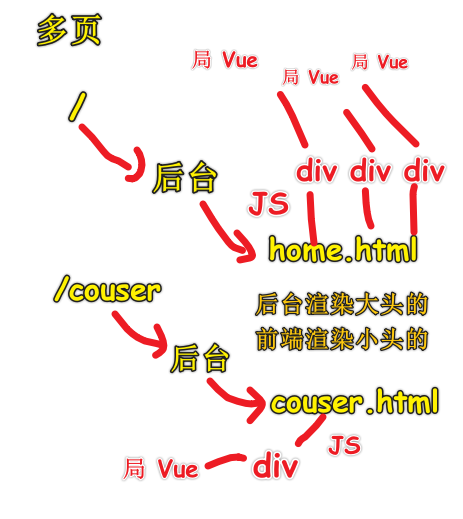

| ✍️ Tangxt | ⏳ 2020-08-02 | 🏷️ 管理后台 |

# 13-管理后台的设计思路

## ★概述

1. 后台页面是什么意思？
2. RESTful API 是什么？
3. 权限怎么设计？
4. JSON 怎么设计？

## ★目录

* 这是 Vue 造轮子的最后一节课
* 关于轮子，方方有些轮子做得不够完善 -> 方方的打算，把自己用 Vue 造的轮子、用 React 造的轮子，完善到可以用在公司的项目里边，如写代码啦这个官网 -> **我想造个专为展示博客的 UI 轮子**……
* 小公司不造轮子，因为页面不多，而大公司就必须得造了，不然页面写得也忒慢了……
* 整个 Vue 造轮子课，大概有 96 小时！
* 展示轮子需要做一个 dashboard 页面

这节课主要讲 Admin/Dashboard（仪表盘、控制面板）的一般设计思路，如果你要维护公司的 Dashboard 页面，不管是从 0 到有创建一个 Dashboard 页面，还是完善已有的 Dashboard 页面，那么我们要怎么去想它的基本功能呢？（包括 SEO、怎么权限判断等等……）

1. 名词约定 -> 讲一节课前，会先把一些名词告知大家，一边后续的讲解能顺利进行下去
2. 单页 vs 多页 -> 用哪个？怎么配置？
3. RESTful 接口
4. 权限设计 -> 前端权限设计怎么做？后端稍微涉及一点……
5. JSON 设计 -> 怎么和后端约定接口？看看 如何设计 JSON 吧！

一个典型的 Dashboard 页面：


> 给的感觉就像是管理系统呀……

> 来自 [Stelian Subotin](https://dribbble.com/shots/3577091-Rideway-Corporate-Dashboard/attachments/797993) 

补充：

精美的图表可分为两类，一类是**信息图**；另一类是 **Dashboard**。

公司常做的是 -> 动态图表以及 Dashboard（商业报表）

➹：[如何制作非常精美的图表？ - 知乎](https://zhuanlan.zhihu.com/p/23944558)

➹：[Dashboard 设计进阶，看这一篇就够了 - 知乎](https://zhuanlan.zhihu.com/p/27400345)

## ★名词约定

* Dashboard：一般翻译来说，叫「控制台、**控制面板**」，注意这可不是那个 Console 哈！ -> 中国人喜欢把 dashboard 页面叫做 admin 页面，为啥这样叫呢？因为一般只有 admin 这个管理员才能登陆这个 dashboard -> 但其实，admin 只是一个角色而已……所以 admin 和 dashboard 其实不是一回事哈……
* 角色（role）：**用户的身份**（下边提到的用户角色足够了）
  + 普通用户
  + 收费用户，分级：
    - vip1
    - vip2
    - vip3
    - ……
  + 有身份的用户
    - 超级管理员（超管）：默认有所有的权限，能做任何事情
    - 财务人员：一般公司的财务信息应该只有财务部的负责人以及二把手能看 -> 所以也得给财务人员单独设定一个角色！
    - ……
* 权限（permission）：权限是什么？ -> **你能做什么？或者你不能做什么？**
  + 超级管理员可以创建任何人的账户 -> 先创建啥就创建啥（不要说成是创建用户，用户是一个人哈！用户创建的那个东西是账户） -> 给某个用户创建一个登录账户
  + 普通用户：只能创建自己的账户
* 后台：很多时候，在非开发人员的嘴里指的就是 **dashboard**，也就是说非开发人员说「我们有一个后台页面」，指的就是「我们有一个 dashboard 页面」 -> 对于我们前端开发人员来说，我们说后台其实就跟「后端」（back-end）一个意思，即服务器端上的代码，如用 PHP、Node.js 、Java 等写的程序代码，总之，就是**用后台语言写的后台程序**
* 前端：不叫前台哈！因为前台与另一个职业重合了，如公司的门面会有个前台小姐姐 -> 前端很讨厌别人说自己是前台，毕竟「我有那么漂亮吗？」，还有前端也很讨厌别人说自己是美工，怒骂一句「你才是美工，你全家都是美工」 -> 前端这个职业特别别扭，即先有的一些名字都有歧义，总之前端不是前台，也不是美工 -> front-end（必须有中划线，没有中划线就写错了！） -> 前端指所有**运行在浏览器中的代码**或者说是程序、软件，如用 JS 写的代码，用 TS 写的代码
* 接口：这个接口指的不是 Java 里代码的接口，而是指前后端之间的接口 -> 前后端开发人员交流的工具，如前端发一个请求给后端，后端返回给我一个 JSON，而这个过程就叫做**调用接口**！ -> 这个接口一般指的是一个 URL

> 前端发一个请求给后端，后端返回给我一个 JSON -> 就像是说 JS 代码程序发请求给后端如 Node.js 程序代码，Node.js 程序代码返回一个值 -> `function callBackEnd('url'){return JSON}` -> 调用接口，就是在调用 url，调用 url 就是在发送 ajax 请求…… 


> 前后端通信需要遵守 HTTP 协议才行！ -> 或者说是按 HTTP 协议来…… -> 三次握手（能听到吗？、听到了、我开始发请求了，你准备一下） -> 请求响应完 -> 四次挥手（HTTP 是无状态协议，所以我们需要 Cookie 等）

## ★单页 vs 多页

1）概述

* SPA：Single Page Application -> 整个应用只有一个页面，那就是单页应用
* 多页：没有专有名词，毕竟以前的网站都是多页的！ -> Multiple Pages Application

如果我们用了 Vue Router 接管了页面所有的路径，那么不管你访问的路径是什么，全都定位到同一个页面（如 `index.html` ），然后渲染 -> 在同一个页面里边通过 Vue Router 可以展示不同的界面：


而对于多页来说，它是用后端路由做的：


它们俩给我的感觉是：

* 单页：在一个页面里的某个旮旯里，根据路径切换画面（大鱼吃小鱼）
* 多页：一个路径，就是一个页面，就是一个画面（都是大鱼）

单页的图示：


> 这像是路径不同导致的 tab 切换

多页的图示：


> 每个页面都有自己的 html、css、js、图片等资源

2）xiedaimala 的单页和多页是怎么做的？

多页面的好处：

1. 首页 -> 打开写代码啦首页，然后禁掉 JS，刷新页面，你可以看到页面还是有内容的，而这些内容就是用于 SEO 的！ -> 让谷歌的爬虫可以检索到内容 -> 而这就是 SSR
2. 首页 -> 重要的内容用 SSR，不重要的内容用 Vue 动态渲染内容（如那个轮播图） -> 局部 Vue 应用
3. 课程页面 -> 用到了 template 标签 -> 页面看不到 template 标签渲染的内容，但源码是有内容的，所以爬虫能检索到！


多页面的坏处：

1. 每次点击，就得刷新请求一个页面，然后重新启动 Vue -> 体验断断续续的
2. 每打开一个页面都得跑一次 JS

单页面的好处：

> admin 页面

我们在浏览器访问直接这样 <https://xiedaimala.com/admin> 访问，回到了首页

但如果在终端 `curl` 一下呢？


方方他是接近超级管理员的权限，他可以看到：


该页面很简洁，由 6 个 Tab 组成：

1. 成员
2. 内容
3. 财务
4. 教务
5. 运营
6. 配置

> 简陋 -> 因为不在乎好看与否


菜单的效果：


你 `click` 一下这个「课程管理」（路由从 `/admin/` 变为 `/admin/course` )：


路径变成 `/admin/course` 这样了，并咩有重新刷新页面，然后渲染界面，而是直接把渲染界面的那个坑切换成一个有关 `course` 的画面

而这就是单页面啦！

饥人谷所有的后台界面，都是 `admin` 的，也就是都是之前 `curl` 出来的那个结构那样：

``` html
<!-- /admin/index.html -->
<div class="page-wrapper" id="AdminShow">
  <j-layout id="vue-app">
    <j-layout-topbar>
      <a class="logo" href="/">
        <icon name="logo-white"></icon>
      </a>
      <search></search>
      <div class="action">
        <login-button></login-button>
      </div>
    </j-layout-topbar>

    <j-layout-main>
      <!-- 核心内容 -->
      <router-view></router-view>
    </j-layout-main>
    <j-layout-footer>
      <admin-menu></admin-menu>
    </j-layout-footer>
  </j-layout>
</div>
```

不管你切换到什么界面，如你切换到 `/admin/couser` 、 `/admin/user` 等，该页面的源码都是上边这个 `index.html` 页面 -> 即便你直接在地址栏敲下 `/admin/couser` 所响应回来的也是这个 `/admin/index.html` 页面，而不是 `/admin/couser.html` 页面

3）单页面 vs 多页面

> 基于写代码啦的页面架构分析

单页面：后端只负责渲染一个空的 HTML，而前端则负责将空的 HTML 给展示出来！


多页面

> 不可能只是后台渲染，于是前端就负责渲染一些需要增加的动态内容



---

目前「写代码啦」的页面架构：

* dashboard：全用单页 -> 无 SEO，因为这内容，为啥要给搜索引擎知道呀？ -> 反正你 `curl` ，如 `/admin/user` 、 `/admin/xxx` 都是 404……或者只是个白屏空架子…… -> 如果有权限就不是 404 页面……
* 多页：把 `home.html` 里的关键内容展示给 SEO，同理， `course.html` 也是如此，这样一来，你谷歌搜索一下，敲下一些关键字，就能访问到 `home.html` 、 `course.html` 等这样一些相应的页面了

如搜索「vue 造轮子」：


如果你前端要宣传自己，那么你就一定不要把网站做成是单页页面的（绝对不能做） -> 要做成多页页面

以上就是「写代码啦」的页面架构了！ -> 其实大部分的网站架构都是这样做的，前端没啥好架构可以做的，总之，你不得不这样架构……可以说这是目前前端网页架构的最佳实践！

> 如果你有 3 年经验，公司要你架构一个网站 -> 选择单页还是多页？ -> 显然，要同时共存，而且你得知道后台应该怎么去——对应路由应该渲染什么……

---

内容较为抽象，之后会有示例！

## ★RESTful API 是什么

> 如果你做前端架构，那么 RESTful 也是一个你需要去关注的技术概念！

1）它是为了解决什么问题而生的？

> 解决 URL 起名字的问题！

如我们经常会遇到一些很常见的需求：

1. 登录
2. 登出
3. 注册
4. 购买课程

请问，这四个功能对应的后台接口分别是什么？ -> 换句话说，如何起名字？

如果你瞎想给个名字的话，那么在下一个项目里边又得瞎想了，所以为啥不一次性解决名字的问题呢？

所以 **RESTful 的基本功能之一就是 「URL 起名字」的方法论**！

2）登录 & 登出 & 注册 & 购买课程

登录是什么？

> 就是用户和网站之间有一个会话 -> 你拨打了 xxx 的电话，xxx 接了，这样一来，你就与 xxx 进行对话了！而这个在技术上就叫做「会话」

你和 xxx 进行一次对话 -> 你与网站进行一次会话！

而登出，就是把电话给挂了，不跟 xxx 对话了！

而登录，就是**在这段时间内，我一直在用「用户名和密码」来访问你的网站，所以网站你要记得我哦！**

所以登录的 URL 大概是这样：

``` 
sessions/create
```

> 会话的创建

而登出则是：

``` 
sessions/destroy
```

> 会话的删除

注册：

``` 
users/create
```

购买课程：

``` 
payments/create
orders/update
```

支付成功之后，订单更新！（一个动作，需要两个 API 来完成，而不是直接一个 API 就完事儿了）

以上就是 RESTful 的大概之意了……

3）RESTful 的大概思路

> 涉及一些技巧性的东西！

RESTful 就是一个约定

所有的东西有一个重要的概念，那就是「资源」 -> **所有东西都是资源，用户是资源，课程是资源，支付也是资源**

每一个资源有 4 种不同的动作，分别是：

* 增：增加一个资源
* 删：删除一个资源
* 改：更新一个资源
* 查：搜索或浏览一个资源

1、查资源

以「写代码啦」的查资源为例：


查的两种形态：

* 查所有： `courses`
* 查一个： `courses/:id`


---

题外话：

302 重定向：

> 302 是一个普通的重定向代码。直观的看来是，请求者（浏览器或者模拟 http 请求）发起一个请求，然后服务端重定向到另一个地址。而事实上，**服务端仅仅是增加一条属性到 header，location=重定向地址**。而一般的，浏览器会**自动的**再去请求这个 location，重新获取资源。也就是说，这个会使得**浏览器发起两次请求**。


---

查有两种形态，一种是「查所有」，一种是「查一个」，但细分起来，还得对这两种形态细分一下：

* 查所有
  + 用 HTML 形式查看
  + 用 JSON 形式查看
* 查一个 
  + 用 HTML 形式查看
  + 用 JSON 形式查看

如果我们直接从浏览器中输入网址，那么渲染的就是 HTML 格式的内容；如果我们是通过 AJAX 发起请求，那么我们就应该渲染 JSON 的格式！

举例来说：


浏览器之所以知道要返回的是 json，而不是 HTML，因为我们在请求头里说了啊：


如果你要其它的，如 HTML，则这样：


所以，这就是为啥所有的路径都不需要加后缀：

* 是 `https://xiedaimala.com/courses` 而不是 `https://xiedaimala.com/courses.html` -> 因为 `https://xiedaimala.com/courses` 可以代表两种表现形式的资源，要么是传给你 `html` ，要么是传给你 `json` ，这一点可以在 `Accept` 里设置！

以上就是「查」的**两种方式两种形式**了……

> 有很多后台是这样的：你要 html，就 `xxx.html` ，你要 json，就 `xxx.json or xxx.do` 之类的…… -> 但其实，这不需要后缀，设置 `accept` 头就好了！ -> 如何设置？搜索「 `js set accept` 」

``` js
$.ajax({
  headers: {
    // 你改成是「application/json;」就好了
    Accept: "text/plain; charset=utf-8",
    "Content-Type": "text/plain; charset=utf-8"
  }
  data: "data",
  success: function(response) {
    // ...
  }
});
```

➹：[javascript - Pass accepts header parameter to jquery ajax - Stack Overflow](https://stackoverflow.com/questions/12347211/pass-accepts-header-parameter-to-jquery-ajax)

---

> 知道 7 个动作，就知道 RESTful 到底是啥意思了！

---

2、改资源 or 更新资源

把课程的标题给改了，请问该如何设计这个路由？

一般只有改一个，不会出现改多个的情况！

``` js
courses/:id
```

可是这如何区分这是查还是改呢？

用动词方法`get`，就是查看一个课程，如 `get courses/:id`

而用`patch`，就是更新一个课程，如`patch courses/:id` -> `patch`就是更新的意思

话说，为啥不是用`post`作更新呢？难道不是只有两个动词方法`get`和`post`吗？

> 为什么后端程序员，只用`post`和`get`？ -> 因为历史上曾经出现过某个很著名的后台服务、软件工具啥的，它除了 post 和 get 方法，其它方法都有 bug，于是那几年，大家在用这个软件的时候，就只使用咩有 bug 的 post 和 get，于是，那几年程序员就传其它 http 方法是有 bug，只有 post 和 get 咩有 bug -> 但这其实是软件的 bug，不然 http 设计出那么几个动词方法有啥意义呢？

把要改的资源用 json 传过去，然后改好的用 json 传回来：


这就是更新的方法，我们不需要去想任何接口的名字，直接用 http 提供的`patch`方法就好了！

很多后端程序员都喜欢这样干：

```
<!-- 查看所有课程 -->
courses/all
<!-- 查看一个课程 -->
cousers/:id
```

可是，你难道不认为`all`也有可能是一个`id`吗？

然后更新就用：

```
courses/:id/update
```

你看，这难道不麻烦吗？ -> 为啥不用一个动词`patch`呢？

3、删除一个资源

一般只删一个，删多个是一个很危险的操作！

```
delete courses/:id
```

> 饥人谷的课程是不能删除的，但任务是可以删除的


这三句话（`tasks/:id`、`delete`、响应回`200 ok`）足矣说明这么一个删除动作……

不需要`tasks/:id/delete`这样设计……

4、增加 or 创建一个资源

用 `post` 方法，有人说`put`也能用，但也有人说`put`是用来更新的（存在疑问？？？），所以我们干脆只用`post`好了！

```
/courses
```

不用传`id`，因为`id`是你创建数据库之后才创建的！说白了，你预先是不知道你课程 id 的！

我们只要 `post` 一个 `courses` 就能创建一个课程了！ -> 后台返回一个 json（该 json 包含一个`id`字段）

拿创建一个任务举例：


我们创建一个任务，服务器就会把这个所有的资源信息（`resource`）给我们响应回来！其中有个 `id` 字段，该字段让用户可以编辑这个唯一的 Task

5、小结

- 可以看到，对一个资源的增删改查，透过 RESTful 这个原则都给我们想好了 -> 路径就两种 `courses` & `courses/:id` ，就能完成 CRUD 操作，而动作就是 `post/delete/patch/get`

4）RESTful 的第二部分

1、概述

为啥还有第二部分呢？ -> 因为还不够呀！虽然上边提到的 CRUD 可以完成对资源所有的操作，但还是缺少一些东西！

举例子说：

用户现在想编辑一个，也就是更新一个课程信息，那么请问「用户在地址栏里该输入什么样的 url 呢？」总不能，让用户自己创建一个 patch json 吧！

用户自己是不会发一个 patch 请求的 -> 只要不是 get 请求，用户都不会发，毕竟是在地址栏输入的！ -> **用户在地址栏输入网址就是在发 get 请求**，而用户也只会发 get 请求

因此，我们上边所提到的 4 个动词方法，除了 get，那都是有问题的！

所以改可有：

- `get courses/:id/edit`

而删除，不需要给个页面，只要一个按钮就行了！（点个按钮就发送个`delete`请求就行了）

而创建，也需要一个页面，如填表单之类的：

- `get courses/new`：表示我想要新增一个页面


> Task 信息填好后 -> 点击「提交」按钮 -> 调用「Post」接口！ -> `api/v1`是前缀
> 
> `course_id`：在某个课程上创建一个任务


查看：


查看某个课程下所有的 task：


改某个任务：

> 照理说会有个`edit`页面，但方方把「查」和「改」都设计到同一个页面了，即可以边看边改！这样就不用写多余的一个页面了，但实际上不应该这么做，就得「查看」一个页面，「编辑」又一个页面……毕竟有些 dashboard 角色是只能查看不能编辑的，而超级管理员则既能查看又能编辑……所以最好整俩页面，当然，整个 dashboard 就你一个超级管理员，那就算了！


提交：


> 提交的数据，放在 playload 里，提交完后，响应回 json 数据，再把数据渲染到界面里！ -> 为啥要把填入的数据从前端到后台再到前端这样兜一圈回来呢？ -> 因为后台要做敏感词校验呀！ -> 如用户填了「`44 大保健，某 av 地址 666`」，而这样的信息显然不能给广大网友看到，所以最后返回回来的数据就是「44666」这样了，总之，用户填的数据都得让后台过一遍，不然，你看那些抖音评论都发黄网，那岂不是乱套了？

删除：

一般用户点击一个删除按钮，后台响应回来，会给你一个 Tips「确认要删除吗？」 -> 写代码啦的后台咩有做这样一个「确认」按钮，因为方方做的是「假删除」啊！ -> 不会把记录从数据库中删除，只是在界面把任务数据给隐藏掉罢了！总之，写代码啦是咩有删除这个操作的，你看不见就是删除了？天真…… -> 为啥不真正删除呢？因为如果真删除了，数据库很多地方就是无效的，会有很多 bug，总之，删除是很难做的！

> 我在想知乎里的一些回答和文章真得就被作者给删掉了？ -> 我想作者他看不见，广大网友看不见，这很有可能是个假删除 -> 后台应该始终会有记录的！
> 
> 很多时候，我们打开微信，收藏一些文章，那么这些文章被作者删掉了，那么这还能访问吗？ -> 我测试了一下微博的收藏功能，收藏的东西，只要被原作者删掉了，那么用户就无法找到这个东西了，而且 B 站也是这样的……我太确定，知乎和微信是不是也是这样的！

2、小结

目前，有 5 个需要处理`json`的方法，以及 2 个需要让用户看到页面的方法：


- 查看一个资源，有两种姿势
- 改删增，各有一种姿势
- 两个页面 -> 创建需要一个表单页面、改也需要一个表单页面、（「按钮删」放在页面中就好了，一般也不需要真正删除）

**以上这 7 个东西就代表了任何一个资源的增删改查！**

为啥有 7 个？ 而不是 4 个？ -> 这一点一定要搞清楚！

> 因为查有两种形式，而用户改不能直接`patch`（只能给个表单页面填了之后，点击「提交」，才能`patch`），用户创建也不能直接`post`（只能给个表单页面你，你才有位置可填，才能创建一个新资源出来，点击「提交」，你才能`post`） -> 用户输入的 url 只有 get

只要你按照以上这 7 种姿势想路径，你就能非常快速的想出所有的 API 接口了……

一些技巧：

- 课程 id、task id，都是一串数字……数据库自己生成的……保证记录（一条数据）是唯一的……
- `_=`：防止缓存，在路径后边加个随机数，保证不会缓存，不然，资源就从本地缓存拿了！而不是从数据库拿

> API 接口写多了，就熟悉怎么写一个设计良好的 URL 了！

5）几个问题
