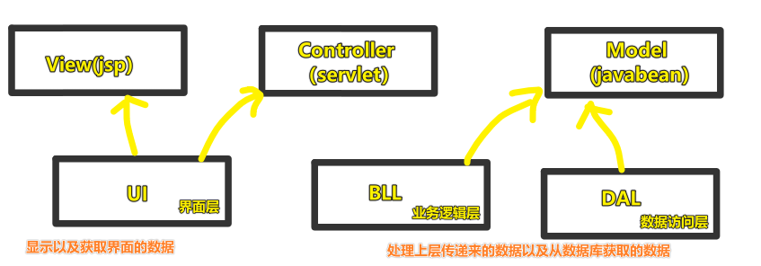
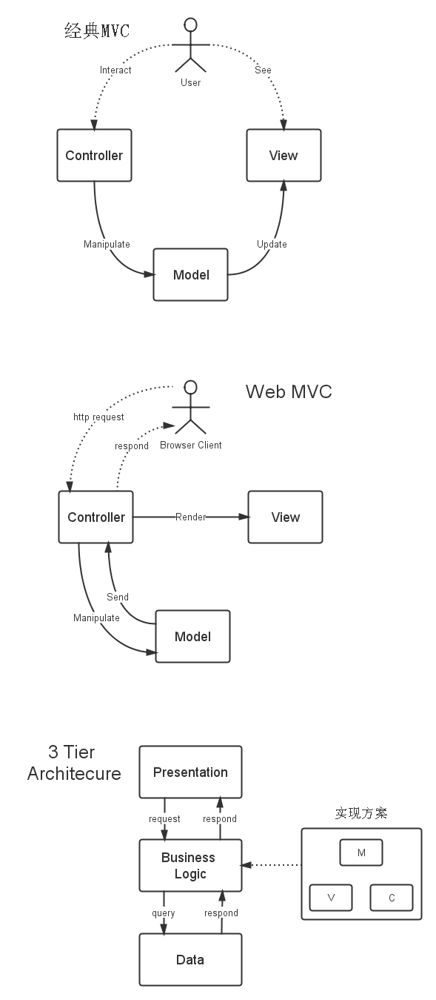
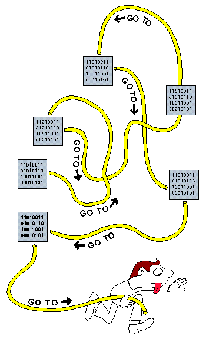

## ★Q&A

1）MVC 与 三层架构有联系吗？

系统架构是指整个应用系统程序大体的结构，常见的系统架构有**三层架构**与**MVC**

三层架构与MVC不是简单的相等，它们存在差别，但又有联系 -> 这两种系统架构的出现，都是为了**降低系统模块间的耦合度**

也就是说虽然它们一个叫「**馒头**」，一个叫「**面条**」，但它们的本质都是面粉，即它们都是用来「**分层和解耦**」的！

> 不要以为都是「三」，就认为三层架构和MVC是一样的！

对比Java后端的三层架构：

总之，直白点来说：

MVC是**设计模式**，属于微观的解决方案（如『博客』这一特定应用）

3 Tier（层）是**系统架构**，属于**宏观**的解决方案（如『网络』这一巨大的领域）。

3 Tier的三层是指（在client-server的语境下）：

- Presentation Tier，指客户端。
- Business Tier，指服务器。
- Data Tier，指数据库。

> Manipulate -> 操作，处理

Q：为什么需要mvc架构，或者为什么有三层架构？

这是一个很好很重要的问题。

简单地说，是为了**更好地**分开逻辑，从而让代码模块化。

模块化的好处是：

1. 一个模块的修改对其他模块影响大大减小。
2. 拓展应用更加容易。可以增加一个新的v模块，如在pc web的基础上增加一个mobile web。
3. 不同模块的开发可以同时进行。

总而言之，利大于弊……

➹：[MVC 与三层架构 - 掘金](https://juejin.im/post/5929259b44d90400642194f3)

➹：[mvc与三层结构终极区别](https://blog.csdn.net/csh624366188/article/details/7183872)

➹：[对三层和MVC的认识过程](https://blog.csdn.net/beijiguangyong/article/details/7029257)

➹：[中度理解MVC和三层架构 - 知乎](https://zhuanlan.zhihu.com/p/62146420)

➹：[MVC和三层架构有何区别和联系？ - 知乎](https://www.zhihu.com/question/21851341)

2）意大利面条代码？

- 是什么？
  - 非结构化和难以维护的源代码，如在一个文件里边，对某一行代码的理解，需要在好几行里边跳来跳去才能理解！
- 这是如何出现的？
  - 项目需求经常变化
  - 缺乏编程风格规则
  - 能力或经验不足
  - ……
- 我们要做什么？
  - 写出可理解的代码，而不是意大利面条式的代码
- 其它称呼的代码？
  - Ravioli code 意大利饺子代码、馄饨代码：针对OOP，描述了由结构良好的class组成的代码，这些class隔离起来很容易理解，但是**作为一个整体很难理解**
  - Lasagna code 烤宽面条代码、千层面代码：是指各层代码复杂且缠绕在一起，改变其中一层就需要改变其它**所有的**层
  - Pizza code 披萨代码：指结构非常平坦（flat，扁平）的代码

➹：[Spaghetti code - Wikipedia](https://en.wikipedia.org/wiki/Spaghetti_code)

➹：[What is Spaghetti Code? - Definition from Techopedia](https://www.techopedia.com/definition/9476/spaghetti-code)

➹：[Definition of spaghetti code - PCMag](https://www.pcmag.com/encyclopedia/term/spaghetti-code)

