## ★Q&A

1）什么是图表？

就是有图的表格 -> 「图形」（散点图、折线图、柱状图、条形图……）+「表格」（罗列数据的表格，但不直观）

> 图表是图形、示意图、地图或表格等形式的数据表示法 -> 数据的可视化

一个图表一般包含 6 种元素：

1. 第 1 个是图表标题，用于介绍图表的主题；
2. 第 2 个是横轴纵轴标题；
3. 第 3 个是类别名称；
4. 第 4 个图例：用各种符号和颜色代表图形里的不同类别；
5. 第 5 个是网格线，方便看到每个元素大概在图形中哪个部分；
6. 第 6 个是数据来源：赋予数据可信度；

当然，为了图表精简，这 6 个元素不必要所有都用上

图表示例：

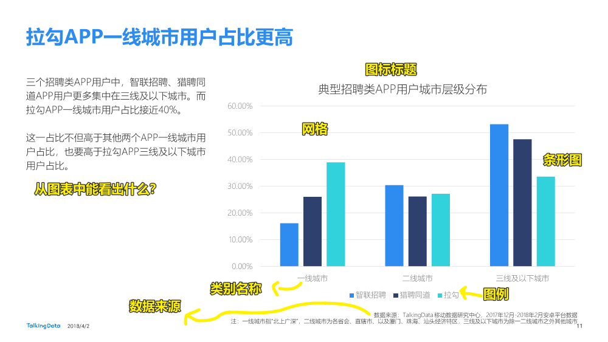

> 数据周期：2017 年 12 月-2018 年 3 月

为什么需要图表？

1. 让数据可视化 -> 直观 -> 分析报告 -> 数据分析师
2. 对于非数据分析师的岗位，例如产品、市场、运营等，每天也会接触大量的图表
3. 学习和工作中，**很多想法**都需要**利用图表与领导沟通**
4. ……

所以我们前端就是把图表网页化咯？ -> 数据分析啥的不用我们干，我们只是个画图的，图中的信息表示啥，与我们无关……

> 数据 -> 影响他人的决策 -> 如果你的简历有数据量化你的能力，那么你就很容易得到面试官的青睐，如我把网页性能提供了 200%……

➹：[如何看懂图表？ - 知乎](https://zhuanlan.zhihu.com/p/41098335)

➹：[TalkingData-招聘类 APP 用户人群洞察报告](http://mi.talkingdata.com/report-detail.html?id=724)

➹：[图表入门 - 了解示意图、曲线图和图表 - Tableau](https://www.tableau.com/zh-cn/learn/articles/data-visualization/glossary/charts)

2）versus 的缩写？

> VS 是 versus 的简写，versus 是拉丁文，表示“相对照、相对立”等意思。这个词及其简写，后来被英文采用。此缩写在中文有很多解释，所以可能没有必要在中国用英文单词，反而词不达意。在汉语中，基本是「对」的意思。

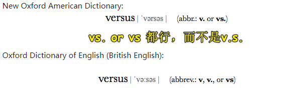

➹：[「versus」的缩写形式应该怎样写？ - 知乎](https://www.zhihu.com/question/24199500)

➹：[【NG 英文】英文縮寫『vs、v.s、vs.、v.s.』哪個才是正確的？點錯地方竟然變成別的字！](https://www.hopenglish.com/hope-tips-versus)

➹：[vs（拉丁文（英文）versus 的缩写）_百度百科](https://baike.baidu.com/item/vs/1563)

3）URL vs URI

这图是正确的吗？

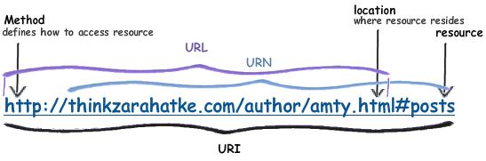

不太正确！

因为：

1. URLs 和 URNs 都是 URL 的特殊形式（格式）
2. 标识用于访问资源的机制的 URI 通常称为 URL，如 HTTP URIs 就是 URLs 的一个例子！
3. 如果 URI 使用 **URN 作为其方案**，并遵循 RFC 2141 和 RFC 2611 的要求，那么它就是 URN。URN 的目标是为资源提供全局唯一的名称

URN 示例（它没有提供任何机制来检索这个资源，但确实能识别这个资源）：

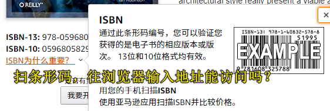

如果你有一些链接可以链接到这本书的在线版，如 PDF 格式的，那么这就是一个 URL（你也可以说成是 URI），如这样的：

```
https://www.somewebsite.org/books/RestInPractice.pdf
```

总之，每个 URL 是一个 URI，每个 URN 也是一个 URI！

你往浏览器的地址栏敲下的地址，就是一个 URL！但你也可以说它是一个 URI

---

其它的解释：

- URI：是一个资源的标识符，如书上的一页纸、一本书、一个 HTML 文档页面

  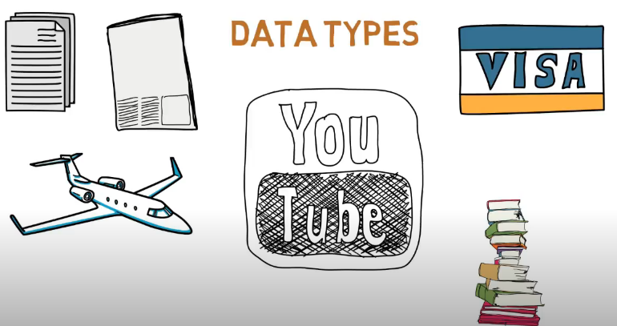

- URL：是特别形式的标识符，它告诉你如何访问资源，如通过`HTTPs`、`FTP`等访问某个资源，如 <https://www.google.com>

所以说，**URL 是 URI 特别形式**，它的特别之处在于「**这是一种提供如何访问资源位置的`method`**」 -> 基本上，**URL 越具体越好**……因为这就越能定位「或者说找到」到你想要的资源！ -> URL（Uniform Resource Locator，统一资源定位符、网址、统一资源定位器、全球资源定位器）

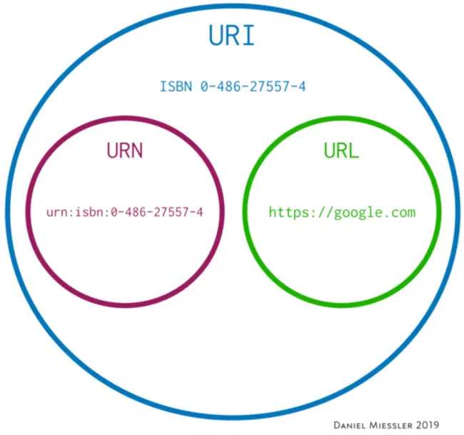

> All URLs are URIs, but not all URIs are URLs.

更深层次的解释？ -> 不需要了，因为我只想吃根香肠，并不想去了解这根香肠是如何做出来的！

---

➹：[Examples of URI, URL and URN - Stack Overflow](https://stackoverflow.com/questions/42534419/examples-of-uri-url-and-urn)

➹：[What's the Difference Between a URI and a URL? - Daniel Miessler](https://danielmiessler.com/study/difference-between-uri-url/)

➹：[Linked Data and URI, URL, URN - YouTube](https://www.youtube.com/watch?v=6oFYgfVGsWw)

4）API 是什么？EEST？SOAP？

API 有很多个意思：

编程开发里的 API：

> **别人提供给你用的东西就是 API**，如你操作页面元素，需要 DOM API、你要知道用户对 DOM 元素做了什么，需要 Event API、你需要调用用户的相机功能，需要系统提供给你的 API 才能调用、你需要指纹识别，也要系统给你一个 API，不然自己对着硬件手撸实现一个指纹功能也太那个了，假如用户的手机是其它类型的，那么岂不是要重新写一遍？

浏览器 与 服务器交互的 API：

> 这 **API 就是 URL 啦**！ -> 你来到一家奶茶店，看到菜单说：「服务员，我要红茶味的奶茶，不加冰，不加珍珠」，过一会儿，你要的奶茶就出现在你手上了 -> 完成这么一过程，就像是你在编程开发里的调用 API，然后返回一个结果给你 -> 在这里服务员就是 API，除了服务员这个 API 以外，还有奶茶制作人员这个 API，API 之间相互调用，最终就把结果送到你手上了！

API 的分类：

- Open API：也叫 Public API，使用上没有太大限制，当然，有时候需要开发者注册账户，拿到一些 key -> 基本上免费，公开给大众使用……可能会有流量限制……如： [API List: A public list of free APIs for programmers](https://apilist.fun/)
- Internal API：也叫 Private API，专门设计给公司内部使用，各个 team 之间的使用
- Partner API：只给有使用权的开发者去使用 -> 合作、付费使用服务

在 Web 开发里边，我们经常说 API 是 Web Service API，也就是那些 URL（通过 URL 提供服务），但其实，API 不是只有 Web Service API 这么一种形式的，还有其它形式……

回过头来看，Web Service API 可以分为 4 种：

1. REST
2. JSON-RPC
3. XML-RPC
4. SOAP

其中常用的是 REST、SOAP 这俩种！

SOAP：

> 肥皂，全名是「Simple Object Access Protocol」 -> 是一种 Protocol，就像 HTTP 一样，也是一种 Protocol ->它比较复杂，使用 XML 这种 Data Format -> 使用场景：常使用在与 Security 相关的东西，因为它可以包很多东西，包很多层呀！、还有一些 Enterprise 企业的场景，而在 Web Service 上面会比较少使用……

REST：

RESTful API：

> RESTful，一个名词形容词的概念 -> REST，即 Rest，叫你休息，很简单的意思 -> 使用起来很轻松，很方便 -> 很多程序员所认识到的 API，基本上都像 RESTful API 这种形式，甚至有程序员说到，所有的 API 都应该像 RESTful API 这个样子才叫做「API」，但其实这并不是哈！RESTful API，它只是一种 Style，它跟像 SOAP，像什么 JSON-RPC 那些东西是不一样的，因为它不是一种 「Protocol」，它只是一种「Architectural Style」，简单来说，就是一种原则（principle），一种使用这种样子 Address url 的原则：

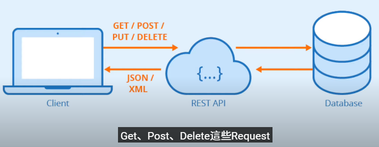

也就是说，透过使用像 HTTP 这种 Protocol 去发送一些「Get」、「Post」、「Delete」这种的 Request，然后去做一些资料的传送以及 Service 之间的沟通

特征 -> 简单，会有 client 与 Server 之间这种 Request、Response，还有它是可以被 Cache 的，还有它的 Data Format 是可以比较多元的，如 JSON、TEXT、XML

注意，REST 并不是非得透过 HTTP 协议来搞的，也可以透过像 SOAP 这种 Protocol 去达成，只是不常见罢了！

SOAP vs REST：


SOAP 比较像是你用信封 -> 把信包好之后还要盖印章把它封好 -> 寄出去。但是它会有很多的包装以及 Overhead 什么的

而像 REST 的话，它比较像一张明信片 -> 非常的简单，上面写什么东东都很容易被看到 -> 寄出去。所以你可以看到它的安全性是有差别的！它所使用的资源上面也是有差别的，也就是说，SOAP 它就使用比较多的纸，因为有信封啥的，而明信片就只有一张纸

以上就是一个简单的比喻 -> 用来比较一下 SOAP、REST 的异同……

> 千万不要认为 API 是啤酒…… -> API，电器有个插头想要通电，使用了插座这个 API，就可以通电运转了……

---

我们不需要自己做登录功能，使用第三方登录就好了 -> 这就需要用到别人提供给你的 API

为啥这些公司要免费提供一些 API 给你使用呢？

我们**软件应用插入到人家提供的 API（接口）**，就可以用到它们提供的后台数据了，但这些数据是怎么来的，我们并不知道！就像是你拧开一个水龙头，这些水是怎么来的，你也不知道！

回过头来，为啥要免费提供呢？

1. 打广告
2. 知道用户的消费、行为习惯，跟广告公司谈价格

> 为啥叫接口？ -> 你的 web 应用插入了人家提供的 API（接口） -> 为啥要插入？因为这些服务，我们的 web 应用需要用到呀！

---

➹：[API? IPA? 應用程式介面是什麼？API 種類介紹 - What is API? REST? SOAP?【電腦說人話】 (CC 字幕 感謝幫我生字幕的各位） - YouTube](https://www.youtube.com/watch?v=xQULsD-r3mo&feature=emb_rel_end)

➹：[什么是 API，接口？ - YouTube](https://www.youtube.com/watch?v=Pbx4elFAXR0)

5）一个 HTTP 方法是幂等的，「幂等」是啥意思？

一个 HTTP 方法是幂等的，指的是同样的请求被**执行一次与连续执行多次**的效果是一样的，服务器的状态也是一样的。

换句话说就是，幂等方法**不应该具有副作用**（统计用途除外）

在正确实现的条件下，`GET`，`HEAD`，`PUT`和`DELETE` 等方法都是幂等的，而 `POST` 方法不是。所有的 safe 方法也都是幂等的。

> safe 方法：只读操作，如 GET、HEAD、OPTIONS，与之相对的 unsafe 方法 则是 PUT、DELETE

注意：开发者不应该使用`DELETE`方法实现具有**删除最后条目功能**的 RESTful API

如，第一次调用`DELETE` 方法有可能返回 200，但是后续的请求可能会返回 404，而这 404 的返回破坏了`DELETE`幂等性约束，所以你应该谨慎使用 `DELETE` 方法对资源干的那些事儿！

➹：[幂等 - 术语表 - MDN](https://developer.mozilla.org/zh-CN/docs/Glossary/%E5%B9%82%E7%AD%89)

➹：[理解 HTTP 幂等性 - Todd Wei - 博客园](https://www.cnblogs.com/weidagang2046/archive/2011/06/04/idempotence.html)

6）REST？

前言：

越来越多的人开始意识到，**网站即软件**，而且是**一种新型的软件**。

这种"互联网软件"采用客户端/服务器模式，建立在分布式体系上，通过互联网通信，具有高延时（high latency）、高并发等特点。

网站开发，完全可以采用软件开发的模式。但是**传统上，软件和网络是两个不同的领域，很少有交集**；软件开发主要针对**单机环境**，网络则主要**研究系统之间的通信**。互联网的兴起，使得这两个领域开始融合，现在我们必须考虑，**如何开发在互联网环境中使用的软件**。

RESTful 架构，就是目前**最流行的**一种**互联网软件架构**。它结构清晰、符合标准、易于理解、扩展方便，所以正得到**越来越多网站的采用**。

但是，到底什么是 RESTful 架构，并不是一个容易说清楚的问题。下面，我就谈谈我理解的 RESTful 架构。

---

REST -- REpresentational State Transfer

一句话概括它是什么：

> URL 定位资源，用 HTTP 动词（GET,POST,DELETE,DETC）描述操作。

如果一句话不行，那就三句话：

> 看 Url 就知道要什么
>
> 看 http method 就知道干什么
> 
> 看 http status code 就知道结果如何

---

简洁版：

1. REST 描述的是在网络中 client 和 server 的**一种交互形式**；REST 本身不实用，实用的是**如何设计 RESTful API**（REST 风格的网络接口）
2. **Server 提供的** RESTful API 中，URL 中只使用名词来指定资源，原则上不使用动词。“**资源**”是 REST 架构或者说整个网络处理的**核心**。比如：
   1. <http://api.qc.com/v1/newsfeed> : 获取某人的新鲜（类似于朋友圈、微博发的言论这样）
   2. <http://api.qc.com/v1/friends> : 获取某人的好友列表
   3. <http://api.qc.com/v1/profile> : 获取某人的详细信息
3. 用 HTTP 协议里的动词来实现资源的添加，修改，删除等操作。即通过 HTTP 动词来实现**资源的状态扭转**：
   1. GET 用来获取资源，POST 用来新建资源（也可以用于更新资源），PUT 用来更新资源，DELETE 用来删除资源。
   2. 比如：
      1. DELETE `http://api.qc.com/v1/friends`: 删除某人的好友 （在 http parameter 指定好友 id）
      2. POST `http://api.qc.com/v1/friends`: 添加好友
      3. UPDATE `http://api.qc.com/v1/profile`: 更新个人资料
      4. 禁止使用： GET `http://api.qc.com/v1/deleteFriend`
   3. 图例：
    
      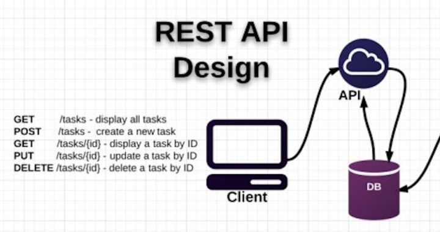
    
4. Server 和 Client 之间传递某资源的一个表现形式，比如用 JSON，XML 传输文本，或者用 JPG，WebP 传输图片等。当然还可以压缩 HTTP 传输时的数据（on-wire data compression）
5. 用 HTTP Status Code 传递 Server 的状态信息。比如最常用的 200 表示成功，500 表示 Server 内部错误等

主要信息就这么点。最后是要**解放思想**，Web 端不再用之前典型的 PHP 或 JSP 架构，而是改为前端渲染和附带处理简单的商务逻辑（比如 AngularJS 或者 BackBone 的一些样例）。

**Web 端和 Server 只使用上述定义的 API 来传递数据和改变数据状态**。**格式一般是 JSON**。iOS 和 Android 同理可得。由此可见，Web，iOS，Android 和第三方开发者变为平等的角色通过**一套 API** 来共同消费 Server 提供的服务。

---

详细版：

**先说 REST 名称**

REST -- REpresentational State Transfer

首先，之所以晦涩是因为前面主语被去掉了，全称是 **Resource Representational State Transfer**

通俗来讲就是：**资源在网络中以某种表现形式进行状态转移**。

分解开来：

- Resource：资源，即数据（前面说过网络的核心）。比如 newsfeed，friends 等；
- Representational：某种表现形式，比如用 JSON，XML，JPEG 等；
- State Transfer：状态变化。通过 HTTP 动词实现。

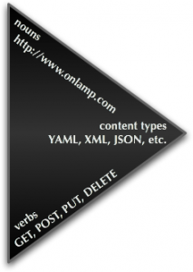

> 我觉得确实应该是状态变化，动作 -> CRUD 资源，资源状态变化 -> 返回结果

**REST 的出处**

Roy Fielding 的毕业论文。这哥们参与设计 HTTP 协议，也是 Apache Web Server 项目（可惜现在已经是 nginx 的天下）的 co-founder。PhD 的毕业学校是 UC Irvine，Irvine 在加州，有着充裕的阳光和美丽的海滩，是著名的富人区。Oculus VR 的总部就坐落于此（虚拟现实眼镜，被 FB 收购，CTO 为 Quake 和 Doom 的作者 John Carmack）。

众说周知，论文都是晦涩难懂的。当年在 CMU 读书的时候，很多课程都会安排每周两篇的 Paper review。现在回想起来每次写 Paper review 都是我最为痛苦的时候。REST 这篇博士论文毫无疑问更甚。

论文地址：[Architectural Styles and the Design of Network-based Software Architectures](https://www.ics.uci.edu/~fielding/pubs/dissertation/top.htm)

REST 章节：[Fielding Dissertation: CHAPTER 5: Representational State Transfer (REST)](https://www.ics.uci.edu/~fielding/pubs/dissertation/rest_arch_style.htm)

REST 那章我初读了，整个论文没有读完 =_=

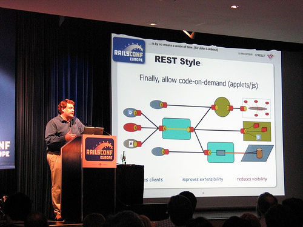

**RESTful API**

实用的是如何正确地理解 RESTful 架构和设计好 RESTful API。

首先为什么要用 RESTful 结构呢？

大家都知道"古代"网页是前端后端融在一起的，比如之前的 PHP，JSP 等。在之前的桌面时代问题不大，但是近年来移动互联网的发展，各种类型的 Client 层出不穷，RESTful 可以通过一套统一的接口为 Web，iOS 和 Android 提供服务。另外对于广大平台来说，比如 Facebook platform，微博开放平台，微信公共平台等，**它们不需要有显式的前端，只需要一套提供服务的接口，于是 RESTful 更是它们最好的选择**。在 RESTful 架构下：

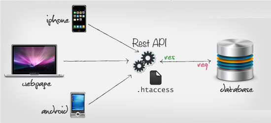

> 面向 API 接口编程，也就是面向 URL 编程……数据源有了，但前端界面不是固定死的，你可以按照自己喜欢的弄 UI 界面！

 **Server 的 API 如何设计才满足 RESTful 要求？**

首先是简洁版里面的那几点。外加一些附带的 best practices：

1. URL root:
   1. `https://example.org/api/v1/*`
   2. `https://api.example.com/v1/*`
2. API versioning:
   1. 可以放在 URL 里面：`/api/v1/`
   2. 也可以用 HTTP 的 header
3. URI 使用名词而不是动词，且推荐用复数
   1. BAD
      1. `/getProducts`
      2. `/listOrders`
      3. `/retrieveClientByOrder?orderId=1`
   2. GOOD
      1. GET `/products `: will return the list of all products
      2. POST `/products` : will add a product to the collection
      3. GET `/products/4` : will retrieve product #4
      4. PATCH/PUT `/products/4` : will update product #4
4.  保证 HEAD 和 GET 方法是安全的，不会对资源状态有所改变（污染）。比如严格杜绝如下情况：
    1.  GET `/deleteProduct?id=1`
5.  资源的地址推荐用嵌套结构。比如：
    1.  GET `/friends/10375923/profile`
    2.  UPDATE `/profile/primaryAddress/city`
6.  警惕返回结果的大小。如果过大，及时进行分页（pagination）或者加入限制（limit）。HTTP 协议支持分页（Pagination）操作，在 Header 中使用 Link 即可。
7.  使用正确的 HTTP Status Code 表示**访问状态**：[HTTP/1.1: Status Code Definitions](https://www.w3.org/Protocols/rfc2616/rfc2616-sec10.html)
8.  在返回结果用明确易懂的文本（String。注意返回的错误是要给人看的，避免用 1001 这种错误信息），而且适当地加入注释。
9.  关于安全：自己的接口就用 https，加上一个 key 做一次 hash 放在最后即可。考虑到国情，HTTPS 在无线网络里不稳定，可以使用 Application Level 的加密手段把整个 HTTP 的 payload 加密。有兴趣的朋友可以用手机连上电脑的共享 Wi-Fi，然后用 Charles 监听微信的网络请求（发照片或者刷朋友圈）。 -> 如果是平台的 API，可以用成熟但是复杂的 OAuth2，新浪微博这篇：[授权机制说明](https://open.weibo.com/wiki/%E6%8E%88%E6%9D%83%E6%9C%BA%E5%88%B6%E8%AF%B4%E6%98%8E)

**各端的具体实现**

如上面的图所示，Server 统一提供一套 RESTful API，**web+ios+android 作为同等公民调用 API**。各端发展到现在，都有一套比较成熟的框架来帮开发者事半功倍。

> RESTful 就是在告诉我们该如何设计 URL，才能让浏览器和服务器之间友好相处！ -> 我们要关注的是如何设计 API，而不是 RESTful 是什么！
……

➹：[理解 RESTful 架构 - 阮一峰的网络日志](http://www.ruanyifeng.com/blog/2011/09/restful.html)

➹：[RESTful API 设计指南 - 阮一峰的网络日志](http://www.ruanyifeng.com/blog/2014/05/restful_api.html)

➹：[怎样用通俗的语言解释 REST，以及 RESTful？ - 覃超的回答 - 知乎](https://www.zhihu.com/question/28557115/answer/48094438)

➹：[API 是什麼？RESTful API 又是什麼？. API ? RESTful API ? HTTP ?](https://medium.com/itsems-frontend/api-%E6%98%AF%E4%BB%80%E9%BA%BC-restful-api-%E5%8F%88%E6%98%AF%E4%BB%80%E9%BA%BC-a001a85ab638)

➹：[★What is a RESTful API (REST API) and How Does it Work?](https://searchapparchitecture.techtarget.com/definition/RESTful-API)

➹：[http - What exactly is RESTful programming? - Stack Overflow](https://stackoverflow.com/questions/671118/what-exactly-is-restful-programming/3950863#3950863)

➹：[关于 Facebook NewsFeed，看这一篇就够了！ - 知乎](https://zhuanlan.zhihu.com/p/20901694)
