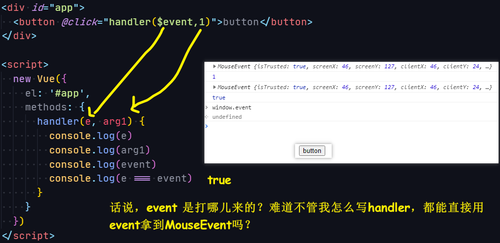

## ★Q&A

1）vue 中的 `$event`？

不传参数：

``` 
<button v-on:click="click">click me</button>

click(event) {
    console.log(typeof event);    // object MouseEvent
}
```

给括号不传参数：

```
<button v-on:click="click()">click me</button>
click(event) {
    console.log(typeof event);    // undefined
}
```

给括号也传参数：

```
<button v-on:click="click($event, 233)">click me</button>
click(event, val) {
    console.log(typeof event);    // object
}
```

所以：

1. 使用**不带圆括号**的形式，`event` 对象将被**自动**当作实参传入；
2. 使用**带圆括号**的形式，我们需要使用 `$event` 变量**显式传入** `event` 对象
3. `event`是个关键字！

可假如我们这样呢：



让`event`失效的姿势是，把`event`作为形参，然后不给`$event`实参！

总之，`$event`就是`MouseEvent`，如果你的`handler`没有用`event`作为形参，你也咩有传入`$event`实参，那么获取`MouseEvent`的姿势就是`event`

对了，当子组件`$emit('enlarge-text', 0.1)`，父组件`v-on:enlarge-text="postFontSize += $event"`时，通过 `$event` 可以访问到被抛出的这个`0.1`值 -> 这其实类似于我们原生点击一个`button`时，默认就会有一个`e`作为第一个参数传给`callback`一样，同理`0.1`这个值也是第一个参数！

➹：[vue.js - 奇怪的 event 对象 - 简书](https://www.jianshu.com/p/b078cfe97c92)

➹：[使用事件抛出一个值](https://cn.vuejs.org/v2/guide/components.html#%E4%BD%BF%E7%94%A8%E4%BA%8B%E4%BB%B6%E6%8A%9B%E5%87%BA%E4%B8%80%E4%B8%AA%E5%80%BC)


