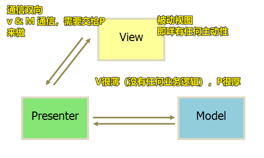
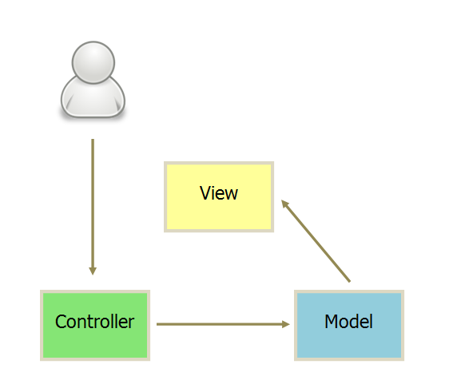
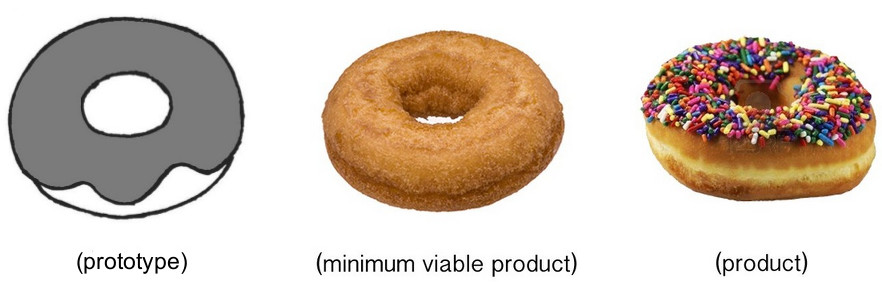

## ★Q&A

1）MVP是什么？

编程里边的 理解：

来买宝贝的（View） -> 主持人(Presenter) -> 宝贝（Model），宝贝谁买了，就在谁身上，就像是哪个视图要了数据，就在谁身上渲染一样……（Model和View是不能接触的，说白了View 与 Model 不发生联系）



> MVP, MVVM甚至MXXX都只是MVC的变体而已，至于将重点放在C点还是V点（没人会希望放到M点吧？！）就自然引出了若干种所谓的模式，其实模式只有一种，你称为P也好VM也好，它都只是C的实例而已。总是设法弄出一些所谓的Business Word的家伙们，是前端开发最大的敌人！

我个人理解的MVC是： `V -> C -> M -> V` （V接收用户指令，数据通信都是单向的）


``` js
{
  add() {
    // 业务逻辑
    let newData = {
      number: this.model.data.number + 1
    }
    // 要求Model改变状态
    this.updateModel(newData)
  },
  updateModel(newData) {
    // 发送Ajax请求，把响应回来的数据，保存到 Model 里边
    this.model.update(newData).then(() => {
      // 把 新数据 发送给 View 去 Render
      this.view.render(this.model.data)
    })
  }
}
```

> View 传送指令到 Controller -> Controller 完成业务逻辑后，要求 Model 改变状态 -> Model 将新的数据发送到 View，用户得到反馈

还有一种是直接通过controller接受指令（改变 URL 触发 `hashChange` 事件）：



总之：

- 视图（View）：用户界面
- 控制器（Controller）：业务逻辑
- 模型（Model）：数据保存

对了，Backbone.js 是变体的MVC，其 **Controller 非常薄**，只起到路由的作用，而 View 非常厚，**业务逻辑都部署在 View**，即由 View 直接要求 Model 改变状态，所以，**Backbone 索性取消了 Controller，只保留一个 Router（路由器）**（ Backbone.js 有 Router 的概念，毫无疑问，它是借鉴了后端的 Web MVC 概念……而像 Vue 这样的，借鉴了经典 MVC，以及 Angular 的双向绑定，还有 React 的 虚拟DOM……）


> Backbone这种MVC，目前不怎么用了，目前大多用 MVVM、MVP 这样的，即 M 与 V 是不直接通信的


在产品设计里边：

> a minimum viable product (MVP) is the version of a new product that allows a team to collect the minimum amount of validated learning about customers with the least effort.

即 MVP 是最小可行性产品，如果该产品对用户ok，那么就会继续迭代下去，说白了，先用最低的成本试水，如果市场反应好，那继续迭代下去：


我觉得很多培训机构就是这样的，课程不断迭代……而老学员两眼泪汪汪……

其它示例：




➹：[Running hypothesis driven experiments using the MVP - UX Collective](https://uxdesign.cc/the-product-manager-and-the-mvp-a0c618b0d8fa)

➹：[Using The MVP Approach To Create A Successful Project](https://www.infomir.eu/eng/blog/articles/17-using-the-mvp/)

➹：[MVC、MVP、MVVM，我到底该怎么选？ - 掘金](https://juejin.im/post/5b3a3a44f265da630e27a7e6#heading-7)

➹：[goldze/MVVMHabit: 👕基于谷歌最新AAC架构，MVVM设计模式的一套快速开发库，整合Okhttp+RxJava+Retrofit+Glide等主流模块，满足日常开发需求。使用该框架可以快速开发一个高质量、易维护的Android应用。](https://github.com/goldze/MVVMHabit)

➹：[Everything You Need to Know for Building MVP for Startups](https://www.cloudways.com/blog/building-an-mvp/)

➹：[MVC，MVP 和 MVVM 的图示 - 阮一峰的网络日志](https://www.ruanyifeng.com/blog/2015/02/mvcmvp_mvvm.html)