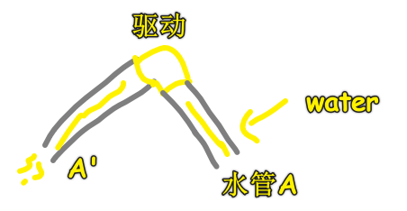
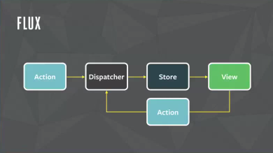

## ★总结

- 大概过一遍视频之后，自己学一遍，敲一些代码，再看一遍视频，记录一些关键点信息……

## ★Q&A

1）驱动？

在 vuex 里边，state 是驱动应用的数据源

所谓的「驱动」，在我看来就是让应用活起来了，简单来说，一个应用如果没有数据源，那么你什么都看不到，就像是没有电力驱动风扇运作一样……

大众所认为的驱动：

> 驱动就是为了实现设备无关性而架在操作系统与硬件之间的**桥**。

再简单说驱动是桥。

应用程序开发者不用关心目标用户使用什么硬件，硬件厂家不用关心目标用户用什么应用。而两者只需要关心使用的是什么操作系统，以此为目的为操作系统开发的**可执行程序就是驱动**。



➹：[虽然经常听说驱动，但是驱动具体是啥？ - 知乎](https://www.zhihu.com/question/28758504)

2）方法论？

在我看来，方法论就是「做好一件事的最佳实践」！

> 古语，磨斧不误砍柴功，其实就是 方法论
> 
> 方法论是一种以解决问题为目标的通用理论体系
> 
> 字面上，词源学上：方法论 (methodology) 是关于方法 (method) 的学问 (-ology=a field of study)

我看到了阮一峰的这篇 [博文](http://www.ruanyifeng.com/blog/2007/11/mvc.html)：

> 如何设计一个程序的结构，这是一门专门的学问，叫做"架构模式"（architectural pattern），属于编程的方法论。
> 
> MVC 模式就是架构模式的一种，它对我的启发特别大。我觉得它不仅适用于开发软件，也适用于其他广泛的设计和组织工作。

在评论里提到：

> 事实上很多人类社会中的组织都是模块化的，只有模块化才能更好的分工，实现`specialization`（专业化、专门化、特殊化），提高效率。
另，其实计算机中的很多概念，包括模块化，都是模拟人类社会学来的，比如`hyperlink`就是来自人的`associative memory`（联想记忆）。计算机本来就是人的发明，不可能脱离人而单独存在

这个`hyperlink`，我从为想过居然可以把超链接看作一个联想记忆的点！ -> 通过输入关键字，具体化关键字的细节，就像是我们在思考一个东西，然后突然就跳到另外一个东西里边去思考！

> 关于 Flux 架构 -> 这种架构似乎正在将 MVC 转变为看起来基于事件的架构

MVC 适合小型应用，当许多 models 和相应的 views 被添加到一个系统中时，复杂性就会爆炸，如下图所示：


这样的应用程序很难理解和调试，特别是由于 models 和 views 之间可能存在**双向数据流**

所以也就出现了 Flux：



- Store：应用程序所有的数据都在这儿了
- Dispatcher：「initial Controller（绑定事件之类的）」+「决定触发 Action 时如何更新 Store」
- View：Store 更细，View 也会随着同步更新

还可以选择生成一个要由 Dispatcher 处理的 Action。

这确保了系统组件之间的**单向数据流**（unidirectional flow of data）。具有多个 Stores 或 Views 的系统可以看作是只有一个 Store 和一个 View，因为数据只以一种方式流动，不同的 Stores 和 Views 不会直接相互影响。

> 一个村子是一个系统的话，那么每个家庭都是独立的 Model 和 View，Model 就像是金钱等一些可量化的数据一样，而 View，就是我们能看到这家人的房子是啥样一样……

以前我们每个家庭的生活是很独立的，不会接触到大量的其它家庭的信息，但是现在，手机出现了，信息发达了，每个家庭与家庭之间都在相互影响，有些小年轻更是焦虑起来了，导致整个家庭的面貌都按照不可预测的方向进行了……

这给我的感觉就像是社会从 FLux，转向了有双向绑定的 MVC 一样……

题外话：

Flux 是一种架构思想，专门解决软件的结构问题。它跟 MVC 架构是同一类东西，但是**更加简单和清晰**。

Flux 存在多种实现（至少 15 种） -> 如 Redux

而 MVC 也有诸多实现，如 Angular.js、Backbone.js……

➹：[Flux 架构入门教程 - 阮一峰的网络日志](http://www.ruanyifeng.com/blog/2016/01/flux.html)

➹：[Facebook: MVC Does Not Scale, Use Flux Instead [Updated]](https://www.infoq.com/news/2014/05/facebook-mvc-flux/)

➹：[javascript mvc 框架有哪些？ - html 中文网](https://www.html.cn/qa/javascript/11073.html)

➹：[方法论到底是什么？ - 知乎](https://www.zhihu.com/question/55340286)

➹：[Flux - Flux](https://facebook.github.io/flux/)

3）playload？

胶囊里的药粉就是payload

外面的皮是为了保证中间药粉的完好有效

➹：[http中的payload怎么理解？ - 知乎](https://www.zhihu.com/question/26689845)

3）rest & spread？

解析赋值：

``` js
let { x, y, ...z } = { x: 1, y: 2, a: 3, b: 4 };
x; // 1
y; // 2
z; // { a: 3, b: 4 }
```

初始化一个对象：

``` js
let n = { x, y, ...z };
n; // { x: 1, y: 2, a: 3, b: 4 }
```

➹：[tc39/proposal-object-rest-spread: Rest/Spread Properties for ECMAScript](https://github.com/tc39/proposal-object-rest-spread)


