### ✍️ Tangxt ⏳ 2020-08-14 🏷️ 项目介绍

# 01-旺财记账介绍

## ★项目介绍

### <mark>1）设觉设计</mark>

Figma：[链接](https://www.figma.com/file/493MWONLQcmwH5bAHUbWEw/%E6%97%BA%E8%B4%A2%E8%AE%B0%E8%B4%A6%EF%BC%88%E6%9C%AC%E5%9C%B0%E7%89%88%EF%BC%89?node-id=2%3A62) -> 最好学习一下如何使用这个 Figma 工具，以便按自己的喜好更改方方所提供的设计稿！

从设计稿当中可以看到，界面有 4 个：

#### <mark>1、首页</mark>

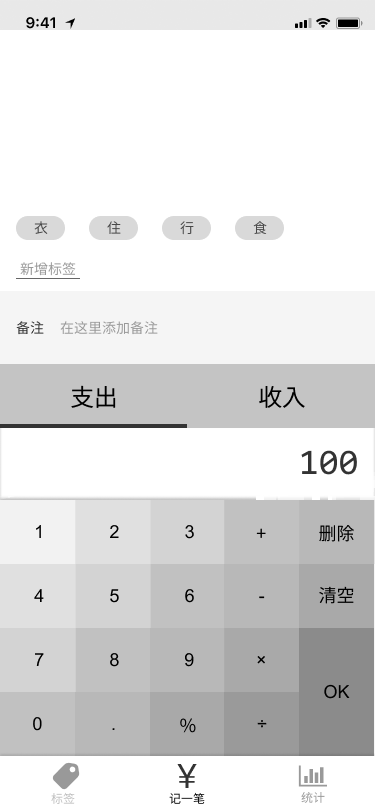

底部有 3 个 Tab，其中「记一笔」是默认激活的（最重要的）！ -> 新增的标签是从下往上堆的！ -> 完成记一笔的操作：输入金额（支出 or 输入），添加标签，点击「完成」

点击「标签」这个 Tab，就会进入到第二个页面——「标签页」

#### <mark>2、标签页</mark>

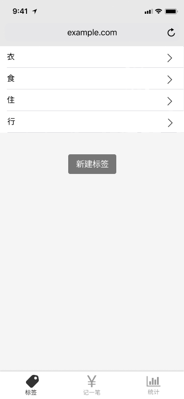

默认有 4 个标签「衣食住行」 -> 点击标签可编辑（默认的也行）or 创建标签 -> 编辑 or 创建标签时会跳到「编辑标签」页面

> 最新的交互好像是弹出一个框给你 CRUD 标签

#### <mark>3、编辑标签</mark>

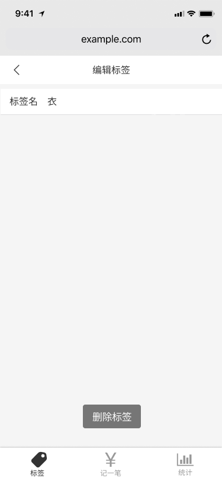

点击「`<`」回到「标签页」

#### <mark>4、统计</mark>

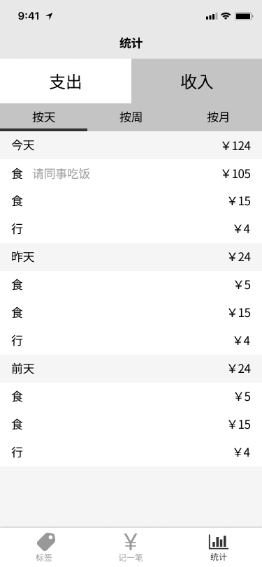

统计一下过去一周总共花了多少钱？ -> 分别查看「支出」（按天、按周、按月）和「收入」（按天、按周、按月）

额外功能 -> 可加图表（可视化数据）

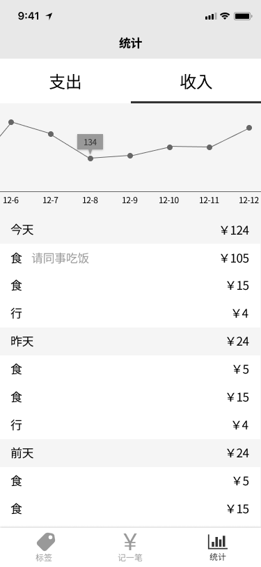

---

**一定要先把设计稿（UI+交互）弄出来了，再去考虑写代码！** -> 这个项目看起来非常简单，但你在做的时候会用到很多小知识

---

#### <mark>5、Figma 的使用事项</mark>

- 可以复制该项目 -> 进行**个性化改动**
- 主色调 -> 黑白灰（为啥选择这个配色？易于我们个性化，而且这种配色很安全，不会很难看） -> 你可自行添加**一个**主色调，如蓝色 （按照黑白灰的深浅来配，如深蓝、浅蓝、浅浅蓝……只能在**一个颜色上变深变浅变暗**，而不是一层蓝，下一层黄，再下一层绿……）
- 还可添加几个**点缀色**，如红色、橙色（尤其是「删除标签」，你用红色的话，会让人感到这个「删除」操作是很危险的，因为你一旦删了，假如你记了 100 笔都用了这个标签，那么这 100 笔就失去了这个标签的关联了） -> **红色代表危险，橙色代表比较危险，绿色代表安全**
- 千万**不要添加太多颜色** -> 多了会非常丑！（花花绿绿的界面让人感到很丑！）

> 配色方面可以看看其它网站是怎么做的，如网易严选、鲨鱼记账……

### <mark>2）需求描述</mark>

> 需求就是功能的意思

- 平台：手机优先（总不能吃完饭，拿起电脑打开一个网页，记一笔吧！ -> 用手机多方便啊！如果你想做 PC，那就自己设计 UI，反正方方认为这是很没有必要的！）
- 功能（必须完成的功能）
  - 记账：金额、标签、备注、收入还是支出
  - 管理标签：添加、改名、删除
  - 查看历史：按天、按周、按月
- 其它功能
  - 持久化：页面关闭再打开，数据不消失（`localStorage`）
  - 持久化：换一个手机，数据不消失（需要登录）

什么叫持久？ -> 就是让数据不要消失，一旦消失了，那就不持久了！

> 阶段二会有这个记账的后端服务……

### <mark>3）范围（目标）</mark>

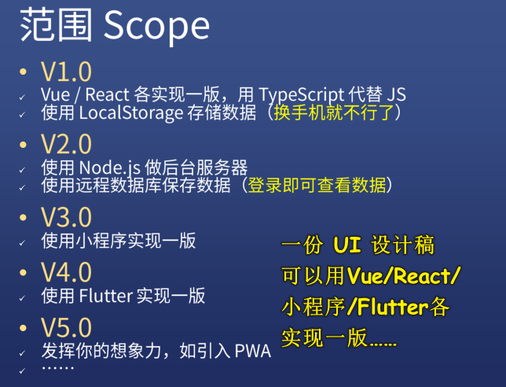

所谓的范围就是你在「V1.0」这个版本下，你需要实现什么……用到什么技术……

不需要单独去学 TS，跟着方方在做项目的过程中学习 TS

方方提供 API 接口

小程序 -> 很多公司都需要，设计稿不需要变

Flutter -> 可以做安卓、IOS 应用……

V5.0 -> 发挥你的想象力，把你学到的所有新技术都用到这个项目上！

> 一个好项目不在于这个项目有多么的复杂！而在于你能不能把你的**新点子**用到这个项目里边去！ -> 很多人都喜欢说「我要做复杂项目」，可复杂的项目无非就是把简单的功能重复，如 10 个页面变成 1000 个页面，这是很复杂，但没用呀！ -> 你还不如把项目做简单一点，做精美一点……然后在各个平台用不同的技术重复的实现它…… -> 这样的结果就是「你**学习速度会非常快**，很快就学会了 React、小程序、Flutter……」

### <mark>4）学习要求</mark>

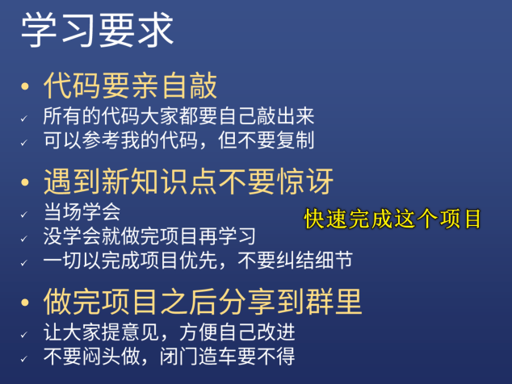

- 代码亲自敲就是「不要复制」的意思，每行代码都是你敲下的，而不是直接「拷贝粘贴」
- 日常工作中，很有可能遇到你从未接触过的技术，但请你不要惊讶！ -> 即便你不会，但公司还是要你去做，所以你要保持淡定，使用 CRM 学习法，直接干！
- **项目优先完成**，千万不要在做项目的过程中，因为不会 TS，所以跑去系统学习一遍 TS 后，再回来做项目 -> 对比在公司里，遇到一个需求，就先把这个需求给干了，而不是遇到某个自己不会的技术，转而学完这个技术再去干这个需求，不然，你 leader 会给你好脸色看？ -> 总之，**先把项目做完，其它情况再说**！
- 遇到某个功能不懂？ 不会做？-> 那就去抄（一行一行地抄……），那就去仿照，而不是复制粘贴
- 项目做完？ -> github/码云…… -> 推荐放到码云，因为访问速度快 -> 注意，这个记账应用的界面千万不要跟方方的设计稿一模一样，不然，你发给人家，人家一看并没有感到有很大的惊喜，最好你就**改改「颜色、标签形状、布局」、加一点小小的功能**等等 -> 公开让他人提意见，你改进，这样一来，面试官看到你项目也就没有多少 bug 了……
- 闭门造车是不好的 -> 对比其他人做的，改进你自己做的……

### <mark>5）教学形式</mark>

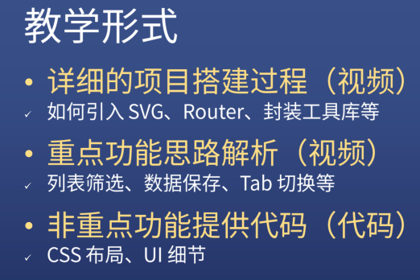

- 项目从 0 到 1 搭建是最难的 -> 填充功能较为简单
- 边看边敲 -> 敲完删了，自己撸一遍 -> 不会？再回到视频，看一下怎么回事儿，继续敲 -> 直到能不看视屏就能敲下来！
- 写 CSS 原则：
  - 布局：分析上下结构等……
  - 不写死宽高，只写最大宽度、最小宽度、最大高度、最小高度，透过内容撑开盒子大小 -> 这种写法最具响应式风格

### <mark>7）学习建议</mark>

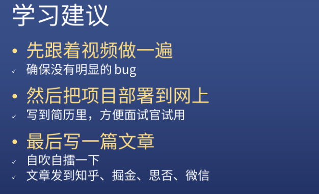

- 跟着视频做一遍 -> 做完咩有明显 bug -> 叉掉 -> 自己重写一遍（不看视频）
- 让别人看到
- 作为一个程序员一定要善于吹嘘自己 -> 你的能力是多少，和你表现出来的能力是多少，是两个概念……如**你的能力是 80 分，但别人觉得你的能力是 60 分**，为啥？因为你没有表现自己呀！唯有**表现自己**，才有可能晋升…… -> 发文章到掘金等网站……

### <mark>8）开发工具的选择？</mark>

我选择 VS Code，方方推荐 Webstorm

> 我电脑运行 Webstorm 很卡…… -> 因为我的系统盘（C 盘）不是 SSD 硬盘

## ★总结

- 先把项目做完，再考虑其它事儿……

## ★Q&A

### <mark>1）如何把方方的设计稿拷贝到我的 Figma 账户旗下？</mark>

> 为了能个性化更改！

方方的：

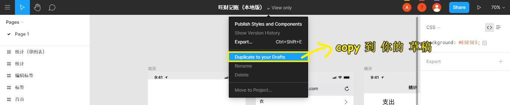

拷贝到自己的账户：

> 拷贝好后，打开「drafts」 -> 右击「Duplicate」

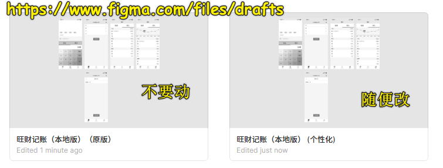

➹：[网页设计？你也可以——Figma 入门 - 少数派](https://sspai.com/post/47249)

➹：[FigmaChina：Figma 中文网，学习 Figma 从这里开始](https://figmachina.com/articles/)
