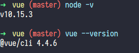
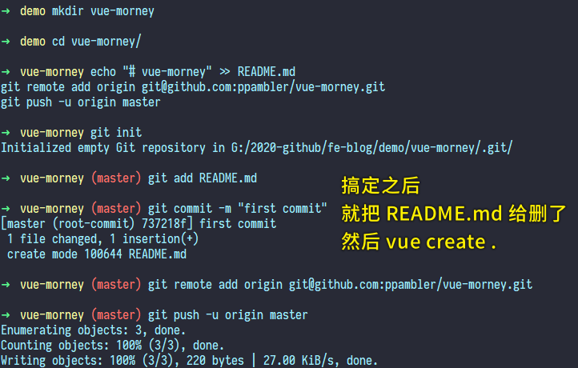
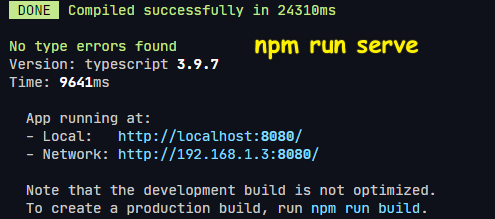
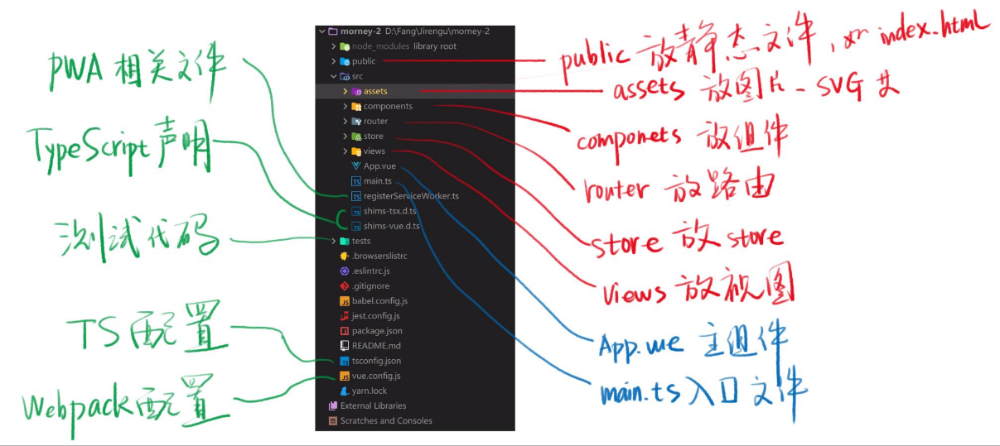
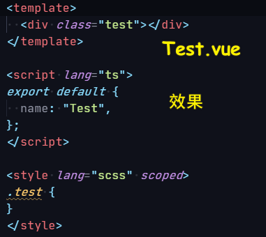
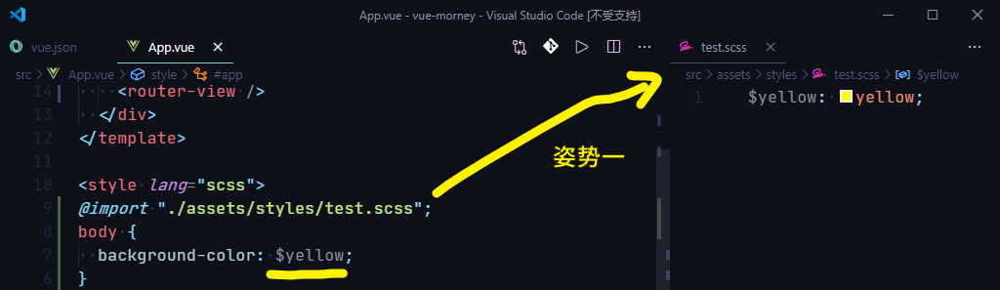
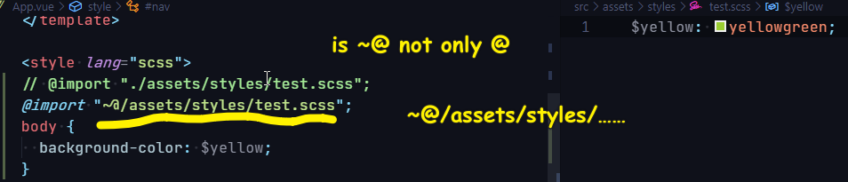
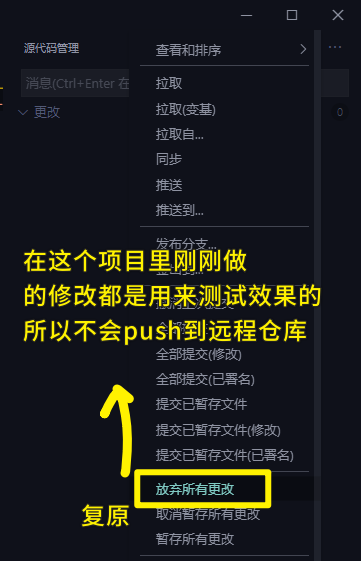

### ✍️ Tangxt ⏳ 2020-08-14 🏷️ Vue 项目搭建

# 04-旺财 Vue 项目搭建

## ★课前准备

要安装的东西：

1. 安装 `Node.js 10`（10 及以上的双数版本。安装目录可以改，一定不要在路径中出现中文和空格） -> 最好再安装个`nrm` -> `nrn use taobao`
2. 安装 `@vue/cli@4.1.2`
3. 安装 VSCode 最新版 or WebStorm 最新版
4. 科学上网 -> 能访问 Google

版本查看：

``` bash
node -v
vue --version
```



---

为啥方方推荐的是 `@vue/cli@4.1.2`，而不是目前的最新版呢？

> 因为就在方方录完课程之后，`@vue/cli` 就升级到了 4.2.0 了，而这个版本对 eslint 做了升级，导致视频里的课程代码在 4.2.0 版本里会报一个 eslint 错误，解决这个错误需要手动修改 eslint 配置，有点影响开发体验。 -> 这对新手不友好，当然，对于老手而言，自己解决这个 bug 就好了！

所以我用`@vue/cli 4.4.6`这个版本也是可以的！ -> 可以看到，**工具升级了，以前的做法会变得不一样……**

> 截止到 2020-08-15，`@vue/cli`的 [最新版本](https://github.com/vuejs/vue-cli) 是 `v4.5.3`

## ★目标

1. 用`@vue/cli`创建项目
2. 用 VueRouter 添加底部导航
3. 引入 SVG Icon
4. 部署到 GitHub 和码云

## ★使用 `@vue/cli` 创建项目

> 在做这个项目的过程中，你会遇到一些奇奇怪怪的知识，如编辑器的使用、在什么情况下进行优化等等 -> 这些东西书本上咩有，也是你想不出来的东西 -> **做了就会的知识，不做就不会的知识**

### <mark>1）项目起名？</mark>

一般来说，**项目名跟产品名可以不一样**，如产品名是「wangcai（旺财）」，那么你可以取「more-money（更多的钱）」 -> 合并这两个单词，得出最终的项目名：「**morney**」

> 根据这个「morney」项目名，你可以在 GitHub 搜索找到其他同学做的项目：[Search · morney](https://github.com/search?q=morney&type=)

找到的项目：

- [yybb717/morney: 少女心记账项目源代码](https://github.com/yybb717/morney)：<http://yybb717.xyz/morney-website/#/money>
- [qwxying/morney: 【小七记账】Vue 版](https://github.com/qwxying/morney)：<https://qwxying.github.io/morney-website/#/money>
- [minured/morney-source: 氢记账](https://github.com/minured/morney-source)：<https://minured.top/morney/#/money>
- [JonieFu/complete-morney: 随心记账预览](https://github.com/JonieFu/complete-morney)：<https://joniefu.github.io/complete-morney/#/money>
- [Woozyzzz/crumb-morney: 点滴记账](https://github.com/Woozyzzz/crumb-morney)：<https://woozyzzz.github.io/crumb-morney-website/#/money>
- ……

### <mark>2）创建项目</mark>

> 方方推荐用 `yarn` 来创建项目，因为这比 `npm` 会更快一点，但我之前用过`yarn`了，在用`yarn`安装依赖包的过程中遇到了一个我无法解决的 `bug`，所以我就改用 `npm`了！ -> 如果你用`yarn`，那么你千万不要用 `npm` 来安装 `yarn`，在 windows 系统下，你可以用 `Scoop`来安装！

在 GitHub 上新建一个远程仓库 -> 「vue-morney」（不用要初始化「README.md」什么的，就是创建一个**没有提交记录的空仓库**) -> 会得到一些命令行……

在 本地创建一个「vue-morney」目录 -> `cd vue-morney` -> 把之前得到的那些命令行在这个目录旗下运行一下：



``` bash
# vue-cli 默认是用「yarn」安装依赖包的，我改了默认配置，用的是「npm」！
vue create vue-morney
# or
vue create .
```

> 关于这个项目名，之后会有「react-morney」、「mp-morney」、「flutter-morney」……

配置：


> 不用「history」模式，是因为需要在后台配置一下这个路由，而我们这个项目是 LocalStorage 版的……所以就不需要用「history」模式了……
> 
> 目前，单元测试流行的是「Jest」
>
> 不要把这个配置存为模板，因为这个配置是很全的……当然，如果你存为模板也没事，你直接在网上搜索如何更改 vue-cli 的默认配置就好了！

如果项目创建过程很慢 -> 请使用淘宝源安装依赖包……

> 不要使用 `cnpm` -> 因为这工具不怎么维护了 -> 用 `nrm` 切换成淘宝源就好了

如果你看到`error`，那就是失败 -> 看到`warn`，不用管它 -> 看到`success`，就是安装成功！

测试项目是否安装成功（一般不用命令行终端运行该命令，而是打开编辑器 -> 打开终端 -> 运行命令）：

``` bash
npm run serve
```




`push` 到 远程仓库……

---

接下来，介绍一下项目里边每个目录是干嘛用的……

## ★目录结构说明



`public` 目录里边放的东西是**不会变的**，而 `src/assets` 目录下的东西则是**会变的！**

`src`是`source`的缩写，所有的源代码都应该在`src`目录里边

除了 html、css、js、ts 之外的所有源代码都应该放在 `assets`（该目录里边可新建其它目录）里边，如背景图片、SVG 等等

`components`里边只放组件，除了组件，啥也不放，同理 `router`就是放路由的，`store`就是用来放 store（集中式管理应用的所有组件状态）的，`views`就是用来放是视图的！

`views` 与 `components` 的区别：

一般来说，如果是比较重要的页面，如首页、关于页等都会放在`views`目录里边，如果是页面的一部分，那么就放在 `components`里边！ -> 简单来说，`views`就是**最外层的组件**，而`components`就是**被包裹的小视图、小组件**……

`App.vue` -> 整个应用的最外面包裹的组件

`main.ts` -> 渲染这个`App.vue`组件的

`registerServiceWorker.ts`、`shims-tsx.d.ts`、`shims-vue.d.ts` -> 这三个用到再说

`tests` -> 放测试文件

剩下的都是一些配置文件 -> 其中 `tsconfig.json`、`vue.config.js`（加`loader`之类的）可能会改，而其它的一般基本不用改！

总之，我们一般只改`src`目录里边的东西！

## ★添加代码片段 snippets

安装 VSCode 插件：

- Vue VSCode Snippets
- Vetur

自己配置代码片段：

``` json
{
  "addTS": {
    "prefix": "!ts",
    "body": [
      "<template>",
      "<div class=\"${TM_FILENAME_BASE/(.*)/${1:/downcase}/}\">",
      "",
      "</div>",
      "</template>",
      "",
      "<script lang=\"ts\">",
      "export default {",
      "name: '$2${TM_FILENAME_BASE}'",
      "}",
      "</script>",
      "",
      "<style lang=\"${3:scss}\" scoped>",
      "  .${TM_FILENAME_BASE/(.*)/${1:/downcase}/} {}",
      "</style>",
    ],
    "description": " .vue 文件初始化"
  }
}
```

测试效果：



## ★JS 或 TS 里使用`@`

`@`就是`/src`的别名！ -> 为什么需要？ -> 因为这就不用让我们去想到底是几级的上一级目录了……直接**从上到下找**，而不是**从下到上再到下**…… -> 简单来说就是「**不用自己计算相对路径了**」


## ★CSS 或 SCSS 里使用`@`

引入 CSS 姿势一：



引入 CSS 姿势二：



> 该姿势在 Webstorm 里会爆红 -> 需要自行配置一下……

---

把刚刚测试的内容都删了：



## ★了解更多

➹：[是时候放弃用 cnpm 命令了 - CNode 技术社区](https://cnodejs.org/topic/552212ba01b6c9310d8e9959)

➹：[在 VS Code 使用 Prettier 排版 Vue 程式碼 - Paul Tsai's Blog](https://www.paultsai.com/vscode-prettier-vue/)