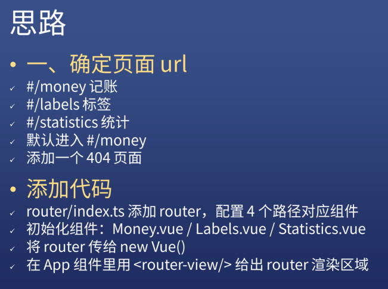
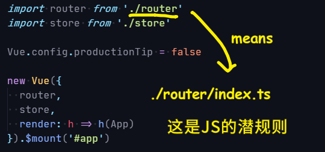
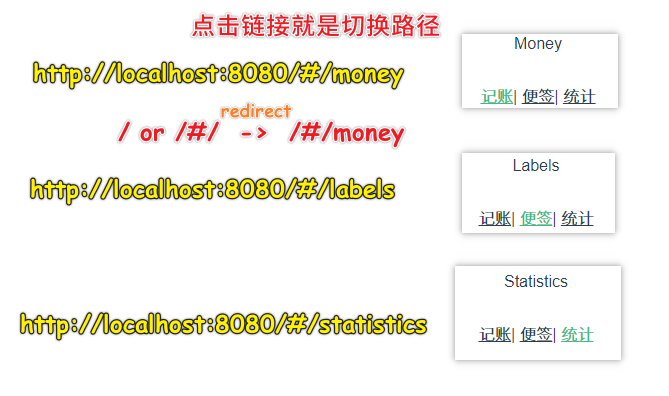
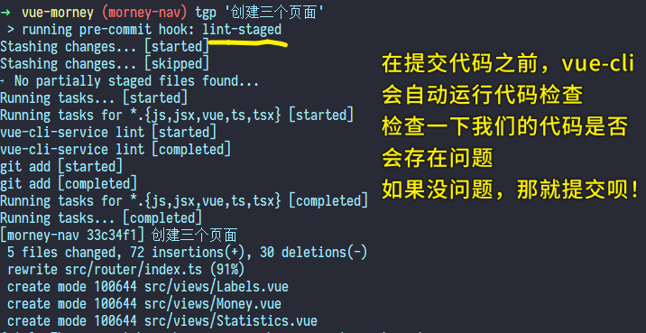
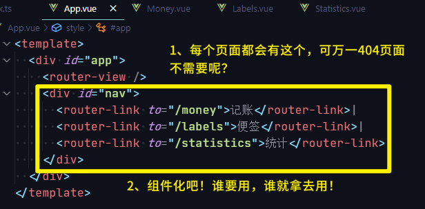
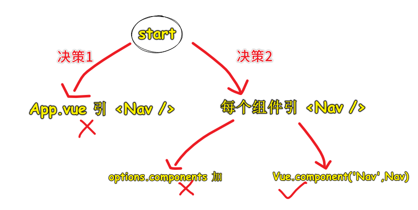
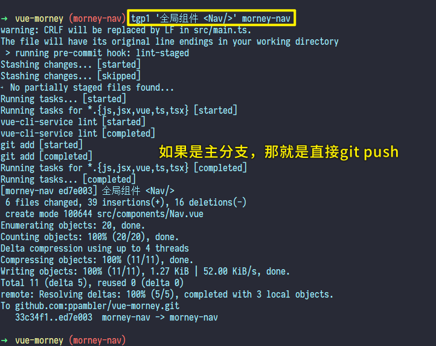
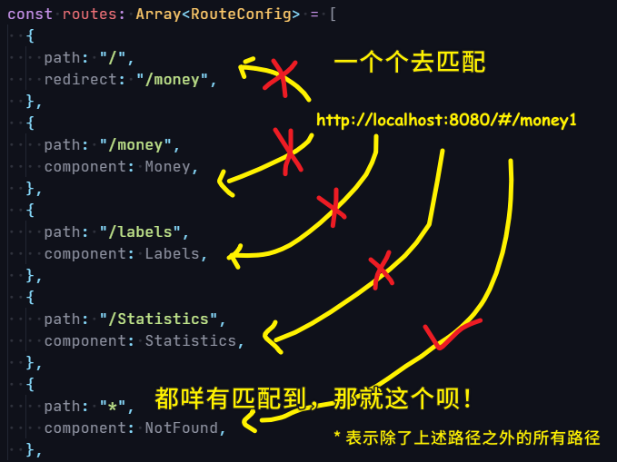
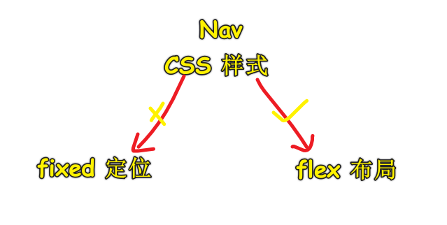
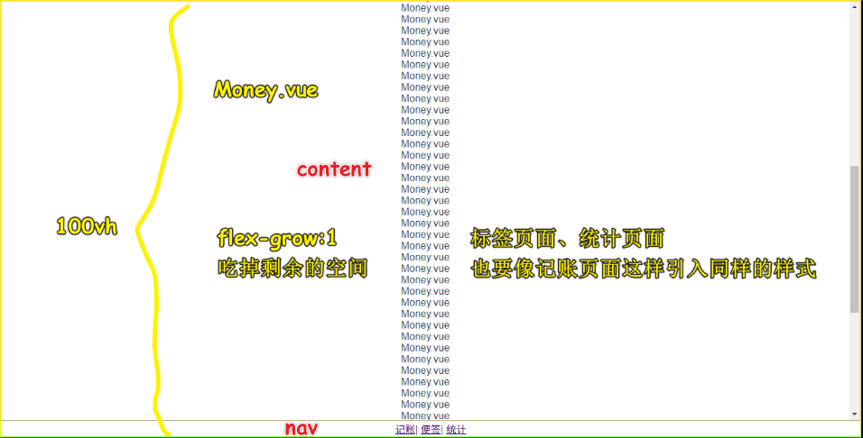

### ✍️ Tangxt ⏳ 2020-08-15 🏷️ Vue 导航栏

# 05-旺财 Vue 导航栏

> 打开设计稿，先把底部的导航栏给做出来！

## ★使用 VueRouter

1）思路



我们透过 hash 模式来确定每个页面的路径

注意，用户**乱输入路径**就会进入到「404」页面！

Tips：

- `git reset --hard HEAD`：可以把当前在工作区里的所有变动给删掉…… -> 你写了无意义的代码，不想一个个删，那么你就重置一下吧！
- TypeScript Importer：可自动`import` -> 我测试未成功，所以我只好手动 `import` 了 -> 感觉 Webstorm 更香！
- 自动找到 `index` 文件：

  

2）做法

切换路径展示不同的内容：

1. 创建三个页面，往路由表里边配置 4 个路径，并给上相应的组件……（没有用命名路由）
2. 初始化三组件 -> 添加一些无关紧要的内容
3. 把 `router` 传给 `new Vue()`
4. 在 App 组件里搞个界面用来展示路由所对应的内容…… -> 添加`router-link`，用点击的方式来切换路由，而不是在地址栏里输入不同的路径来切换路由……

代码：[创建三个页面 · ppambler/vue-morney@33c34f1](https://github.com/ppambler/vue-morney/commit/33c34f1a149a4fe0e6b8582d9f5ace6460789eba)

效果：



关于把代码提交到远程分支：

``` bash
git add .
git commit '创建三个页面'
git push origin morney-nav:morney-nav
```



---

接下来要做的：

- 加样式
- 思考一下目前这样做有没有什么问题

> 这个「目前这样做」指的是「创建三个页面」这个提交代码里的做法！

## ★将 Nav 组件做成全局组件

1）为啥要把导航栏组件化？

实际工作中做项目，leader 是不怎么允许你犯错误的！但是自己在做项目的时候，其实犯得错误越多越好！

为啥这样说呢？

因为：


都犯完了，那么这就是「领域专家」了！

举例来说，目前我们做的这个项目，「导航栏」功能面临着两条路可选：



- 写在 `App.vue` 的导航栏 -> 如果「404」页面不用导航栏呢？难道我们要写一个`v-if`判断一下路径吗？（这样做很麻烦）
- 把导航栏包装成一个组件，谁要用，谁就拿去用！

2）搞一个 Nav 组件

引入组件的两种姿势：

- 为每个页面都手动引入一个`Nav`组件 -> 很麻烦
- 全局引入 -> `main.ts` -> 全局注册一个`Nav`组件

代码：[全局组件 <Nav/> · ppambler/vue-morney@ed7e003](https://github.com/ppambler/vue-morney/commit/ed7e0038e9296ebe4191b0ff8a2b6b157bbae74d)

3）利弊权衡，最终的决策

> 每一条路都走了，那就是经验加成……



> 如何确定哪个决策是对的？ -> **把所有路都走一遍**，权衡优缺点，选择自己目前认为非常合适的做法！

市面上大部分的前端课程，都**直接告诉你走图上那条我们最终选择的「第三条路」**，而前边两条有错的路是不会告诉你的……

而这就会导致这样的问题：

在面试的时候，面试官经常问「你遇到过一个比较难的技术问题是什么？」

面对这样的问题，你肯定会回答「没有遇到过什么比较难的技术问题」，毕竟，你所接触到的例子，都是**别人直接告诉你答案的**……

所以，对于方方讲的这个「引入`Nav`」的例子，我们就可以回答说：

1. 我在我的网站引入全局导航的时候，我遇到一个比较难的问题
2. 我首先在`App.vue`引`<Nav />`，发现这样做有很多缺点，如……（把缺点说出来）
3. 于是我就换了一个思路——在每个组件引 `<Nav />`
   1. 一开始我用的是 `options.components` 引入，但这种姿势也有 xxx 这样的缺点
   2. 为了精益求精，我想到了第 4 步，在`main.ts`里边，全局注册`Nav` 组件 -> 对边其它的做法，这种更方便……

面试官的感受 -> 在你表达的过程中，会带入进去，最后，给出评价「**思考全面**」

虽然最终所选择的方案，并不难，但这所谓的难是**难在这过程足够曲折**……

> 难不难不在于结果难，而在于选择这个最终结果的过程足够曲折……

---

一个提交到远程分支上的技巧：

``` bashrc
tgp1() {
  git add .
  git commit -m "$1"
  git push origin $2:$2
}
```

效果；



---

目前，我们已经确定了该如何加导航栏了，那么接下来就是「加样式」！

## ★VueRouter 404 页面

1）为什么需要？


用户输入一个错误的网址，结果得到的结果是一片空白，所以我们需要提示用户「你输入的这个网址有问题！」

2）怎么做？

文档：[动态路由匹配 - Vue Router](https://router.vuejs.org/zh/guide/essentials/dynamic-matching.html#%E6%8D%95%E8%8E%B7%E6%89%80%E6%9C%89%E8%B7%AF%E7%94%B1%E6%88%96-404-not-found-%E8%B7%AF%E7%94%B1)

1. 创建一个`NotFound.vue` -> 提示信息+返回首页
2. 配置路由 -> 路径咩有匹配到前几个数组元素，那么就渲染这个`NotFound`组件呗！

路由表里边的路径匹配是这样的：



> 先匹配前边 4 个，如果这 4 个都不成功，那就是「`*`」了！

返回首页有两种姿势：

``` html
<!-- 一般选择这种高级姿势 -->
<router-link to="/">返回首页</router-link>
<a href="#/">返回首页</a>
```

> 一般来说，能使用高级姿势，那就使用高级姿势！

代码：[添加 404 页面 · ppambler/vue-morney@fe8cc88](https://github.com/ppambler/vue-morney/commit/fe8cc88ad1d5b7b10e00d29ddea9d335c778c841)

效果：


## ★用 Fixed 还是用 Flex 布局

1）加样式，同样有两条路可以走

> 最好把这两条路都走一遍……当然，如果你时间不够，那就使用正确答案——Flex 布局！



根据设计稿，让导航栏在视口的最底部，我们有俩种姿势可以做到：

- fixed -> PC 上好说，但手机上多 bug，尤其是 IOS
- flex -> PC 和手机都好说！

2）使用 flex 布局

关于 `Nav`组件的 `class` 名 -> 不要叫`site-nav`之类的，直接用一个**最简单的名字`nav`，然后再加上 `scoped`** 就好了！ -> `scoped`的原理：「在元素上加个随机属性`data-v-x1`」+「属性选择器`.nav[data-v-x1]`」 -> 不加`scoped`的话，那就是直接`.nav`了！

做法：

1. `Money.vue`上下布局 -> `content`+`nav` -> 全局样式写在`App.vue`（该组件不要加`scoped`，不然样式就有局限性了）

代码：[Demo](https://github.com/ppambler/vue-morney/commit/1fc69c326effa943449e1b8ec0dd56265e958db6)

效果：



这样做的问题：

其它页面也要这样做 -> 代码需要复制两遍 -> 假如`Money`的样式写错了，我们除了要改`Money`的样式以外，还得再改两遍（标签页面、统计页面） -> 假如有 20 个页面也用到了，那么就得再改 20 遍……

> 重复三次就会有两次 bug 的可能性……

## ★Layout 组件 & slot 插槽——我与重复不共戴天

