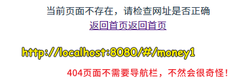
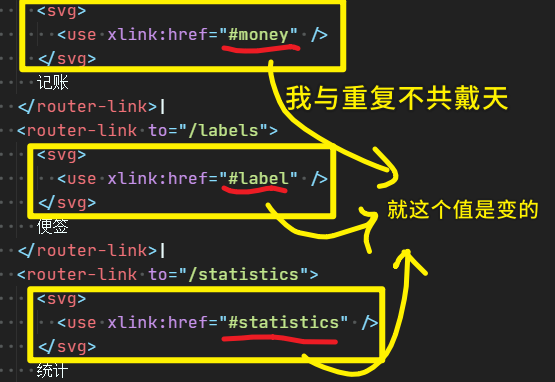

### ✍️ Tangxt ⏳ 2020-08-15 🏷️ Vue 导航栏

# 05-旺财 Vue 导航栏

> 打开设计稿，先把底部的导航栏给做出来！

## ★使用 VueRouter

### <mark>1）思路</mark>


我们透过 hash 模式来确定每个页面的路径

注意，用户**乱输入路径**就会进入到「404」页面！

Tips：

- `git reset --hard HEAD`：可以把当前在工作区里的所有变动给删掉…… -> 你写了无意义的代码，不想一个个删，那么你就重置一下吧！
- TypeScript Importer：可自动`import` -> 我测试未成功，所以我只好手动 `import` 了 -> 感觉 Webstorm 更香！
- 自动找到 `index` 文件：

  

### <mark>2）做法</mark>

切换路径展示不同的内容：

1. 创建三个页面，往路由表里边配置 4 个路径，并给上相应的组件……（没有用命名路由）
2. 初始化三组件 -> 添加一些无关紧要的内容
3. 把 `router` 传给 `new Vue()`
4. 在 App 组件里搞个界面用来展示路由所对应的内容…… -> 添加`router-link`，用点击的方式来切换路由，而不是在地址栏里输入不同的路径来切换路由……

代码：[创建三个页面 · ppambler/vue-morney@33c34f1](https://github.com/ppambler/vue-morney/commit/33c34f1a149a4fe0e6b8582d9f5ace6460789eba)

效果：


关于把代码提交到远程分支：

``` bash
git add .
git commit '创建三个页面'
git push origin morney-nav:morney-nav
```


---

接下来要做的：

- 加样式
- 思考一下目前这样做有没有什么问题

> 这个「目前这样做」指的是「创建三个页面」这个提交代码里的做法！

## ★将 Nav 组件做成全局组件

### <mark>1）为啥要把导航栏组件化？</mark>

实际工作中做项目，leader 是不怎么允许你犯错误的！但是自己在做项目的时候，其实犯得错误越多越好！

为啥这样说呢？

因为：


都犯完了，那么这就是「领域专家」了！

举例来说，目前我们做的这个项目，「导航栏」功能面临着两条路可选：


- 写在 `App.vue` 的导航栏 -> 如果「404」页面不用导航栏呢？难道我们要写一个`v-if`判断一下路径吗？（这样做很麻烦）
- 把导航栏包装成一个组件，谁要用，谁就拿去用！

### <mark>2）搞一个 Nav 组件</mark>

引入组件的两种姿势：

- 为每个页面都手动引入一个`Nav`组件 -> 很麻烦
- 全局引入 -> `main.ts` -> 全局注册一个`Nav`组件

代码：[全局组件 <Nav/> · ppambler/vue-morney@ed7e003](https://github.com/ppambler/vue-morney/commit/ed7e0038e9296ebe4191b0ff8a2b6b157bbae74d)

### <mark>3）利弊权衡，最终的决策</mark>

> 每一条路都走了，那就是经验加成……


> 如何确定哪个决策是对的？ -> **把所有路都走一遍**，权衡优缺点，选择自己目前认为非常合适的做法！

市面上大部分的前端课程，都**直接告诉你走图上那条我们最终选择的「第三条路」**，而前边两条有错的路是不会告诉你的……

而这就会导致这样的问题：

在面试的时候，面试官经常问「你遇到过一个比较难的技术问题是什么？」

面对这样的问题，你肯定会回答「没有遇到过什么比较难的技术问题」，毕竟，你所接触到的例子，都是**别人直接告诉你答案的**……

所以，对于方方讲的这个「引入`Nav`」的例子，我们就可以回答说：

1. 我在我的网站引入全局导航的时候，我遇到一个比较难的问题
2. 我首先在`App.vue`引`<Nav />`，发现这样做有很多缺点，如……（把缺点说出来）
3. 于是我就换了一个思路——在每个组件引 `<Nav />`
   1. 一开始我用的是 `options.components` 引入，但这种姿势也有 xxx 这样的缺点
   2. 为了精益求精，我想到了第 4 步，在`main.ts`里边，全局注册`Nav` 组件 -> 对边其它的做法，这种更方便……

面试官的感受 -> 在你表达的过程中，会带入进去，最后，给出评价「**思考全面**」

虽然最终所选择的方案，并不难，但这所谓的难是**难在这过程足够曲折**……

> 难不难不在于结果难，而在于选择这个最终结果的过程足够曲折……

---

一个提交到远程分支上的技巧：

``` bashrc
tgp1() {
  git add .
  git commit -m "$1"
  git push origin $2:$2
}
```

效果；


---

目前，我们已经确定了该如何加导航栏了，那么接下来就是「加样式」！

## ★VueRouter 404 页面

### <mark>1）为什么需要？</mark>


用户输入一个错误的网址，结果得到的结果是一片空白，所以我们需要提示用户「你输入的这个网址有问题！」

### <mark>2）怎么做？</mark>

文档：[动态路由匹配 - Vue Router](https://router.vuejs.org/zh/guide/essentials/dynamic-matching.html#%E6%8D%95%E8%8E%B7%E6%89%80%E6%9C%89%E8%B7%AF%E7%94%B1%E6%88%96-404-not-found-%E8%B7%AF%E7%94%B1)

1. 创建一个`NotFound.vue` -> 提示信息+返回首页
2. 配置路由 -> 路径咩有匹配到前几个数组元素，那么就渲染这个`NotFound`组件呗！

路由表里边的路径匹配是这样的：


> 先匹配前边 4 个，如果这 4 个都不成功，那就是「`*`」了！

返回首页有两种姿势：

``` html
<!-- 一般选择这种高级姿势 -->
<router-link to="/">返回首页</router-link>
<a href="#/">返回首页</a>
```

> 一般来说，能使用高级姿势，那就使用高级姿势！

代码：[添加 404 页面 · ppambler/vue-morney@fe8cc88](https://github.com/ppambler/vue-morney/commit/fe8cc88ad1d5b7b10e00d29ddea9d335c778c841)

效果：



## ★用 Fixed 还是用 Flex 布局

### <mark>1）加样式，同样有两条路可以走</mark>

> 最好把这两条路都走一遍……当然，如果你时间不够，那就使用正确答案——Flex 布局！


根据设计稿，让导航栏在视口的最底部，我们有俩种姿势可以做到：

- fixed -> PC 上好说，但手机上多 bug，尤其是 IOS
- flex -> PC 和手机都好说！

### <mark>2）使用 flex 布局</mark>

关于 `Nav`组件的 `class` 名 -> 不要叫`site-nav`之类的，直接用一个**最简单的名字`nav`，然后再加上 `scoped`** 就好了！ -> `scoped`的原理：「在元素上加个随机属性`data-v-x1`」+「属性选择器`.nav[data-v-x1]`」 -> 不加`scoped`的话，那就是直接`.nav`了！

做法：

1. `Money.vue`上下布局 -> `content`+`nav` -> 全局样式写在`App.vue`（该组件不要加`scoped`，不然样式就有局限性了）

代码：[Demo](https://github.com/ppambler/vue-morney/commit/1fc69c326effa943449e1b8ec0dd56265e958db6)

效果：


这样做的问题：

其它页面也要这样做 -> 代码需要复制两遍 -> 假如`Money`的样式写错了，我们除了要改`Money`的样式以外，还得再改两遍（标签页面、统计页面） -> 假如有 20 个页面也用到了，那么就得再改 20 遍……

> 重复三次就会有两次 bug 的可能性……

重复三次布局：[Demo](https://github.com/ppambler/vue-morney/commit/dc665304272d618cb6d53ad33eeb46de2758da74)

## ★Layout 组件 & slot 插槽——我与重复不共戴天

> 方方的理念：我与重复不共戴天，重复在，我就不在，我在，重复就不在，我们俩个不能杵在同一片天下


### <mark>1）目前情况</mark>


三个页面的 HTML 结构是重复的（`content`除外），而且样式也是重复的

所以，我们能否把这俩重复部分提到另外一个组件去呢？

### <mark>2）Layout 组件</mark>

> 插槽：其它组件引入这个`Layout`组件，把内容插到这个`Layout`组件去！

做法：

1. 把重复的提取成一个组件——`Layout`
2. 全局注册组件 -> 因为有三个组件都要用它，这一点跟`Nav`组件一样（**其实可以不用全局注册`Nav`组件，直接把该组件注册到`Layout`里边去就好了！**）
3. 那三个页面使用`Layout`组件，把样式都删了，把不同的内容写到`Layout`标签去就好了！

代码：[Demo](https://github.com/ppambler/vue-morney/commit/538854e88ff6d39f7d3b7826fe293016f7048c49)

代码整体上看，变得好简洁。工程师与码农的区别是：

- 码农只知道复制粘贴
- 工程师是会把「复制代码」简化封装

方方一直强调「**初级程序员就是调 API，中级程序员就是封装**」

如果你有把重复的代码封装成组件的话，如`Layout`组件这样，那么你就比低级程序员高级很多了！

> 有时候 webstorm 有红色的小波浪线是因为它慢了卡了……过一会儿就没事儿了

小结：

- 把**重复的玩意儿**放到一个组件里边去
- 把**不重复的玩意儿**透过插槽插进去……

编程就咩有复杂的东西，因为编程的最终目的就是把复杂的东西变简单！ 

如：


## ★使用 `svg-sprite-loader` 引入 icon

> 最新的前端做的 icon 不用什么雪碧图，而是直接用 svg icon

### <mark>1）找 3 个 svg 图标放到我们的项目中去</mark>

1. 到 <https://www.iconfont.cn/> 里边找 3 个图标 -> 处理 -> 下载`.svg`
2. 把下载的 3 个`.svg`放到`assets/icons`目录里边（一般先放在这个目录，当然，你也可以放在`public`目录）

svg 是 xml 代码，话说，我们该如何把这些 svg icon 引入到我们的项目中去呢？

### <mark>2）使用 svg 图标</mark>

我们无法直接在 ts 中引入 svg 图标，不然会报「`ts cannot find module svg`」这样的错误 -> 配置一下：

``` ts
// 在 shims-vue.d.ts 里边追加
declare module "*.svg" {
  const content: any;
  export default content;
}
```


我们想要的是 `svg use`  的使用方法，而不是直接一个路径字符串……

所以如何做？

我们需要一个 loader——`svg-sprite-loader`

安装 loader：

``` bash
npm install svg-sprite-loader -D
# via yarn
yarn add svg-sprite-loader -D
```

安装成功后，我们需要配置一下，但是这些配置是`webpack.config.js`的，而我们这个项目是用`vue.config.js`来配置的 -> **把官方提供的 webpack 配置按照 vue-cli 文档翻译成`vue.config.js`支持的！**

配置代码：

``` js
// vue.config.js
const path = require("path");

module.exports = {
  lintOnSave: false,
  // 函数
  chainWebpack: (config) => {
    // __dirname root 目录 -> vue-morney/
    const dir = path.resolve(__dirname, "src/assets/icons");
   // config 是 vue 把 webpack API 封装之后暴露给我们使用的
    config.module
      .rule("svg-sprite")
      .test(/\.svg$/)
      .include.add(dir)
      .end() // 只包含 icons 目录，其它目录旗下的 .svg ，我不管
      .use("svg-sprite-loader") // use 一遍，再重复一遍……
      .loader("svg-sprite-loader")
      .options({ extract: false }) // 不要把它解析出文件来
      .end();

    // 配置插件 -> 文档上抄的！
    config
      .plugin("svg-sprite")
      .use(require("svg-sprite-loader/plugin"), [{ plainSprite: true }]);
    config.module.rule("svg").exclude.add(dir); // 其他 svg loader 排除 icons 目录，毕竟之前已经走过来了，不然就冲突了……

    // config.module
    //   .rule('svg-sprite')
    //   .test(/\.(svg)(\?.*)?$/)
    //   .include.add(dir).end()
    //   .use('svg-sprite-loader-mod').loader('svg-sprite-loader-mod').options({extract: false}).end()
    //   .use('svgo-loader').loader('svgo-loader')
    //   .tap(options => ({...options, plugins: [{removeAttrs: {attrs: 'fill'}}]}))
    //   .end()
    // config.plugin('svg-sprite').use(require('svg-sprite-loader-mod/plugin'), [{plainSprite: true}])
    // config.module.rule('svg').exclude.add(dir)
  },
};
```

再次使用的效果：


---

之前用 iconfont 的时候，我们是直接引入一个`xxx.js`文件的


---

在页面上引入了`symbol`标签之后（`import x from "@/assets/icons/money.svg";`就是在做把`symbol`标签引入到`body`这件事儿 -> 如何做到的？ -> loader 帮我们做的），我们就可以`use` svg 了！

> loader 做的事儿 -> 把`money.svg`变成`symbol`标签，然后放到`svg`标签这个舞台上！（会有很多个`symbol`放在舞台上，只要你`import`了，并且在 JS 中用到了） -> 把`svg`标签放到`body`里边

`use`是 xml 语法，默认还是用自闭合比较好！

``` js
import y from "@/assets/icons/label.svg";
console.log(x);
console.log(y);
```

``` html
<svg>
  <use xlink:href="#money" />
</svg>
```

效果：


以上做法就实现了一种非常好用的引入 icon 的一种机制！

不过，这需要解决两个工程问题：

1. 目前我们用一个 icon 就需要`import`一个 icon，可假如我有 20 个 icon 呢？那么我岂不是要`import` 20 下？ -> 我能否一下子就把`icons`目录下所有的`xx.svg`都给引入了呢？
2. use svg 这种写法很麻烦呀！每次都得 `……xlink:href……` 这样…… -> 我们能否把它简化一下，封装成一个组件？

> 我觉得还是使用外链的方式比较好！因为这比较好修改呀！而不是自己动手一个个下载 svg 图标！万一图标效果不好呢？岂不是还得修改一下，再重新下载？ -> 由于这个项目是会用到很多 icon 的，而不是仅仅就只有这 3 个 icon，所以我最后应该会改成外链的形式 -> 或许方方之所以这样讲是因为设计师会直接提供给我们一个个 svg icon，而不需要我们到 iconfont 里边找……

## ★ eslint 报错如何解决？

### <mark>1）错误</mark>


### <mark>2）做法</mark>


鸵鸟遇到危险就把头埋到地里边 -> 没有危险了！

看电视说，吸烟有害健康，引起肺炎，一咬牙就不看电视了 -> 没有危险了！

我们虽然可以让 webstorm 关掉提示的，但提交代码的时候也会检查的呀！ -> 所以我们可以这样做：


> 命令行关提示的意思是 -> 我们写上了注释，让命令行忽视了这个文件的检查，也就是「**怎么做到命令行关提示**」

但真正的做法，是把代码错误给真正解决了！而不是让我们无视它就行了！

改代码 -> 不用`require`，改用`import` -> 但是有些 node 版本是不支持`import`的


所以，第三种姿势是「改配置」：


---

最好的方式是改代码 -> 而改代码需要你去看 ESLint 的文档！当然，webstorm 的提示也可以帮到你！

ESLint 有几百项配置 -> 用上你的「狗手和狗眼」就能把报错给 GG 了！而不是让方方教了如何把具体的某个错误给 GG 了！

姿势优先级选择：

改代码 > 改配置 > 鸵鸟做法

> 我现在的状况挺像鸵鸟 -> 以为逃避就能解决问题……

## ★如何 import 一个目录

> 我们不想`import`一个个 svg icon！ -> `import`一个目录，所有`icon`就一次性引入了……

代码：

``` ts
// Nav.vue
let importAll = (requireContext: __WebpackModuleApi.RequireContext) =>
  requireContext.keys().forEach(requireContext);
try {
  // 不支持@，只能用相对路径
  importAll(require.context("../assets/icons", true, /\.svg$/));
} catch (error) {
  console.log(error);
}
```

> 上边这个代码 -> 经验告诉我们，在做单元测试的时候会失败，所以需要加个`try……catch……` -> 有错误就是把错误打出，而不是让代码运行中断！

效果：


这个代码哪儿来的？

方方搜遍全网搜到的 -> 初级程序员调别人的代码 API，中级程序员就是封装一些代码，高级程序员就是只要这个互联网上存在它的解决方案，我就一定能找到，即使互联网上没有，我也可以找人问到

> 没有两年经验是搜不到的 -> **任何难题都能想办法解决的这种能力！**

---

小结：

- 上边那段代码，可以实现将一个目录里边任意后缀的文件统一全部引入到当前文件 -> 请记住这个代码！

---

解决完第一个问题后，接下来解决第二个问题——封装 icon

## ★封装 icon 组件

### <mark>1）为啥要封装？</mark>



### <mark>2）怎么做？</mark>

1. 创建一个`Icon.vue`
2. 把重复代码提取出来，把动态的内容插进去
3. 把那段`import`目录的代码也搞过来
4. 由于很多个页面很多个地方都会用到，所以全局引入`Icon` -> 注意，**全局注册的组件不能太多，这一点一定要控制住！**
5. 组件使用方面是`<Icon name="xxx" />` -> 所以在定义`Icon`组件的时，得搞一个形参`name`
6. 给上样式

代码：[Demo](https://github.com/ppambler/vue-morney/commit/54ddfdd07df120c5ccc3b9bfbd71e489ece380ae)

效果：


---

在提交代码时，ESlint 检测出错了！


做法：

``` js
// 在 .eslintrc.js 的 rules 选项里边追加两个配置！
{
  rules: {
    "@typescript-eslint/no-var-requires": 0,
    "@typescript-eslint/no-explicit-any": 0,
  }
}
```

---

可以看到，很多时候，我们就是在把重复代码创建成一个组件就搞定了！

接下来要做到的：美化`Nav`（会重新命名`div`）

## ★给导航栏（Nav）添加 CSS

> 不要追求先讲一遍再用，就像是不要「放大招前吟唱」 -> 不要先学一遍`scss`，再去写`scss`，边用边学……不然，学一遍后再去用，很容易忘记自己之前学了什么……

### <mark>1）做法</mark>

1. `Nav.vue` -> 把 root `div` 改成 `nav`
2. `router-link`不是一个真正意义上的标签（咩有 `router-linl {}` 这种姿势） -> 添加 class `item` 加样式 -> `<a class="item"></item>`
3. 设计稿确定`item`的高度 -> 不要写死（内容填充） -> 在`body`里边给个默认行高 1.5（确定了，就不用每处都写上了）
4. `<Icon />`默认就有个`.icon`（svg 标签上有`.icon`），不需要`<Icon class="icon" />` 这样

用阴影的技巧就是不能让别人看出你用了阴影……就像是女生化妆了，但是看不出来，那这这就是牛逼！

代码：[Demo](https://github.com/ppambler/vue-morney/commit/2f4a8ef06314c004d625feb7d81de9bd04c0e429)

效果：


---

接下来做 -> 激活路由的时候，如何把对应的 icon 高亮！

## ★ `active-class` 的使用

> 路由激活 -> 点了一个链接，那么这个链接就应该高亮起来！

### <mark>1）做法</mark>

1. 利用 `router-link` 提供的 `active-class` 参数来搞（假设值为`x`） -> 当前页面的路由与 `router-link` 的 `to` 值一样的话，那么该`router-link`就会有个叫`x`的`class` -> `<a class="x">` -> 如何做到的？**每次路由切换都会刷新整个页面（包括底部的`Nav`**） -> 动态匹配`class`

代码：[Demo](https://github.com/ppambler/vue-morney/commit/2bbe0654406e96637afba6df2e4bab61e7630398)

效果：


> 如果路由并不完全相同，我也要激活，这一点该做怎么做呢？ -> 如`to="x-money"`之类的 -> 用到再说！

## ★更新 meta viewport

> vue 加上的 `viewport` 不够完全！ -> 抄手淘的

``` html
<!-- 改 public/index.html -->
<meta name="viewport" content="width=device-width,initial-scale=1,minimum-scale=1,maximum-scale=1,user-scalable=no,viewport-fit=cover">
```

我顺便把`label.svg`的大小也改了！

改的过程很简单：


代码：[Demo](https://github.com/ppambler/vue-morney/commit/cd0bf4db3645c2b22c1fbb9d206c4db2dbaa4318)

## ★了解更多

➹：[深入理解 flex-grow、flex-shrink、flex-basis - 掘金](https://juejin.im/post/6844904016439148551)

➹：[Unable to import svg files in typescript - Stack Overflow](https://stackoverflow.com/questions/44717164/unable-to-import-svg-files-in-typescript)

➹：[JetBrains/svg-sprite-loader: Webpack loader for creating SVG sprites.](https://github.com/JetBrains/svg-sprite-loader)

➹：[懒人神器：svg-sprite-loader 实现自己的 Icon 组件 - 好好写代码吧 - SegmentFault 思否](https://segmentfault.com/a/1190000015367490)

➹：[未来必热：SVG Sprites 技术介绍 «  张鑫旭-鑫空间-鑫生活](https://www.zhangxinxu.com/wordpress/2014/07/introduce-svg-sprite-technology/)

➹：[基于 vue-cli3 使用 svg-sprite-loader 在 vue 中引入 svg 图标 - front-gl - 博客园](https://www.cnblogs.com/mmzuo-798/p/13091689.html)

➹：[VUE-cli3 使用 svg-sprite-loader  - 掘金](https://juejin.im/post/6844903695478439949)

➹：[react native - ESLint: Require statement not part of import statement.(@typescript-eslint/no-var-requires) - Stack Overflow](https://stackoverflow.com/questions/59278151/eslint-require-statement-not-part-of-import-statement-typescript-eslint-no-va)

## ★总结

- 如何封装一个组件？如`Nav/Layout/Icon……`
- 如何把 ESLint 的报错提示给 GG 掉？
