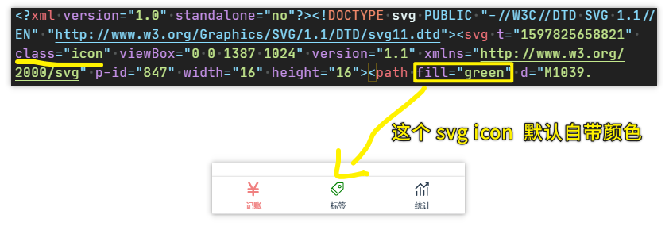
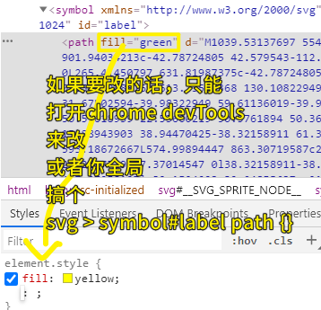
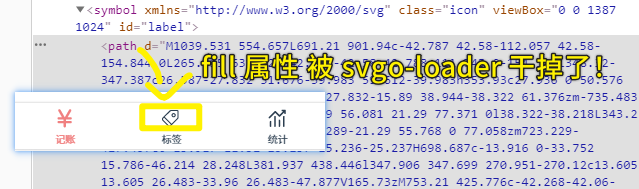
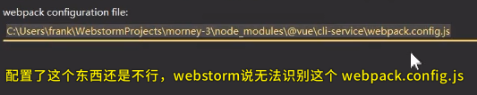
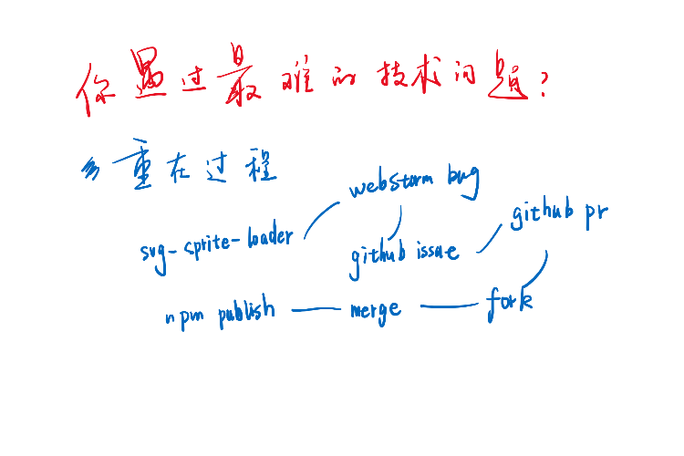

### ✍️ Tangxt ⏳ 2020-08-19 🏷️ SVG

# 06-SVG 的两个坑

## ★svgo-loader 删除 fill

> svgo -> o -> optimization（优化）

### <mark>1）经验是什么？</mark>

目前，我们基本上已经把应用的框架给搭起来了，但是这里边有一些对于我们而言是看不见的！

这些东西只有有经验的人才能看得出来！

什么是经验？


简单来说，就是只要你踩了坑，然后爬出来，那这就是「经验」了

如我如何快捷拷贝远程代码的地址？

> 错得越多获取的经验越多……如果你全都是对的，那么你基本上是获取不到什么经验的！

### <mark>2）获取经验？</mark>

> 主动踩坑，获取经验！ -> 你只要踩坑，才会遇到 bug，你不主动去踩坑，是不知道这个 bug 的！ -> 难道偶遇 bug，才是编程的魅力？

坑：svg icon 默认就有颜色，不需要我们点击路由

重现这个坑：



svg icon 的原文件默认就带颜色的，那么我们想改颜色都无法改！



所以怎么办？ -> 很简单，直接手动把源文件的这个 `fill` 属性去掉就好了！

可是假如有十几个 icon 呢？ -> 难道我要重复这样打开一个文件然后删除一个个 `fill` 属性？ -> 别忘了，我与重复不共戴天呀！

其实，我下载下来的 icon 都是批量去色的！（**以前我并不知道这样做是为什么，现在我倒是知道了！**）

当然，假如你下载下来的 icon 是没有批量去色的，那么你该怎么做呢？

能做到自动帮我删的 loader—— `svgo-loader`
> 不是把源文件的 `fill` 属性给删了，而是在使用的时候，就把它给删了 -> 源文件没有变化，变化的是页面里边的 `symbol` 标签旗下的 `path` 标签 -> `fill` 属性被删了！ -> 至此，我们就可以透过外部的 CSS 来 update svg icon 的颜色了！

做法：

1. 安装 `loader` -> 如果在安装的过程中报错说还需要其它 loader，那就先安装其它 loader 再安装这个 `svgo-loader`
2. 在 `vue.config.js` 里边配置 `loader`

配置代码：

``` js
xx.use('svgo-loader').loader('svgo-loader')
  .tap(options => ({
    ...options,
    plugins: [{
      removeAttrs: {
        attrs: 'fill'
      }
    }]
  })).end()
```

代码：[Demo](https://github.com/ppambler/vue-morney/commit/6c9fa43a1c7f80b39474b90c93f58d6eac9d7c82)

效果：



至此，我们就解决了如果 svg icon 自带颜色的问题了！

> 这个方案其实就是一种兜底方案吧！ -> 万一你忘记对 icon 批量取色了！

---

还有第二个坑！这个坑只有方方这个喜欢踩坑的人才能遇到！

## ★svg-sprite-loader-mod 解决 WebStorm 提示问题

这个坑我跳过了！ -> 因为我用的是 VS Code！

这个坑大概是这样的：

在其它组件文件的`style`里边导入一个样式文件 -> 结果这个`import`代码爆红了 -> 配置了一下`webpack`：



错误原因 -> svg-sprite-loader 的锅！（**破坏了 webstorm 的提示**）

其实这个 bug，已经有人提供了修复的代码的，只是官方没有去合并罢了！

所以方方的做法是把项目`fork`一份，把别人修复 bug 的代码合并一下，改一下名字，然后`publish`一下这个包（`svg-sprite-loader-mod`） -> 本地安装该包！ -> 解决 bug！

> 我开始明白为啥有那么多人去 `fork` 人家的代码了！ -> 很大可能是该项目有 bug，但是官方没有合并修复，只好自己去合并，然后自己改个名字`publish`这个包，然后在本地安装使用它！

做项目过程中与在学习过程中是不一样的 -> 做项目，你只要能把 bug 解决了，那就不管你这代码是从哪儿抄的！而学习过程中，则是脚踏实地一步步去敲去学习……

## ★你遇到最难的技术问题是什么？



面试官问到你「你遇到最难的技术问题是什么？」，那么你可以用这两个 svg 的坑来作为你的答案！ -> 把怎么解决这两个坑的过程说一遍就好了！

坑 1 -> 填坑 -> 坑 2 -> 填坑 -> 花了 4 小时发现 bug 原因所在，所有人都无法解决这个 bug，我就硬生生把这个 bug 给解决了！

重点捉住这个**过程难（尽可能描述过程艰难）**，而不是技术难！

> 过程越曲折，越艰难，花的时间越长！ -> 那就看上去越难！ -> 跟最终快速修复这个 bug 的技术是没关系的 -> **找 bug，找解决方案才是最难的，而不是做的那个方案过程才是最难的！**

