### ✍️ Tangxt ⏳ 2020-08-19 🏷️ Money 组件

# 07-Money.vue 组件（上）

* 代码：[Demo](https://github.com/ppambler/vue-morney/commit/df2fcb003bfa36770bc964245d2a03a131ea2438)
* 代码：[Demo](https://github.com/ppambler/vue-morney/commit/b9d02c5cbe54ea8bc16e813fcc21e9bc8e7dc7ad)
* 代码：[Demo](https://github.com/ppambler/vue-morney/commit/36463e534cf24f44d98ce9e935ef99673a2c105b)

## ★整体思路

1）概述

以怎样的顺序写 `Money.vue` ？（基于设计稿来搞）

1. HTML -> 结构怎么写
2. SCSS -> CSS 怎么试，如何组织 CSS 代码
3. TS -> 详细看看这个

2）写 HTML

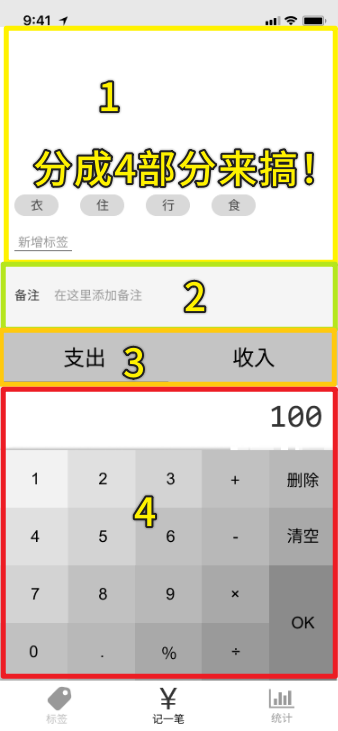

第一层：

> 在写的时候不用留意后边该怎么做！

``` html
<template>
  <Layout>
    <div>tags</div>
    <div>notes</div>
    <div>type</div>
    <div>number pad</div>
  </Layout>
</template>
```

`div` 里的内容实际上就是在给这 4 部分起名字呀！ -> 这样再进一步细分的时候，你就不会想不到类名了！

第二层（细化、递归第一层的）：

> 由于有 `scoped` ，所以元素的 `class` 可以写得很简短！

tags：

``` html
<div class="tags">
  <ul class="current">
    <li>衣</li>
    <li>食</li>
    <li>住</li>
    <li>行</li>
  </ul>
  <div class="new">
    <button>新增标签</button>
  </div>
</div>
```

notes：

> 左右两部分

``` html
<div>
  <label class="notes">
    <span class="name">备注</span>
    <input type="text" />
  </label>
</div>
```

> `lebel` 包住一个 `input` -> 老手做法！ -> 给「备注」加 `class` 是因为它也会改样式

types：

``` html
<div>
  <ul class="types">
    <li class="selected">支出</li>
    <li>收入</li>
  </ul>
</div>
```

> 为啥老师要多留一个 `div` 呢？ -> 留一个先，以防有用，如果之后写完了发现没用，那就删咯！

在写 HTML 的时候，不要去关心如何去实现 CSS，你只要知道 `li` 元素有了个 `selected` 的类后，那么该元素就会有个下划线样式！

numberPad：

> 简化了数字面板 -> 不要 `+-*/%` ……

``` html
<div class="numberPad">
  <div class="output">100</div>
  <div class="buttons">
    <button>1</button>
    <button>2</button>
    <button>3</button>
    <button>删除</button>
    <button>4</button>
    <button>5</button>
    <button>6</button>
    <button>清空</button>
    <button>7</button>
    <button>8</button>
    <button>9</button>
    <button>OK</button>
    <button>0</button>
    <button>.</button>
  </div>
</div>
```

给元素的 `class` 是最后给的，即你先这样：

``` html
<div>
  <div>100</div>
  <div>
    <button>1</button>
    <button>2</button>
    <button>……</button>
  </div>
</div>
```

然后根据子元素的内容再去给 `class` ！ -> 从外到里给 -> `numberPad > output > buttons`

---

要开始写 CSS 了吗？ -> 目前该文件有 50 多行！ -> 把样式写完后，大概 200 多行 -> 需要优化！

> 一个文件如果超过 150 行，那么一般就会把它拆成多个文件

---

接下来，给这 4 部分整上 CSS -> 写完后，给这 4 部分整体做个布局！（tags 部分处于最上方，而且占满空隙，而 numberPad 则是处于最下方，因为符合用户习惯！）

> 我以为先布局 ，透过写死的 4 部分高度，慢慢填充内容！ -> 而不是把 4 部分得高度透过内容填充，然后组合起来布局！ -> 总之简单来说，是布局架子先行，还是每一部分内容的样式写好了再套进去……

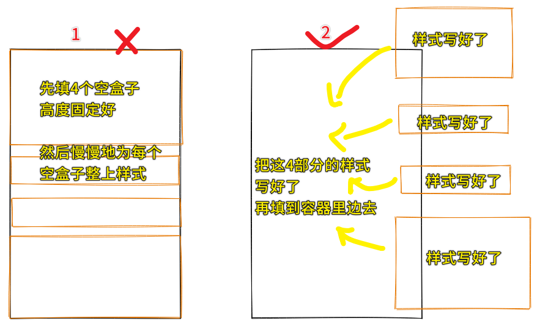

## ★CSS 思路

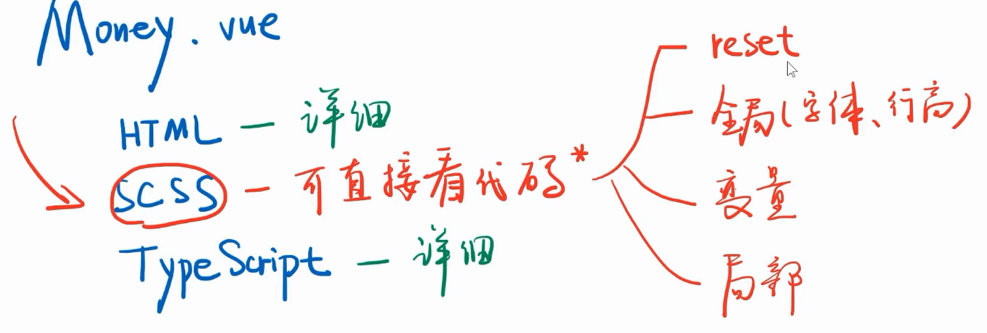

1）给 vue 组件加 scss

> 如果有 `scoped` ，那么这就意味着当前样式只对当前组件有效！

我们一般在写一个项目的 CSS 的时候，一般分为这几个部分：

1. reset -> **把所有的、默认的、你不想要的样式都给清空掉**！ -> 可抄淘宝等网站的，反正这些都是大同小异的！ -> `reset.scss`
2. 全局样式 -> **字体、行高等** -> `body {} or #app {}`
3. 全局变量 -> **确保每个组件用的红色是一样的**，而不是一个组件用的是浅红，另一个组件用的是浅浅红…… -> 高亮色 `$color-highlight`、字体`$font-hei` -> 所有与颜色相关的变量都用`color-`开头，同理，字体则是`font-`开头 -> `helper.scss` -> 注意，千万不要在`helper.scss`里边用上类似`.clearfix {}` 这样的类样式，因为如果你真这样做了，那么假如有 10 个文件引入了，那么这 10 个文件就会复制`.clearfix {}` 这个代码十次！而变量则不会，因为编译文件时会把这些变量给删了，最终的结果就是`helper.scss` 这个文件都会消失掉！ -> 总之，**`helper.scss` 只能放一些最终会消失的东西**！
4. 局部样式 -> **各个组件自己的样式**

> 一个忠告：不要在你的代码里留下任何没有用的代码，包括没有用的注释

2）字体使用的最佳实践

使用这个网站 [Fonts.css](https://zenozeng.github.io/fonts.css/) 提供的字体代码，可以保证你的网站不管在哪个平台里边都有好看中文或英文的字体显示！

用法：

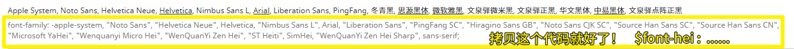

> 我这台电脑的中文字体默认用的是「思源黑体」，而英文则是其它的……

一个疑问：

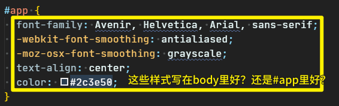

如果一个页面是多个部门一同开发的，如淘宝，那么就放在 `#app` 里 -> 如果一个页面是你自己一个人独立完成的，那么放哪儿都无所谓，反正你要明白，放在 `#app` 里的话，那么样式的效果就作用于 `#app` 旗下，所以你得保证 `#app` 没有其它兄弟元素了！

话说，为啥这个 `App.vue` 总会有这两行代码：

``` css
#app {
  -webkit-font-smoothing: antialiased;
  -moz-osx-font-smoothing: grayscale;
}
```

只对苹果系统有用 -> 尤雨溪经试验测试认为多了这两行代码字体会顺滑一点…… 

## ★可抄的 CSS 代码

1）CSS 第一部分

1、scss 语法 

使用`scss`语法，可以让 CSS 代码有作用域的感觉：

是

``` scss
// 读作 tags 里面的 current
.tags {
  > .current {

  }
}
```

而不是

``` css
.tags {

}
.tags > .current {

}
```

另外一个语法：

``` scss
// 读作：tags 本身如果被选中了
.tags {
  &.selected {

  }
}
```

2、如何弄圆角？

你这样写：`border-radius:50%;`，那么这是宽度的`50%`（默认的）

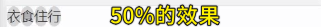

代码类似这样：

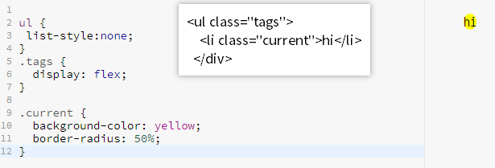

我们要做到我们想要的效果，得是高度的 50%，所以我们得要写个`height:24px;`，然后 `border-radius: 24/2 px;`

不过，`border-radius` 这个属性本身就支持 `/` 这种语法，所以最后浏览器解析出来的值还是 `24/2 px`

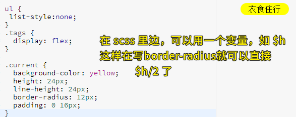

2）CSS 第二部分 & 第三部分

1、「支出」or「收入」被选中了，那么这该如何整条线出来？

使用绝对定位来搞，而不是直接给个 border 底边框，不然，这文字内容就会被抬高一点了……

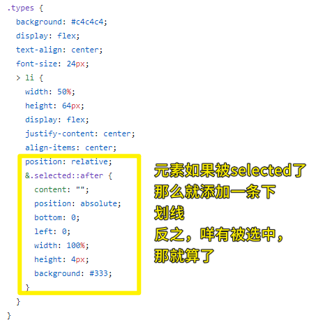

---

**把 CSS 全写完了，这样你去写 JS 的时候，你的思路才会比较清晰！不然，如果你混着写的话，会写着很乱的！**

> 以前我的做法是先把 JS 做了，再去整 CSS

3）CSS 第四部分

> 这部分看起来很复杂，但写 CSS 就是重复——flex+长宽高背景色，然后就完事儿了！ -> 写 CSS 就是在浪费你的时间

1、设计稿给出的「100」是等宽字体——编程字体 Consolas？

该字体，对于大部分设备而言是没有的，所以你可以给一个更加泛的等宽字体，也就是`monospace` -> `monospace`旗下有很多种等宽字体，如`Consolas`就是其中的一种！

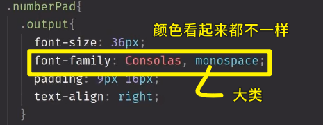

> 等宽字体「100」这 3 个字符是一样宽的，而普通字体，也就是非等宽字体，这 3 个字符中，`0`是要比`1`宽的 ！

2、如何确定数字面板里的每个 button 的高度？

button 的宽度是容易确定用百分比就好了，但是高度就不能这样用了，因为设计稿是针对 iPhone6/7/8 来设计的，如果设备是在 iPhone10 里边看这个网页的话，显然 button 的高宽比例 就显得很不一致了！

所以你就不能这样求高度的百分比：`64px / 667px = xx vh`

而是这接按设计稿给出多少高度就写多少高度 -> 如果设计师不服了，你就跟设计师理论一下……毕竟设计师 ta 没有给出每样屏幕高度尺寸不一样大小的设备里边这些按钮大小的具体比例是多少！

3、flex 定位行不通了？

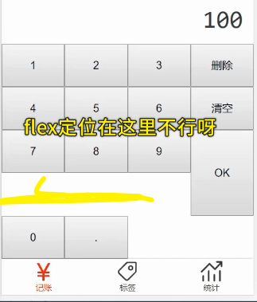

所以在这里，我们可以使用 `float` 定位 -> 右浮就好了！

> 这是一种经验处理方式 -> 以前用 flex 可以解决 99%的情况，但最后这 1% 需要你自己去瞎碰它！ -> 运气好可以解决，运气不好，还是无法解决，那就去问 CSS 写得好的、经验好的前端，如方方，大部分的前端写的 CSS 都是很辣鸡的，他们都只会用别人写的库，稍微复杂点的，他们就不会写了！

对了，如果这元素用了 `float` ，那么其父元素就得 `clearfix` 一下！

`.clearfix` 在哪儿写？

在 `App.vue` 里的 `style` 里边写 -> 但这种做法很 low

话说，需不需要给 `button` 元素追加一个 `clearfix`？ -> 不需要，不然，这就显得很奇怪了，因为这就像是**为了解决某个 bug，而专门去写了一个类**！

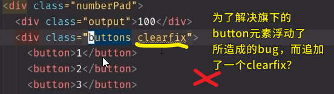

所以我们为了少写一个无厘头的`class`，那就这样做：

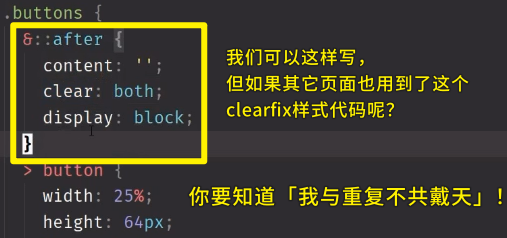

为了减少重复，我们使用了 scss 提供的 「placeholder」，也就是「%」功能！

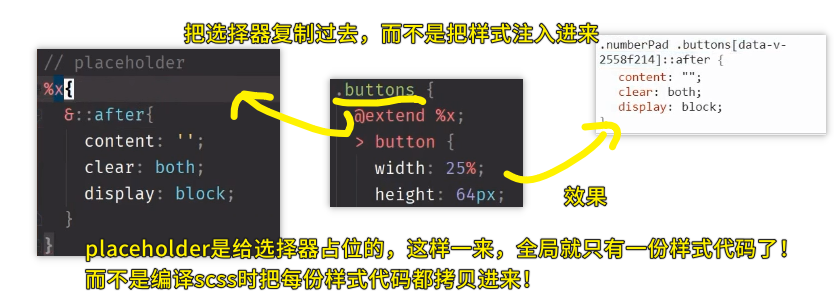

如果其它元素也用到了，那么效果就是这样子：

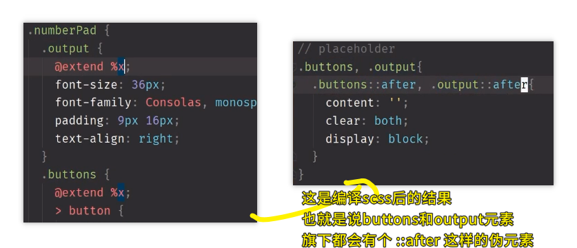

补充一下，最终的编译的效果：

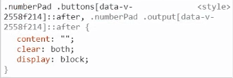

> 学 CSS 意会就好了，如果非得想去搞清楚的话，反而学不会 CSS！ -> 总之，就是有那么一个意思就好了，如写了 `@extend %x`就相当于是在全局里边搞了个有`scoped`的 `x` 样式！

关于 `x` 的命名 -> 以功能为名，如`clearFix`，当然，你也可以是 `clear-fix` -> 方方个人喜欢，只代表一个功能的东西就用大写`clearFix`

这其实是按照一种「关注点分离」的理念来去弄的 -> 即你以后改样式的时候，就不需要在 HTML 里边添加`clearFix` 这个 class 了 -> 我们给 HTML 加一个类就已经仁至义尽了，如果在加一个为了 hack 的 class 话，那就没啥必要了！

总之，这是一种非常好的组织方案！

4、如何让数字面板里的颜色是有层次的？也就是搞一个「渐变色」的 numberPad？

按照 `%4` 的大小变暗 -> 可能 `%4` 不符合设计稿的要求，但你可以去跟设计师商量一下，不然，你不嫌麻烦的话，那就一个个取吧！有时候，你作为一个前端就应该强势一点，而不是弱势——设计师叫你怎样做，你就怎样做！ -> 总之，**每一层变暗 `%4`**

`scss` 提供了一种颜色函数 `darken` -> 使某个颜色变暗 -> 如`background: darken(red, 4%)`

---

至此，我们已经把4部分的样式都给弄好了！接下来就做一个统筹！

注意，虽然我们把这4部分样式都弄好了，但放在一起不一定对，如这样：

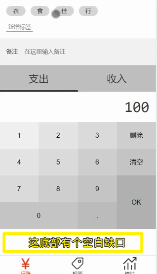

这个空白缺口应该放在「衣食住行」这4个标签的上边！

5、对「支出」和「收入」搞一个上下内阴影？


