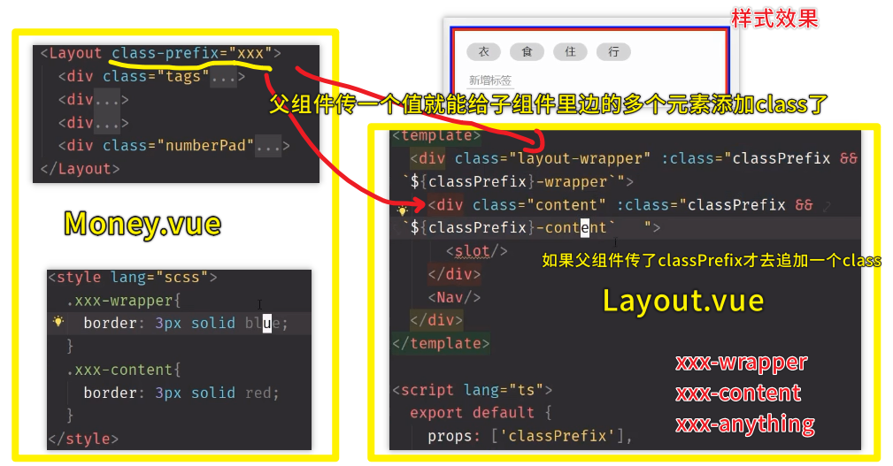

### ✍️ Tangxt ⏳ 2020-08-19 🏷️ Money 组件

# 07-Money.vue 组件（上）

* 代码：[Demo](https://github.com/ppambler/vue-morney/commit/df2fcb003bfa36770bc964245d2a03a131ea2438)
* 代码：[Demo](https://github.com/ppambler/vue-morney/commit/b9d02c5cbe54ea8bc16e813fcc21e9bc8e7dc7ad)
* 代码：[Demo](https://github.com/ppambler/vue-morney/commit/36463e534cf24f44d98ce9e935ef99673a2c105b)

## ★整体思路

1）概述

以怎样的顺序写 `Money.vue` ？（基于设计稿来搞）

1. HTML -> 结构怎么写
2. SCSS -> CSS 怎么试，如何组织 CSS 代码
3. TS -> 详细看看这个

2）写 HTML


第一层：

> 在写的时候不用留意后边该怎么做！

``` html
<template>
  <Layout>
    <div>tags</div>
    <div>notes</div>
    <div>type</div>
    <div>number pad</div>
  </Layout>
</template>
```

`div` 里的内容实际上就是在给这 4 部分起名字呀！ -> 这样再进一步细分的时候，你就不会想不到类名了！

第二层（细化、递归第一层的）：

> 由于有 `scoped` ，所以元素的 `class` 可以写得很简短！

tags：

``` html
<div class="tags">
  <ul class="current">
    <li>衣</li>
    <li>食</li>
    <li>住</li>
    <li>行</li>
  </ul>
  <div class="new">
    <button>新增标签</button>
  </div>
</div>
```

notes：

> 左右两部分

``` html
<div>
  <label class="notes">
    <span class="name">备注</span>
    <input type="text" />
  </label>
</div>
```

> `lebel` 包住一个 `input` -> 老手做法！ -> 给「备注」加 `class` 是因为它也会改样式

types：

``` html
<div>
  <ul class="types">
    <li class="selected">支出</li>
    <li>收入</li>
  </ul>
</div>
```

> 为啥老师要多留一个 `div` 呢？ -> 留一个先，以防有用，如果之后写完了发现没用，那就删咯！

在写 HTML 的时候，不要去关心如何去实现 CSS，你只要知道 `li` 元素有了个 `selected` 的类后，那么该元素就会有个下划线样式！

numberPad：

> 简化了数字面板 -> 不要 `+-*/%` ……

``` html
<div class="numberPad">
  <div class="output">100</div>
  <div class="buttons">
    <button>1</button>
    <button>2</button>
    <button>3</button>
    <button>删除</button>
    <button>4</button>
    <button>5</button>
    <button>6</button>
    <button>清空</button>
    <button>7</button>
    <button>8</button>
    <button>9</button>
    <button>OK</button>
    <button>0</button>
    <button>.</button>
  </div>
</div>
```

给元素的 `class` 是最后给的，即你先这样：

``` html
<div>
  <div>100</div>
  <div>
    <button>1</button>
    <button>2</button>
    <button>……</button>
  </div>
</div>
```

然后根据子元素的内容再去给 `class` ！ -> 从外到里给 -> `numberPad > output > buttons`

---

要开始写 CSS 了吗？ -> 目前该文件有 50 多行！ -> 把样式写完后，大概 200 多行 -> 需要优化！

> 一个文件如果超过 150 行，那么一般就会把它拆成多个文件

---

接下来，给这 4 部分整上 CSS -> 写完后，给这 4 部分整体做个布局！（tags 部分处于最上方，而且占满空隙，而 numberPad 则是处于最下方，因为符合用户习惯！）

> 我以为先布局 ，透过写死的 4 部分高度，慢慢填充内容！ -> 而不是把 4 部分得高度透过内容填充，然后组合起来布局！ -> 总之简单来说，是布局架子先行，还是每一部分内容的样式写好了再套进去……


## ★CSS 思路


1）给 vue 组件加 scss

> 如果有 `scoped` ，那么这就意味着当前样式只对当前组件有效！

我们一般在写一个项目的 CSS 的时候，一般分为这几个部分：

1. reset -> **把所有的、默认的、你不想要的样式都给清空掉**！ -> 可抄淘宝等网站的，反正这些都是大同小异的！ -> `reset.scss`
2. 全局样式 -> **字体、行高等** -> `body {} or #app {}`
3. 全局变量 -> **确保每个组件用的红色是一样的**，而不是一个组件用的是浅红，另一个组件用的是浅浅红…… -> 高亮色 `$color-highlight`、字体`$font-hei` -> 所有与颜色相关的变量都用`color-`开头，同理，字体则是`font-`开头 -> `helper.scss` -> 注意，千万不要在`helper.scss`里边用上类似`.clearfix {}` 这样的类样式，因为如果你真这样做了，那么假如有 10 个文件引入了，那么这 10 个文件就会复制`.clearfix {}` 这个代码十次！而变量则不会，因为编译文件时会把这些变量给删了，最终的结果就是`helper.scss` 这个文件都会消失掉！ -> 总之，**`helper.scss` 只能放一些最终会消失的东西**！
4. 局部样式 -> **各个组件自己的样式**

> 一个忠告：不要在你的代码里留下任何没有用的代码，包括没有用的注释

2）字体使用的最佳实践

使用这个网站 [Fonts.css](https://zenozeng.github.io/fonts.css/) 提供的字体代码，可以保证你的网站不管在哪个平台里边都有好看中文或英文的字体显示！

用法：


> 我这台电脑的中文字体默认用的是「思源黑体」，而英文则是其它的……

一个疑问：


如果一个页面是多个部门一同开发的，如淘宝，那么就放在 `#app` 里 -> 如果一个页面是你自己一个人独立完成的，那么放哪儿都无所谓，反正你要明白，放在 `#app` 里的话，那么样式的效果就作用于 `#app` 旗下，所以你得保证 `#app` 没有其它兄弟元素了！

话说，为啥这个 `App.vue` 总会有这两行代码：

``` css
#app {
  -webkit-font-smoothing: antialiased;
  -moz-osx-font-smoothing: grayscale;
}
```

只对苹果系统有用 -> 尤雨溪经试验测试认为多了这两行代码字体会顺滑一点…… 

## ★可抄的 CSS 代码

1）CSS 第一部分

1、scss 语法 

使用`scss`语法，可以让 CSS 代码有作用域的感觉：

是

``` scss
// 读作 tags 里面的 current
.tags {
  > .current {

  }
}
```

而不是

``` css
.tags {

}
.tags > .current {

}
```

另外一个语法：

``` scss
// 读作：tags 本身如果被选中了
.tags {
  &.selected {

  }
}
```

2、如何弄圆角？

你这样写：`border-radius:50%;`，那么这是宽度的`50%`（默认的）


代码类似这样：


我们要做到我们想要的效果，得是高度的 50%，所以我们得要写个`height:24px;`，然后 `border-radius: 24/2 px;`

不过，`border-radius` 这个属性本身就支持 `/` 这种语法，所以最后浏览器解析出来的值还是 `24/2 px`


2）CSS 第二部分 & 第三部分

1、「支出」or「收入」被选中了，那么这该如何整条线出来？

使用绝对定位来搞，而不是直接给个 border 底边框，不然，这文字内容就会被抬高一点了……


---

**把 CSS 全写完了，这样你去写 JS 的时候，你的思路才会比较清晰！不然，如果你混着写的话，会写着很乱的！**

> 以前我的做法是先把 JS 做了，再去整 CSS

3）CSS 第四部分

> 这部分看起来很复杂，但写 CSS 就是重复——flex+长宽高背景色，然后就完事儿了！ -> 写 CSS 就是在浪费你的时间

1、设计稿给出的「100」是等宽字体——编程字体 Consolas？

该字体，对于大部分设备而言是没有的，所以你可以给一个更加泛的等宽字体，也就是`monospace` -> `monospace`旗下有很多种等宽字体，如`Consolas`就是其中的一种！


> 等宽字体「100」这 3 个字符是一样宽的，而普通字体，也就是非等宽字体，这 3 个字符中，`0`是要比`1`宽的 ！

2、如何确定数字面板里的每个 button 的高度？

button 的宽度是容易确定用百分比就好了，但是高度就不能这样用了，因为设计稿是针对 iPhone6/7/8 来设计的，如果设备是在 iPhone10 里边看这个网页的话，显然 button 的高宽比例 就显得很不一致了！

所以你就不能这样求高度的百分比：`64px / 667px = xx vh`

而是直接按**设计稿给出多少高度就写多少高度** -> 如果设计师不服了，你就跟设计师理论一下……毕竟设计师 ta 并没有给出每个「屏幕高度尺寸不一样大小」的设备里边这些按钮大小的具体比例是多少！

3、flex 定位行不通了？


所以在这里，我们可以使用 `float` 定位 -> 右浮就好了！

> 这是一种经验处理方式 -> 以前用 flex 可以解决 99%的情况，但最后这 1% 需要你自己去瞎碰它！ -> 运气好可以解决，运气不好，还是无法解决，那就去问 CSS 写得好的、经验好的前端，如方方，大部分的前端写的 CSS 都是很辣鸡的，他们都只会用别人写的库，稍微复杂点的，他们就不会写了！

对了，如果这元素用了 `float` ，那么其父元素就得 `clearfix` 一下！

`.clearfix` 在哪儿写？

在 `App.vue` 里的 `style` 里边写 -> 但这种做法很 low

话说，需不需要给 `button` 元素追加一个 `clearfix`？ -> 不需要，不然，这就显得很奇怪了，因为这就像是**为了解决某个 bug，而专门去写了一个类**！


所以我们为了少写一个无厘头的`class`，那就这样做：


为了减少重复，我们使用了 scss 提供的 「placeholder」，也就是「%」功能！


> `@extend %x;` 的书写位置一般放在 `.xxx {}` 里边的第一行位置，也就是最上边的位置！

如果其它元素也用到了，那么效果就是这样子：


补充一下，最终的编译的效果：


> 学 CSS 意会就好了，如果非得想去搞清楚的话，反而学不会 CSS！ -> 总之，就是有那么一个意思就好了，如写了 `@extend %x`就相当于是在全局里边搞了个有`scoped`的 `x` 样式！

关于 `x` 的命名 -> 以功能为名，如`clearFix`，当然，你也可以是 `clear-fix` -> 方方个人喜欢，只代表一个功能的东西就用大写`clearFix`

话又说回来，我们把`clearFix`写在`helper.scss`里边，这其实是按照一种「**关注点分离**」的理念来去弄的 -> 即你以后改样式的时候，就不需要在 HTML 里边添加`clearFix` 这个 class 了 -> 我们给 HTML 加一个类就已经仁至义尽了，如果再加一个为了 hack 的 class 话，那就没啥必要了！

总之，这是**一种非常好的组织方案**！

4、如何让数字面板里的颜色是有层次的？也就是搞一个「渐变色」的 numberPad？

按照 `%4` 的大小变暗 -> 可能 `%4` 不符合设计稿的要求，但你可以去跟设计师商量一下，不然，你不嫌麻烦的话，那就一个个取吧！（同设计师沟通是需要花时间的，自己去繁琐取色也是需要花时间的，所以你自己去权衡就好！）有时候，你作为一个前端就应该强势一点，而不是弱势——设计师叫你怎样做，你就怎样做！ -> 总之，**每一层变暗 `%4`**

`scss` 提供了一种颜色函数 `darken` -> 使某个颜色变暗 -> 如`background: darken(red, 4%)`

---

至此，我们已经把 4 部分的样式都给弄好了！接下来就做一个统筹！

注意，虽然我们把这 4 部分样式都弄好了，但放在一起不一定对，如这样：


这个空白缺口应该放在「衣食住行」这 4 个标签的上边！

5、对「支出」和「收入」搞一个上下内阴影？

用到了一个 sass 函数 -> `fade_out(black,0.2)`（0.6 表示很淡，0.8 表示很很淡）-> 编译结果：`rgba(0,0,0,0.8)`（这里的 0.8 表示很深）

对阴影理解的一个形象比喻：


1 个 px 就是一排官兵，同理 5 个 px 就是 5 排官兵！

对了，在页面中如果你用到了阴影，那么你就得把这阴影调到看不出为止，就像是美女化妆一样，明明化了妆但是就是看不出来！除非你是搞 cosplay 的，需要化一些很浓的妆！


好的阴影（看起来很自然）：


有好几处地方都用到了阴影，所以我们就**把这阴影样式给统一起来**，就如同处理 `clearFix` 一样！

``` scss
// helper.scss
$color-shadow: rgba(0, 0, 0, 0.25);
%outerShadow {
  box-shadow: 0 0 3px $color-shadow;
}
%innerShadow {
  box-shadow: inset 0 -3px 3px -3px $color-shadow,
    inset 0 3px 3px -3px $color-shadow;
}
```

> 我觉得我的博客里边的图片阴影可以设置成这样：`box-shadow: 0 0 3px rgba(0, 0, 0, 1)`，我之前是抄王垠大佬博客里边的图片样式（阴影效果很浓重）！

`box-shadow`里边的值不是一次性就能确定好的，之后可能会修改 -> **不需要把`box-shadow`的值做到完美才去把阴影样式提取到`helper.scss`出来，走一步就写一步，不管这是不是最终答案……**

## ★CSS 布局

如何把底部的空隙放到「衣食住行」的上边？

使用 flex 布局！

1）父组件如何给子组件传 class？


我们知道，在组件标签上加 class，那么这个 class 默认就会加在 Layout 组件的 根元素上了！ -> React 则是什么也不加！

可以看到 Vue 好心办坏事了！ -> 因为我们想要 class 加在 `div.content`（这才是那四部分的**真正的容器**）上：


so，我们该咋办呢？

Vue 可没有提供「可以指定把写在 Layout 标签上的 class 放在 Layout 的 template 里边的任意一个元素上」这样的一个功能！

难道无解了？

可以使用 `props` 这个 API 来搞！

做法：

1. 给`Layout.vue`一个`props:['contentClass']`，并且把这个属性动态绑定到`div.class`上：`<div class="content" :class="contentClass">` -> Vue 会自动合并这个 class，不要觉得写了一个 `class` 属性，又写一个 `:class`会很奇怪！
2. 来到`Money.vue`，也就是使用 `Layout` 组件标签的地方 -> 父子通信，传东西给儿子 -> `<Layout content-class="xxx">` -> 注意，这里的属性是 `content-class`，可不是 `contentClass`，而这是 Vue 自己的规定，毕竟 HTML 规定 `=` 的左边 是没有大写的！而 `=` 的右边，也就是值，是可以大写的！总之，Vue 会自动把小写的属性 `content-class`，转化成大写的 `contentClass`，这样 子组件才会接受到父组件传过来的值！（我想这一步应该是编译 template 的时候做的）

目前，我们可以做到把写在 `Layout` 组件标签上的属性值扔给 其 `template` 里边的任意一个元素，也就是可以把 `class` 扔给`Layout`其内部的 任意一个元素！

接下来，就是给`xxx`一点样式了

1. 写在有`scoped`的 style 里边 -> 样式不生效呀！因为这样式只对父组件生效呀！也就是`Money.vue`有效
2. 写在没有`scoped`的 style 里边 -> 样式全局生效！因为只要元素上有 `xxx` 这个 class 就会生效！ -> 这种姿势好不好呢？——你觉得好就用，不好就不用，反正对于 CSS 来说，随你的便就好了！


---

以上姿势是有问题的，因为如果 `Layout` 组件的 template 是有很多个 `div` 套在一起的，那么这种姿势就不好了，当然，我们这里的 `Layout` 只有两个 `div`，所以这种姿势倒是没啥问题

但以防万一，以后会修改这个 `Layout`，如套上几层 `div` 之类的，那么我们又得整上几个`props`属性，所以我们可以参考 ant-design 的做法——**通过前缀给 class**

回到问题：**如何给一个组件传你想要给的类？**



以后，你在使用人家的组件库时遇到使用它的某个组件，提供了一个叫`class-prefix`的 API（写在组件标签上的属性），那么你就应该想到这是在告诉我们，你可以对这个组件的的 template 追加任何的 `class`，而这意味着你可以更改这个组件的默认样式！ -> **组件样式由开发者控制变成是由组件使用者控制了**

不过，这还是有 bug 的，那就是其它组件也可以给这个 `Layout` 标签添加一样的 `xxx` 前缀呀！这样一来该 `Layout` 组件的样式就被覆盖了！

> 方方的经验直觉 -> 老手还未写代码就知道这样做最后会出现什么 bug，而新手依葫芦画瓢的做，根本就不知道这样做，到最后是会有 bug 的 -> 解决方案：使用 vue 的 deep 语法！ -> 需求没到，不需要现在去理解这个东西的用法！

2）flex 布局

1. 把容器改成是纵向排布
2. 把容器里的 4 个 item 的 HTML 源码书写顺序给倒过来
3. 把空白的内容 都给 `tags` 这部分 -> 对 `tags` 这部分同样来一次 flex 布局，然后 HTML 代码顺序同样颠倒一次！

在写 CSS 的时候，你要注意一点，那就是 **内容多了或少了，样式会不会有问题？** 千万不要就是实现设计稿给出的样式就完事儿了！


问题：tag 多了，用户是否可以接受滑动页面？

目前设计稿是咩有给出 tag 多了，样式要怎么呈现的效果图的！

所以这一点只能让前端开发者自己去权衡了 -> 如何优化这一点？ -> 不要花太多时间，能用就行！ -> 可以用轮播滑动的效果来优化

方方不打算优化了 -> 因为目前做到这样也就算能用了，如果之后用户在使用的过程中追加了好几十个标签，然后给我们建议说「标签多了，需要滑动页面才能点到 ok ，体验不好啊！」，我们再去想办法优化！

> 不要花太多时间在 CSS 的优化上，目前能用就行！

---

这四部分的样式整体上看（可以直接抄老师的CSS代码，你只要了解其中大概的样式写法过程就行了）：

1. 布局：flex 布局 & float 布局
2. 元素外观呈现：字体大小、背景色、空隙等……

如何学好 CSS？ -> 用 5 年时间练 CSS，熟能生巧，一看到一份 xxx 设计稿，就能肌肉记忆化般的把 CSS 给 唰唰地 写出来……千万不要认为把老师写的这个 CSS 自己撸一遍出来，就能让你的 CSS 技能提高了，要是能提高那就是在做梦……毕竟事后马后炮太 TM 简单了！

> CSS 大神，全中国就一个，那就是张鑫旭，就一个出名的，而 JS 呢？JS 大神就有好多个了……

不管做什么你都要**考虑投入产出比**，花时间去提高 CSS 技能，性价比太低了，我们只要用够用的 CSS ，满足用户的样式需求就可以了，千万不要花过多的时间去学 CSS……

## ★模块化

