### ✍️ Tangxt ⏳ 2020-08-27 🏷️ Money 组件

# Money.vue 组件（下）

## ★JS 组件

> 先用 JS 的姿势来写，写完后再改写成 TS 姿势的！

### <mark>1）「收入」&「支出」类型切换组件</mark>

刚开始搞，就来整个最简单的！

在单文件组件里边，写 JS 区域的模板：

``` html
<script>
  export default { data, props, methods, created, /**...**/ }
</script>

<!-- <=> -->

<script lang="js">
  export default { data, props, methods, created, /**...**/ }
</script>
```

> 你不写`lang="js"`，默认就是 `lang="js"`！

思路：

1. 定义这个切换组件的状态：`type`为`'+'/'-'`则表示组件为「收入/支出」状态 -> 定义组件状态用 `data`
2. 在`template`里边代表「支出」和「收入」的这俩元素，此时 `type` 为何值，那么相对应的谁就有下划线，也就是谁会有 `selected` 这个 class
3. 组件状态的改变 -> `click` 元素

代码：[Demo](https://github.com/ppambler/vue-morney/commit/8425cd2198778b2a1dddbb2a629e234a499820ba)

### <mark>2）代码分析</mark>

`:class="type === '-' && 'selected'"`：

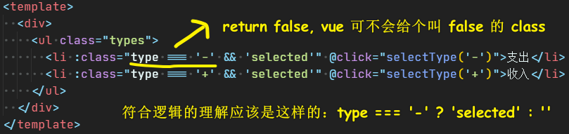

vue 在背后做了很多事情，如果 `&&` 表达式返回了 `false`，那么 vue 就会自动把这个 `false` 值给去掉，毕竟 class 是 `false` 未免也显得忒奇怪了吧！ -> 总之，这是一种**简写的写法**！正常写法应该是整个三目运算……

`@click="selectType('-')"`：

这还有一种写法，那就是直接 `type = '-'`就可以了，但是这种写法**只能写一行代码**，所以这就显得很鸡肋了！而方法调用则可以**写多行代码**！

该「切换组件（`Types`）」接收外边传过来的值：

透过 `props` 这个 options API 就可以做到！ -> 拿到传过来的值，一般扔到 `mounted` 里边使用！


---

接下来看看如何把上边的 JS 代码，改成是 TS 姿势的！

## ★TS 组件

> 实现第一个 TS Vue 组件

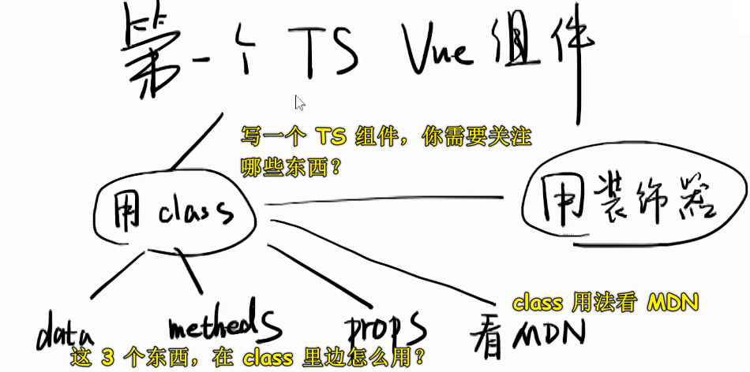

### <mark>1）TS 组件 vs JS 组件</mark>

它们俩最大的不同：

TS 组件不用构造选项 -> 为啥不用？ -> 因为构造选项是没有类型的，而且可以随便加东西！

写 TS 组件必须要用 `Class` -> 这是 Vue 规定的！

### <mark>2）如何写一个 TS 组件？</mark>

1. 为 `<script>` 添加 `lang="ts"`
2. 导出一个 `class`，而且该 `class` 继承 `Vue` -> 这是规定
3. 在 `class` 里边定义实例的自有属性 -> 就是在干 `data` 的活儿
4. 在 `class` 里边定义实例的方法 -> 就是在干 `methods` 的活儿
5. 安装`vue-property-decorator`：`npm i -S vue-property-decorator` -> 在安装`vue-property-decorator`的过程中，连带着`vue-class-component`也一起安装了！
6. 添加装饰器 `@Component` -> 有了它，就可以把「自有属性+实例方法」自动处理成「`data`+`methods`」了 -> 没有它，那就不帮你处理了！ -> **总之，它是一个自动化的帮我们处理代码的东西**
7. 为 JS 代码加类型 -> 你用 webstorm，如果代码出现爆红，那么你就得把它去处理成不爆红的状态！ 如：为形参加类型 `selectType(type: string) {}`（是小写的`string`，可不是大写的`String`）

> 如何添加生命周期钩子？ -> 直接 `created() {}` 就行了！

代码：


### <mark>3）vue-property-decorator</mark>

文档：[kaorun343/vue-property-decorator: Vue.js and Property Decorator](https://github.com/kaorun343/vue-property-decorator)

这个包不是尤雨溪写的，话说，为啥不用尤雨溪的呢？ -> 因为尤雨溪写的没有这个人写的好！

尤雨溪写的是这个：[vuejs/vue-class-component: ES / TypeScript decorator for class-style Vue components.](https://github.com/vuejs/vue-class-component) -> 这是 Vue 官方提供的 TS 支持库！但其功能不如 `vue-property-decorator` 好用，所以我们就用了这个 `vue-property-decorator`！

`vue-property-decorator` 提供了好几个装饰器（`@`开头的），当然，我们用的这个 `@Component` 是 Vue 官方提供的！所以，如果你要看 `@Component` 的官方文档，那就得看 `vue-class-component` 的！

透过 CRM 学习法来了解 `@Component` 的使用：

> 文档：[Overview - Vue Class Component](https://class-component.vuejs.org/)

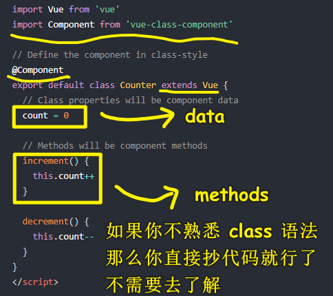

> CRM 学习法，让你可以不用深究所有的事情，**节省大量的时间**！当然，你的 JS 基础得扎实才行！ -> 「`class` 语法」 无非就是把 「JS 对象写法」 换成是另一种写法罢了！所以，如果你时间有限的话，其实可以放弃深究 `class` 的语法细节，以及 装饰器的用法！直接依葫芦画瓢就行了，反正你已经知道这种写法的背后到底做了什么……

## ★TS 组件 @Prop 装饰器

### <mark>1）如何写 props？</mark>

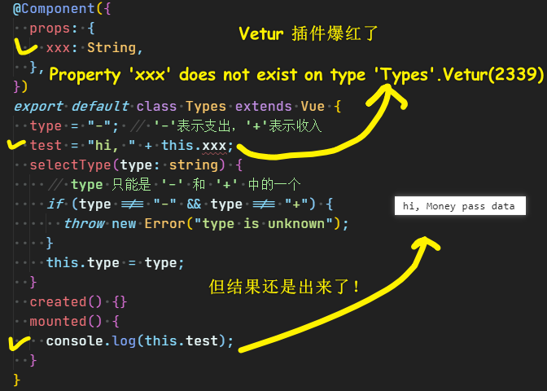

Vetur 提示说 `Property 'xxx' does not exist on type 'Types'`（`xxx`不存在于`Types`这个`class`里边！）

可以看到官方文档翻车了……（或许这是插件的缘故！毕竟效果已经出来了，只是插件检测说这有问题罢了！）

代码：[Demo](https://github.com/ppambler/vue-morney/commit/f17179b32b6a7cf40bee969d474467d6f3858f56)

### <mark>2）用 @Prop 来写 props</mark>

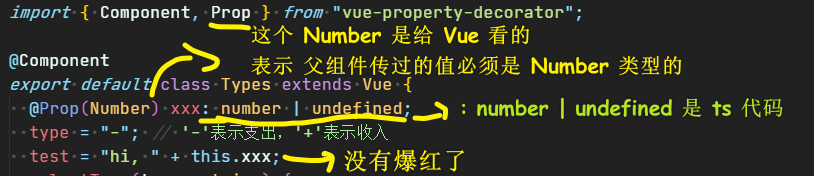

你在父组件里边是透过 `xxx="Money pass data"` 来传值的，但这样的写法只能表示这是在传字符串，因此 Vue 报了这样的错误：

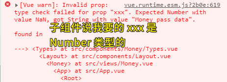

> 即便传的值不符合类型，但最终的运行结果还是出来了！ -> Vue 的容错性处理！

所以你得这样来：`:xxx="666"`（加一个`:`，意味着属性值是 JS 代码）

代码：[Demo](https://github.com/ppambler/vue-morney/commit/354969b5caf71a3720b35e23559447c484009864)

### <mark>3）代码解析</mark>

`@Prop(Number) xxx: number | undefined;`：

这行代码在干嘛？为啥写了一个大写的 `Number` 还得再写一个小写的`number`？

`number | undefined` -> 是编译时的检查！ -> 在你还未运行代码的时候就能告诉你的代码是否有问题

如：

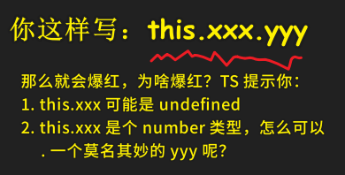

透过代码检查，你就明白自己这样写是有潜在的 bug 的！ -> 所以我得换一种写法，如先判断一下 `this.xxx` 是否等于 `undefined`，如果不等于那就证明 `this.xxx` 是个 `Number` 类型的值……

回过头来，整体看一下 `@Prop(Number) xxx: number | undefined;` 这行代码：

- `@Prop`是一个装饰器，告诉 Vue：「后边的这个 `xxx` 属性是个 `prop`，而不是 `data`」 -> **不写 `@Prop` 就是 `data`，写了 `@Prop` 就是 `prop`**
- `Number` -> 告诉 Vue `xxx` **运行时**是个 `Number`，如果不是 `Number` 类型的值，那么浏览器就会报错！
- `xxx` -> 属性名
- `number | undefined` -> 告诉 TS `xxx` 的**编译时**类型 -> 注意，你不写这个`undefined`是会报「`Property 'xxx' has no initializer and is not definitely assigned in the constructor`」这样的错误的！（联合类型通常与 `null` 或 `undefined` 一起使用，给了一个 `undefined` 类型， 就是在告诉 TS `xxx` 的初始值为 `undefined`）

话说，为啥`Number`是大写，而`number` 是小写呢？难道不应该都是小写的吗？

Vue 作者也想把 `Number` 改成是小写的，但因为某种原因（区分运行时和编译时）就放弃了！

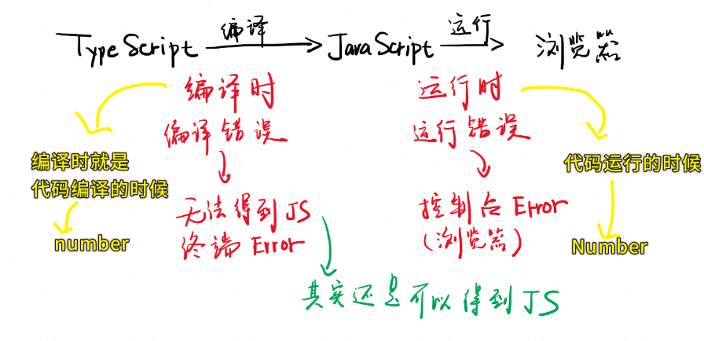

补充一点：

你也可以这样写：`@Prop(Number) xxx: number = 0;`（默认给`xxx`一个`0`的默认值），这样你就不用检查 `xxx` 是否为 `undefined`了，反之，用原先的姿势你就得处处检查`this.xxx`是否为`undefined` -> 我测试了一下给上初始值，结果报了这样的错误：

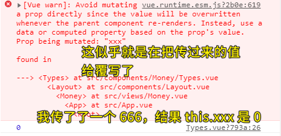

`@Prop(Number) xxx: number | undefined;`这种姿势，应该是在告诉 TS 这个`xxx`是没有初始值的！（疑问 🤔 ） -> 如果父组件不传`xxx`，那么`this.xxx`就是`undefined`值了！这难道不就是在说初始化值是`undefined`吗？

### <mark>4）我们用 TS 写代码好还是不好？</mark>

- 对代码**没追求的**前端 -> 写 TS 就是在打扰他们
- 对代码**有追求的**前端 -> 这东西牛逼呀！我以前没有注意到的错误，它都告诉我了！

给我工资 3k？ -> 我是个没追求的前端，所以我的代码都用 JS 来写 -> 把 `lang="ts"` 删了 + 去掉所有的 `: type1 | type2` -> 瞎写……（webstorm 有智能的编译时弱提示，而 vscode 则没有，只能当代码在浏览器里边跑起来了才知晓！）

给我工资 10k？ -> 那我就是个有追求的前端，因此我的代码应该用 TS 来写！

### <mark>5）TS 类型添加原则</mark>

1. 你这样 `type = '-'` 写了，那么就不用这样写了： `type: string = '-'`，TS 会自己推导
2. 函数的返回值类型声明不用写，即不用 `string selectType(){}` 这样写
3. 函数的形参需要写上类型声明
4. `@Prop(Number) xxx`需要写上类型声明 -> `@Prop(Number) xxx: number | undefined;`

### <mark>6）怎样理解这个代码？</mark>

``` js
this.xxx.yyy
```

`this.xxx`不过关，它可能是 `undefined`，`this.xxx.yyy`不过关，因为已知`this.xxx`是`number`类型，所以它是咩有`yyy`这个方法的

代码改写：

``` js
if(this.xxx === undefined) {
  console.log('xxx is undefined')
} else {
  // xxx 一定会有 toString 这个方法！
  console.log(thix.xxx.toString())
}
```

### <mark>7）写 TS 的 3 个好处？</mark>

1. 类型提示：更智能的提示 -> 自动提示
2. 编译时报错：还没运行代码就知道自己写错了 -> 严谨
3. 类型检查：无法点出错误的属性，如你不能随便写 `this.xxx.yyy`

> 在 Vue 的 `template` 里写的 JS 代码，TS 是不会去检查的！

### <mark>8）其它装饰器的用法？</mark>

自己看 [文档](https://github.com/kaorun343/vue-property-decorator#Prop) -> CRM 学习法！ -> **始终谨记「写法形式上有所不同，不需深究，依葫芦画瓢直接用即可！」**

### <mark>9）小结</mark>

1. 官方的 `props` 不行，就用了第三方的 `@Prop`
2. 搞清楚这行 `@Prop(Number) xxx: number | undefined;` 代码里边的 `Number` 和 `number` 各自代表什么意思！ -> 它们的错误展示是这样的：浏览器控制台 Error（运行时） vs 终端 Error（编译时）

----

## ★TS 的本质

### <mark>1）TS 真得很难吗？</mark>

TS 的本质：

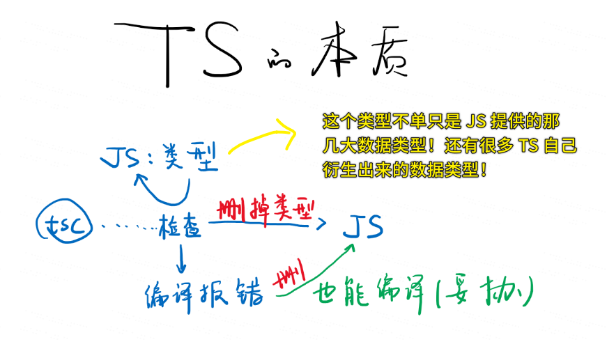

- TS 的类型 -> 功能是「检测你写的 JS 代码对不对」，如`this.xxx.yyy`，TS 发现`this.xxx`可能是`undefined`，就不让你写`.yyy`了 -> 为啥不让写？ -> 因为这代码在运行时肯定会报错的呀！你想想 `undefined.yyy`？
- TS 检查分两种情况（还有其它情况，这里主要简单提一下类型的变化）：
  - 有错 -> 编译报错 -> 根据「爆红」的线去改你的 JS 代码
  - 没有错 -> 把类型给删了，保留只含有 JS 代码的那部分代码 -> 类型用完就删！
- TS ->编译 -> JS -> babel -> 更低级的 JS
- 谁在做检查？ -> tsc（是一个程序，功能是「检查+编译」，你在安装`typescript`的时候会顺带把这个工具给安装上） -> 对了，babel 也可以做编译这件事儿！ -> 二者都存在独特的功能！
- 编译报错，也能正常运行编译过后的 JS 代码 -> 为啥会这样呢？如果你有一份有 100 行代码的 JS 文件，你直接改成是 `.ts` 后缀，结果编译报了几十处错误，难道我们要一行行改吗？ -> 不需要改，你直接扔到浏览器里跑也是可以正常运行的！所以这就是 TS 它给我们的包容性……

  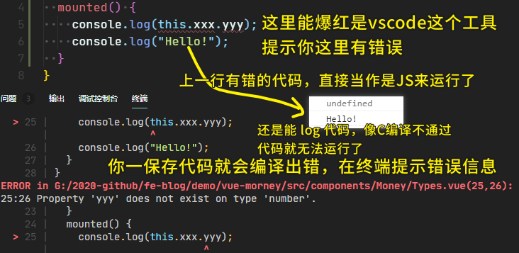

- 可以看到，TS 是一个非常简单的东西！ -> 千万不要认为它有多么的难！

### <mark>2）如何配置只要有编译错误，就无法得到编译出来的 JS 文件？</mark>

官网回答说：

在`tsconfig.json`的`"compilerOptions"`配置`"noEmitOnError": true`就行了！

但测试发现，这配置是无效的，TS 还是可以把代码 编译成 JS

当然，我们并不关心这个问题是否能解决，因为这在我看来，这有点画蛇添足的意思了！

### <mark>3）小结</mark>

- TS 的本质，就是在 JS 上写一些 `: 类型`，透过「类型」，我们可以检查我们的 JS 代码是否有错，而检查的家伙是`tsc`这个程序：
  - `tsc`检查通过，就会把 TS 代码翻译成 JS 代码，其中翻译过程中最重要的一步就是把含有`: 类型`这样的代码给删掉，毕竟 JS 本身是不支持 `: 类型` 这种语法的！（翻译出来的 JS 代码是否还需要 Babel 处理呢？不一定需要呀！可能 `tsc` 就内嵌了类似 Babel 这样的功能，然后`tsc`自身也顺便把 Babel 的活儿给干了）
  - `tsc`检查报错，还是可以把 TS 代码翻译成 JS 代码，即直接把 `: 类型`这样的代码给删了就行了 -> 一种**妥协**做法！

---

接下来，就来看看目前写 Vue 单文件组件的几种姿势！

## ★Vue 单文件组件的三种写法

> 只针对「Vue 单文件组件」，可不是直接的在某个 `new Vue({})`里边注册一个 Vue 组件或者全局注册一个 Vue 组件，因为这种姿势忒 low 了！

### <mark>1）用 JS 对象</mark>

``` js
export default { data, props, methods, created, ...}
```

### <mark>2）用 TS 类</mark>

> `<script lang="ts">`

``` ts
 @Component
 export default class XXX extends Vue{
     xxx: string = 'hi';
     @Prop(Number) xxx: number|undefined;
 }
```

### <mark>3）用 JS 类</mark>

> `<script lang="js">`

``` js
 @Component
 export default class XXX extends Vue{
     xxx = 'hi'
 }
```

> JS 也可以用 `class` 姿势来写单文件组件！ -> 我一直以为只有「JS 对象」那种姿势！

### <mark>4）用哪个？</mark>

优先使用最难的 TS 姿势！ -> 因为使用最难的，会学到更多的知识！

最简单的姿势是用「用 JS 对象」

注意：你使用了 `class` 姿势，那么你就得写上 `@Component`、`extends Vue`

## ★numberPad 模块

### <mark>1）创建一个写 ts 代码的模板</mark>

``` json
{
  "vue-ts": {
    "prefix": "!tts",
    "body": [
      "<script lang=\"ts\">",
      "import Vue from \"vue\";",
      "import { Component, Prop } from \"vue-property-decorator\";",
      "",
      "@Component",
      "export default class ${TM_FILENAME_BASE} extends Vue {",
      "}",
      "</script>"
    ],
    "description": "插入 ts 模板"
  }
}
```

### <mark>2）该模块的功能分析</mark>

> 看 windows 系统提供的计算器功能

由于 TS 是非常重视数据类型的，所以根据实际情况分析， `div.output` 的值是 `string` 类型的：

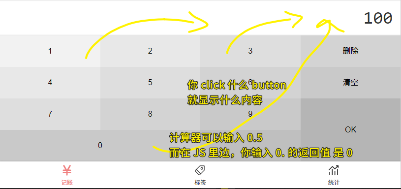

### <mark>3）代码实现</mark>

思路：

- `numberPad`这个模块旗下有俩东西：`output` & `buttons`，用户点击一个个`button` 就是在给`numberPad`组件输入内容，给用户反馈的就是那个 `div.ouput`（呈现组件状态值的容器） 元素 -> 说白了，你要根据当前组件`output`（组件的状态）的情况，来处理用户的输入，处理之后再考虑是否把组件的状态给更新了！ -> 谨记：「用户可以乱点击`button`」
- `output`框呈现的内容：
  - 不能出现多个 `.`，如`123.456.789`、`0..`……
  - 不能出现 `000`、`01`……这样
  - 默认就出现个 `0`，用户第一次直接输入一个`.`，那么结果就是`0.`

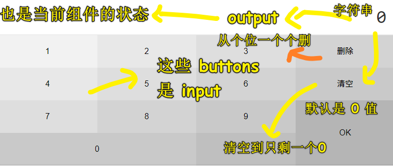

代码：[Demo](https://github.com/ppambler/vue-morney/commit/67d707f5f39ef4523d1afbe416ab77a99295169c)

### <mark>4）代码分析</mark>

`height: 72px`：

为啥要写高度？为啥不写 `min-height`？

不写高度的话，用户一进来页面，那么那个展示输入情况的框框就会有个从低到高这样一个变化的闪烁情况（由于 JS 渲染 DOM 是需要时间的，所以你给了这个框框初始值也是会有问题的！我们原先就直接给这个框框元素一个字符串`100`，但现在它是动态变化的，所以我们用了插值表达式！） -> `min-height`，你不能保证每个字符是否高度一致，可能你输入某个字符的时候，增加了一个 `1px` ，导致框框闪烁了一下

所以综合起来看，我们就得写死这个高度！ -> 当然，这是不得已的情况！

---

`inputContent(event: MouseEvent) {}`：

我们可以 `@click="output += 1"` 这样做，但这样忒麻烦了！而且也不好写！所以我们用了这种姿势：`@click="inputContent('1')"`

可这种姿势也不好，根据「**我与重复不共戴天**」原则，最后选择了这种`@click="inputContent"` 不传参数的做法（Vue 会自动传一个**事件对象**给这个方法，透过这个事件对象，我们可以拿到用户所点击的那个`button`的值） -> 当然，这`inputContent`还是重复，所以我们最后可以用事件代理的姿势来搞！

回过头来看这个 `event: MouseEvent` -> 没有点击事件，只有鼠标事件、键盘事件、UI 事件等等的！ -> 点击事件是鼠标事件的儿子！

这行`event.target as HTMLButtonElement;`代码，为啥要加个 `as HTMLButtonElement`？

- `e.target` 指向触发事件监听的对象。
- `e.currentTarget` 指向添加监听事件的对象。

对于 TS 而言，面对 `e.target.textContent`这样的代码，`e.target` 有可能为空！`e.target`可能没有`textContent`，如图片就咩有内容！（**不是所有元素都有内容的！**）

当你面对这种写啥都有意外的情况，你真得有种不想写下去的感觉！幸好，我们可以**强制指定类型**，而这就是为啥要用 `as HTMLButtonElement` 的原因了，你添加了这个，那就意味着，这个元素是有内容的，即便 `button` 元素的内容空字符串也是有内容的！

虽然这样写代码让人蛋疼，但这代码写得很精确，不会有任何 bug！

> 强制指定类型会经常用到，尤其用在 `event.target` 上！ -> 为啥会这样？因为 Vue2 和 TS 的搭配并没有那么好！照理说，像 `event.target` 这样代码，`tsc` 是可以自动识别的，或者 Vue 会在编译模板的时候，告知 `tsc` 这个元素是个`button`元素

---

`"0123456789".indexOf(input) >= 0` 的读法：你输入的东西在`0123456789`之间，那就大于等于`0`

`this.output.indexOf(".") >= 0` 的读法：`output`的东西已经有`.`了

---

你在计算器里边输入的字符个数是有限制的 -> 最多`16`个字符

---

`const input = button.textContent!;`：

没有 `!`，那么你在用 `input` 的时候，`tsc` 会说 `input` 可能为 `null`：

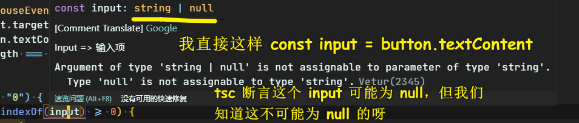

所以我们就强制断言一下 `input` 不可能是 `null`，而是一个 `string`：`button.textContent as string`

如果我们只是把它不为`null`这种情况给排除掉，那么这还有一种写法，那就是 `button.textContent!` -> `!`相当于是`as string`这样的东西，说白了就是它表示不为`null`的值，它可以是`as number`、`as boolean`之类的东西…… -> **`!`类似于水果这样的东西，它可以是苹果、桃子、李子……，但它就是不是丝瓜、苦瓜之类的东西**

总之，`!`就是在提示我们 `button.textContent` 不是一个 `null` 值，而我们之所以能确切知道它不是`null`，因为我们写的`button`元素就有是内容的呀！即便内容是个空字符串！

对了，如果 `tsc` 提示某个变量可能是 `undefined`，那么你也可以用 `!`！

---

`inputContent`方法里边的`if……else……`逻辑：

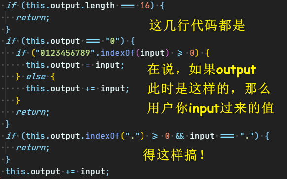

---

`this.output = this.output.slice(0, -1)`：

把切割出来的结果作为组件的`output`状态！

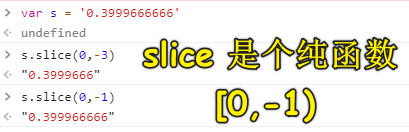

`-1`是最后一个字符！ -> **正值从左往右正数（索引为 `0` 是第一个字符），负值从右往左倒数（索引为 `-1` 是最后一个字符，`-2` 就是倒数第二）**

> 为啥是从 `0` 开始的？难道不应该是第一个字符 `1` 这样吗？ -> 因为这是外国人的习惯，外国人在说接触地面上的那一层，是说 Ground Floor，然后接着上一层才是 First Floor，而我们中国则是 1 楼，然后 2 楼这样子……

### <mark>5）重复的东西出现了，但很难消除？</mark>

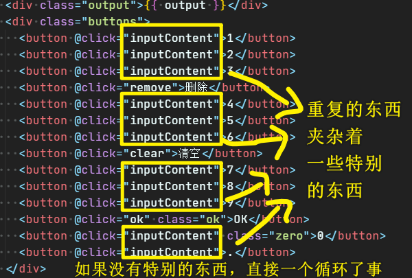

### <mark>6）小结</mark>

- 对于我们用户而言，我们摁计算器上的按键，然后有相应的字符展示在`output`里边，这其实会让我们误以为在往 `output` 里输入东西！ -> 真正的理解是：用户随意按下的键才是`input`，那个展示我们 `input` 字符的才是 `output`！ -> **虽然是个`input`元素，但也可以客串成`output`元素**
- 看一个 API 是什么时候添加的？ -> 去看 MDN 找到这个 API，然后跳到「规范」这个标题！ -> 如 `slice`（方方一直以为`slice`只有数组才有，没想到字符串也有，于是他认为这个`slice`是 ES6 时追加的……谁知到该 API 在 ES3 就有了）
- 代码里边的`if……else……`不是一气呵成就写出来的，在写它的过程中，代码从很混乱的状态，再到很清晰的状态。 -> 这是一个越写越清晰的过程！

## ★notes 模块 - `v-model`

### <mark>1）代码实现</mark>

思路：

用户输入的内容需要**让我们的 JS 代码过一手**再显示到输入框！ -> 所谓的「双向绑定」

代码：

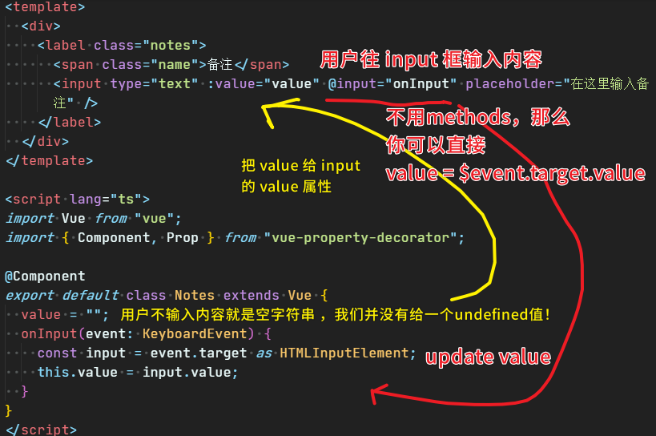

注意，如果是原生 HTML，我们是通过 `event.target` 拿到 `input` 框的输入值的！而我们自定义的 `input` 组件（也就是`Notes`组件），`input`元素直接就是透过 `Notes`组件的状态 `value` 拿到用户输入的值的！

> `template`里边拿到事件对象用 `$event`（不需要 TS 类型），方法里边则是形参`event`（需要 TS 类型）

为啥不用 `change` 事件？ -> 失去焦点才会触发`change`事件！

> 关于形参 `event` 是什么类型的事件？ -> 需要你自己去查找，如 `input` 事件就是 `KeyboardEvent`

### <mark>2）`v-model`</mark>

如果你的代码出现这种形式的代码：

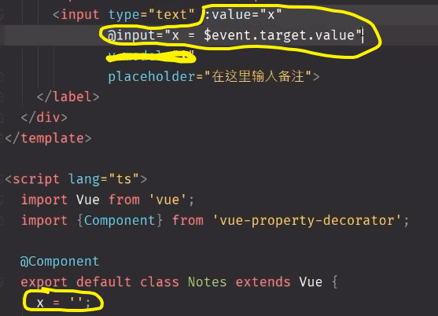

那么你可以把那两句话（`:value`+`@input`）简写成 `v-model`：

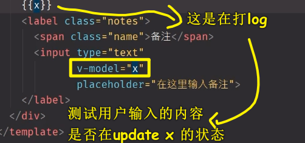

> 我们一般用 `value` 作为 `input` 组件（也就是`Notes`组件）的状态！

`v-model` 是 vue 从 angular 1 抄过来的！ -> 所以，不要问为啥要这样写！这是历史原因决定的，请不要问「为什么」!

> `v-model` 的存在让我们少写了很多代码！话说，我们可以拿到用户输入的值，但是为啥还有把拿到的值再赋值给 `input`元素 的 `value` 属性呢？ 这难道不是自动就能赋值的吗？ 为啥还要这样多此一举？ -> 难道这是为了保存用户输入的状态？还是说我们要把`input`元素的值的状态交给这个 `Notes` 组件来管控？ -> `Notes` 组件看上去就像是一个 `input` 元素一样！

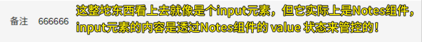

所谓的双向绑定应该就是：

- `Notes`组件的`value`状态 与 `input` 元素的 `value`属性之间的绑定（**内到外，JS 到界面**）
- 用户往`input`框输入的内容 ，也就是 `input` 元素的 `value`属性与 `Notes`组件的`value`状态之间的绑定（**外到内，界面到 JS**）

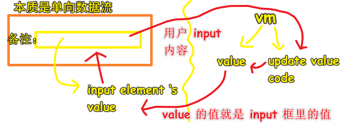

> `v-model` 给了我们双向绑定的错觉，因为它让我们忽视了 `@input` 的作用！

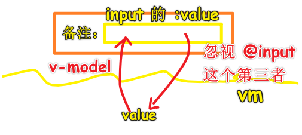

## ★tags 模块

### <mark>1）代码实现</mark>

思路：

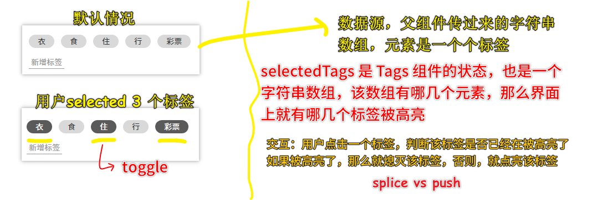

代码：[Demo](https://github.com/ppambler/vue-morney/commit/48a5668345b2b3977dce2b1640dbbc6492356b63)

### <mark>2）代码分析</mark>

> 方方在写 `data` 的时候，直接先写 `dataSource` 和 `selectedTags`，然后知道这个`dataSource`的数据是来自于外部的，所以就追加了 `@Prop()` -> 总之，先不考虑外部的数据，先把这个组件应该有的状态给写上！

1. **标签不是写死的**，是外部告诉 `Tags` 组件的！
2. `Tags` 组件**默认**有「所有的标签`dataSource`」，以及选中的标签`selectedTags`（默认咩有任何一个标签被选中）
3. `selectedTags: string[] = []` -> 表示「我是一个**字符串数组**，只不过我目前是一个**空的数组**，而且我这里边**只能装字符串**，不能装其它东西！」 -> 如果你直接这样 `selectedTags = []`，那么 `tsc` 就认为这里边能装任何数据类型的东西！
4. `@Prop() dataSource: string[] | undefined` -> `@Component`即便不传参数也不用加`()`，而`@Prop`不管传不传参都要加`()`，而这是**语法规定**！ -> 如果给`@Prop()`传参，那么你得写成这样：`@Prop(Array) dataSource: string[] | undefined`，话说，`Array` 与 `string[]`为啥不对应上？即应该写成 `@Prop(string[])`才对的呀！因为给`@Prop`的参数是 JS 内置的**构造函数**呀！这个参数是运行时检查的！ -> 为啥方方不给`@Prop`传参？因为这个项目是我们**自己在做给人家看**的，而且又**用上了 TS**，所以不用给！当然，如果你这个项目是 UI 轮子库，给其它前端开发者是使用的话，那么你就得给上参数`Array` -> 为什么不这样写 `@Prop() dataSource: string[] = []`？因为如果真这样写，那就**违反原则**了，毕竟这个 `dataSource` 是外部的数据，我们这个`Tags`组件给`dataSource`一个值，那就很不好了！所以用了一个 `undefined` ，表示外部可能没有传数据过来，那就是接收`undefined`值了！当然，我们这样做了，在后续的代码里边，如果用到了 `dataSource`，那么就得判断一下它是否为`undefined`值！
5. 如果组件名字叫`Tags`了，那么`prop`的名字就不要再叫`tags`了！ -> 不要这样写 `<Tags :tags="" />`，因为这显得很奇怪！
6. 子组件用 TS 写，而父组件也可以用 JS 写 -> **父组件（JS） vs 子组件（TS）**
7. 渲染标签 -> 遍历`dataSource`
8. 状态驱动视图渲染！ -> 我们的 JS 只为改变状态而生！
9. 我们用了对象写法来添加`class`，原先的做法是 `xxx && 'selected'`，现在的做法是`{selected: xxx}` -> `xxx`为`ture`就添加`selected`这个`class`，否则就不添加！ -> 如果元素被`selected`了，那就点亮它！
10. 点一下标签，就高亮，再点一下，就熄灭 ，如开灯关灯一般…… -> 方法起名 `toggle`（开关之意），根据方法行为决定方法的起名！

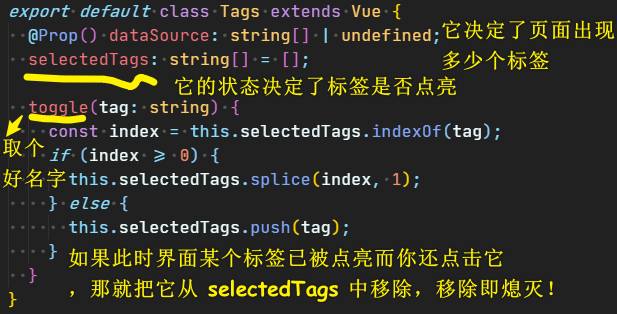

### <mark>3）新增标签功能</mark>

> 目前不做复杂的，只做个最简单的！

代码实现：

思路 -> 子父通信！

代码：[Demo](https://github.com/ppambler/vue-morney/commit/14db5a5e4d3f19f2abf91a06f721cf091346d884)

代码解析：

> 创建标签的方法起名 -> 本来叫`createTag`的，但这整个组件本身就叫`Tags`，所以直接就是`create`了 -> 一般起名原则是「动词+名词」（所以不能起`newTag`），特殊情况直接一个「动词」

手机上的 `window.prompt` 效果很好！而 PC 上就不太好了！

`window.prompt("请输入标签名")`的返回值就是用户输入的东西：

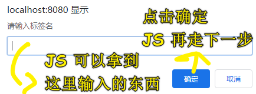

> 可以直接回车确定！

如果用户咩有输入内容，该 API 返回值默认就是一个空字符串 `''`

如果用户输入了内容，我们就得更改 `dataSource` 的值，但是 `Tags` 组件是不能自己直接更改它的，因为 `dataSource` 是外部传过来的，不是`Tags` 组件自己的！

为啥 `dataSource` 要加 `readonly`？

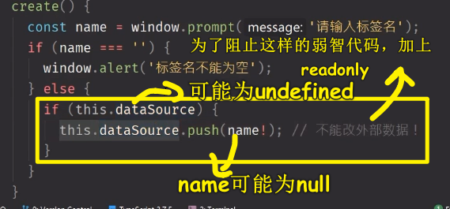

上边的代码 `tsc` 并没有提示爆红，因为我们是直接往数组里边追加元素，并没有更改`dataSource` 的地址，而 `tsc` 功能有限，所以就没有提示爆红了 -> 如果你直接这样 `this.dataSource = []`，那么就会报错——「**你不能把一个值赋值给一个 `const` or `readonly` 的变量**」

总之，为`Prop`加`readonly`，是为了防止我们写弱智代码——组件更改来自外部的数据！

> 理论来说，我们直接在 `Tags` 组件里边 `update` `dataSource` 是可以的，Vue ，并没有阻止我们这种做法，但 Vue 不推荐！因为这是一种不规范的行为，子组件改外部数据，很容易导致数据混乱，让代码难以维护！

作为一个职业素养良好的前端程序员来说，我们不应该让组件更改来自外部的数据，于是，我们就用了`$emit` 这个 API：

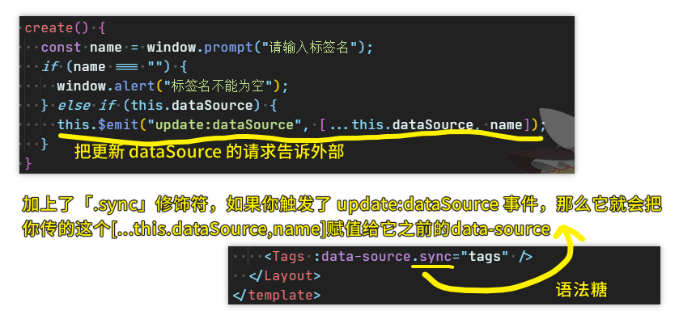

> `.sync` 的本质就是拿到子组件传过来的数据，然后把这数据赋值给父组件的`tags`状态，`tags`一变，那么子组件的`dataSource`就能实时更新 -> 这是一个响应式过程！

---

关于标签的删除功能 -> 在「标签页」里边做！「记账页」可没有删除标签的功能！

> 这个记账页面做到现在，基本的功能已经完成了，至于还有其它的什么功能，目前还想不到！

下一篇，主要讲「如何把记账页面里的 4 个模块整合起来 -> 把它们的数据收集起来，然后把这些数据提交到数组里边或数据库里边！」

## ★了解更多

➹：[读懂 TS 中联合类型和交叉类型的含义 - 全栈修仙之路](http://semlinker.com/ts-meaning-of-union-and-intersection-types/)

## ★总结

- 写代码就跟写作文一样，你写的作文，交给老师打分就相当于把代码扔到浏览器里边跑，你在写作文的时候，觉得自己写得很好，但老师一看就知道有哪些 bug 了，而 TS 的出现就相当于是有个人在旁边指导你该怎么写才是严谨的…… -> 总之，没有 TS，你的代码考出来的分数是有上限的，而有了 TS，你的代码考出来的分数的上限要比没有 TS 的高得多！
- 我看了这个视频 [背多少单词才会说英语？5000 还不够吗？](https://www.bilibili.com/video/BV1GV411S7Cb)，我在想我看方方的前端视频是否是正确的输入？ -> 有一点我必须要搞清楚，那就是我真正想要的输出是什么？是 学会 「Vue2 + TS」 的使用吗？是为了能让这个项目出现在我的简历里边以应付面试吗？如果是为了面试，以及学会「Vue2+TS」的搭配使用，那么这个项目是否是一个好的输入呢？ -> 对于此时此刻的我来说，我认为这是一个好的输入！

## ★Q&A

### <mark>1）slice 和 splice 的区别？</mark>

- `slice`没有副作用，第二个参数可以是负数，返回值是截取过后的值
- `splice`有副作用，第二个参数不能是负数，因为它表示删除的个数，如果你不写第二个参数，假如第一个参数是`1`，那么这表示从索引`1`开始，一直删到结束，返回值是被删元素组合起来的新数组

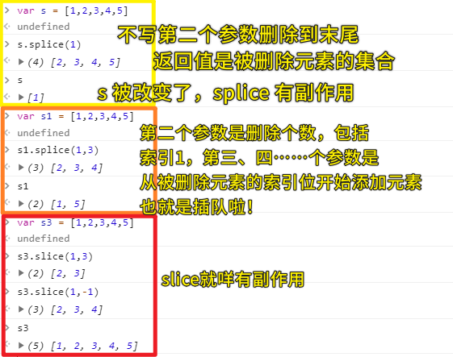

补充：

``` js
var s34 = [1,2,3,4,5]
s34.splice(1,3,7,8,9) // [2, 3, 4]
s34 // [1, 7, 8, 9, 5]
```

➹：[slice（）与 splice（）的用法和区别你清楚吗？_积少成多-CSDN 博客](https://blog.csdn.net/wxl1555/article/details/79388292)

➹：[JavaScript Array splice vs slice - Stack Overflow](https://stackoverflow.com/questions/37601282/javascript-array-splice-vs-slice)

➹：[JavaScript slice()、splice()、split() 傻傻分不清 - by Peggy Chan - Medium](https://medium.com/@bebebobohaha/slice-splice-split-%E5%82%BB%E5%82%BB%E5%88%86%E4%B8%8D%E6%B8%85-46d9c8992729)
