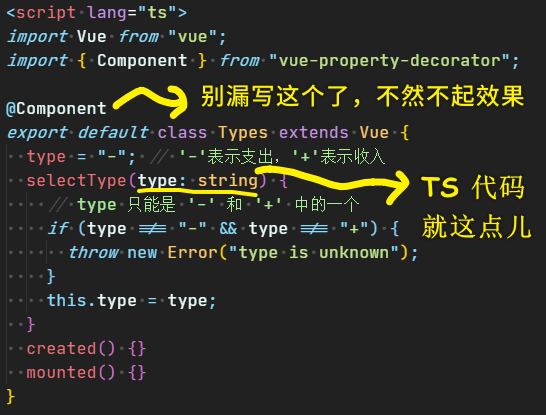

### ✍️ Tangxt ⏳ 2020-08-27 🏷️ Money 组件

# Money.vue 组件（下）

## ★JS 组件

> 先用 JS 的姿势来写，写完后再改写成 TS 姿势的！

1）「收入」&「支出」类型切换组件

刚开始搞，就来整个最简单的！

在单文件组件里边，写 JS 区域的模板：

``` html
<script>
  export default { data, props, methods, created, /**...**/ }
</script>

<!-- <=> -->

<script lang="js">
  export default { data, props, methods, created, /**...**/ }
</script>
```

> 你不写`lang="js"`，默认就是 `lang="js"`！

思路：

1. 定义这个切换组件的状态：`type`为`'+'/'-'`则表示组件为「收入/支出」状态 -> 定义组件状态用 `data`
2. 在`template`里边代表「支出」和「收入」的这俩元素，此时 `type` 为何值，那么相对应的谁就有下划线，也就是谁会有 `selected` 这个 class
3. 组件状态的改变 -> `click` 元素

代码：[Demo](https://github.com/ppambler/vue-morney/commit/8425cd2198778b2a1dddbb2a629e234a499820ba)

2）代码分析

`:class="type === '-' && 'selected'"`：


vue 在背后做了很多事情，如果 `&&` 表达式返回了 `false`，那么 vue 就会自动把这个 `false` 值给去掉，毕竟 class 是 `false` 未免也显得忒奇怪了吧！ -> 总之，这是一种**简写的写法**！正常写法应该是整个三目运算……

`@click="selectType('-')"`：

这还有一种写法，那就是直接 `type = '-'`就可以了，但是这种写法**只能写一行代码**，所以这就显得很鸡肋了！而方法调用则可以**写多行代码**！

该「切换组件（`Types`）」接收外边传过来的值：

透过 `props` 这个 options API 就可以做到！ -> 拿到传过来的值，一般扔到 `mounted` 里边使用！


---

接下来看看如何把上边的 JS 代码，改成是 TS 姿势的！

## ★TS 组件

> 实现第一个 TS Vue 组件


1）TS 组件 vs JS 组件

它们俩最大的不同：

TS 组件不用构造选项 -> 为啥不用？ -> 因为构造选项是没有类型的，而且可以随便加东西！

写 TS 组件必须要用 `Class` -> 这是 Vue 规定的！

2）如何写一个 TS 组件？

1. 为 `<script>` 添加 `lang="ts"`
2. 导出一个 `class`，而且该 `class` 继承 `vue` -> 这是规定
3. 在 `class` 里边定义实例的自有属性 -> 就是在干 `data` 的活儿
4. 在 `class` 里边定义实例的方法 -> 就是在干 `methods` 的活儿
5. 安装`vue-property-decorator`：`npm i -S vue-property-decorator` -> 在安装`vue-property-decorator`的过程中，连带着`vue-class-component`也一起安装了！
6. 添加装饰器 `@Component` -> 有了它，就可以把「自有属性+实例方法」自动处理成「`data`+`methods`」了 -> 没有它，那就不帮你处理了！ -> **总之，它是一个自动化的帮我们处理代码的东西**
7. 为 JS 代码加类型 -> 你用 webstorm，如果代码出现爆红，那么你就得把它去处理成不爆红的状态！ 如：为形参加类型 `selectType(type: string) {}`（是小写的`string`，可不是大写的`String`）

> 如何添加生命周期钩子？ -> 直接 `created() {}` 就行了！

代码：



3）vue-property-decorator

文档：[kaorun343/vue-property-decorator: Vue.js and Property Decorator](https://github.com/kaorun343/vue-property-decorator)

这个包不是尤雨溪写的，话说，为啥不用尤雨溪的呢？ -> 因为尤雨溪写的没有这个人写的好！

尤雨溪写的是这个：[vuejs/vue-class-component: ES / TypeScript decorator for class-style Vue components.](https://github.com/vuejs/vue-class-component) -> 这是 Vue 官方提供的 TS 支持库！但其功能不如 `vue-property-decorator` 好用，所以我们就用了这个 `vue-property-decorator`！

`vue-property-decorator` 提供了好几个装饰器（`@`开头的），当然，我们用的这个 `@Component` 是 Vue 官方提供的！所以，如果你要看 `@Component` 的官方文档，那就得看 `vue-class-component` 的！

透过 CRM 学习法来了解 `@Component` 的使用：

> 文档：[Overview - Vue Class Component](https://class-component.vuejs.org/)


> CRM 学习法，让你可以不用深究所有的事情，**节省大量的时间**！当然，你的 JS 基础得扎实才行！ -> 「`class` 语法」 无非就是把 「JS 对象写法」 换成是另一种写法罢了！所以，如果你时间有限的话，其实可以放弃深究 `class` 的语法细节，以及 装饰器的用法！直接依葫芦画瓢就行了，反正你已经知道这种写法的背后做了什么……

## ★TS 组件 `@Prop` 装饰器


