### ✍️ Tangxt ⏳ 2020-09-04 🏷️ LocalStorage

# 09-保存至 LocalStorage

## ★前言

涉及到的知识点：

1. `.sync` 怎么用
2. TS 怎么用
3. `window.localStorage` 怎么用
4. 数据迁移是什么

## ★收集四个组件的 value

### <mark>1）代码实现</mark>

思路：

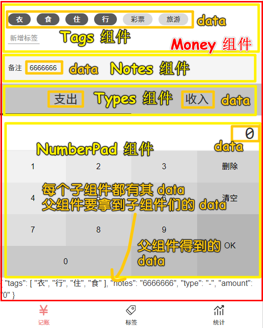

我们要做的就是如何把这 4 个子组件的 `data` 上交给 父组件 `Money` ，其中需要注意的是，除了「备注」的数据，其余的都是父组件传给子组件的！

> 如果我们当初不考虑模块化，那么父子通信的问题也就无须考虑了！ -> 似乎组件标签上，只能写自定义事件，而像元素标签则可以写原生事件！

我是用什么视角来看待父子组件的？或者说我眼中这样的代码：

``` html
<template>
  <Layout class-prefix="layout">
    <NumberPad :value.sync="record.amount" />
    <Types :value.sync="record.type" />
    <Notes @update:value="onUpdateNotes" />
    <Tags :data-source.sync="tags" @update:value="onUpdateTags" />
  </Layout>
</template>
```

在我脑海里的呈现是怎样的？

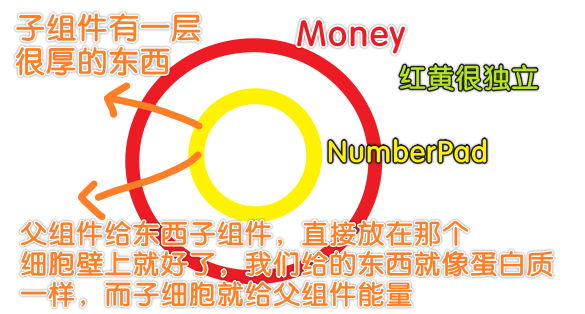

> 可以看成是鸡蛋白和蛋黄的关系，细胞质和细胞核的关系

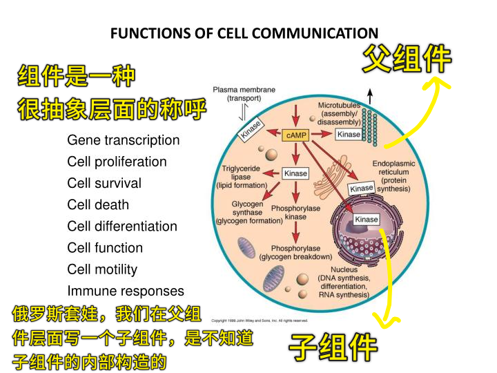

代码：[Demo](https://github.com/ppambler/vue-morney/commit/c1036d10d1c607206daedf2a2b0a8c2a8a23203f)

### <mark>2）代码解析</mark>

> 原先我们把 `Money.vue` 分成了 4 个部分，而现在我们需要把这 4 部分给整合起来、互相关联起来！ -> 把这些子组件的数据收拢到父组件上！ -> 把用户填的东西都收集起来！

#### <mark>1、 `Tags.vue`</mark>

父组件（`Money`）区域监听子组件标签 `Tags` -> 一旦某个 `tag` 被用户选中，父组件就能拿到这个 `tag` 的内容

---

题外话：

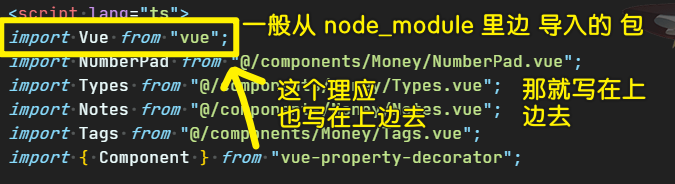

---

我们用了 `class` 姿势写组件，那么局部注册组件，就得这样来：

``` js
@Component({
  components: {
    NumberPad,
    Types,
    Notes,
    Tags,
  },
})
```

不然，你在 `class` 里边这样：

``` js
class Money extends Vue {
  components = {
    Tags,
    Notes,
    Types,
    NumberPad
  }
}
```

那岂不是在写`data`？

回过头来，当用户在子组件的这个界面区域，选中了一些标签，那么你就 `$emit` 一下，该 API 会抛一个信号并带着一个实参（选中的一个个标签）向上传递给父组件 -> 父组件执行 `callback`搞一些事情……

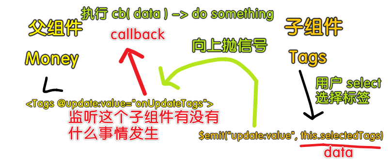

> 自定义的事件名 `update:value` 是约定俗称的，当然，你也可以用 `xxx` 流之类的名称！

关于 `callback` 的命名 -> 某件事情发生了，那我就会回应点什么 -> `on`+`你要回应的事儿` -> 如`onUpdateTags`，子组件`update:value`了，那我就在这个事情上（`on`），回应你，如`UpdateTags`！

> 好的命名，让你不用写注释！ -> 见名知义！

---

接下来看看如何获取用户输入的备注……

#### <mark>2、`Notes.vue`</mark>

跟上边的做法基本一致……

一个细节点，方方本来是这样起事件名的：

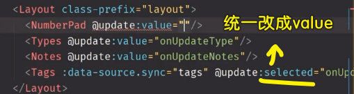

之后就统一改成 `value` 了：

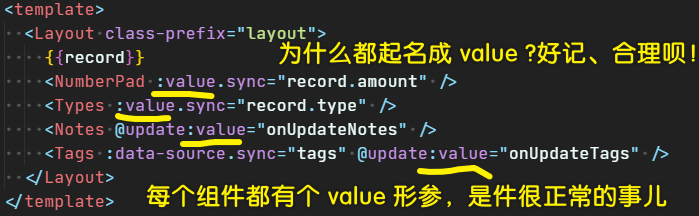

> 统一把用户输入的数据，都叫做 `value` -> 不用操心是取`type`（来自 `Types` 组件的数据），还是 `tag`（（来自 `Tags` 组件的数据））这样画蛇添足的命名了……

`@Watch('value')`：

> `callback`的第一个参数是新值 `value`，第二个参数则是旧值 `oldValue`

`value`发生一丁点的更新，那就`$emit`一下！

> 你在写代码的时候，看到文档是这样写的： `val`，那么你就改成 `value` -> 不推荐用简写，你无须跟着文档这样写，文档傻逼那时它的事儿…… -> 这样你的脑海中就不会有潜意识的把 `val` 转化成 `value` 的念头了！

#### <mark>3、`NumberPad.vue`</mark>

> amount：总金额

本来是同上的做法，但为了代码简洁，用了 `.sync` 语法 -> 让我们少写了一些东西：

- 一个方法
- 一个`@update:value="onUpdateAmount"`

多了一些东西：`:value.sync="record.amount"`

子组件抛上来的 `data` 会赋值给 `record.amount`

而这就是 `.sync` 给我们代码带来的 「糖」！

---

`ok`：触发事件的位置 -> 用户体验 -> 用户输入完数据，点 `ok` 按钮再触发事件，而不是一边输入一边触发事件，所以就不用`@Watch`了 -> 如果用户狂点`ok`按钮，那就是用户的事儿了，我们无须去处理（或者你可以给一个反馈给用户，比如「fuck!」）

> 作为一个前端，你在写代码的时候也要考虑用户交互的事儿了！ -> 虽然这是产品经理的活儿……

#### <mark>4、`Types.vue`</mark>

为什么不在 `selectType`方法里边触发事件？

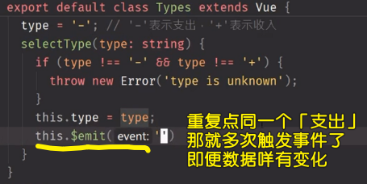

所以我们就用了 `@Watch`：

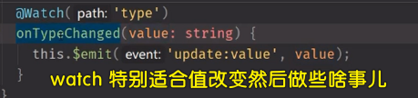

> 第一次进来会触发吗？ -> 自己去测试一下，测试不通过，那就再改！

#### <mark>5、`Money.vue`</mark>

我们要把从每个子组件里边得到数据统一给记录起来！ -> 所以为`Money`组件创建了一个叫`record`的状态！

话说，`record`的类型是啥？普通对象`{}`这样？ -> 这是不行滴，因为在 TS 里边你不能直接说它就是一个对象，你得说这个对象有哪些东西才行 -> 把 `record` 的类型明确写出来 -> 如何写？

``` ts
type Record = {
  tags: string[];
  notes: string;
  type: string;
  amount: number;
};
```

> `tags: string[];`这个`;`可以是`,`，甚至可以不用写 -> 总之，有 3 种姿势可选（很宽容的做法） -> 一般都是用 `;`（格式化插件自动帮我们加`;`，不需要我们手动添加）

TS 的类型声明和 JS 的变量声明特别像，如 `var record = { tags: ['1','2']}`

TS 的类型声明 -> 不要告诉我值是多少，我只关心类型 -> **只写类型，不写值**

写这个类型声明的时候，你可以先用 JS 写一个有值的 `record` 出来，然后再抽象成类型声明的形式：

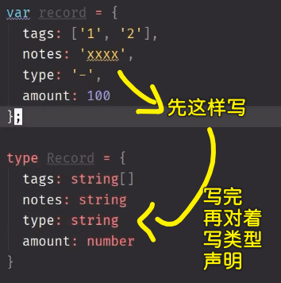

至此，我们已经知道了如何在 TS 里边声明一个类型了！

总之，`record`是一个复杂类型，我们不能直接这样 `record: Object`，因为`tsc`并不知道`record`它有哪些属性 -> 所以就用了我们写的自定义类型 `Record`

关于给`record`初始值，如果你直接这样 `record: Record = {}`，那么就会报错——「大哥，你得声明一下 `Record` 里边的四个属性呀！ 」（**根据类型声明，你这一个属性都不能少**）

所以我们就这样给初始值了：

``` ts
export default class Money extends Vue {
  record: Record = {
    tags: [],
    notes: "",
    type: "-",
    amount: 0,
  };
}
```

> 在 Java 里边的定义一个接口类，只写方法签名，不写方法的实现代码！ -> 而 TS 只写类型，不写值！

话说，我不写某个属性的初始值行吗？ -> 也是可以的，你直接对某个属性的类型声明加个 `？` 就行了：

``` ts
type Record = {
  tags?: string[];
  notes: string;
  type: string;
  amount: number;
};
```

这样一来，你就可写 `tags` 属性，也可不写 `tags` 属性了！

> 如果你觉得这样写很麻烦，转为用 JS 姿势，那就是懦夫行为，当然，如果你急着找工作，那你可以用 JS -> TS 的类型声明真得很简单，记住那七种数据类型就好了！

话说，TS 不是可以自动推测类型吗？我们不写 `Record` 这个类型声明，直接像写 JS 那样给`record`初始值，难道不行吗？ -> 理论是可以的，但测试发现报错了！ -> 总之，你不要省类型声明那几个字符，就跟变量命名不用简写一样，多写几个字不会死的……况且，你少写几个字，是很容易出 bug 的！

---

如何更新 `record`？

> 直接对`record`旗下的一个个属性赋值就好了

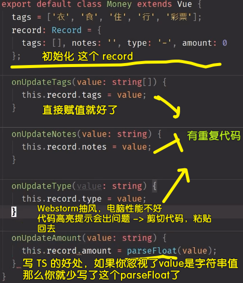

> webstorm -> 代码高亮抽风情况（电脑性能不好所致） -> 剪切后重新粘贴，webstorm 会重新检查代码！ 

---

如何知道我们的代码对`record`的收集是正确的？ -> 打 `log` -> 在 `template`里边用个插值表达式就好了！

测试一下：

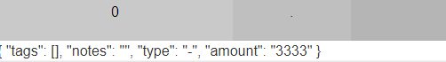

思考用户的行为（站在别人的角度思考我们代码这样的交互是否可行） -> 假如用户不选标签、也不输入备注？ -> 无关紧要，这两个都是可选项 -> 默认选项的设置：`0`是一个，`'-'`也是一个（支出出现的频率高，所以就用了`'-'`作为默认值，而不是`'+'`）

### <mark>3）小结</mark>

如何监听四个组件的变化 -> 把这四个组件的值收集起来，然后放到父组件的`record`里边去！

话说，我们该如何把`record`存到数据库里边去？

在解决这个问题之前，还得解决一个问题，那就是我们要把来自父组件`record`的初始值传给子组件，而不是让子组件自己决定自己的初始值，如`Types`组件的`type`状态：

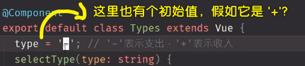

需求变更，如默认是 `'+'`而不是`'-'`，那么你就得改两处地方了 -> 这是靠记忆知道要改两处地方，但人类记忆一般都是不可靠，所以你很有可能改了 `Types` 这处的，忘记了`Money`的`record`这处也要改！

所以我们需要让这两处变成是一个变量 -> 也就是 `Types` 里边的 `type` 值必须是从外界输出过来的！ -> 总之，默认值是外界给的，不能是 `Types` 这个组件自己定的！

想到这里，我们修改了`Types`代码 -> 代码更少了，更简单了，而这是因为 `Types` 组件不用去操心自己的 `data`了，毕竟数据是来自于外部的，外部说是啥，那就是啥，`Types`组件没有资格直接赋值更改它，只能在修改值的时候，通知外部改值，然后再让外部改完值后再传回来！

更改的结果：`@Prop() readonly value: string` -> 然而这样报错了！（`tsc`说你没有初始化） -> 可我们能确定这值是从外边传进来的呀！ -> **我们能确保不需要初始化**

那就改成这样：`@Prop() readonly value: string = '-'`？ -> 可这不是原先那种情况吗？而且，我加了`readonly`，表示 `value` 是不能写，只能读的！

所以，我们该如何给`value`一个默认值？

两种姿势：

``` ts
export default class Types extends Vue {
  @Prop({default: '-'}) readonly value!: string
  // or 
  @Prop() readonly value!: string
}
```

前者表示，如果父组件没传初始值，那就用 `'-'`，但我们能确保它是传了的，因为这代码是我们自己写的呀！所以我们用的是后者！

---

更新 `Type` 组件 `value` 状态的位置：在 `selectType` 里边，而不是`@Watch`里边！ -> 因为 `value` 现在是 `prop` 了！`value`的变化是交给父组件去改的！所以你去监听 `value` 是毫无意义的！

回到 `Money` ，再看一下 `.sync` 的用法：

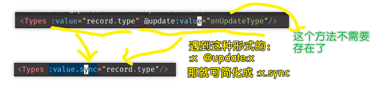

话说，`record.type`的状态是如何变化的？ -> `recore.type = $event`（`$event`是子组件`$emit`传过来的参数） -> `.sync`就是把这个参数赋值给省了，还有把那个`@update:value`也给省了 -> 整体上看，子组件想要的值手递手传给了父组件，然后父组件再传回给子组件


`.sync`这个语法糖的效果就像是父子之间的双向绑定一样……

> 同`v-model`一样，这都是伪双向绑定，本质都是单向数据流，因为这背后都存在一个事件作为第三方，就像是儿子要爸爸打钱，需要经过妈妈的同意才行…… -> 但这俩东西的存在，确实实打实地让我们的代码不用出现事件监听器代码，而这就给人一种是双向绑定的错觉了！

话说，`v-model` 与 `.sync` 有啥区别？

- `v-model`只认`value`属性+`input`事件 -> 常用于**表单元素**，以及有这俩东西的组件标签
- `.sync`可以认自己任意写的属性（如`xxx`）和事件（如自定义事件`@update:zzz`） -> 注意，必须要有`update:`

`v-model`和`.sync`还有的区别：在一个组件上，只能使用一个`v-model`，而`.sync`则可以多次使用

总之，`.sync`的使用场景很广泛，而且相较于`v-model`来说更方便…… -> **万金油**

---

关于一致性的追求：

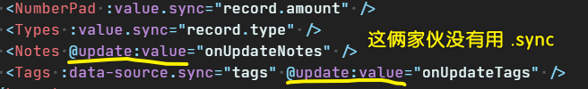

因为父组件并没有打算给子组件 `Notes` 和 `Tags` 一个初始化值 -> 也就是没有传`value`属性，所以这也就不打算用`.sync`了，总之，让这俩东西自己去维护用户输入的值，而父组件只管接收这俩东西传上来的数据就行了！

> 如果后边有需求，那你就自己改成是`.sync`的姿势吧！如用户在记一笔账的时候，默认就有`'食'`这个标签，这个时候，我们就可以像改 `Types` 组件那样，改`Tags`组件了！

---

一句话概括 `.sync`，那就是父组件拿到子组件的最新值，然后再手递手传回给子组件！

## ★使用 `.sync`

### <mark>1）那个 `NumberPad.vue` 的改造</mark>

父组件区域：

``` html
<!-- record.amount -> number -->
<NumberPad :value.sync="record.amount" />
```

子组件的映射代码：

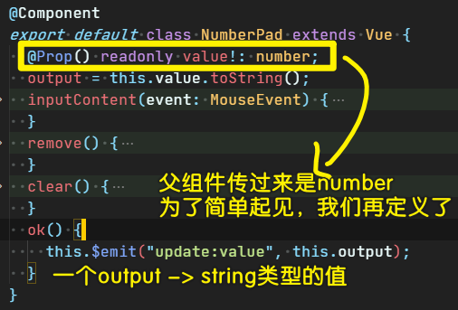

> `0`来自于外界，把来自于外界的`0`字符串化！ -> 注意，我们改 `output` 的状态，除了`ok` 方法要告诉外界子组件要改 `output`，其余的方法都是直接改 `output`，所以这一点看起来是有点不一致的，但为了方便起见还是这样做了！

这样的做法都是为了让`NumberPad`的默认值由外边控制，而不是自己内部写死！

> `:value.sync` 这个 `value` 的命名是方方的命名习惯，你可以改成是 `:x.sync`，那么事件就是 `update:x`了

---

接下来看看如何把 `record` 的值存到数据库里边去！

## ★使用 LocalStorage

> 有数据库吗？ -> 用浏览器提供的 LocalStorage 功能！

### <mark>1）代码实现</mark>

思路：

当用户点击 `ok` 的时候，我们就把 `record`（`{}`） 的副本值 记录到 `recordList`（`[{},{}……]`） 里边去 -> 把 `recordList` 字符串化 扔到 `localStorage` 里边去！

代码：[Demo](https://github.com/ppambler/vue-morney/commit/96d2fbe327e36944816cc6957390cb8a085267ce)

### <mark>2）代码解析</mark>

``` js
window.localStorage.setItem("recordList", JSON.stringify(this.recordList))
```

`localStorage`的`Item`存储的值是字符串！所以我们需要把`[{},{}……]`这样的值给序列化一下！

效果就像这样：

``` js
JSON.stringify([{name:'frank'}]) // -> "[{"name":"frank"}]"
```

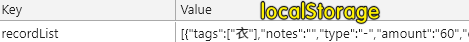

---

`onRecordListChange`这个名字，方方不喜欢加`d` -> `onRecordListChanged`

---

为什么是这样：

``` js
{
  saveRecord() {
    const record2 = JSON.parse(JSON.stringify(this.record));
    this.recordList.push(record2);
    console.log(this.recordList);
  }
}
```

而不是这样：

``` js
{
  saveRecord() {
    this.recordList.push(this.record);
    console.log(this.recordList);
  }
}
```

因为如果你选择后边这种做法，那么你每次`push`都是在`push`同一个引用了！ -> 而这样的结果就是`[]`里边的一个个`{}`都一样的！

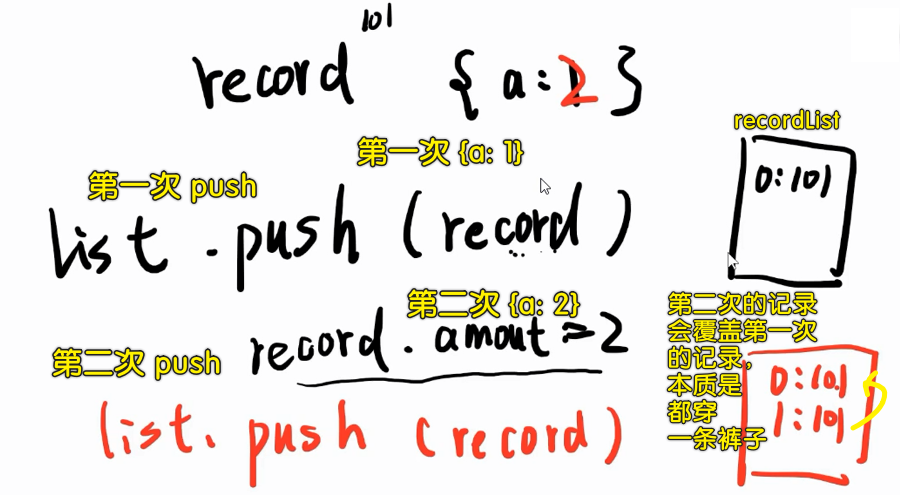

所以，我们就需要把`record`深拷贝一下 -> 把得到的`record2`（副本） `push` 到 `recordList`里边去！

> 对象 -> 字符串化 -> 对象化

`recordList` 存储的是每条记账的记录！

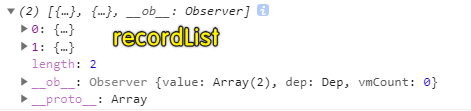

---

### <mark>2）处理一些小 bug</mark>

代码：[Demo](https://github.com/ppambler/vue-morney/commit/a7025fd52629a9637f5b7b8edd1191bb2650319a)

---

每次点击 `ok` ：把`output` 里边的内容重置为 `'0'` -> 而不是还有上一次记账所输入的金额！

---

每次刷新这个`Money`页面，`recordList`都重置为`[]`，而这显然是不合理的，所以我们就这样干了：

``` ts
const recordList: Record[] = JSON.parse(
  window.localStorage.getItem("recordList") || "[]"
);
```

`Money`组件的`recordList`状态的初始值来自于`localStorage`！ -> 拿到值是字符串值，所以我们需要把这个值 `JSON.parse` 一下！

> `recordList`的数据 -> 需要交给「统计」页面去统计！

---

我们需要把一条账的创建时间给记录下来：

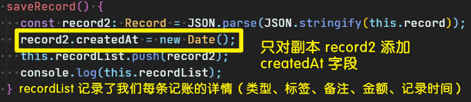

> 可选需求：用户可以自己改时间记一笔账 -> 我们这里的时间都是随时记的！不关心这笔账是几点花出去的！

题外话，类型声明语法：

``` ts
type Record = {
  tags: string[];
  notes: string;
  type: string;
  amount: number;
  // or createdAt: Date || undefined
  createdAt?: Date;
};
```

`Date`是拓展类型，不只是那七种类型！ -> 简单来说，我们除了可以写数据类型以外，还可以写 `类` 这样的东西！（在 JS 里边 `类` 叫「构造函数」）

注意，类 和 类型 是不同的 -> 类型是更大的数据划分，如 JS 的七大数据类型（`string | object | ……`）！其中 `object` 可以细分成不同的 `类`，如`Date | RegExp | ……`（这是大写字母开头的）

总之，**「类」是比「类型」更小的一个概念！，因为「类」是对 `object` 这个「类型」的分类，而「类型」则是所有数据的分类！**

---

在写代码时的提示问题：

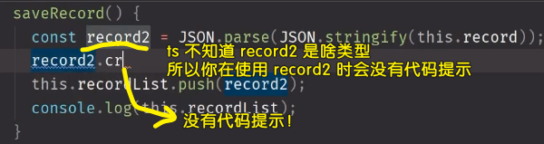

为啥不提示？ -> 因为 ts 认为 `record2` 是一个 `any` 类型，即 ts 不知道 `record2` 是啥类型，也就是任意类型啦！

所以，我们就这样做了：`record2: Record` -> 当你再写 `record2.` 的时候，vscode 就会提示你它有 5 个属性！

---

用户先前的记录是咩有时间这个字段的，而现在我们添加了时间：

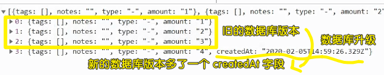

问题来了：网站的数据库升级了（多了一个时间字段），而用户的数据库并咩有升级，我们需要通知用户「把数据库清空一下」？ -> 这些数据都是重要的呀！ -> 简单来说，这涉及到一个**数据库的版本问题**！

所以我们最好再追加一个有关**数据库版本的变量**！（发现用户的数据库版本不对，那就在保存一笔账前，先把用户的数据库给升级了，再保存到`localStorage`里边去）

> 数据库变化了，如何做数据迁移？

## ★数据迁移策略

### <mark>1）代码</mark>

> 大概了解那个意思

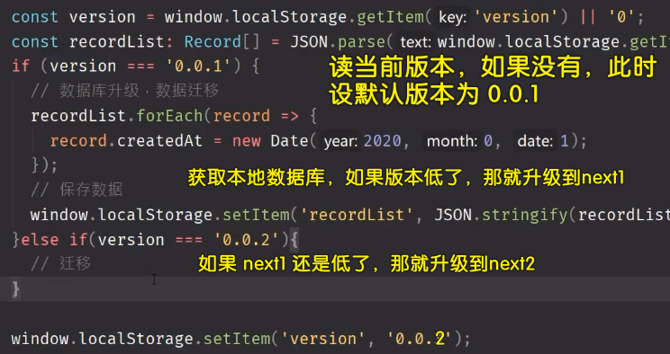

### <mark>2）迁移的复用</mark>

> 一次挨着一次的升级，而不是一步登天

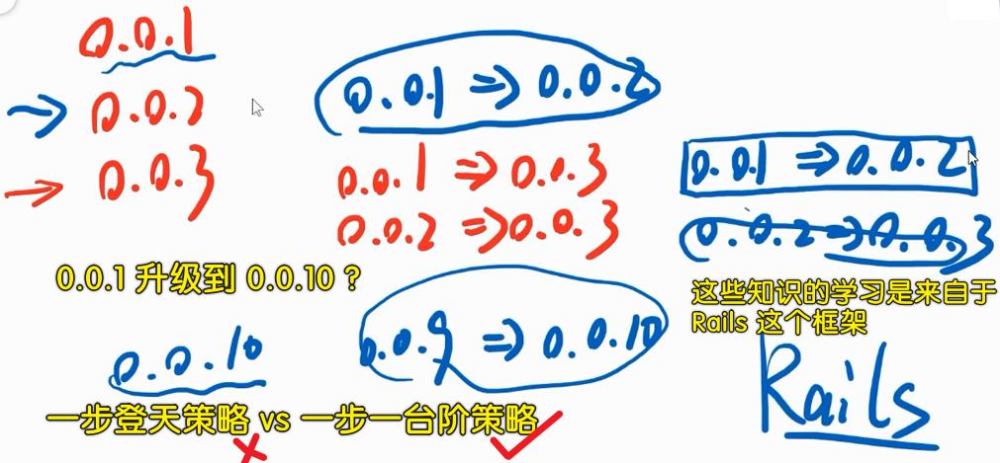

关于升级的策略：

是

```
0.0.1 -> 0.0.2 -> 0.0.3 -> 0.0.4…… -> 0.0.10
```

不是

```
0.0.1 -> 0.0.10
```

这样一来问题就变得简单很多了！

### <mark>3）小结</mark>

为了避免数据库迁移的问题，**一定要在想数据的时候一次性想好**！ -> 也就一张表有哪几个字段，一定要一次性想好！

---

至此，保存数据库一块内容就搞定了！

下一篇，对数据库的操作（读和写）进行封装！

我们不想每次「读」的时候，需要写这么一长串的代码：

``` js
const recordList: Record[] = JSON.parse(
  window.localStorage.getItem("recordList") || "[]"
);
```

「写」的时候，也要写这么一长串的代码：

``` js
window.localStorage.setItem("recordList", JSON.stringify(this.recordList));
```

## ★总结

父组件 vs 子组件：

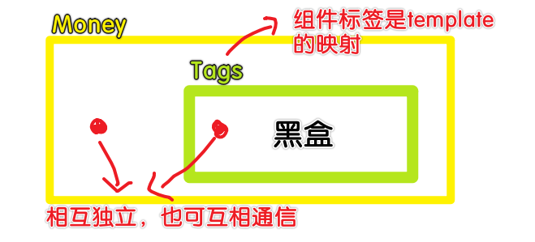

## ★Q&A

### <mark>1）解析 和 分析的区别？</mark>

- 分析就是将研究对象的整体分为各个部分，并分别加以考察的认识活动。分析的意义在于通过认识事物或现象的区别与联系，细致地寻找能够解决问题的主线，并以此解决问题。
- 【词目】解析，【拼音】`jiě xī`，【英译】`analysis`，【基本解释】剖析；深入分析。近义词为分析。

解析表达的意思更为严谨，是内在的分析。分析是外在、可识别的区分。

> 分析父组件，解析子组件

➹：[词语 解析 和 分析 的区别是什么_百度知道](https://zhidao.baidu.com/question/620729114991460172.html)

### <mark>2）在组件标签上只能写自定义事件，而原生事件只能写在元素标签上？</mark>

我们想要在一个组件的根元素上直接监听一个原生事件，那么可以这样：

> `v-on` + `.native`

``` html
<base-input v-on:focus.native="onFocus"></base-input>
```

所以我们在组件标签上也可以写原生事件，但这并不好！因为如果根元素不是`input`的话，那就 GG 了！

➹：[自定义事件 — Vue.js](https://cn.vuejs.org/v2/guide/components-custom-events.html)

### <mark>3）Cookie、localStorage、sessionStorage？</mark>

三者的异同：

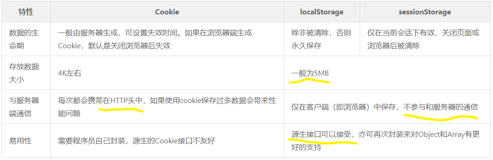

➹：[详说 Cookie, LocalStorage 与 SessionStorage - 咀嚼之味](https://jerryzou.com/posts/cookie-and-web-storage/)

➹：[Cookie、LocalStorage、SessionStorage 差異 - by Peggy Chan - Medium](https://medium.com/@bebebobohaha/cookie-localstorage-sessionstorage-%E5%B7%AE%E7%95%B0-9e1d5df3dd7f)

➹：[Window.localStorage - Web APIs - MDN](https://developer.mozilla.org/en-US/docs/Web/API/Window/localStorage)
