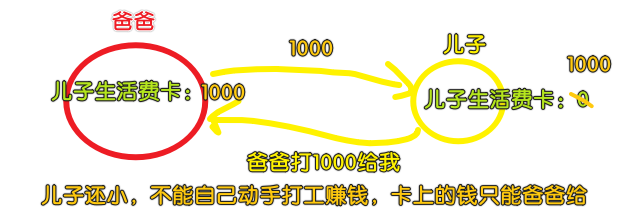

### ✍️ Tangxt ⏳ 2020-09-04 🏷️ LocalStorage

# 09-保存至 LocalStorage

## ★前言

涉及到的知识点：

1. `.sync` 怎么用
2. TS 怎么用
3. `window.localStorage` 怎么用
4. 数据迁移是什么

## ★收集四个组件的 value

1）代码实现

思路：


我们要做的就是如何把这 4 个子组件的 `data` 上交给 父组件 `Money` ，其中需要注意的是，除了「备注」的数据，其余的都是父组件传给子组件的！

> 如果我们当初不考虑模块化，那么父子通信的问题也就无须考虑了！ -> 似乎组件标签上，只能写自定义事件，而像元素标签则可以写原生事件！

我是用什么视角来看待父子组件的？或者说我眼中这样的代码：

``` html
<template>
  <Layout class-prefix="layout">
    <NumberPad :value.sync="record.amount" />
    <Types :value.sync="record.type" />
    <Notes @update:value="onUpdateNotes" />
    <Tags :data-source.sync="tags" @update:value="onUpdateTags" />
  </Layout>
</template>
```

在我脑海里的呈现是怎样的？


> 可以看成是鸡蛋白和蛋黄的关系，细胞质和细胞核的关系


代码：[Demo](https://github.com/ppambler/vue-morney/commit/c1036d10d1c607206daedf2a2b0a8c2a8a23203f)

2）代码解析

> 原先我们把 `Money.vue` 分成了 4 个部分，而现在我们需要把这 4 部分给整合起来、互相关联起来！ -> 把这些子组件的数据收拢到父组件上！ -> 把用户填的东西都收集起来！

1、 `Tags.vue`

父组件（`Money`）区域监听子组件标签 `Tags` -> 一旦某个 `tag` 被用户选中，父组件就能拿到这个 `tag` 的内容

---

题外话：


---

我们用了 `class` 姿势写组件，那么局部注册组件，就得这样来：

``` js
@Component({
  components: {
    NumberPad,
    Types,
    Notes,
    Tags,
  },
})
```

不然，你在 `class` 里边这样：

``` js
class Money extends Vue {
  components = {
    Tags,
    Notes,
    Types,
    NumberPad
  }
}
```

那岂不是在写`data`？

回过头来，当用户在子组件的这个界面区域，选中了一些标签，那么你就 `$emit` 一下，该 API 会抛一个信号并带着一个实参（选中的一个个标签）向上传递给父组件 -> 父组件执行 `callback`搞一些事情……


> 自定义的事件名 `update:value` 是约定俗称的，当然，你也可以用 `xxx` 流之类的名称！

关于 `callback` 的命名 -> 某件事情发生了，那我就会回应点什么 -> `on`+`你要回应的事儿` -> 如`onUpdateTags`，子组件`update:value`了，那我就在这个事情上（`on`），回应你，如`UpdateTags`！

> 好的命名，让你不用写注释！ -> 见名知义！

---

接下来看看如何获取用户输入的备注……

2、`Notes.vue`

跟上边的做法基本一致……

一个细节点，方方本来是这样起事件名的：


之后就统一改成 `value` 了：


> 统一把用户输入的数据，都叫做 `value` -> 不用操心是取`type`（来自 `Types` 组件的数据），还是 `tag`（（来自 `Tags` 组件的数据））这样画蛇添足的命名了……

`@Watch('value')`：

> `callback`的第一个参数是新值 `value`，第二个参数则是旧值 `oldValue`

`value`发生一丁点的更新，那就`$emit`一下！

> 你在写代码的时候，看到文档是这样写的： `val`，那么你就改成 `value` -> 不推荐用简写，你无须跟着文档这样写，文档傻逼那时它的事儿…… -> 这样你的脑海中就不会有潜意识的把 `val` 转化成 `value` 的念头了！

3、`NumberPad.vue`

> amount：总金额

本来是同上的做法，但为了代码简洁，用了 `.sync` 语法 -> 让我们少写了一些东西：

- 一个方法
- 一个`@update:value="onUpdateAmount"`

多了一些东西：`:value.sync="record.amount"`

子组件抛上来的 `data` 会赋值给 `record.amount`

而这就是 `.sync` 给我们代码带来的 「糖」！

---

`ok`：触发事件的位置 -> 用户体验 -> 用户输入完数据，点 `ok` 按钮再触发事件，而不是一边输入一边触发事件，所以就不用`@Watch`了 -> 如果用户狂点`ok`按钮，那就是用户的事儿了，我们无须去处理（或者你可以给一个反馈给用户，比如「fuck!」）

> 作为一个前端，你在写代码的时候也要考虑用户交互的事儿了！ -> 虽然这是产品经理的活儿……

4、`Types.vue`

为什么不在 `selectType`方法里边触发事件？


所以我们就用了 `@Watch`：


> 第一次进来会触发吗？ -> 自己去测试一下，测试不通过，那就再改！

5、`Money.vue`

我们要把从每个子组件里边得到数据统一给记录起来！ -> 所以为`Money`组件创建了一个叫`record`的状态！

话说，`record`的类型是啥？普通对象`{}`这样？ -> 这是不行滴，因为在 TS 里边你不能直接说它就是一个对象，你得说这个对象有哪些东西才行 -> 把 `record` 的类型明确写出来 -> 如何写？

``` ts
type Record = {
  tags: string[];
  notes: string;
  type: string;
  amount: number;
};
```

> `tags: string[];`这个`;`可以是`,`，甚至可以不用写 -> 总之，有 3 种姿势可选（很宽容的做法） -> 一般都是用 `;`（格式化插件自动帮我们加`;`，不需要我们手动添加）

TS 的类型声明和 JS 的变量声明特别像，如 `var record = { tags: ['1','2']}`

TS 的类型声明 -> 不要告诉我值是多少，我只关心类型 -> **只写类型，不写值**

写这个类型声明的时候，你可以先用 JS 写一个有值的 `record` 出来，然后再抽象成类型声明的形式：


至此，我们已经知道了如何在 TS 里边声明一个类型了！

总之，`record`是一个复杂类型，我们不能直接这样 `record: Object`，因为`tsc`并不知道`record`它有哪些属性 -> 所以就用了我们写的自定义类型 `Record`

关于给`record`初始值，如果你直接这样 `record: Record = {}`，那么就会报错——「大哥，你得声明一下 `Record` 里边的四个属性呀！ 」（**根据类型声明，你这一个属性都不能少**）

所以我们就这样给初始值了：

``` ts
export default class Money extends Vue {
  record: Record = {
    tags: [],
    notes: "",
    type: "-",
    amount: 0,
  };
}
```

> 在 Java 里边的定义一个接口类，只写方法签名，不写方法的实现代码！ -> 而 TS 只写类型，不写值！

话说，我不写某个属性的初始值行吗？ -> 也是可以的，你直接对某个属性的类型声明加个 `？` 就行了：

``` ts
type Record = {
  tags?: string[];
  notes: string;
  type: string;
  amount: number;
};
```

这样一来，你就可写 `tags` 属性，也可不写 `tags` 属性了！

> 如果你觉得这样写很麻烦，转为用 JS 姿势，那就是懦夫行为，当然，如果你急着找工作，那你可以用 JS -> TS 的类型声明真得很简单，记住那七种数据类型就好了！

话说，TS 不是可以自动推测类型吗？我们不写 `Record` 这个类型声明，直接像写 JS 那样给`record`初始值，难道不行吗？ -> 理论是可以的，但测试发现报错了！ -> 总之，你不要省类型声明那几个字符，就跟变量命名不用简写一样，多写几个字不会死的……况且，你少写几个字，是很容易出 bug 的！

---

如何更新 `record`？

> 直接对`record`旗下的一个个属性赋值就好了


> webstorm -> 代码高亮抽风情况（电脑性能不好所致） -> 剪切后重新粘贴，webstorm会重新检查代码！ 

---

如何知道我们的代码对`record`的收集是正确的？ -> 打 `log` -> 在 `template`里边用个插值表达式就好了！

测试一下：


思考用户的行为（站在别人的角度思考我们代码这样的交互是否可行） -> 假如用户不选标签、也不输入备注？ -> 无关紧要，这两个都是可选项 -> 默认选项的设置：`0`是一个，`'-'`也是一个（支出出现的频率高，所以就用了`'-'`作为默认值，而不是`'+'`）

3）小结

如何监听四个组件的变化 -> 把这四个组件的值收集起来，然后放到父组件的`record`里边去！

话说，我们该如何把`record`存到数据库里边去？

在解决这个问题之前，还得解决一个问题，那就是我们要把来自父组件`record`的初始值传给子组件，而不是让子组件自己决定自己的初始值，如`Types`组件的`type`状态：


需求变更，如默认是 `'+'`而不是`'-'`，那么你就得改两处地方了 -> 这是靠记忆知道要改两处地方，但人类记忆一般都是不可靠，所以你很有可能改了 `Types` 这处的，忘记了`Money`的`record`这处也要改！

所以我们需要让这两处变成是一个变量 -> 也就是 `Types` 里边的 `type` 值必须是从外界输出过来的！ -> 总之，默认值是外界给的，不能是 `Types` 这个组件自己定的！

想到这里，我们修改了`Types`代码 -> 代码更少了，更简单了，而这是因为 `Types` 组件不用去操心自己的 `data`了，毕竟数据是来自于外部的，外部说是啥，那就是啥，`Types`组件没有资格直接赋值更改它，只能在修改值的时候，通知外部改值，然后再让外部改完值后再传回来！

更改的结果：`@Prop() readonly value: string` -> 然而这样报错了！（`tsc`说你没有初始化） -> 可我们能确定这值是从外边传进来的呀！ -> **我们能确保不需要初始化**

那就改成这样：`@Prop() readonly value: string = '-'`？ -> 可这不是原先那种情况吗？而且，我加了`readonly`，表示 `value` 是不能写，只能读的！

所以，我们该如何给`value`一个默认值？

两种姿势：

``` ts
export default class Types extends Vue {
  @Prop({default: '-'}) readonly value!: string
  // or 
  @Prop() readonly value!: string
}
```

前者表示，如果父组件没传初始值，那就用 `'-'`，但我们能确保它是传了的，因为这代码是我们自己写的呀！所以我们用的是后者！

---

更新 `Type` 组件 `value` 状态的位置：在 `selectType` 里边，而不是`@Watch`里边！ -> 因为 `value` 现在是 `prop` 了！`value`的变化是交给父组件去改的！所以你去监听 `value` 是毫无意义的！

回到 `Money` ，再看一下 `.sync` 的用法：


话说，`record.type`的状态是如何变化的？ -> `recore.type = $event`（`$event`是子组件`$emit`传过来的参数） -> `.sync`就是把这个参数赋值给省了，还有把那个`@update:value`也给省了 -> 整体上看，子组件想要的值手递手传给了父组件，然后父组件再传回给子组件



`.sync`这个语法糖的效果就像是父子之间的双向绑定一样……

> 这都是伪双向绑定，因为这背后都存在一个事件作为第三方，就像是儿子要爸爸打钱，需要经过妈妈的同意才行……

话说，`v-model` 与 `.sync` 有啥区别？

- `v-model`只认`value`属性+`input`事件 -> 常用于**表单元素**，以及有这俩东西的组件标签
- `.sync`可以认自己任意写的属性（如`xxx`）和事件（如自定义事件`@update:zzz`） -> 注意，必须要有`update:`

`v-model`和`.sync`还有的区别：在一个组件上，只能使用一个`v-model`，而`.sync`则可以多次使用

总之，`.sync`的使用场景很广泛，而且相较于`v-model`来说更方便…… -> **万金油**

---

关于一致性的追求：


因为父组件并没有打算给子组件 `Notes` 和 `Tags` 一个初始化值 -> 也就是没有传`value`属性，所以这也就不打算用`.sync`了，总之，让这俩东西自己去维护用户输入的值，而父组件只管接收这俩东西传上来的数据就行了！

> 如果后边有需求，那你就自己改成是`.sync`的姿势吧！如用户在记一笔账的时候，默认就有`'食'`这个标签，这个时候，我们就可以像改 `Types` 组件那样，改`Tags`组件了！

---

一句话概括 `.sync`，那就是父组件拿到子组件的最新值，然后再手递手传回给子组件！

## ★使用 `.sync`


