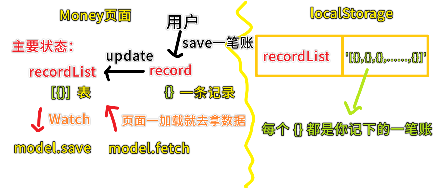
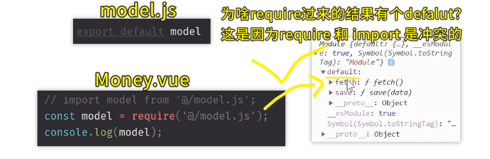
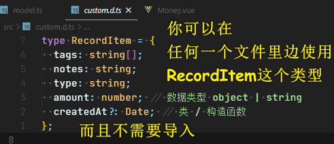
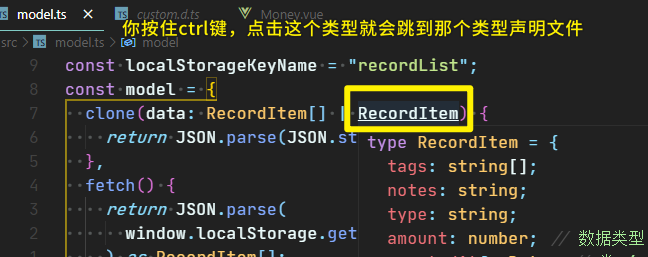
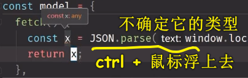
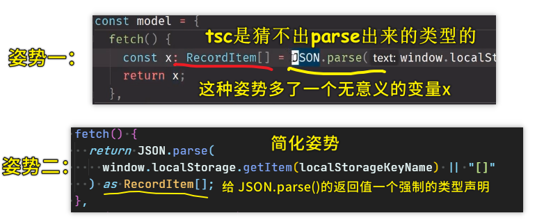
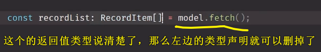
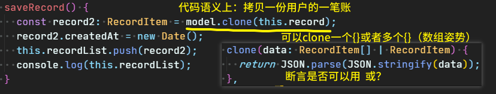
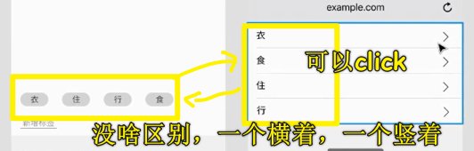

### ✍️ Tangxt ⏳ 2020-09-06 🏷️ 标签页、标签编辑页

# 10-标签页+标签编辑页

## ★ model.js & model.ts

1）为什么要 MVC 思想重构代码？

因为目前的 [代码](https://github.com/ppambler/vue-morney/blob/a7025fd52629a9637f5b7b8edd1191bb2650319a/src/views/Money.vue)，在数据层面上是很混乱的！

所以我们需要对页面做代码分层 -> 用 MVC 思想过来搞 -> 关于这个思想，你记得越模糊越好！如 `M` 负责数据层， `V` 负责视图层， `C` 负责其它的业务逻辑！

目前代码有视图层 `template` ，也有控制器（一个个更新组件状态的方法），但唯独就是差了个 `Model` ，不过，实际上，我们的 `Money.vue` 是有 `Model` 层面上的代码的！

如：

初始化数据，从数据库里边拿数据：

``` ts
const recordList: Record[] = JSON.parse(
  window.localStorage.getItem("recordList") || "[]"
);
```

保存数据到数据库里边：

``` js
window.localStorage.setItem("recordList", JSON.stringify(this.recordList));
```

> MVC 这个思想可以影响一个前端工程师的整个生涯，因为你只要写网页，那么就会用到 MVC，毕竟它实在是太经典了，而**你写页面，不可能不会用到数据**

2）代码实现

> 如何封装一个`model`？

思路：



> 我们 `push` 一笔账（ `{}` ）到 `recordList` （ `[]` 结构的表）里边， `@Watch` 是可以 `watch` 到 `recordList` 的变化的！

代码：[Demo](https://github.com/ppambler/vue-morney/commit/431c200d8168fd1961a982ac82a6f5d3007a755f)

3）代码解析

1、本来的做法 `model.js`

创建了一个`model.js` （`src`这个根目录下）-> 把获取数据和保存数据的代码扔进去：


接下来我们要在 `ts` 里边导入 `model.js`，可是 `ts` 里边真得用 `js`吗？

测试发现，我们不能通过 `import`导入这个`model.js`，因为这种姿势与`ts`不相容！

而用了`require`这种姿势却是可行的！



> `require`一开始是不支持`export defalut xxx`这种`defalut`姿势的，之后为了兼容就导出了带有`defalut`的！

所以，如果你在`require`的时候，就`require('xxx.js').default`这样搞！

而前端界里边有一个大佬**呼吁大家不要用 `export defalut xxx`**，而是用具名的姿势：`export {model}`（就是导入列表姿势啦！） -> 引入的时候就 `require('xxx.js').model`（表示我要这个`xxx`文件里的`model`）

> 可以用析构语法：`const {model} = require('model.js')`

总之，不管你用 `export defalut model` 也好，还是用 `export {model}`也罢，都随你的便！ -> **个人建议用后一种，因为语义性更强！**

> 我们在`ts`里边引入`js` -> 使用导入进来的`model` -> 在用 vscode 写代码时是没有提示它有哪些 API 的！（webstorm 可以猜出`model`的类型信息） -> 这就是为啥不用`model.js`而用`model.ts`的原因！

对了，用了这种姿势，你还得测试一下使用了导入进来的`model`，`Money.vue`是否正常运行！（**一定要测试代码是否正常运行，这一点贼重要**）

小结：不推荐使用 JS，因为这是懦夫行为，当然万不得已你可以这样！

接下来看看，如何把 JS 改写成 TS!

2、`model.ts` 

把`.js`后缀改写成`.ts`后缀 -> 这一步就完成了99%的工作，剩下的工作就是为变量加`: 类型`了！

🤔：原先代码的失误

我们之前局部定义了一个`Record`类型，但该类型是TS默认就有的高级类型，所以我们是不能把天生自带的，定义成自己的

总之，`Record`局部声明你随便改没问题，但全局声明就有问题了，毕竟`Record`这个名字已经被占用了！不然就会冲突

所以我们改成是一个不冲突的名字就可以了，如`RecordItem`

> 由于现在要用`RecordItem`，而之前我们都是用 `Record`的，所以有什么快捷方式能快速让`Record`变为`RecordItem`？ -> 编辑器都提供了一个叫「重构」的功能！

💡：如何让一个自定义类型能在所有文件里边使用？

创建`src/custom.d.ts`-> `ts`发现`.d.ts`这个后缀文件，就知道这是一个全局的声明文件

把需要全局使用的类型声明扔到这个文件里边……



一个小技巧：



> 你写到每个`RecordItem`类型都会关联到这个`custom.d.ts`文件！-> 关于`custom`这个名字，不是固定的，你也可以叫`xxx.d.ts`，但是`custom`这个名字语义性更好，表示这是我们自定义的类型！

💡：用了`model.ts`就可以用`import`语法了吗？

当然可以：

``` ts
// Money.vue
import model from "@/model";

// model.ts-> 可以使用默认导出了！
export default model;
```

当然，你也可以用有名字的导出，不过，这就需加`{}`了：

``` ts
// Money.vue
import {model} from "@/model";

// model.ts -> or export model -> 推荐带 {} 导出，因为可以一眼看清楚输出了哪些变量。
export {model};
```

简单区分一下默认导出和有名字导出：

- 默认导出 -> `import`时不需要加`{}`
- 有名字导出-> `import`时需要加`{}`，而且`{}`里的名字要与`export`的名字保持一致！

💡：如何确定`fetch`的返回值类型？或者说整个`model.ts`里边的类型？



随便搞个 `x` 变量，就能得出一个个很长的代码的返回值类型了！

可以看到这是一个`any`类型

有两种姿势可以改变`x`的类型：



关于姿势二，注意不要把类型强制错了（出错了，就是你活该！），因为 `tsc` 就是根据你强制出来的类型来判断`JSON.parse()`返回值的类型的！

> TS 很简单，把类型说清楚就完事儿了！-> 说不清楚，那你就用回 JS 吧！

为什么要指定`model.fetch()`的返回值类型？也就是给返回值一个`as xxx`这样的断言？



方便了我们之后不用再写`:RecordItem[]`了，不然，每个变量都得写一遍 `:RecordItem[]`……

> 最开始的地方写对了，那么后边用到了就会自动推测，千万不要为了图个方便，就不给`model.fetch()`的返回值一个断言（`as RecordItem[]`），不然，你每次需要用到`model.fetch()`的返回值，都得加上 `:RecordItem[]`

💡：为啥要把 `JSON.parse(JSON.stringify(xxx))` 这个操作也封装到`model.clone`了？

因为搞个副本对象这种需求，有很多种姿势可以做到，而我们并不关心是用哪种姿势做到的，反正你调用一下`model.clone`能完成这种需求就可以了，至于`clone`的背后用了啥，一点都不关心，既然不关心，那就封装一下……这样代码看起来就很语义化了



> 感觉封装就是为了让我们写的代码语义性更强！更能读懂代码在做什么！-> 你想想 `JSON.parse(……)`好懂，还是`clone()`好懂？-> 就像是你叫「名字」好懂人家叫谁，还是叫「头发短的、小眼睛、大嘴巴」好懂人家叫谁？

后边会把这个`model.ts`给删掉！

## ★Labels.vue 之 HTML

1）需求

> 看着设计稿怼就行了！



标签页里的每个标签都是可以 `click` 的，`click`之后就跳到标签的标签的「编辑页」，注意，标签名是不可以重复的（我们没有用`id`来区分所有标签）

点击「新建标签」`button` -> 与 `Money` 页面的「新增标签」功能是完全一样的！

点击「删除标签」`button` -> 回到「标签页」列表

2）标签页面


