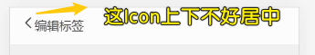

### ✍️ Tangxt ⏳ 2020-09-06 🏷️ 标签页、标签编辑页

# 10-标签页+标签编辑页

## ★model.js & model.ts

1）为什么要 MVC 思想重构代码？

因为目前的 [代码](https://github.com/ppambler/vue-morney/blob/a7025fd52629a9637f5b7b8edd1191bb2650319a/src/views/Money.vue)，在数据层面上是很混乱的！

所以我们需要对页面做代码分层 -> 用 MVC 思想过来搞 -> 关于这个思想，你记得越模糊越好！如 `M` 负责数据层， `V` 负责视图层， `C` 负责其它的业务逻辑！

目前代码有视图层 `template` ，也有控制器（一个个更新组件状态的方法），但唯独就是差了个 `Model` ，不过，实际上，我们的 `Money.vue` 是有 `Model` 层面上的代码的！

如：

初始化数据，从数据库里边拿数据：

``` ts
const recordList: Record[] = JSON.parse(
  window.localStorage.getItem("recordList") || "[]"
);
```

保存数据到数据库里边：

``` js
window.localStorage.setItem("recordList", JSON.stringify(this.recordList));
```

> MVC 这个思想可以影响一个前端工程师的整个生涯，因为你只要写网页，那么就会用到 MVC，毕竟它实在是太经典了，而**你写页面，不可能不会用到数据**

2）代码实现

> 如何封装一个`model`？

思路：


> 我们 `push` 一笔账（ `{}` ）到 `recordList` （ `[]` 结构的表）里边， `@Watch` 是可以 `watch` 到 `recordList` 的变化的！

代码：[Demo](https://github.com/ppambler/vue-morney/commit/431c200d8168fd1961a982ac82a6f5d3007a755f)

3）代码解析

1、本来的做法 `model.js`

创建了一个`model.js` （`src`这个根目录下）-> 把获取数据和保存数据的代码扔进去：


接下来我们要在 `ts` 里边导入 `model.js`，可是 `ts` 里边真得用 `js`吗？

测试发现，我们不能通过 `import`导入这个`model.js`，因为这种姿势与`ts`不相容！

而用了`require`这种姿势却是可行的！


> `require`一开始是不支持`export defalut xxx`这种`defalut`姿势的，之后为了兼容就导出了带有`defalut`的！

所以，如果你在`require`的时候，就`require('xxx.js').default`这样搞！

而前端界里边有一个大佬**呼吁大家不要用 `export defalut xxx`**，而是用具名的姿势：`export {model}`（就是导入列表姿势啦！） -> 引入的时候就 `require('xxx.js').model`（表示我要这个`xxx`文件里的`model`）

> 可以用析构语法：`const {model} = require('model.js')`

总之，不管你用 `export defalut model` 也好，还是用 `export {model}`也罢，都随你的便！ -> **个人建议用后一种，因为语义性更强！**

> 我们在`ts`里边引入`js` -> 使用导入进来的`model` -> 在用 vscode 写代码时是没有提示它有哪些 API 的！（webstorm 可以猜出`model`的类型信息） -> 这就是为啥不用`model.js`而用`model.ts`的原因！

对了，用了这种姿势，你还得测试一下使用了导入进来的`model`，`Money.vue`是否正常运行！（**一定要测试代码是否正常运行，这一点贼重要**）

小结：不推荐使用 JS，因为这是懦夫行为，当然万不得已你可以这样！

接下来看看，如何把 JS 改写成 TS!

2、`model.ts` 

把`.js`后缀改写成`.ts`后缀 -> 这一步就完成了 99%的工作，剩下的工作就是为变量加`: 类型`了！

🤔：原先代码的失误

我们之前局部定义了一个`Record`类型，但该类型是 TS 默认就有的高级类型，所以我们是不能把天生自带的，定义成自己的

总之，`Record`局部声明你随便改没问题，但全局声明就有问题了，毕竟`Record`这个名字已经被占用了！不然就会冲突

所以我们改成是一个不冲突的名字就可以了，如`RecordItem`

> 由于现在要用`RecordItem`，而之前我们都是用 `Record`的，所以有什么快捷方式能快速让`Record`变为`RecordItem`？ -> 编辑器都提供了一个叫「重构」的功能！

💡：如何让一个自定义类型能在所有文件里边使用？

创建`src/custom.d.ts`-> `ts`发现`.d.ts`这个后缀文件，就知道这是一个全局的声明文件

把需要全局使用的类型声明扔到这个文件里边……


一个小技巧：


> 你写到每个`RecordItem`类型都会关联到这个`custom.d.ts`文件！-> 关于`custom`这个名字，不是固定的，你也可以叫`xxx.d.ts`，但是`custom`这个名字语义性更好，表示这是我们自定义的类型！

💡：用了`model.ts`就可以用`import`语法了吗？

当然可以：

``` ts
// Money.vue
import model from "@/model";

// model.ts-> 可以使用默认导出了！
export default model;
```

当然，你也可以用有名字的导出，不过，这就需加`{}`了：

``` ts
// Money.vue
import {model} from "@/model";

// model.ts -> or export model -> 推荐带 {} 导出，因为可以一眼看清楚输出了哪些变量。
export {model};
```

简单区分一下默认导出和有名字导出：

- 默认导出 -> `import`时不需要加`{}`
- 有名字导出-> `import`时需要加`{}`，而且`{}`里的名字要与`export`的名字保持一致！

💡：如何确定`fetch`的返回值类型？或者说整个`model.ts`里边的类型？


随便搞个 `x` 变量，就能得出一个个很长的代码的返回值类型了！

可以看到这是一个`any`类型

有两种姿势可以改变`x`的类型：


关于姿势二，注意不要把类型强制错了（出错了，就是你活该！），因为 `tsc` 就是根据你强制出来的类型来判断`JSON.parse()`返回值的类型的！

> TS 很简单，把类型说清楚就完事儿了！-> 说不清楚，那你就用回 JS 吧！

为什么要指定`model.fetch()`的返回值类型？也就是给返回值一个`as xxx`这样的断言？


方便了我们之后不用再写`:RecordItem[]`了，不然，每个变量都得写一遍 `:RecordItem[]`……

> 最开始的地方写对了，那么后边用到了就会自动推测，千万不要为了图个方便，就不给`model.fetch()`的返回值一个断言（`as RecordItem[]`），不然，你每次需要用到`model.fetch()`的返回值，都得加上 `:RecordItem[]`

💡：为啥要把 `JSON.parse(JSON.stringify(xxx))` 这个操作也封装到`model.clone`了？

因为搞个副本对象这种需求，有很多种姿势可以做到，而我们并不关心是用哪种姿势做到的，反正你调用一下`model.clone`能完成这种需求就可以了，至于`clone`的背后用了啥，一点都不关心，既然不关心，那就封装一下……这样代码看起来就很语义化了


> 感觉封装就是为了让我们写的代码语义性更强！更能读懂代码在做什么！-> 你想想 `JSON.parse(……)`好懂，还是`clone()`好懂？-> 就像是你叫「名字」好懂人家叫谁，还是叫「头发短的、小眼睛、大嘴巴」好懂人家叫谁？

后边会把这个`model.ts`给删掉！

## ★Labels.vue 之 HTML

1）需求与代码实现

> 看着设计稿怼就行了！


标签页里的每个标签都是可以 `click` 的，`click`之后就跳到标签的标签的「编辑页」，注意，标签名是不可以重复的（我们没有用`id`来区分所有标签）

点击「新建标签」`button` -> 与 `Money` 页面的「新增标签」功能是完全一样的！

点击「删除标签」`button` -> 回到「标签页」列表


代码：[Demo](https://github.com/ppambler/vue-morney/commit/e0c061b0de9aa692f2b052d8fa5bde591a8f92e9)

2）标签页面

> 写 HTML -> 写 CSS -> 写 JS

💡：为啥要用一个`span`标签包裹一个文本？


💡：页面的背景色写在哪儿？

写在 `body` 里边！

## ★Labels.vue 之 CSS

1）写 CSS 顺序

1. 文本、icon -> 字体大小
2. 文本所处盒子的`min-height`、`padding`等 -> 有关布局
3. 边框、icon、文本 -> 颜色
4. icon -> 布局
5. button -> 背景色、文本颜色、布局、盒子模型

> 元素上下之间的间距用`padding`，因为`margin`会有塌陷，不过`padding`也会影响`background`的范围……当然也可以结合起来使用！

💡：一个你使用`scss`，但一直误会的点？


`&`这个符号的作用，可以把嵌套的写法编译成平级的写法：

``` scss
#main {
  color: black;
  a {
    font-weight: bold;
    &:hover { color: red; }
  }
}
```

编译为

``` css
#main {
  color: black; }
  #main a {
    font-weight: bold; }
    #main a:hover {
      color: red; }
```

如果咩有`&`，那就是存粹的后代选择器了！

总之，**被嵌套的也有可能是爸爸级元素！**

## ★新建标签功能

💡：标签存在哪儿？

之前我们用了一个`model`来专门存储一笔账！而现在要存储的东西是「标签」呀！

为啥要存储标签呢？

我们在`Money.vue`里边是这样写的：

``` js
tags = ['衣', '食', '住', '行', '彩票'];
```

显然，这标签是写死的！不管你新建了多少个标签，页面一刷新，新建的标签都会统统消失掉！

所以我们搞了一个叫 `tagListModel` 的东西

之前，我们只有一个`model`，所以就创建了一个叫`model.ts`文件，而现在还需要`model`，所以现在的目录结构变成这样了：


> 本来文件名是没有后缀`Model`的，但不加后缀的话，在使用的时候会有名字冲突！ -> 所以就随便加了一个后缀！

💡：`tagListModel.ts`如何写？

结构基本与`recordListModel.ts`一样，所以 `clone` 一份 `recordListModel.ts`里边的内容粘贴过来，然后修改就好了！

> 结构很像 -> 意味着重复 -> 之后会试着重构一下，如把这两个`model`合成一个！ -> 而目前我们先把功能完成再说！

💡：每个组件的`template`里边，基本不会出现写死的数据？


💡：往`tagListModel`对象里边封装了很多操作？

如`fetch`（从`localStorage`里边拿到`['11','222']`）、`create`（创建标签，如`'3333'`）、`save`（把`['11','222']`保存到`localStorage`）等这样的操作

💡：对象有个属性`data`，可它的类型该怎么声明呢？

这样做？


我们想要这个`data`的类型是元素是字符串的数组，而不是元素是对象的数组之类的……

所以，我们搞了个类型声明定义：

``` ts
type tagListModel = {
  data: string[];
  fetch: () => string[];
  create: (name: string) => "success" | "duplicated"; //联合类型
  save: () => void;
};
```

`=>`左边`(name: string)`里边的内容是输入的类型（输入咩有就是一个空的`()`），`=>`右边的`string[]`则是输出的结果的类型 -> `void`是不返回

> 这可不是箭头函数语法哈！

不要问为什么要这样写，因为语法就这样规定的！你看着方方写的代码依葫芦画瓢就行了，下次遇到同样的场景，就照着这个姿势去处理就对了！ -> 当你写多了，你也就感觉也就那样了，这语法没啥奇怪的！

💡：为啥要在`tagListModel`对象里边写个`data`属性？

因为`tagListModel`想自己维护`data`，如果你`Labels`页面想要操作`data`，那么你就得用`tagListModel`提供的 API 来操作！而不是让页面直接操作用户数据！

这种处理，跟`recordListModel`对比是不同的：


`tagListModel`这样做的好处：


> 更像 MVC 了，`Labels`组件的`tags`状态值，只是视图渲染的数据源！而 `C` 则是负责调度`M`去操作`data`


> 别忘了数据分为 UI 数据 和 用户数据

💡：方方喜欢把创建的东西`return`回去！


💡：用户在创建出来的标签重复了，我们该如何提示用户「标签重复了」？

新手做法：创建 成功/失败 就返回`ture/false` -> 根据返回值提示用户

老手做法（考虑很多）：比如为啥创建失败？需要把失败原因给返回出去！

姿势有两种：

姿势一：


姿势二：

按照方方的经验来说，最好是返回一个数字或者返回一个对象！

如：

- 成功返回`0`
- 失败返回`1、2、3、4、5、6、7、8、9、10` -> `1`表示`name`重复……`2`表示`xxx`错误……

返回数字这种姿势可行，但数字这种姿势语义性不好呀！ -> 很容易遗忘……

所以我们用了字符串姿势来表示错误原因！如返回`'duplicate'`就是重复错误，而`'success'`表示创建成功！

返回对象的姿势是这样的：

``` js
{
  // 错误码
  code: number,
  // 错误码所代表的含义
  message: string
}
```

这种返回值也是 ok 的 -> 为了简单起见，返回字符串！

注意，返回字符串这种姿势，很容易会写错单词，所以我们需要统一规定一下：


当你拼错单词的时候，`tsc`就会爆红：


> 联合类型是字符串的子类型 -> 也就是说，不是所有的字符串，而是就那两个字符串！ -> 这是不属于那 7 大类型里边的其中一个，类似于枚举

## ★EditLabel.vue & Vue Router

1）需求与代码实现


顶部导航栏 -> 方便回退到「标签页」 -> 如果咩有这个那就只能点击底部的那三个导航了，而这贼其不方便！

代码：

- [Demo](https://github.com/ppambler/vue-morney/commit/d900d9c7bdaa81a46541c064c6bbc3601bcf01d1)
- [Demo](https://github.com/ppambler/vue-morney/commit/df3bade4fd5d6b03ab70e64e70d350405ad1a1bb)

2）代码解析

💡：我们要编辑一个标签需要用到它的`id`？

`id`一般是数据库自动生成的，在这里我们自己造一个假的`id`（方便起见，把标签的`name`当作`id`）!

> 正常的`id`是一串数字或者一串数字字符串！而我们这里则是**非数字的字符串**！

之后会改成`id`生成器！

💡：数组 API `map`的用法？


💡：在「标签页」里边点击了某个标签，然后就会跳转到「标签编辑页」，那么这个「标签编辑页」是如何知道我们刚刚点击了哪个标签？


路由配置一下：

``` ts
{ path: "/labels/edit/:id", component: EditLabel }
```

`:id`是占位符 -> 可以是`1`、`2`、`3`等这样的值！

话又说回来，我们该如何获取路由信息？也就是如何获取那个`:id`值？

用 Vue 提供的钩子 `created` 来获取 -> 为什么？ -> 因为我们需要用到`this`呀！

``` ts
this.$route.params // {id: '1'}
```

> 一般跟路由相关的信息是放在`$route`里边的（**拿到路由路径信息之类的**），而跟路由器相关的信息则放在`$router`里边（**处理转发之类的**）！

注意，如果你写的是`:fuck`，那么你就得这样做了：

``` ts
this.$route.params // {fuck: '1'}
```

所以`:id`并不是固定的写法 -> 它相当于是给这个值一个名字！

> 方方的一个习惯，如果不确定一个东西是哪儿来的，那就把这个东西改成`fuck`！ -> 如我们不确定`parms`所返回的`{id:'1'}`里边的`id`是哪儿来的，于是就用了`:fuck`测试一下！ -> 得出结论：`{id:'1'}`里边的`id`来自于路由配置里边的`:id`

透过这些 API ，「标签编辑页」就知道用户要编辑的是哪一个标签了！

话说，`params`为啥会有`id`这个参数？不需要声明它的类型吗？


> `Dictionary`类型意味着 `params`这个 `{}` 里边可以是任意的键值！

为什么`this`会有个`$route`的东西？ -> 因为我们安装了一个库 `vue-router`


这两个属性 API 的作用 -> 无非就是在收集一些信息罢了！我们无须关心它们的源码实现！

💡：`this.$router.push("/404")` & `this.$router.replace("/404")` 的区别？

前者跳转后，不能点击`<-`回退到上一个页面，而后者则可以点击`<-`回退到上一个页面！

`replace`的效果：


💡：如何把「标签页」和「标签编辑页」关联起来？

> 代码：[Demo](https://github.com/ppambler/vue-morney/commit/eea730779f81eb8c3de48cff0dd68fdb443092ec)

很简单，对「标签页」里边的每个`item`使用 `router-link` 包裹一下就好了

目前，每个`item`是这样的结构：`ol > li`

我们不能改成这样：`ol > router-lin1k` -> 因为`ol`的儿子只能是`li`，所以我们改`ol`为`div`就好了

所以，最后改成这样了：


> 图中那个`class`是在`a`标签上的


总之，我们把`div > router-link` 看成是原先的 `ol > li` 就好了！ -> 在样式方面都是用`class`来管控的，而不是用标签，所以更改标签基本上对样式无影响！

💡：`#/labels`是标签，`tags`也是标签，那么在命名方面能否统一起来？

💡：如何找到对称的 `Icon` ？

我们很难找到相匹配的 `Icon`，所以我们可以把`right.svg`上传到 `iconfont.cn` ，然后借助它的 `svg` 编辑器旋转修改！

我的做法是这样的（不用上传）：


旋转处理：


方方的一个习惯：

在上传文件给`iconfont.cn`的时候，首先把源文件拷贝一份到桌面（**桌面上的文件是不重要的！可以随便删！**），然后再上传

💡：`EditLabel.vue`用到了类似`Money.vue`里边的那个`Notes.vue`，那么我们能否把这个`Notes`组件封装成更为通用的组件呢？

`Money`页面需要用到输入框，`EditLabel`页面同样也需要用到输入框

对于这整个记账应用来说，输入框都应该是同一个组件才对！而不是拷贝一份`Notes`组件代码，修改一下，扔到`EditLabel.vue`里边直接用就完事儿了……

## ★如何封装通用组件

1）做法

1. 在 `EditLabel` 里边使用 `Notes` 组件
2. 发现有问题 -> 字段提示信息不是我们想要的
3. 改`Notes`组件 -> 用字段提示信息是由外界提供的
4. `Label.vue`出问题了 -> 修复

代码：[Demo](https://github.com/ppambler/vue-morney/commit/ab874f8f596164620330ea8545d7df41bee16a82)

2）代码解析

💡：`@Prop({required:true}) fieldName!: string;`

> 你这样定义`fieldName`属性，那么在传值时，你得这样来：`field-name`

这个字段是必填的 -> 加`!`是表示我不需要初始值，因为用户必填有一个值！

如果不加`!`，你必须给个初始值！不然，`tsc`会报错！

总之，`!`是非`null`和非`undefined`的类型断言！

另一种理解姿势：


➹：[【前端资讯】TypeScript 2.7 发布 - 知乎](https://zhuanlan.zhihu.com/p/33551084)

💡：`@Prop() placeholder?: string`

`?`用于属性定义时，表示该字段有可能不存在！而属性读取时，该值可能为空值（`null`or`undefined`），所以需要做判断！

如果你用`!`，那么意味着你不传`placeholder`字段，它就是默认的`undefined`值！而我们并不想要这样，所以就用`?`

我测试了一下，不管用`!`还是`?`都是一样的！用户不传`placeholder`，那么这个`Notes`组件的`placeholder`属性就是`undefined`值了！ -> **我还以为用了`?`，用户不传`placeholder`，那么这个`Notes`组件就咩有这个`placeholder`属性！实际上，不管传不传都会有这个属性！**

➹：[对比理解 Typescript 中的 as、问号与叹号 - 掘金](https://juejin.im/post/6844904068951834632#heading-2)

💡：关于`Notes.vue`这个名字？

其实这个`Notes`名字不怎么合适，因为它的功能就是个输入框，所以可以叫做`EditItem` or `InputItem` 之类的……

重命名这个`Notes.vue`（功能必须先完成，而且还得先提交一份代码，然后再考虑重命名）：

在 VSCode 里边，全局搜索`Notes`这个名字，然后替换成`FormItem`就好了！（只改使用到的组件名以及`class`名，其它的方法名，字段名还是用`notes`）

3）删除按钮

把`Button`也改成通用组件！ -> 为啥要改？ -> 因为「标签页」有个「新建标签」的`Button`，而「标签编辑页」也有个叫「删除标签」的`Button`！

💡：新建了一个`Button.vue`，可是原生标签是`button`呀！难道这不会冲突吗？

不会的！因为一个是大写`B`，一个是小写`b` -> 最终会编译这个`Button`组件标签！

💡：改用为`Button`组件标签后，如何触发它的点击事件？

我们监听了大`Button`的点击事件，但用户在页面上点击的是编译过后的小`button` -> 用户点击小`button`的时候，触发大`Button`的点击事件！

小`button`：

``` html
<button class="button" @click="$emit('click',$event)">
  <slot />
</button>
```

大`Button`：

``` html
<Button class="createTag" @click="createTag">新建标签</Button>
```

话说，如果还要监听其它事件呢？ -> 那我岂不是还需要写很多次`$emit()`？

尤雨溪发明了另一种语法：

``` html
<!-- template -->
<button class="button">
  <slot />
</button>

<!-- use -->
<Button class="createTag" @click.native="createTag">新建标签</Button>
```

这种姿势也是可以的！`.native`相当于是一种语法糖！ -> 一种封装操作！

不过，这种姿势很少人知道，所以一般都会用上边那一种，即内部通知外部触发`click`事件！

总之，不管怎样，整体上看这个`Button`组件标签，我们都可以把它当作像使用普通的`button`原生标签这样去使用它！

> 一个权衡：`Button`很容易会被使用到，那么我们是否可以全局引用它？ -> 随便……

---

始终谨记：先搞定 HTML，再去写 CSS，最后再搞 JS

## ★EditLabel.vue 之 CSS

代码：[Demo](https://github.com/ppambler/vue-morney/commit/b39c9f885d4b88760f9ead77707d84ce894d861d)

1）写 CSS

💡：HTML 结构？


> HTML 代码重复 2 次及以上，就应该考虑组件化！

💡：`navBar`的布局思路？

思路一：

左边`Icon`绝对定位，而`title`则是绝对居中 -> 为啥不左中右布局呢？因为右边没东西呀！不然，就很不对称了！ -> 但这有个弊端，那就是`Icon`上下不好居中！



思路二：

`flex`布局！ -> 还是用了左中右布局，因为`Icon`不好上下居中！

💡：关于方方写样式时的一个比较喜欢的习惯？


💡：方方在 CSS 的时候，其大脑在干什么？


从中可以看到`Icon`并咩有上下对齐！ -> 利用 `flex` 提供的那几个属性可以实现上下居中！

💡：为什么会有个没有内容的标签：`<div class="rightIcon"></div>`？


💡：为什么方方写的 CSS 代码经常性的出现一个`class`为`xxx-wrapper`嵌套`div`？

因为不想直接在：

``` html
<FormItem field-name="标签名" placeholder="请输入标签名" />
```

上给背景色，而是给它的爸爸一个背景色！

为啥不叫`container`？ -> 因为这单词比`wrapper`长！

💡：一个不成文的规定？


> 让一个元素看起来变高（用背景色衬托），可以给它的爸爸加个上下`padding`，如`Money.vue`里边的`Input`框就是这样做的！

💡：`button`元素上下距离的处理？


具体测试效果：


## ★EditLabel.vue 功能实现

> 写这个代码之前，一定要先把之前写的代码给提交了！ -> 你做了一件事情就要`commit`一次，而不是做了多件事之后再提交！

1）如何获取标签名然后展示之？

功能：把用户选择的标签展示到「标签编辑页」的输入框


思路：`EditLabel.vue`是`FormItem.vue`的父组件，所以我们只需要传一个`value`给`FormItem`就行了

💡：我们要让`Input`框里边的内容从外部传进来？（把用户选中的标签名传进来）

代码：[Demo](https://github.com/ppambler/vue-morney/commit/5d084138066c980b011ecfe62fd203b4c278400c)

💡：为什么要写单元测试？

你会经常性地改代码，改完之后，还得测试一下项目是否有报错！ -> 如何测试呢？ -> 让项目运行一下

而有了单元测试，就不用项目运行了，直接跑测试代码就行了！

💡：为什么不推荐用`v-model`？

我们给`FormItem.vue`一个`Prop`：

```
@Prop({ default: "" }) value!: string
```

结果在测试（输入内容）的时候报错了：


为啥会报错呢？（具体来说应该是警告）


所以对于`Prop`，那就不要用`v-model`了，如果是`data`，那倒是可以使用！

消除警告：


为了稳妥起见，我们对`Prop`加了个`readonly`，以防他人对该`value`属性在子作用域直接赋值！

```
@Prop({ default: "" }) readonly value!: string;
```

如果你不加的话，那么只能让控制台提示你这儿有错误了，如果加上的话，`tsc` 就能直接提示了有错误了！

我测试了一下，加了`readonly`，但是还是原来的`v-model`，结果`tsc`并没有爆红！ -> 为啥呢？ -> 因为 `tsc` 检查不到 `template` 里边的内容！

但不管怎样，加上`readonly`是很有必要的！ -> 因为你有可能在方法里边出现对`value`赋值的情况！ -> 而一旦出现了，就会爆红！

代码：[Demo](https://github.com/ppambler/vue-morney/commit/de91a3957b9f110b6c5e0b91b9c98f247a3fae7b)

💡：如何展示标签名？

代码：[Demo](https://github.com/ppambler/vue-morney/commit/36c38af51050a39014ccdc038589fb12051b62be)

再次解释一下这样的代码：`tag?: { id: string; name: string } = undefined`

它表示`tag`这个属性是可选的，如果你要给`tag`值，而且你不叫`?`，那么你就不能给`undefined`值了！

总之，你加了`?`就相当于是把`tag`当作是`union`类型，即相当于你这样`{ id: string; name: string } | undefined ` 给 `tag` 类型！

所以这就是我们可以给`tag`赋值一个`undefined`作为初始值的原因！


