### ✍️ Tangxt ⏳ 2020-09-17 🏷️ Vuex

# 11-Vue 全局数据管理（上）

## ★前言

上节课遗留的问题：改了这个页面的数据，另一个页面没有同步更新这个数据 （**各自为政**）-> 解决办法 -> 全局数据管理！

方方的一个观点（人的主观想法，不一定对）：

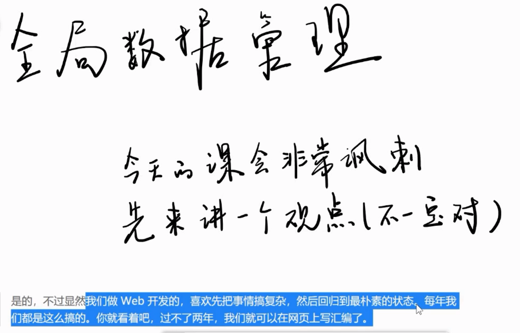

前端把这个全局数据管理搞得超级复杂，而目前还咩有把这个东西回归到最朴素的状态！ -> 为啥咩有回归？ -> 因为前端还咩有搞清楚全局数据管理到底是什么！

➹：[在 2016 年学 JavaScript 是一种什么样的体验？ - 知乎](https://zhuanlan.zhihu.com/p/22782487)

## ★再次封装 recordListModel

1）提取 data

任何操作表的 `data` 都交给`recordListModel`来做 -> 之后的统计页面拿数据也方便！

代码：[Demo](https://github.com/ppambler/vue-morney/commit/407511195faeecbb015677ba9df18c79272a47e2)

2）封装 create

> 叫`createItem`比较好听！ 

代码：[Demo](https://github.com/ppambler/vue-morney/commit/dc88c79e7bbf283201da0dafd46c2c6d613a06f5)

💡：第一次使用`any`类型？

把经常用的`clone`方法封装到`lib`里边的`clone.ts`

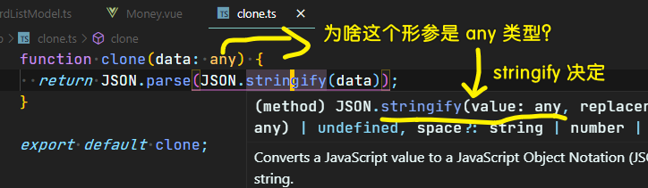

其它模块文件使用这个`clone`方法，直接`import`一下就好了！

3）小结

把获取数据，新增数据，保存数据的操作都封装到`recordListModel`里边去了！

接下来做一下全局数据管理 -> 解决页面之间数据不同步的问题！

## ★用 window 来容纳数据

1）页面之间数据不同步的原因

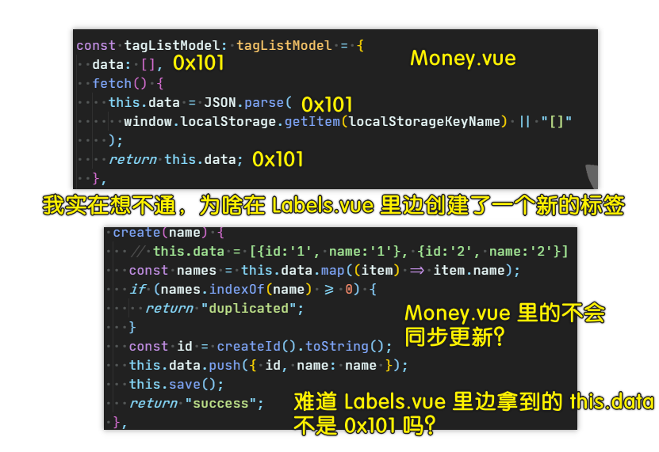

我的已知认识是这样的：

`Money.vue`里边导入了`tagListModel`，`Labels.vue`里边也导入了`tagListModel` -> 这两个`tagListModel`是同一个地址！

我的测试：

把这两个`tagListModel`各自扔到`window`上，看看它们是否全等？

经过测试，它们确实是全等的！

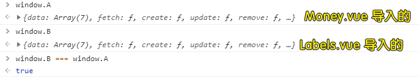

既然如此，那么问题来了，我们在标签页创建了一个标签，就会往`tagListModel`里边追加了一个标签，可记账页却没有同步更新？ -> 所以，这是怎么一回事呢？

我猜测这是 Vue 不能检测数组项修改的原因！

我们知道 `tagListModel.data`的数据结构是这样的 `[{},{}]`，我们在创建标签的时候用了 `tagListModel.data.push({ id, name: name })`，而这个`push`显然不是 Vue 更改过的 `push` 方法！所以这就导致了数据不同步更新的问题！

我用了`Vue.set()`测试一下，结果还是如此：

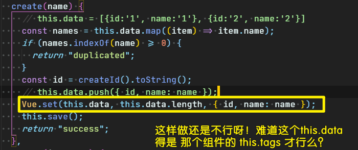

---

按照老师的解释 -> 我们代码是在把同一个 JSON 字符串分别做成了对象 1 和对象 2 -> 解决姿势是 -> 弄成是同一个对象！

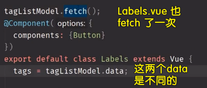

---

测试：

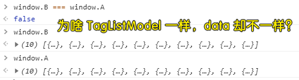

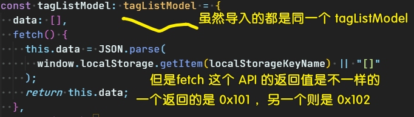

再次测试在不同模块里边导入相同的模块：

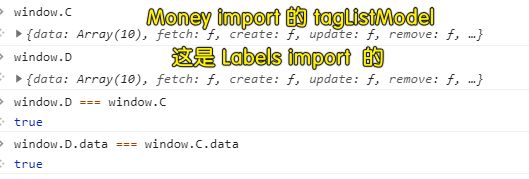

我在`tagListModel.ts`里边，写了行 `console.log(1)`，然后再不同文件模块里边各写一次`import tagListModel from "@/models/tagListModel";`，结果只`log`一次`1`！

2）解决 bug

思路：

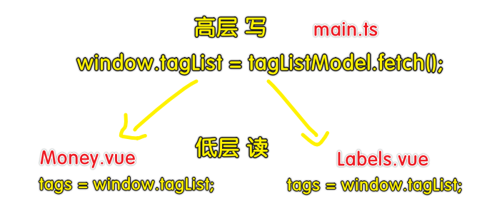

在 `main.ts` 里边搞个全局变量 -> 往上提（`Money.vue` -> `App.vue` -> `main.ts`）

代码：[Demo](https://github.com/ppambler/vue-morney/commit/d6a71bc5a0d15719a2e4f827748c303649e9a853)

💡：你直接这样写：`window.tagList = tagListModel.fetch();`会报错？

为啥`tsc`会报错？ -> 因为`window`根本就咩有`tagList`属性，所以你不能这样做！

我们写 JS 可以随意加，但是`tsc`是不允许的！

所以，我们得声明一下这个`Window`

``` ts
// custom.d.ts
interface Window {
  tagList: Tag[];
}
```

为啥要这样做？有种脱裤子放屁的感觉……

其实这是为了约束你写代码，保证不会写出`taglsit`这样的无用属性，以及不会写出`'666'`这样的数据类型 -> 总之，你要记住，`tsc`就是在用类型检查你的代码写得有没有错！

💡：标签多了，创建标签`button`就看不见了？

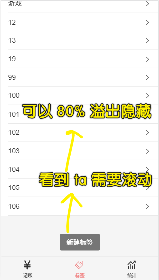

我直接用 `fixed` 固定定位加水平居中！

---

以上这个操作就是「全局数据管理」 -> 就是这么简单！ -> 也许你听说过 vuex ，觉得它很厉害，但其实它也就那样！

接下来，就把我们这个「全局数据管理」封装得更厉害一点！

## ★用 window 来封装 API 1

1）对「全局数据」的操作

不能直接`push`数据，而是通过某些 API 来管理这些数据！ -> 全局暴露 API

2）最小知识原则

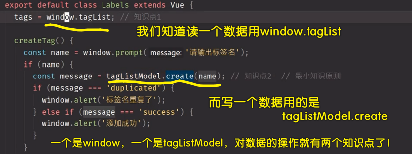

我们写代码的时候，对一个全局数据的操作，理应只有一种姿势去操作！

所以我们需要封装一个`createTag`：

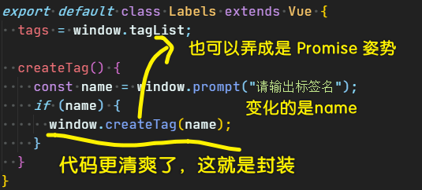

如果使用 `Promise` 封装的话，那么在使用 `window.createTag`的时候，那就可以这样了：

``` js
window.createTag(name).then(()=>{}).catch((e)=>{
  console.log(e)
})
```

代码：[Demo](https://github.com/ppambler/vue-morney/commit/e74a9a51161451dda98145b7f776937cefa27f8a)

3）封装查找、更新、删除标签操作

思路：

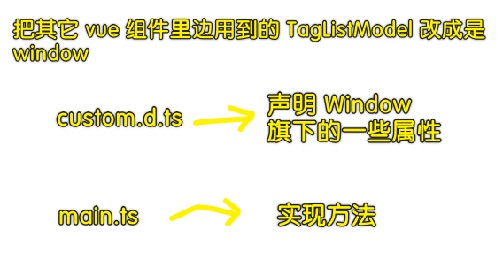

代码：[Demo](https://github.com/ppambler/vue-morney/commit/8fab303e42359441bd0337ec10a8b6ca81157e17)

💡：`window.updateTag = (id: string, name: string) => {}`？

如果传多个属性？如，还有`createdAt`等这样的属性，那么就得这样写了：

``` ts
type Tag = {
  id: string;
  name: string;
  // …… 
};
// 这样做必选传 id，因为 Tag 的类型定义并咩有写 ?
window.updateTag = (id: string, object: Tag) => {}
```

如果除了`id`都可以传呢？

那就这样写：

``` ts
window.updateTag = (id: string, object: Exclude<Tag, 'id'>) => {}
```

表示`Tag`里边，除了`'id'`的所有东西 -> 也就是说，你不能传`id`！

不管怎样，为了简单起见，就直接`id: string, name: string` 这样定义形参了！

💡：类型声明一样，能否简写？

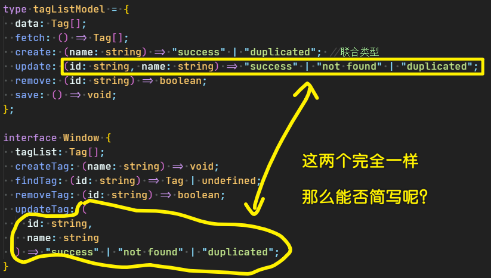

可以简写的，你可以这样做：

``` ts
interface Window {
  updateTag: TagListModel['update']
}
```

表示`updateTag`的类型，跟`update`的类型完全一模一样！

当然，我们重复写两遍也是没问题的！毕竟如果`TagListModel`改了就麻烦了！

💡：变量只用了一遍，那就简化它？

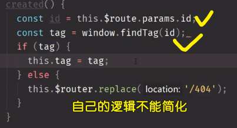

``` ts
{
  created() {
    this.tag = window.findTag(this.$route.params.id);
    if (!this.tag) {
      this.$router.replace("/404");
    }
  }
}
```

变量只用了一遍，那么就不用加局部变量了！

💡：不能在`data`里边拿到`id`吗？

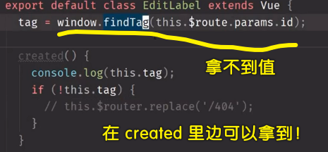

猜测，Vue 是在 `created` 的时候，才会构造出`this.$route`这个对象！

当然，我们在`beforeCreated`里边，也是可以拿到这个`id`的！

总之，你不能在给`data`的赋值里边，透过`this.$router`拿到`id` -> 因为此时可能没有`$route`对象（具体确切情况，得分析源码）！

---

以前我们是对 DOM 树增删改查，现在则是对数组（`tagList`）增删改查！

接下来封装另外一个东西，目前，我们有两个数据（标签数据和记账数据），一个是`tagList`（已封装），另一个是`recordList` -> 以**相同的形式**来封装记账数据！

## ★用 window 来封装 API 2

> 如何封装 `recordList`？ -> 先看看我们的代码哪里有用到`recordList`，然后其封装思路与`tagList`完全一模一样！

代码：[Demo](https://github.com/ppambler/vue-morney/commit/195c8788915f55d5ed519de32e9747b1096b26a5)

1）封装步骤

1. 抽离用到`recordList`的代码到`main.ts`
2. 对原先用到`recordList`的代码改成是使用`window.xxx`的 -> 发现爆红
3. 对`Window`的类型声明
4. 看看`recordListModel`有哪些操作 -> 封装到`window`旗下！

💡：不需要手动`save()`？

对比之前的`tagList`封装，发现并咩有类似`save`的代码！

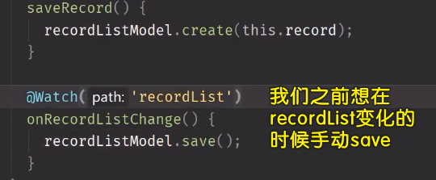

变化都被封装了，我们在`createRecord`的时候，就顺道`save`了！ -> 不需要你手动去调用`save`API -> `create`的时候就意味着`save`代码到`localStorage`里边去了！

💡：看起来无意义的代码：`window.createRecord = (record: RecordItem) => recordListModel.create(record);`？

`window.creatRecord`的时候，本质上就是在直接`recordListModel.create` -> 有种挂羊头卖狗肉的感觉 -> 这看起来有点智障（为了使用`window`而用`window`） -> 之后会重新封装

2）整体看看整个数据管理的封装操作

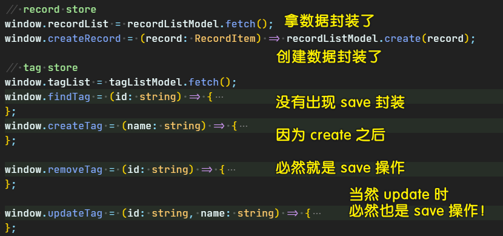

3）我们是否再继续优化封装好的代码？

目前我们看到的问题：

1. 用了过多的全局变量 -> 如果用了 500 个数据，那么岂不是需要在`window`旗下搞很多个全局变量？ -> 我们现在只用了两个数据，就搞了 7 个全局变量了！ -> 这全局变量多了，就得考虑变量名是否冲突了，是否覆盖了……
2. 严重依赖`window` -> 有些环境是咩有`window`对象的，如`Node.js`，所以我们不应该依赖`window`对象，而是自己搞一个对象！

如何解决这两个问题？ -> 请看下个`★`

解决这两个问题特别简单……

1）解决「全局变量过多」

1. 全局变量太多，那就把变量挂到一个变量身上 -> `window.store` -> 这样一来全局变量就不多了！

💡：关于改代码？

程序员很不喜欢改功能已经写好的代码，但**一旦你喜欢上了改代码，那么你的代码会越来简洁**，不然，你的代码会越来越丑！

注意，**在改代码途中，千万不要多删了代码**！

💡：如果你用了`this`，那么你就不要用箭头函数了！

💡：在编辑代码的过程中，我们只管红线警告，黄色警告则不管！

2）解决「严重依赖 window」


