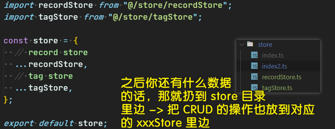
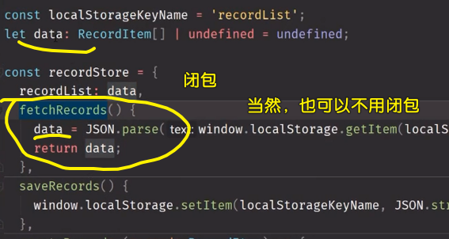
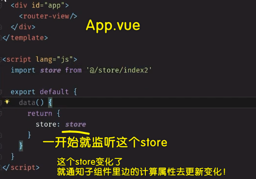

### ✍️ Tangxt ⏳ 2020-09-17 🏷️ Vuex

# 11-Vue 全局数据管理（上）

## ★前言

上节课遗留的问题：改了这个页面的数据，另一个页面没有同步更新这个数据 （**各自为政**）-> 解决办法 -> 全局数据管理！

方方的一个观点（人的主观想法，不一定对）：


前端把这个全局数据管理搞得超级复杂，而目前还咩有把这个东西回归到最朴素的状态！ -> 为啥咩有回归？ -> 因为前端还咩有搞清楚全局数据管理到底是什么！

➹：[在 2016 年学 JavaScript 是一种什么样的体验？ - 知乎](https://zhuanlan.zhihu.com/p/22782487)

## ★再次封装 recordListModel

### <mark>1）提取 data</mark>

任何操作表的 `data` 都交给`recordListModel`来做 -> 之后的统计页面拿数据也方便！

代码：[Demo](https://github.com/ppambler/vue-morney/commit/407511195faeecbb015677ba9df18c79272a47e2)

### <mark>2）封装 create</mark>

> 叫`createItem`比较好听！ 

代码：[Demo](https://github.com/ppambler/vue-morney/commit/dc88c79e7bbf283201da0dafd46c2c6d613a06f5)

💡：第一次使用`any`类型？

把经常用的`clone`方法封装到`lib`里边的`clone.ts`


其它模块文件使用这个`clone`方法，直接`import`一下就好了！

### <mark>3）小结</mark>

把获取数据，新增数据，保存数据的操作都封装到`recordListModel`里边去了！

接下来做一下全局数据管理 -> 解决页面之间数据不同步的问题！

## ★用 window 来容纳数据

### <mark>1）页面之间数据不同步的原因</mark>


我的已知认识是这样的：

`Money.vue`里边导入了`tagListModel`，`Labels.vue`里边也导入了`tagListModel` -> 这两个`tagListModel`是同一个地址！

我的测试：

把这两个`tagListModel`各自扔到`window`上，看看它们是否全等？

经过测试，它们确实是全等的！


既然如此，那么问题来了，我们在标签页创建了一个标签，就会往`tagListModel`里边追加了一个标签，可记账页却没有同步更新？ -> 所以，这是怎么一回事呢？

我猜测这是 Vue 不能检测数组项修改的原因！

我们知道 `tagListModel.data`的数据结构是这样的 `[{},{}]`，我们在创建标签的时候用了 `tagListModel.data.push({ id, name: name })`，而这个`push`显然不是 Vue 更改过的 `push` 方法！所以这就导致了数据不同步更新的问题！

我用了`Vue.set()`测试一下，结果还是如此：


---

按照老师的解释 -> 我们代码是在把同一个 JSON 字符串分别做成了对象 1 和对象 2 -> 解决姿势是 -> 弄成是同一个对象！


---

测试：


再次测试在不同模块里边导入相同的模块：


我在`tagListModel.ts`里边，写了行 `console.log(1)`，然后再不同文件模块里边各写一次`import tagListModel from "@/models/tagListModel";`，结果只`log`一次`1`！

### <mark>2）解决 bug</mark>

思路：


在 `main.ts` 里边搞个全局变量 -> 往上提（`Money.vue` -> `App.vue` -> `main.ts`）

代码：[Demo](https://github.com/ppambler/vue-morney/commit/d6a71bc5a0d15719a2e4f827748c303649e9a853)

💡：你直接这样写：`window.tagList = tagListModel.fetch();`会报错？

为啥`tsc`会报错？ -> 因为`window`根本就咩有`tagList`属性，所以你不能这样做！

我们写 JS 可以随意加，但是`tsc`是不允许的！

所以，我们得声明一下这个`Window`

``` ts
// custom.d.ts
interface Window {
  tagList: Tag[];
}
```

为啥要这样做？有种脱裤子放屁的感觉……

其实这是为了约束你写代码，保证不会写出`taglsit`这样的无用属性，以及不会写出`'666'`这样的数据类型 -> 总之，你要记住，`tsc`就是在用类型检查你的代码写得有没有错！

💡：标签多了，创建标签`button`就看不见了？


我直接用 `fixed` 固定定位加水平居中！

---

以上这个操作就是「全局数据管理」 -> 就是这么简单！ -> 也许你听说过 vuex ，觉得它很厉害，但其实它也就那样！

接下来，就把我们这个「全局数据管理」封装得更厉害一点！

## ★用 window 来封装 API 1

### <mark>1）对「全局数据」的操作</mark>

不能直接`push`数据，而是通过某些 API 来管理这些数据！ -> 全局暴露 API

### <mark>2）最小知识原则</mark>


我们写代码的时候，对一个全局数据的操作，理应只有一种姿势去操作！

所以我们需要封装一个`createTag`：


如果使用 `Promise` 封装的话，那么在使用 `window.createTag`的时候，那就可以这样了：

``` js
window.createTag(name).then(()=>{}).catch((e)=>{
  console.log(e)
})
```

代码：[Demo](https://github.com/ppambler/vue-morney/commit/e74a9a51161451dda98145b7f776937cefa27f8a)

### <mark>3）封装查找、更新、删除标签操作</mark>

思路：


代码：[Demo](https://github.com/ppambler/vue-morney/commit/8fab303e42359441bd0337ec10a8b6ca81157e17)

💡：`window.updateTag = (id: string, name: string) => {}`？

如果传多个属性？如，还有`createdAt`等这样的属性，那么就得这样写了：

``` ts
type Tag = {
  id: string;
  name: string;
  // …… 
};
// 这样做必选传 id，因为 Tag 的类型定义并咩有写 ?
window.updateTag = (id: string, object: Tag) => {}
```

如果除了`id`都可以传呢？

那就这样写：

``` ts
window.updateTag = (id: string, object: Exclude<Tag, 'id'>) => {}
```

表示`Tag`里边，除了`'id'`的所有东西 -> 也就是说，你不能传`id`！

不管怎样，为了简单起见，就直接`id: string, name: string` 这样定义形参了！

💡：类型声明一样，能否简写？


可以简写的，你可以这样做：

``` ts
interface Window {
  updateTag: TagListModel['update']
}
```

表示`updateTag`的类型，跟`update`的类型完全一模一样！

当然，我们重复写两遍也是没问题的！毕竟如果`TagListModel`改了就麻烦了！

💡：变量只用了一遍，那就简化它？


``` ts
{
  created() {
    this.tag = window.findTag(this.$route.params.id);
    if (!this.tag) {
      this.$router.replace("/404");
    }
  }
}
```

变量只用了一遍，那么就不用加局部变量了！

💡：不能在`data`里边拿到`id`吗？


猜测，Vue 是在 `created` 的时候，才会构造出`this.$route`这个对象！

当然，我们在`beforeCreated`里边，也是可以拿到这个`id`的！

总之，你不能在给`data`的赋值里边，透过`this.$router`拿到`id` -> 因为此时可能没有`$route`对象（具体确切情况，得分析源码）！

---

以前我们是对 DOM 树增删改查，现在则是对数组（`tagList`）增删改查！

接下来封装另外一个东西，目前，我们有两个数据（标签数据和记账数据），一个是`tagList`（已封装），另一个是`recordList` -> 以**相同的形式**来封装记账数据！

## ★用 window 来封装 API 2

> 如何封装 `recordList`？ -> 先看看我们的代码哪里有用到`recordList`，然后其封装思路与`tagList`完全一模一样！

代码：[Demo](https://github.com/ppambler/vue-morney/commit/195c8788915f55d5ed519de32e9747b1096b26a5)

### <mark>1）封装步骤</mark>

1. 抽离用到`recordList`的代码到`main.ts`
2. 对原先用到`recordList`的代码改成是使用`window.xxx`的 -> 发现爆红
3. 对`Window`的类型声明
4. 看看`recordListModel`有哪些操作 -> 封装到`window`旗下！

💡：不需要手动`save()`？

对比之前的`tagList`封装，发现并咩有类似`save`的代码！


变化都被封装了，我们在`createRecord`的时候，就顺道`save`了！ -> 不需要你手动去调用`save`API -> `create`的时候就意味着`save`代码到`localStorage`里边去了！

💡：看起来无意义的代码：`window.createRecord = (record: RecordItem) => recordListModel.create(record);`？

`window.creatRecord`的时候，本质上就是在直接`recordListModel.create` -> 有种挂羊头卖狗肉的感觉 -> 这看起来有点智障（为了使用`window`而用`window`） -> 之后会重新封装

### <mark>2）整体看看整个数据管理的封装操作</mark>


### <mark>3）我们是否再继续优化封装好的代码？</mark>

目前我们看到的问题：

1. 用了过多的全局变量 -> 如果用了 500 个数据，那么岂不是需要在`window`旗下搞很多个全局变量？ -> 我们现在只用了两个数据，就搞了 7 个全局变量了！ -> 这全局变量多了，就得考虑变量名是否冲突了，是否覆盖了……
2. 严重依赖`window` -> 有些环境是咩有`window`对象的，如`Node.js`，所以我们不应该依赖`window`对象，而是自己搞一个对象！

如何解决这两个问题？ -> 请看下个`★`

## ★消除对 window 的依赖

解决这两个问题特别简单……

### <mark>1）解决「全局变量过多」</mark>

全局变量太多，那就把变量挂到一个变量身上 -> `window.store` -> 这样一来全局变量就不多了！


💡：关于改代码？

程序员很不喜欢改功能已经被写好的代码，但**一旦你喜欢上了改代码，那么你的代码会越来简洁**，不然，你的代码会越来越丑！

注意，**在改代码途中，千万不要多删了代码**！

💡：如果你用了`this`，那么你就不要用箭头函数了！

💡：在编辑代码的过程中，我们只管红线警告，黄色警告则不管！

### <mark>2）解决「严重依赖 window」</mark>

这个也非常好解决，不要`window`就行了！

做法：

1. 在`store/`里边新建一个`index2.ts` -> 区分默认的`index.ts`
2. 把`store`这个全局对象整个扔到`index2.ts`里边去 -> 导出`store` -> 不用`window`了！ -> 全局咩有`store`对象了！
3. 其它模块文件想要这个`store`，直接`import`一下就好了！
4. 改代码 -> 运行代码测试功能看看是否更改正确（没有写单元测试，只能手动测试了！） -> 这是一个**重复自己**的过程，每次改了代码都得重复做一样的操作，当然，用了单元测试就不用重复自己了！

代码：[Demo](https://github.com/ppambler/vue-morney/commit/c09fceacc701d06be6817642d121a7af67e35c1b)

💡：在使用`store`的过程中，其类型不需要声明，因为`tsc`可自动推测！

写 TS 很多时候，也不需要写类型声明 -> 因为可以自动推测类型！

💡：在改代码的时候，关注红线就可以了！


💡：目前发现有一个 bug？


---

可以看到，`store`就是个仓库，就是个数据库！（不需要先解释`store`是什么，而是你捣鼓一个`store`出来，然后告诉自己这就是`store`）

话说，目前的这个`store`是否还有再优化的可能？


### <mark>3）再优化 store</mark>

代码：[Demo](https://github.com/ppambler/vue-morney/commit/d7ca43e26fb51bc0b86c7dc3076bb0c3e16d4ce5)

💡：文件的命名，方便搜索？


1. `recordStore`
2. `tagStore`

💡：如何把对象弄进来？


做法：



> `...recordStore` -> 是浅拷贝 -> 只是把地址赋值过来了！


可以看到，我们目前的代码组织，是非常容易扩展的！ -> 只要有独一无二的数据，就在`store`目录旗下创建个`xxxStore.ts`，然后把`Model`的`CRUD`操作扔进去！

💡：多文件导入一个`store`，这个`store`是否是单例？


`index2.ts`这个模块文件被其它模块文件`import`了一万遍，也只会加载一遍！

---


目前，我们已经会搞全局数据管理，接下来看看 Vue 里边引以为傲的全局数据管理 —— vuex -> 看看 `vuex` 比我们弄的全局数据管理高在哪里？

## ★将 model 融合进 store

`store`和`model`的功能没啥区别，都是存储数据的仓库，我们这种代码：


根本就没有必要这样组织！

代码：[Demo](https://github.com/ppambler/vue-morney/commit/aaa36f6d7758c4450917241df2e04e38fd5fcf71)

### <mark>1）把 model 里边的代码合到 store 里边</mark>

💡：在定义对象的时候不能使用对象？


测试一下：


💡：关于属性的命名？

如果你这样写：


所以你得改成是独一无二的名字，如`fetchRecords`……

💡：闭包的体现？



用了闭包后，任何人都无法访问这个`data`变量，除非你通过`recordStore.recordList`去引用这个`data`

但这并不简洁，有种逻辑交叉的调调！

💡：关于 `tagList: [] as Tag[]`？

你给`tagList`初始值，必须说明这是一个什么类型的数组，不然`tsc`会报错！

💡：重构技巧？

**先找最简单的重构，然后再找最复杂的** -> 不然，先找最复杂的，会让人感到蛋疼，因为复杂的会涉及到比较多的东西！而这些比较多东西还没有重构，所以导致这个很复杂的 API 会报很多错误！

如果都不简单，那就随你的便吧！

💡：为啥叫`saveTags`，而不是`saveTag`？


> 这是我们目前创建的`store`所带有的 API -> 它们都是从`tagStore`、`recordStore`里边拷贝而来的！

同理，`fetchRecords`和`fetchTags`也是如此 -> 拿到的都是数组！

💡：不叫`init`？


我们透过调用`fetchRecords`给`recordList`值，是因为我们不能这样写：`recordList:tagStore.fetchTags()` -> 一旦这么写了，就会报错！

也不能这样：`recordList:this.fetchTags()`


💡：一种新语法？

``` ts
this.recordList && this.recordList.push(record2)

// or -> 加？号是说，? 前边有东西，那就走 push，没有东西，那就走下一行代码，不要管 push 了！ -> 可选链语法！

this.recordList?.push(record2)
```

用这种`?.`语法，需要更高版本的`TypeScript`，还有 Webstorm、VS Ccode……

---

把`model`和`store`合并之后，就不存在`src/models`这个目录了！ -> 该目录旗下咩有东西，那就可以删掉它！

## ★修复 Tags.vue 的 bug

bug 情况：


解决 bug 的思路：看看点击新建标签之后，我们的代码到底做了什么！ -> 数据是全局的 -> 我们不用传数据给子组件！ -> 简单来说，我们不用一层层地去传数据了！

代码：[Demo](https://github.com/ppambler/vue-morney/commit/e9b8444fcb110109084be6958e6bd92d529558e5)


有了全局数据管理之后，就不用考虑「爷 -> 父 -> 孙 -> 父 -> 爷」这样传递数据了！直接手递手给全局，然后全局再手递手给一个个组件！

## ★store 的 bug 之值与地址


为什么要这样做？


这个监听操作，还有另一种姿势——放到全局的`App.vue`里边，这样其它子组件就不需要监听`store`了：



> 这个全局监听我没怎么懂，这是根组件实例呀！其它子组件实例的`computed`属性为啥就能收到这个信号呢？ -> 难道仅仅只是借用 API？只要是个 Vue 实例就行了？不管是 子组件实例，还是父组件实例都行？

原先我们在组件类里边是这样做的：


---

不管是简单类型的值，还是地址值都放在`computed`里边，而不是看到地址值，就放到**组件类**里边，非地址值就放到`@Component(computed:{})`里边！

总之，我们就是为了统一管理，让我们写代码的时候，无须留意这个来自`store`的值到底是简单类型的值，还是引用类型的值！ -> **不用思考！**

> 原理：利用了`computed`的能力——被监听的值发生了变化，就会去更新计算属性的值！

💡：在测试这个`bug`的时候，用的还是非常实用的 `+1` `button`！

## ★小技巧：把 store2 变成 this.$store2

我们每次使用`store`，都要`import store from "@/store/index2";`一下

那么我们能否不`import`一下吗？ -> 可以的

做法如下：

第一步：


第二步：声明类型（复制 [官方文档](https://cn.vuejs.org/v2/guide/typescript.html#%E5%A2%9E%E5%BC%BA%E7%B1%BB%E5%9E%8B%E4%BB%A5%E9%85%8D%E5%90%88%E6%8F%92%E4%BB%B6%E4%BD%BF%E7%94%A8)）

``` ts
// 1. 确保在声明补充的类型之前导入 'vue'
import Vue from 'vue'

// 2. 定制一个文件，设置你想要补充的类型
//    在 types/vue.d.ts 里 Vue 有构造函数类型
declare module 'vue/types/vue' {
// 3. 声明为 Vue 补充的东西
  interface Vue {
    $myProperty: string
  }
}
```


> 再次使用`store`时，不用`import store`了，直接`this.$store2.recordList`就行了！
> 
> `$store2: any` -> 建议，不要用`any`，而是把 API 接口写得更清楚一点，这样在为`$store`增加 API 的时候，就不会写错代码了！  -> `$store2: { recordList: RecordItem[]……}`

不过，这种做法就牵扯到`.d.ts`文件的潜规则，那就是如果这个文件里边没有`import`语句，那么默认所有 `.vue` 文件全部都是自动引入`.d.ts`文件的！ -> 反之，如果有`import`，那么你在某个`.vue`文件里边，用到了`RecordItem`等这样的类型，那么你就得手动引入这个`.d.ts`文件了！

当然，这也是可以解决的：


## ★全局状态管理的优点

全局状态管理（也叫全局数据管理）的好处是什么？

1. 解耦：将所有数据相关的逻辑放入 store（也就是 MVC 中的 Model，换了个名字而已）
2. 数据读写更方便：任何组件不管在哪里，都可以直接读写数据
3. 控制力更强：组件对数据的读写只能使用 store 提供的 API 进行（当然也不排除有猪队友直接对 tagList 和 recordList 进行 push 等操作，这是没有办法禁止的）

下节课我们学习 Vuex，你会发现，Vuex 跟我们手写的 store 没有本质区别。

## ★总结

你必须得有这样的角度去看待模块化：


不要管`import`很多遍，你的脑海里就是`import`一次，相当于这个文件无中生有的多了一段`xxx`代码！ -> 一般我们会用`const`声明某段`xxx`代码！ -> 其它模块文件用的都是同一份`xxx`代码，内存地址也是一样的！

说白了，我们会把多个模块打包成一个文件！然后交给浏览器去解析执行！ -> 千万不要认为`import`一次模块文件，那么这个模块文件就会加载执行一遍哈！

这节课涉及到的知识点：

1. 全局数据管理/全局状态管理是啥
2. store 是啥
3. store 怎么模块化
4. 如何封装

## ★Q&A

### <mark>1）在 JS 里边，如何拿到对象的内存地址？</mark>

问题缘由：


`tagListModel`自己维护了一个`data`状态，我们通过这个对象提供的 API 去操作这个`data`！而这个`data`也是每个模块公有的值！

➹：[请问 JavaScript 里面怎么获取某个变量的内存地址？并打印出来 - 的回答 - SegmentFault 思否](https://segmentfault.com/q/1010000015236330/a-10120000015237110)

➹：[javascript - 有没有一种方法可以在 JavaScript 中获取对象的内存地址和对象的哈希值 - IT 工具网](https://www.coder.work/article/1865903)

### <mark>2）global 对象存在吗？为啥我们可以在 TS 里边，直接定义一个 Window 接口？</mark>

不存在 `global` 这个变量，但存在 `window = { global 的键值对 }` -> 可存在一个叫`Window`的构造器呀！只是我们无法 `new` 罢了！

➹：[JS/JavaScript 中的概念区分：global 对象、window 对象、document 对象](https://blog.csdn.net/chenchunlin526/article/details/78908592)

### <mark>3）多个文件导入同一个模块，那么这个模块是否是一样的？</mark>

无论执行环境和实现如何，js 代码本身在 import 完成之前是不会被执行的，所以就好像在“执行”之前存在一个静态的编译期一样。

为什么题主的那一种写法会报错呢，因为在 import 完成之前，代码是不被执行的。

那么为什么代码一定要等 import 完成才会执行，是因为 import 需要时间，而如果要在代码运行的中途支持这种写法，那么脚本执行就必须被阻塞，但这样的阻塞在浏览器中会导致用户界面阻塞，所以这样的阻塞必须被“提前”，于是就形成了“import 之前代码不被执行”的操作。

实际上 es6 是支持动态 import 的，import 函数的签名是 `string->Promise`，用 Promise 就可以避免阻塞带来的问题了

➹：[多个文件 import 的相同模块里的对象，是否永远都是同一个对象？ - 知乎](https://www.zhihu.com/question/266129549)

➹：[Module 的语法 - ECMAScript 6 入门](https://es6.ruanyifeng.com/#docs/module)

➹：[深入理解 ES6 模块机制 - 前端](https://juejin.im/entry/6844903565236895758)

➹：[代码静态分析的原理是什么？ - 知乎](https://www.zhihu.com/question/28764803)

➹：[如何理解 es6 中的 import 是静态编译执行的？（一说是编译期执行的）？ - 知乎](https://www.zhihu.com/question/265631914)

### <mark>4）`position: fixed` 定位的元素如何实现水平居中？</mark>

``` css
.demo {
    position:fixed;
    top: 50%;
    left: 50%;
    transform: translate(-50%, -50%);
}
```

➹：[position:fixed 定位的元素，如何实现绝对居中，并且宽度自适应内容的宽度 - SegmentFault 思否](https://segmentfault.com/q/1010000002986876)

### <mark>5）TS 接口声明语法？</mark>

➹：[对象的类型——接口 · TypeScript 入门教程](https://ts.xcatliu.com/basics/type-of-object-interfaces.html)

➹：[🔌 TS 的 Interface 了解一下？](https://juejin.im/post/6844903799459414029)