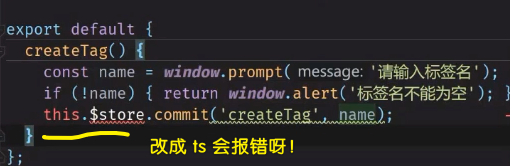

### ✍️ Tangxt ⏳ 2020-09-29 🏷️ vuex

# 12-Vue 全局数据管理（下）之 Vuex

## ★Vuex 初体验 - 数据读写


1）安装

安装 `vuex` （在创建项目的时候我们已经安装了），如果没有那就 `npm` 一下呗！

2）是什么？


我们在写文章的时候 -> 记住不要用那么多术语

话又说回来，我们该如何理解 vuex 是什么呢？

用之前我们弄得 `store` 来理解它 -> **用来管理数据的工具**！ -> 简单来说，它就是个对象，提供了一些 API，让我们可以读数据（查）和写数据（增删改）！

总之，所谓「管理」就是「读写」，所谓「状态」就是「数据」! -> 「状态管理模式」即是「**数据读写工具**」（关于「模式」的解释，芳芳也不知道是什么意思……）

3）我们能否透过官方提供的视频学会 vuex ？

> [视频 1](https://vuex.vuejs.org/)、[视频 2](https://scrimba.com/scrim/cMPa2Uk?pl=pnyzgAP)


很难 -> 因为对于中国人而言，它是英文教学的 -> 所以我们只好用 CRM 大法看官方文档学习它了！

> 很多时候我们学不会某个东西，并不是因为我们的智商问题，而是入门教程实在太辣鸡了！

代码：[Demo](https://github.com/ppambler/vue-morney/commit/21d1cdfd44f2db7cdf6166d5b82313df9f8b392d)

💡：`store`可不是那个参数`{}`？


我们传的`state`显然是复制到了`store`这个实例上！ -> 跟我们之前`...tagStore`一样……

💡：你以为在`state`里边不能写方法吗？


💡：读写状态的操作？

- 读：`store.state.count`
- 写：对数据进行改动，需要在`mutations`（改动之意）里边做！

> `data`即是`state`，`methods`即是`mutations` -> Vue 很贱，总是发明一些新的单词来增加我们的记忆负担！ -> 其实是延用了某些设计才搞得这些新单词！

进一步分析一下「写」：


> `this`可能是`window`

不要用`this`哈，如果你用了，那也是白用了！ -> 传个`state`形参，然后`state.count += 1`这样改！

如何调用`increment`方法？

显然不会用这种智障姿势：

``` js
store.mutations.increment(store.state)
```

vuex 给我们封装了一个 API：

``` js
// 不需要我们自己传 state 参数！
store.commit('increment')
```

> 讽刺：Vuex 给了我们非常多的新单词，但这些单词只是换汤不换药！ -> 本来数据叫`data`的，现在则是叫`state`，本来改变数据直接调用`increment`就好了，但现在不能直接调，而是透过`commit`提交一下`'increment'`方法名来调！

💡：vuex 真得比我们之前封装的`store`好用吗？


没有好用到哪儿去！ -> vuex 改变了我们操作数据的姿势！

💡：如何给`mutation`传参？（如何给改动数据的 API 传参？）


有的时候，如果你代码写得不好，那么你就去发明概念，你概念发明好了，然后写一些非常简单的库，也可以让这些「简单的」库看起来变得非常牛逼！

> 我很菜，但我可以捣鼓一些你不懂的概念，让我看起来很牛逼，很高级！

💡：单一状态树是什么？

简单来说就是对象（包含了全部的应用层级状态）

``` js
{
  state: {
    count: 0,
    user: {
      name: 'frank',
      age: 18
    }
  }
}
```

所谓的树 -> 数据的嵌套层级很深，看起来像是一棵树！

应用层级状态 -> 应用就是「你的这个项目」、层级就是「一层层的组件」，毕竟一个项目是由很多个组件组合而成的、状态即「数据」 -> 合起来就是「**你的项目里边所有组件的数据**」 -> 不说人话的解释就是「应用层级状态」

唯一数据源 -> 我们整个应用没有第二个数据，那就叫做唯一数据源！

> 为了权威性，所以增加了很多术语，但其实没啥用呀！ -> 真正学习编程，一定要了解这个东西的本质才行！ -> `store`本质就是一个对象！

💡：单一状态树让我们能够直接地定位任一特定的状态片段？

我们可以获取全局对象里边的任意一个数据片段，如`count`等

💡：单状态树和模块化并不冲突？


就是分文件呗！

💡：如何在组件中获取状态？

需要计算属性 -> 计算属性写在`@Component`这个装饰器里边！


如果你只想用一次，那就用`data`姿势呗！但大部分情况都不止用一次哈！

总之，`count`会计算依赖 -> `store.state.count`变了，那么`count`就会变！

💡：`template`里边可以拿到`import`的`store`吗？


如何解决？

很简单，你改成是一个函数名不就行了：


另一种解决姿势：


`Vue.use(Vuex)`这行代码，`use`操作会去调用`Vuex`里边的一些东西，这些东西会在`Vue`的原型上绑定一些共用属性！

`Vue.use(Vuex)`就是在安装这个`Vuex`插件，也就是为`Vue.prototype`挂载一个`$store`属性！ -> 也就是把 `store` 给绑定了： `Vue.prototype.$store = store`

当我们：

``` js
new Vue({
  router,
  store,
  render: (h) => h(App),
}).$mount("#app");
```

这样做时，就是传一个`store`给`$store`了！

话说，为啥不在`index.ts`里边一开始就传了？而是跑去`main.ts`里边传？ -> 就是这样设计的！因为符合初始化语法哈！ -> 相当于是注册了，要初始化才能使用！

所以另一种姿势就这样这样：


💡：计算属性与`data`同名，你猜`template`里边会渲染谁？


``` js
'[Vue warn]: The computed property "recordList" is already defined in data.'
```

4）小结

- 读的时候用`computed`来获取 -> `computed:{ count() { return this.$store.state.count } }`
- 写的时候用`this.$store.commit`或者是`this.store.commit`

使用`$store`不需要我们`import` `store`

对比我们之前写的自定义`store`，vuex 并没有好在哪里，而且很不简洁！（**很复杂**） -> 也比不上那种`window`姿势！ -> 明明使用 vuex 没有好处，为啥还要学呢？ -> 因为大家都在学呗！ -> 前端的整体水平有待提高，毕竟什么是好处，什么是坏处，一点深刻认识都没有！

> 批判一个东西前先学会它，不然，别人是不信你所说的！

## ★在 Money.vue 中使用 Vuex

> `action`是用来调用`method`的 -> 异步操作！ -> 旺财升级版会用到它！

1）改代码

1. 删掉所有`import` `index2` 的代码！（我没有这样做，我是一个组件一个组件这样慢慢改……）
2. 处理`fetchRecords` -> `createRecord` -> `saveRecords`


代码：[Demo](https://github.com/ppambler/vue-morney/commit/c50e3b924afc9e15a5a6f8ada76812784b59551b)

💡：注释是给初学者看的，作为同行不需要看，所以把代码里边存在的注释都给删咯！

💡：改用 vuex，那么就有意去削掉`methods`里边的`this`了


可以用`this`，但就是让你不要用！

💡：改代码时，步子不要迈得太大

如，方方一开始就把所有的`import index2`都给删了！ -> 这样每次测试是否把代码修改成功都会报错！

💡：关于注释：`// TODO`？


`todo`意味着你之后要去修改代码的，而且如果遗漏了 `todo` 没有完成，那么在你提交代码时，会告诉你这个：


你可以 `review` 一下看看有哪些 `todo`，也可以不管未完成的`todo`，直接 `commit`。

💡：`mutations`里边的方法都有返回值吗？

是没有的，直接改`state`里边的数据就行了！


## ★重构 Tags.vue 和 Labels.vue

1）重构 Tags.vue

> 往`mutations`里边添加方法  -> 每个方法总是需要传`state`这个形参！

代码：[Demo](https://github.com/ppambler/vue-morney/commit/25d29fddb8f52dec451d6707a0f07c4e5e16308f)

如果一开始就用 Vuex ，那就不用改代码了，但是这样一来，就不能更好地理解 Vuex 了！

2）重构 Labels.vue

💡：一定要重复`fetch`？

`Tags.vue`需要`fetch`，`Labels.vue`也需要`fetch` -> 因为如果只有`Tags.vue`有`fetch`，那么你直接刷新`Labels.vue`是拿不到`TagList`的，因为`Tags.vue`还没有渲染呢，以致于全局`state`还咩有拿到值……

每次切换路由所对应的组件都会重新`fetch` -> 牺牲点性能，保证每次拿到的都是最新的数据！

> 每次切换路由 -> 意味着切换组件 -> 意味着每次都会执行`created`钩子！

💡：出现两次一模一样的代码？


代码重复出现两次，可优化亦可不优化！ -> 如果优化，那就用 `mixin` 呗！

## ★在 TS 里使用 mixin（重新上传）

> `mixin`很好用，它可以把多个组件都用到的方法收拢到一个组件里边 -> 需要`mixin`的组件`extends`一下`mixins`就好了！

1）使用 mixin

1. 创建`/src/mixins/createTags.js` -> 为啥加`s`，因为`src`目录下大多有多个加`s`的目录，简单来说，我们可能不止会用到一个`mixin`
2. `mixins`是个对象，直接导出就好了 -> 为啥不是`.ts`文件？ -> 因为有`this`会报错！而用`.js`则不会报错！

代码：[Demo](https://github.com/ppambler/vue-morney/commit/ada4e2f6edff95ffe9734c796485f73f9e0e93d7)

💡：名字修改？

在组件里边使用`mixin`时，我们导入的是这个`mixin`的文件名


我们改成是`tagHelper.js`了，如果是类，那就是大写`TagHelper`，而对象则是小写！

💡：如何禁用 Eslint 对某一行代码报错？

自己谷歌搜！ -> 在 `ts` 里边使用 `js`，Eslint 可能无法通过！

💡：在写代码的过程中，发现往 `ts` 里边 混入 `js` 代码，是危险的操作？

一个`js`文件，会污染整个用 `ts` 写的项目！


但如果改成 `ts`，又得报错了：



我们用的类组件，是使用第三方工具的，而这个第三方工具也是依赖官方所提供的`Vue Class Component`的，在[官网](https://class-component.vuejs.org/guide/extend-and-mixins.html#mixins)里边我们找到「如何配合`ts`使用`mixin`」

过程挺麻烦的 -> 你选择了使用 `ts`，那就相当于选择了一条高端之路！

做法 -> 把`mixin`声明成类组件 -> 这意味我们的文件名要改成大写的`TagHelper`了！


> 这个名字问题 -> 如果`xxx`组件也有同一个叫`create`的方法，那么就会被覆盖了！

题外话：


## ★重构 EditLabel.vue


