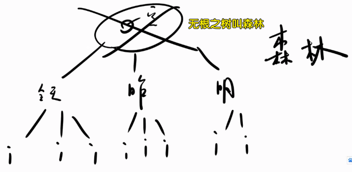
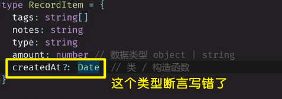

### ✍️ Tangxt ⏳ 2020-10-05 🏷️ 列表页

# 13-列表展示怎么做

## ★封装 Tabs，使用 deep 语法


1）二次封装

在 `Types` 组件的基础上再封装一层！

代码：[Demo](https://github.com/ppambler/vue-morney/commit/36ad09922fc5443378bfd7f7c8e27c279ec73732)

💡：如何更改子组件的样式？

`/deep/` 与 `::v-deep` 的区别 -> 后者可以被 sass 认出来，而前者则不能！


> 可以不用 `.x` ！直接 `::v-deep`


> 这个 `v-deep` 的存在，让我们使用组件标签更像是在使用一个原生标签了 -> 在一些组件库里边，我们要改某个组件的样式是需要透过添加 `prop` 来改的！而现在我们只要追加一个 `class-prefix` ，然后写上 CSS 样式就行了！

我们加前缀的目的是让子组件知道我们是用什么类型的样式来处理它：


效果：


💡：如果子组件有多个 `li` ，如何精准选中某个 `li` ？

最佳实践是使用 `classPrefix` ！ -> 子组件的 `template` 里边有多个 `li` ，我们在 `Types` 组件标签上写一个 `class-prefix="zzz"` ！


用表驱动姿势为元素添加 `class` ：


> ES6 语法 -> `key` 有变量的话，那就用 `[]`
💡：再次强调 `!` & `?` 的意思？


💡：如何完成「按天」、「按周」、「按月」？


需要封装一个 `Tabs` 组件！ -> 内容基本与 `Types` 组件一致，只是有 3 个 `tab` 罢了！ -> 需要二次封装 `Types` ！ -> 把组件的内容交给父组件去控制！ -> 总之，我们可以把 `Types` 变为更通用的 `Tabs` ！

属性定义：


变量的起名：


改名时，可以用 webstorm 提供的重构功能！ -> 变量名改完后要测试一下，看看能否正常运行！

💡：写 `v-for` 必须加 `key` ，这是潜规则！

💡：加 `class` 的代码好长？


class 封装处理：


除了函数姿势，你也可以写成是一个 `data` 的姿势！ -> 当然，优先使用 `methods` 姿势的！

2）不要 `Types` 组件了

把 `Tabs.vue` 放到 `Money.vue` 里边 -> `Types` 能做的， `Tabs` 也能做！

代码：[Demo](https://github.com/ppambler/vue-morney/commit/ad66dad899baddf1e5e9335c2cd15d1f5c903bc5)

💡：模块化处理 `intervalList` & `typeList`
把一些枚举东西扔到一个目录里边，其它模块文件需要用就直接导入就好了！


> 我们无法往这个数组里边 `push` 东西！

原先的做法：让我们无法改变值，也无法改变值的内容


💡：设计稿中的高度？


> 可以同时有 `class` & `:class` -> 会自动合并，但不能同时用 `class/:class` 、 `class/:class`
优先级处理：


但这有问题呀！我们无法确定这是不是 `li` 元素，万一是 `div` 呢？

那如果加 `!important` 呢？ -> 这是万不得已的做法！

另一种做法，降低组件内部的优先级：


> 我没有想到 `scss` 这种 `&-item` 语法的结果居然直接 `.tabs-item` 了，而不是 `.tabs > .tabs-item`
这是方方的经验之谈……

对了， `::deep` 的编译结果居然是这样的：


代码：[Demo](https://github.com/ppambler/vue-morney/commit/7b8ed3e244710badcfafb192ef01e06670bfa23d)

## ★用 JS 配置 height

> 方方推荐用之前的 CSS 姿势！

1）试试用 JS 搞 CSS

代码：[Demo](https://github.com/ppambler/vue-morney/commit/7794b79849c740135ccc3b600bf77ce1b55b43b9)

第一步：

``` ts
@Prop({type:String,default:'64'}) height!: string
```

> 必须加 `!` ，不加的话，那么 `tsc` 就会报错说「你要初始化这个 `height` 」 -> 可这个 `height` 是外边传过来的呀！ -> 所以初始化你妹啊！

第二步：


第三步（使用）：


---

更改子组件的样式 -> 我们要么传属性，要么写 CSS！ -> 推荐写 CSS

对了， `::deep` 可以优化成这样（不用写两次 `::deep` 了）：

``` scss
::v-deep {
  .type-tabs-item {
    background: white;
    &.selected {
      background: #c4c4c4;
      &::after {
        display: none;
      }
    }
  }

  .interval-tabs-item {
    height: 48px;
  }
}
```

## ★用列表展示数据

1）需求 & 思路

我们要做的：


用数据结构的思维去分析列表展示，它就是一颗无根之树，也就是所谓的森林：



那么如何表示森林呢？

很简单，搞一个数组，里边的一个个元素是一个个对象：


公式：


> `1 + 2 = 3` -> 就是在计算，所以就可以联想到「计算属性」了！

由于自身的数据结构不太好，抽象能力不太好，我们可以用其它奇奇怪怪地方式得到森林，但最最简单的方式还是用计算属性！

2）实现需求

💡：拿到 `recordList` ，就分组？


💡：关于时间， `ISO 8601` ？

每个前端都要懂！但 99% 的前端都不懂！

💡：这行代码： `(this.$store.state as RootState).recordList` ？

为什么要用 `as RootState` ？ -> 不用的话， `recordList` 就是 `any` 类型了，我们想要的是 `RecordItem[]` ！

这是 TS 与 Vue2 配合的 bug！

💡： `Date` 类型？



我们存到本地数据库边，是经过一层序列化的操作的，也就是 `JSON.stringify(state.recordList)` ，而当我们：

``` ts
{
  fetchRecords(state) {
    state.recordList = JSON.parse(
      window.localStorage.getItem("recordList") || "[]"
    ) as RecordItem[];
  }
}
```

拿数据的时候，是透过 `JSON.parse` 拿的！而它的返回值是 `any` 类型，然后被我们强制成了 `RecordItem[]` 类型！

JSON 不支持 `Date` 类型，面对`Date`，会转化成 `string`：


所以我们拿到`createdAt`的值时，它就是个 `string` 值，而不是我们声明的 `Date` 类型 -> 我们强制断言`JSON.parse()`的结果是`RecordItem[]`类型，但这只是骗过了 `tsc` 的检查，当代码运行的时候，我们才确切知道 `createdAt` 的结果居然是个 `string`！而不是我们以为的 `Date`！


于是我们把`createdAt`类型改成`string`了：

``` ts
type RecordItem = {
  tags: string[];
  notes: string;
  type: string;
  amount: number; // 数据类型 object | string
  createdAt?: string; // 类 / 构造函数
};
```

因此，之前用到 `createdAt`的地方都得`toISOString()`这样一下：

``` ts
record2.createdAt = new Date().toISOString();
```

> `tsc`即便检查到类型错误，也会让代码在浏览器里边正常地运行起来！

有很多`toXxxString`的 API，我们只要 `ISO 8601` 的 `String`！

💡：如何声明一个空对象`{}`的类型？

``` ts
type HashTableValue = { title: string; items: RecordItem[] };
const hashTable: { [key: string]: HashTableValue } = {}
```

这个`key`可以是`Key`，也可以是`中文`等…… -> 名字随便！ -> `value`值就直接写类型就好了，不用`[value: { title: string }]`这样


💡：计算属性的执行时机要比`mounted`早！

所以我们用了`beforeCreate`这个钩子！

## ★可抄袭：添加 CSS

代码：[Demo](https://github.com/ppambler/vue-morney/commit/1118251bf52ba77f2d84225ba054306aabd3077d)

💡：`localStorage`最多存 5 M 到 10 M 的数据？

如果数据多了，我们会如何处理呢？ -> 数据库版……

每次只加载 7 天的数据，滚动一下，再加载 7 天的数据

## ★ISO 8601 和 dayjs


1）ISO 8601 是什么？

国际标准 ISO 8601，是国际标准化组织的日期和时间（Date and time）的表示方法

> 日期指的是年月日，而是时间则指的是时分秒！

我们要关注的是「日期和时间的组合表示法」：

合并表示时，要在时间前面加一大写字母 T（一般较大的年份放在最前边，所以就是年月日，时分秒这样表示了），如此时东八区：


> 带有小数的当地时间的完全表示：152735.5 或 15:27:35.5

话说，如何把 ISO 8601 表示的日期和时间转化成「中国标准时间」的日期对象？


我们 `toISOString()` 拿到的是绝对的时间，也就是 0 时区的时间，如果你想得到 东八区这个相对的时间，那么你可以把这绝对的时间透过`Date.parse(ISO 8601)`得到「时间戳」，然后再`new Date(xxx)`一下，就能拿到东八区的时间了！

> 时间戳是一个数字，定义为格林威治时间 1970 年 01 月 01 日 00 时 00 分 00 秒（北京时间 1970 年 01 月 01 日 08 时 00 分 00 秒）起至现在的总秒数。**注意，同一时刻，不同时区获得的时间戳是相同的**（是从 0 时区开始计算的时间戳，不是基于东八区，东九区等这样计算时间戳的）。以前很多用来记录时间的字段，在数据库中往往不会存储为 Datetime 类型，而是直接存储为无符号整形，存放时间戳的值。

我们一般都不用时间戳，因为我们并不能看出此时是啥日期和时间，我们一般都用 ISO 8601，虽然结果是 0 时区的，但我们加 8 一下就知道，此时的日期和时间是多少了！

我们一般如何操作时间和日期呢？ -> 不用原生 `Date` 提供的 API -> 因为这 API 像屎一样……

我们会用 [`Moment.js`](https://momentjs.com/) -> 非常好用，但体积贼鸡儿大！（`moment.min.js 18.2k gz`）而 Vue `20KB min+gzip`！（k 是 KB 的简写，都是描述文件大小的，就像是这儿有几个苹果？你说 `10` 也行，你说 `10 个` 也行）

可以看到，我们只是为了处理一个日期和时间居然要用一个比 Vue 小一点点的库，而这显然是划不来的！

所以我们就用了 [`Day.js`](https://day.js.org/zh-CN/)：

> Moment.js 的 2kB 轻量化方案，拥有同样强大的 API -> 和 Moment.js 的 API 设计保持完全一样


2）如何学习 Day.js？

CRM 学习大法！

它的兼容性很好！

安装：

``` bash
npm install dayjs --save
```

使用：

``` js
import dayjs from "dayjs"

const api = dayjs()
console.log(api)
```


💡：如何把「9 号」改成是「今天」？


我们透过`beautify(group.title)`这个 API，可以把`2020-10-09`这样的日期改成是「今天/昨天/前天」这个样子！

原生 API 姿势：


可以看到我们要写很多行代码

`dayjs` 姿势：

它提供了一个叫`isSame`的 API -> 可以判断一个「`xxx`日期」与「今天的这个日期」是否一样，如果一样，那就会返回`true`，否则，则返回`false`

如何计算减一天？

减一天，我们可以用 `new Date().valueof() - 86400*1000`

但这样做忒麻烦了，我们可以这样做：


> 日是咩有`0`的，月同样是没有`0`的 -> 不会出现`09`月、`09`天！

关于时分秒，一笔账的统计精确到何时记的需要自己去发挥自己的创意去弄，当然，你也可以参照支付宝的！

💡：`Date.prototype.valueOf()` & `Date.parse()`的区别？


`Date.prototype.valueOf()`：

- `valueOf` 方法返回以数值格式表示的一个 `Date` 对象的原始值，从 1970 年 1 月 1 日 0 时 0 分 0 秒（UTC，即协调世界时）到该日期对象所代表时间的毫秒数。
- 该方法的功能和 `Date.prototype.getTime()` 方法一样

`Date.parse(dateString)`：

- `dateString`：一个符合 RFC2822 或 ISO 8601 日期格式的字符串（其他格式也许也支持，但结果可能与预期不符）
- 返回值：一个表示从 `1970-1-1 00:00:00` UTC 到给定日期字符串所表示时间的毫秒数的数值。如果参数不能解析为一个有效的日期，则返回 `NaN`。


总之，使用`new Date()`都得`toISOString()`一下！

💡：为了测试代码，`localStorage`里边的`value`是可以被我修改滴！

测试今天、昨天、前天的效果！

💡：目前存在的问题？


3）小结

- 学会了什么是「ISO 8601」 -> 就是一个表示日期和时间的规则
- `moment.js`忒大了，而`day.js`体积小，API 同`moment.js`一样好用且灵活
- 如何学习 `day.js`？ -> 用到了，就去查文档！ -> 文档提供了丰富的 API，如可以把「ISO 8601」格式的日期和时间，透过`dayjs("2020-10-09T11:06:50.751Z")`，可以得到一个`Day.js` 对象实例，而有了这个对象实例，我们可以做一些加一天，减一天，求出相对于今天的时间间隔等这样的操作！

## ★数据排序
