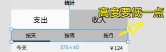

### ✍️ Tangxt ⏳ 2020-10-05 🏷️ 列表页

# 13-列表展示怎么做

## ★封装 Tabs，使用 deep 语法


1）二次封装

在 `Types` 组件的基础上再封装一层！

代码：[Demo](https://github.com/ppambler/vue-morney/commit/36ad09922fc5443378bfd7f7c8e27c279ec73732)

💡：如何更改子组件的样式？

`/deep/` 与 `::v-deep` 的区别 -> 后者可以被 sass 认出来，而前者则不能！


> 可以不用 `.x`！直接`::v-deep`


> 这个`v-deep`的存在，让我们使用组件标签更像是在使用一个原生标签了 -> 在一些组件库里边，我们要改某个组件的样式是需要透过添加`prop`来改的！而现在我们只要追加一个`class-prefix`，然后写上 CSS 样式就行了！

我们加前缀的目的是让子组件知道我们是用什么类型的样式来处理它：


效果：


💡：如果子组件有多个`li`，如何精准选中某个`li`？

最佳实践是使用 `classPrefix`！ -> 子组件的`template`里边有多个`li`，我们在`Types`组件标签上写一个`class-prefix="zzz"`！


用表驱动姿势为元素添加`class`：


> ES6 语法 -> `key`有变量的话，那就用`[]`

💡：再次强调 `!` & `?` 的意思？


💡：如何完成「按天」、「按周」、「按月」？


需要封装一个 `Tabs` 组件！ -> 内容基本与`Types`组件一致，只是有 3 个`tab`罢了！ -> 需要二次封装`Types`！ -> 把组件的内容交给父组件去控制！ -> 总之，我们可以把`Types`变为更通用的`Tabs`！

属性定义：


变量的起名：


改名时，可以用 webstorm 提供的重构功能！ -> 变量名改完后要测试一下，看看能否正常运行！

💡：写`v-for`必须加`key`，这是潜规则！

💡：加`class`的代码好长？


class 封装处理：


除了函数姿势，你也可以写成是一个`data`的姿势！ -> 当然，优先使用`methods`姿势的！

2）不要`Types`组件了

把`Tabs.vue`放到`Money.vue`里边 -> `Types`能做的，`Tabs`也能做！

代码：[Demo](https://github.com/ppambler/vue-morney/commit/ad66dad899baddf1e5e9335c2cd15d1f5c903bc5)

💡：模块化处理`intervalList` & `typeList`

把一些枚举东西扔到一个目录里边，其它模块文件需要用就直接导入就好了！


> 我们无法往这个数组里边`push`东西！

原先的做法：让我们无法改变值，也无法改变值的内容


💡：设计稿中的高度？



> 可以同时有`class`&`:class` -> 会自动合并，但不能同时用`class/:class`、`class/:class`

优先级处理：


但这有问题呀！我们无法确定这是不是`li`元素，万一是`div`呢？

那如果加`!important`呢？ -> 这是万不得已的做法！

另一种做法，降低组件内部的优先级：


> 我没有想到`scss`这种`&-item`语法的结果居然直接`.tabs-item`了，而不是`.tabs > .tabs-item`

这是方方的经验之谈……

对了，`::deep`的编译结果居然是这样的：


代码：[Demo](https://github.com/ppambler/vue-morney/commit/7b8ed3e244710badcfafb192ef01e06670bfa23d)

## ★用 JS 配置 height

> 方方推荐用之前的 CSS 姿势！

1）试试用 JS 搞 CSS

代码：[Demo](https://github.com/ppambler/vue-morney/commit/7794b79849c740135ccc3b600bf77ce1b55b43b9)

第一步：

``` ts
@Prop({type:String,default:'64'}) height!: string
```

> 必须加`!`，不加的话，那么`tsc`就会报错说「你要初始化这个`height`」 -> 可这个`height`是外边传过来的呀！ -> 所以初始化你妹啊！

第二步：


第三步（使用）：


---

更改子组件的样式 -> 我们要么传属性，要么写 CSS！ -> 推荐写 CSS

对了，`::deep`可以优化成这样（不用写两次`::deep`了）：

``` scss
::v-deep {
  .type-tabs-item {
    background: white;
    &.selected {
      background: #c4c4c4;
      &::after {
        display: none;
      }
    }
  }

  .interval-tabs-item {
    height: 48px;
  }
}
```

## ★用列表展示数据
