### ✍️ Tangxt ⏳ 2020-10-10 🏷️ 项目总结

# 14-旺财本地版项目总结


## ★用了哪些知识

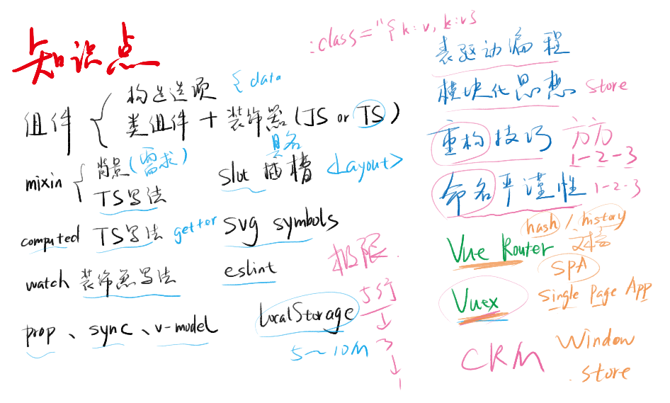

- 就写了 4 个界面，但几乎用到了所有 Vue 重要的知识！
- `mixin` -> 知道需求，才知道它的意义是什么 -> 重复代码抽离出来！如标签的创建
- `localStorage` -> 不同的浏览器所存储的大小是不一样的，可能 A 浏览器存 5M，而 B 浏览器则存 10M，总之，它的存储大小在 5~10 M 之间
- 表驱动编程 -> 写`:class`用到了
- 重构技巧 -> 第一版代码 -> 第二版代码 -> 第三版代码
- 新手遇到瓶颈 -> 第一次是遇到代码量不够，一般来说新手写了 10000 行代码之后就变成熟手了！ -> 第二次瓶颈，那就是代码都是重复的、复制粘贴的，而这就没啥意义了！
- 命名的严谨性 -> 也是「1-2-3」 -> 命名好，就不用写注释了！
- Vuex -> 做全局数据管理，防止团队出现傻逼，但也并没有那么好用 -> 总之，聊胜于无！  

## ★哪些地方可以改进：吃自己的狗粮

吃自己的狗粮，如果自己做出来的东西都不用，那如何让别人用呢？

### <mark>1）手机调试</mark>

手机访问「<http://192.168.1.2:8080/>」，居然无法访问！

如何解决？

1. 手机开热点，电脑连接 -> 我测试了手机连 wifi，电脑也连 wifi，结果不行！
2. 让电脑开放 8080 端口 -> 搜索「防火墙和网络保护」 -> 点击高级设置 -> 配置入站规则，出站规则

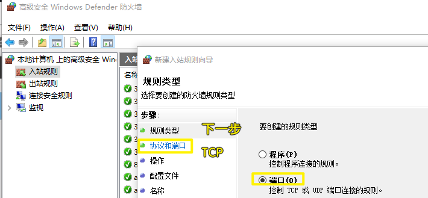

手机预览的 bug：

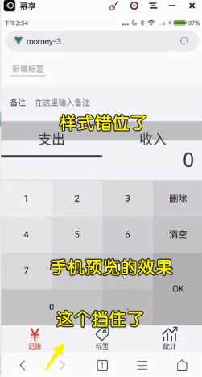

> 我测试用 夸克浏览器 的话，就没啥 bug 了 -> 但用了系统自带的浏览器，和 QQ 浏览器就有问题了！

解决 bug 的姿势：

-  iOS 7.1 的 Safari 中为 `meta` 标签新增 `minimal-ui` 属性，让网页在加载时便可隐藏顶部的地址栏与底部的导航栏
- 样式错位问题 -> 我们不能减小高度，只能增大高度 -> `min-height:100vh`

自动滚到底的代码：

``` js
window.onload = function() {
  setTimeout(function() {
    window.scrollTo(0, document.body.scrollHeight);
  }, 0);
};
```

但是路由切换，就失效了呀！

💡：自动创建 4 个「衣食住行」标签？

思路，`fetch`数据的时候，发现没有，那就自动创建呗！

💡：收入为空的错误？

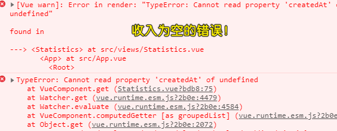

错误原因：

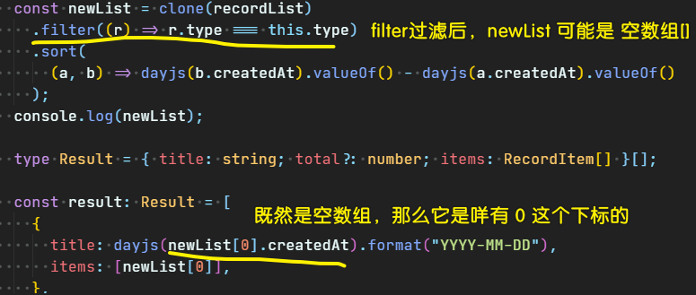

解决：

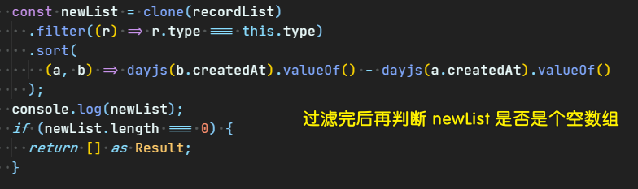

💡：测试的时间不能低于代码开发的时间

💡：如果咩有记录？如何提示？

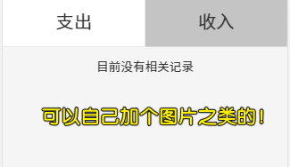

做法：用`v-if/v-else`就好了！

如果想要别人喜欢你的项目，那么你要一直的用，不断地改造成自己喜欢的 -> 这样一来，自然而然地，别人也会喜欢你的项目了！

💡：用户咩有选择标签，在统计页面的效果是「无」？

如果用户没有选择标签请给个默认标签！

💡：添加一笔账之后，备注重置？标签重置？

你一定要测试你的代码，如果出了 bug ，那么这就是扣分项！即便项目外观看起来没啥问题！

### <mark>2）项目原则</mark>

吃自己种的粮食，自己种的粮食自己都不吃，你叫别人怎么吃嘛！ -> bug 是修复不完的！


## ★手机调试的三种方式：局域网、Chrome 远程调试、vConsole

### <mark>1）局域网</mark>

手机与电脑都在同一个局域网 -> 访问 `http://xxx:8080`

> 手机开热点，电脑连接热点

### <mark>2）Chrome / Safari 远程调试</mark>

所谓的远程调试就是：

你在手机用 chrome 浏览器打开网页，你想要有在 PC 端浏览器那样的开发者工具，那么你就可以使用 chrome 提供的远程调试功能！

具体操作很简单 -> USB 线连接电脑，打开 pc 端浏览器的开发者工具：

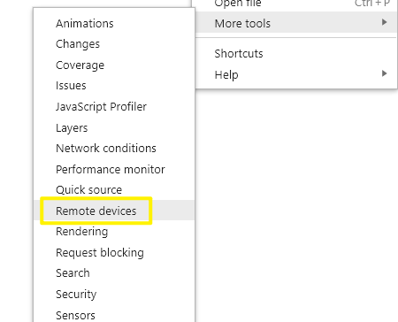

具体效果是这样的：

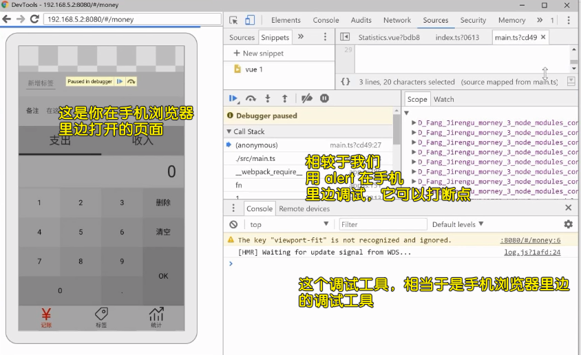

相较于我们 `alert`姿势，这可以设置断点

### <mark>3）vConsole</mark>

看文档学习 -> 这是一个万不得已的调试姿势！ -> 效果咩有上边那两个好！

## ★切忌雷同，项目描述怎么写

### <mark>1）切记雷同</mark>


A 和 B 去面试同一家公司 -> A 拿出了「旺财项目」，B 同样拿出一个一模一样的「旺财项目」 -> 结果「双方不录取，因为互相抄袭」

如何不雷同？

到应用商店里边搜索「记账」 -> 你会看到一堆有关「记账」的 APP，随便找个你看的顺眼的 APP -> 抄样式就好了！ -> 鲨鱼记账里的`icon`是内置的！

### <mark>2）项目描述不空洞</mark>


一个项目做完后，不能简单地说，用了 Vue 实现了一个简单的记账应用！

描述一个项目，你要用一句极简的话告诉面试官，`xxx` 是什么，基于什么技术栈的什么的东西！

技术栈，如 `Vue`、`VueRouter`等可以用橙色、加粗啥的高亮出来！

独立设计 -> 有 Figma 设计稿，如果是抄别人的设计稿，那就说「**我抄袭了某个 APP**」 -> 不盈利是可以使用别人的设计的！

独立实现 -> 表面你在这个项目中位置 -> 非常重要的位置

遇到的问题（svg 插件、TS 使用`computed/Prop`等） -> 博客展示 -> 博客给高亮以及链接，好让他人去点击它！

最后一句「源代码几乎完全用 TS 实现」 -> 吸引那些需要 TS 的公司，TS 很加分，因为你会了 TS，默认你是会 JS 的！

「用到了装饰器语法」 -> 虽然不知道它是什么，但我们依葫芦画瓢确实用到了！

> 独立设计不要抄芳芳的描述，因为这是芳芳的设计啊！而实现倒是可以说自己写的！

---

之前「修复的很多小问题」，我是一次性提交的 -> 最好修复一个就提交一个哈！

代码：[Demo](https://github.com/ppambler/vue-morney/commit/8300eace88d745842241f4b611120b9f08bd34ee)

## ★修复 4 个 commit 引起的 bug

### <mark>1）解耦 `alert`</mark>

代码：[Demo](https://github.com/ppambler/vue-morney/commit/a289c99bdd9da37adc556cefbf041c0d913789b1)

## ★部署到 GitHub & 设置 publicPath

### <mark>1）部署网站到 GitHub Pages</mark>

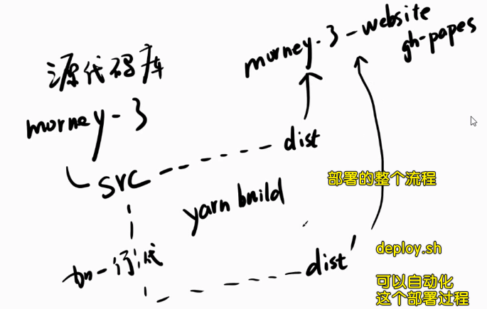

打包：

``` bash
npm run build
```

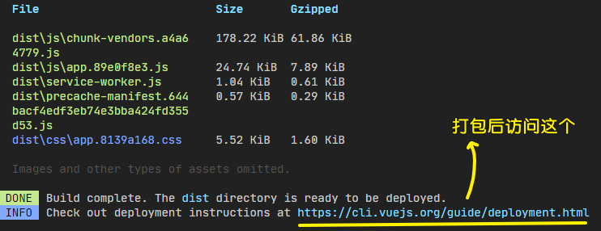

检查本地打包出来的东西，是否能正常跑起来：

``` bash
npm install -g serve
# -s flag means serve it in Single-Page Application mode
# which deals with the routing problem below
serve -s dist
```

> 芳芳推荐使用 `http-server`！

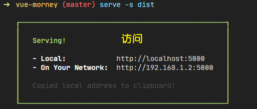

配置你的仓库名：

``` js
// vue.config.js file to be place in the root of your repository

module.exports = {
  publicPath: process.env.NODE_ENV === 'production'
    ? '/vue-morney/'
    : '/'
}
```

自动化部署：

``` bash
#!/usr/bin/env sh

# abort on errors
set -e

# build
npm run build

# navigate into the build output directory
cd dist

# if you are deploying to a custom domain
# echo 'www.example.com' > CNAME

git init
git add -A
git commit -m 'deploy'

# if you are deploying to https://<USERNAME>.github.io
# git push -f git@github.com:<USERNAME>/<USERNAME>.github.io.git master

# if you are deploying to https://<USERNAME>.github.io/<REPO>
git push -f git@github.com:ppambler/vue-morney.git master:gh-pages

cd -
```

`<USERAME>` -> 尖括号就就像是大胡子语法那样，即两个花括号！

运行自动部署的脚本：

``` bash
sh deploy.sh
```

> 运行这个脚本之前，请先关掉之前的 `serve -s dist`，不然就会报错哈！ -> ` ERROR  Error: EPERM: operation not permitted`

项目预览地址：<https://ppambler.github.io/vue-morney/>

代码：[Demo](https://github.com/ppambler/vue-morney/commit/b2bb81a09589b19f8b434e1b8fcf66c25990f219)

### <mark>2）提示用户扫码打开网页</mark>

如何知道用户是在 PC 端打开网页呢？

视口宽度大于 `500 px` 就行了

如何得到一个二维码？

[草料二维码](https://cli.im/) -> 拿到二维码 -> 放到`public`目录，而不是`assets`目录


---

为什么要在`main.ts`里边做这个功能？

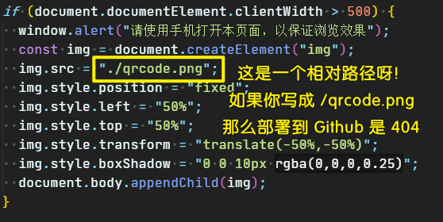

因为它不属于我们这个项目的主要逻辑，由于过于简单，直接就用 js 来做了，如果复杂那就用 Vue 或者 React

---


## ★部署到码云，加快访问速度！

地址：<https://gitee.com/ppambler/vue-morney>

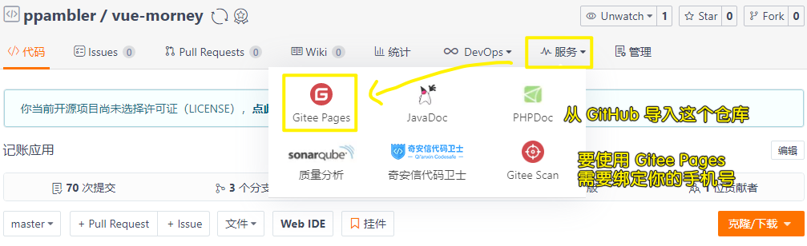

码云是国内的 GitHub 竞品 -> 同样提供了 Pages 服务！使用方法跟 GitHub Pages 基本一样，但是访问速度却快很多！

唯一要注意的是，码云免费版不支持自动更新代码，所以你每次部署之后，要登录码云的网站，手动点击「更新」按钮才能更新网页。

## ★修复：本地预览 dist 目录发现 JS 路径错误

用 `npm run build`得到 `dist` 目录后，再用 `serve -s dist` -> 本地浏览器打开 <http://localhost:5000/> 会看到以下错误：

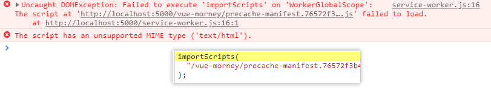

在本地环境，这个 JS 的路径不对；但是在 GitHub Pages 里，这个 JS 的路径其实是对的

我们的 `vue.config.js`，其实已经考虑了这个问题，它会在 `production` 环境（也就是 GitHub Pages 上）使用 `/vue-morney/` 作为路径前缀，在本地使用 `/` 作为路径前缀

但实际情况是，我们本地的 `dist` 使用了 `/vue-morney/`，正确的前缀应该是 `/`。

为什么 `vue.config.js` 考虑了这个问题，还是会出现这个问题呢？

我不知道，但我知道怎么解决这个问题。

做法如下：

1. `npm i cross-env`（这个 `cross-env` 是 Windows 用户必须的，其他系统的用户装了它也没事，不会有任何副作用）
2. 在 `package.json` 里添加一个 `script`，内容为 `"build:dev":"cross-env NODE_ENV=development npm run build"`，效果如下图所示（注意行尾的逗号）：

   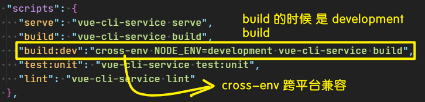

3. 使用 `npm run build:dev` 得到的 `dist` 即可在本地用 `serve` 预览，使用 `npm run build` 得到的 `dist` 即可在 GitHub Pages 上正常预览

## ★后续计划

目前这个项目已经有了基本雏形，你可以在这个雏形上边加很多很多的功能！

目前这个项目的不足之处：

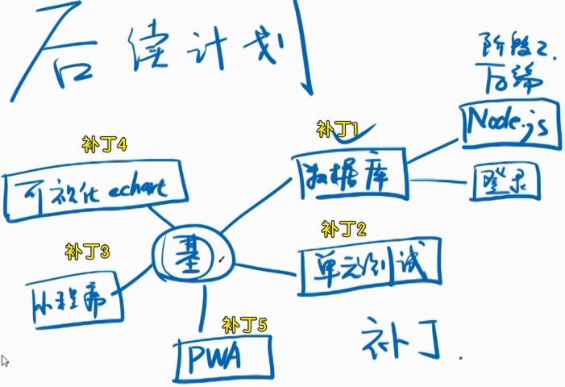

本地存储满了怎么办？换个浏览器存储怎么办？ -> 需要数据库版

……

基于一个基本盘 -> 添加补丁 -> 让这个记账项目越来越完善！
