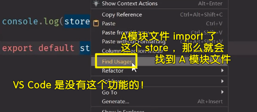
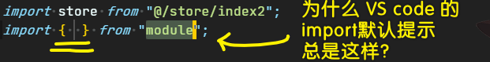

### ✍️ Tangxt ⏳ 2020-08-14 🏷️ faq

# FAQ

## 1、其他人做这个项目的笔记？

➹：[旺财记账（Vue） · 语雀](https://www.yuque.com/haixi-blred/vue)

➹：[项目搭建与导航栏实现 · 语雀](https://www.yuque.com/woozyzzz/ybz8i1/cq7i1d)

## 2、每次把代码提交到远程仓库，我都要拷贝一下这次提交的 URL 到本地的笔记里边？

我不想每次都浏览器里打开这次提交的页面

所以，我找到了两种姿势可以做到：

第一种：


如： `https://github.com/ppambler/vue-morney/commit/` + `fe8cc88ad1d5b7b10e00d29ddea9d335c778c841`

第二种：安装 「Copy GitHub URL」插件-> 只拷贝 master 的路径，不拷贝分支（可能也可以拷贝分支，只是我不知道如何配置！）

> 其实，我最好还是不要建立分支，因为这样在写笔记的时候会很方便……

一种可行的方案：

「配置 `markdown` 代码片段」+「如何拿到最新提交的版本号」

在搜索有没有哪个 VS Code 的插件可以拿到当前提交的版本中，找到了这么一个工具：


最终姿势：

透过 `git log` 拿到 `hash` ，而不是那个「Git History」插件

代码片段

``` json
{
  "github": {
    "prefix": "/dm",
    "body": [
      "[Demo](https://github.com/ppambler/vue-morney/commit/$1)",
    ],
    "description": "拿到最新提交的远程代码地址"
  }
}
```

补充，可以用这俩个命令拿到版本号：

``` bash
# 长的
git rev-parse HEAD
# 短的
git rev-parse --short HEAD
```


配置一下别名：

``` bashrc
alias gh="git rev-parse HEAD"
alias gsh="git rev-parse --short HEAD"
```

合并分支：

``` bash
# 切回到 master 分支
git checkout master
# 合并 morney-nav 分支
git merge morney-nav
# 提交合并过来的版本记录到远程仓库上
git push
```

➹：[让开发效率“飞起”的 VS Code 插件 · Issue #80 · ljianshu/Blog](https://github.com/ljianshu/Blog/issues/80)

➹：[git 怎么查询当前分支的版本号 (commit id) - SegmentFault 思否](https://segmentfault.com/q/1010000004913872)

## 3、如何检测某个包的最新版本？

``` bash
npm info typescript version
```


为啥需要检测？ -> 你用 CRM 大法抄官方代码，结果发现跑不起来！ 于是，你就猜测是不是我安装的依赖包版本过低？

透过上边这行命令，拿到这个包的最新版本 -> 更改 `package.json` 里边包对应的版本号！ -> `npm install / yarn install`（自动卸载旧版本的 `typescript`，然后安装最新版的！） -> 包更新完后就重启服务器！

## 4、关于代码的提交？

千万不要留下任何无意义的代码！只要该代码是咩有用的，那么就得把它们删了，不然，这些代码只会让你感到头疼！

## 5、为啥 Vue 2 要被人吐槽与 TS 不好合作？

因为 `template` 里边的 JS 代码，不是 TS 代码，所以这也就不遵守 TS 规则了！ -> 没办法做类型检查！

如：


所以，我们在 `template` 可以瞎写 -> 当然，你得约束自己，不要瞎传值，是字符串那就传字符串，而不是传其它类型的值 -> 总之，做好这件事，需要靠你的**自觉**！

很多时候我们需要强制指定类型，如 `event.target as HTMLButtonElement`，因为 Vue 2 和 TS 搭配起来是有问题的，当然，这不是双方各自的问题，而是一搭配起来就出的问题，就像是篮球一样，「5 巨头」 也有可能打不赢 「3 巨头 + 2 个不是巨头的球员」

## 6、如果你使用 webstorm 出现了爆红？


CPU 不足会引起这个 bug！

解决姿势：


## 7、在 VS Code 里边，如何配置 import @ 路径提示？

安装 `Path Autocomplete` 插件 -> 在工作区配置 .`vscode/settings.json` 里面这样配置：

``` json
{
  "path-autocomplete.excludedItems": {
    "**/*.js": { "when": "**/*.ts" }, // ignore js files if i'm inside a ts file
    "**/*.map": { "when": "**" }, // always ignore *.map files
    "**/{.git,node_modules}": { "when": "**" } // always ignore .git and node_modules folders
  },
  "path-autocomplete.pathMappings": {
    "@": "${folder}/src"
  },
}
```

你敲下`@`，就能感知到`./src`了！

➹：[如何编写具有代码提示的代码，如何配置 vscode 的目录别名 · Issue #21 · Runtu4378/blog](https://github.com/Runtu4378/blog/issues/21)

➹：[vsCode 配置 import@路径提示 - DY-Tao 的个人空间 - OSCHINA - 中文开源技术交流社区](https://my.oschina.net/yuantao/blog/3156053)

## 8、Webstorm 使用？

💡：注释格式化？


💡：查看某个东西被使用了？



> 对于 VS Code -> 可以使用全局搜索某个关键字找到！


## 9、一些约定俗称的代码规范？



很多时候我们是用具名导出的，因为具名导出的话，在使用时，就不用考虑命名问题了！