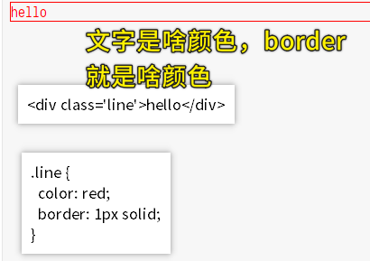
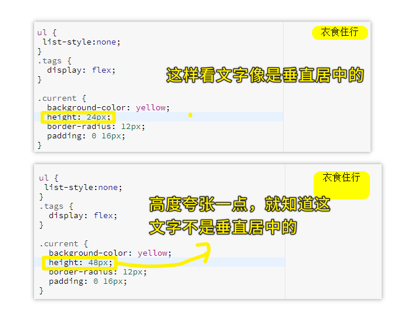

## ★CSS技巧

写 CSS 时是从外往里，还是从里往外？ -> 都可以，内容简单就随便，但内容复杂的话，方方建议是**从里往外**，因为里面是最简单的！

全局字体默认就是16px，但是你最好还是在全局里边，如在 `body`里边写上 `font-size:16px;`，而局部里需要其它大小的文本，那就局部覆盖就好了！ -> **全局显示写上字体大小，局部不同则覆盖更改！**

`button/input`里的文本字体默认是不会继承父元素（也就是`body`元素）的字体的，所以需要在 `reset.scss` 里边对这俩元素 `font: inherit;` -> `font-family`是个继承属性！ -> **`button/input`这俩兄弟不会继承font-family的遗产**

方方确定一个元素的宽度是用`padding-left/right`来填充的！而不是用 `width` 来确定的！ -> 宽度的变大还可以用 `flex-grow:1;` -> 还可以用不确定的**百分比宽度**！
 -> **确定宽度就意味着bug**

对于上下两个元素的间距，方方个人喜欢优先使用 `padding-top/bottom`，而不是 `margin-top/bottom`

文字内容的下边框看起来更长一点？ -> 文字内容 `padding-left/right` 一下就好了！

写样式前，先把选择器写好！ -> 通过 scss 的作用域功能，类命名不会有冲突，所以样式随便写！ -> 样式属性书写顺序：背景色 -> 背景色没有效果那就`display`变化一下（布局） -> 字体大小、居中、颜色 -> 盒子模型宽高`padding`、`line-height`、`height`

> 一般是把布局调好后，再处理文本样式……


`line-height`撑大一个元素的高度是包含 `border`的 -> 所以你写了这个属性就得写上`height`属性，不然，多了一个`border`就会有bug -> 当然，你可以用`flex`居中一把梭+固定`height`来搞居中的事儿！

class可以用数字开头吗？ -> 似乎可以，但为了保守起见，最好还是用英文字母，毕竟有些智障浏览器万一不支持呢？

在写有关百分比的样式值的时候，你可以不用把最终的百分比计算起来，如 `4 * 2%` 、`25 * 2%`………这样，毕竟浏览器自带计算器呀！它自己会帮我们去算最终的结果值！ -> 能使用这样的计算功能是 sass 的锅！

对于阴影的效果，一定要弄成是有阴影但是就是看不出来的这样子 -> 很主观，很艺术！


---

去掉任何元素 `focus` 时有默认的 `outline` ：

``` css
/* reset.css */
:focus {
  outline: none;
}
```

---

你不给 `border` 颜色，那么其颜色就与字体颜色一样！



---

文字垂直居中？ -> 文字默认也是`span`元素，给其父元素一个夸张的高度，就能确定文字在元素里边是否垂直居中：



如何让文字垂直居中？（两种姿势）

1. 让元素`flex`，再让里边的内容垂直居中
2. 让 `line-height` 与 `height` 是一样高的！

何时用第二种？ -> 你能确定只有一行字，那就用，不然，那就用第一种 `flex`！
