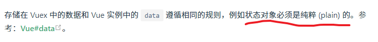

## ★总结

- 我觉得使用 Vuex 很大的一个原因就是它的调试工具！ -> 能够很直观的帮助我们看到全局数据的变化，以及是什么操作导致全局数据的变化！

## ★Q&A

1）什么是纯粹的对象？

问题缘由：



> [State - Vuex](https://vuex.vuejs.org/zh/guide/state.html)、[data — Vue.js](https://cn.vuejs.org/v2/api/#data)

什么是存粹的对象？

我们 `var obj = {}` 相当于是执行了这个语句：

``` js
var obj = Object.create(Object.prototype)
```

这个 `obj` 是不存粹的，因为它生来自带了`Object`的一系列内置属性和方法

如何才能造个存粹的对象？

很简单，直接这样：

``` js
var obj = Object.create(null)
```


为什么需要纯粹的对象？

> 「纯粹」的对象适合用于存储键值对数据，而且没有隐式的类型转换，更加直观

总之，除了继承了`Object.prototype`这点，`Object.create(null)` 和 `{}`之间没有别的区别了，在操作对象这一点上完全一致，存取的性能没差啦。但如果并不 care 自己的空对象继承了`Object`的话，我建议大家还是使用`{}`来声明吧，因为在创建性能上`{}`比`Object.create(null)` 快了 20 倍呢！！！

➹：[什么是纯粹的 JS 对象？？ - 简书](https://www.jianshu.com/p/b644bcf935ac)

2）Vue 的 `use` 方法？

➹：[Vue.use(plugin) 详解](https://juejin.im/post/6844903946343940104)